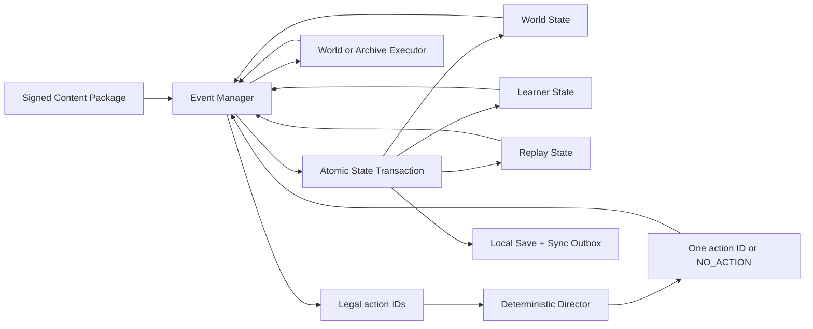

# Backend & AI System

**Purpose.** This document turns the game rules in `Project-Archive-v3.md`, `Day-Template.md`, `Day-1.md`, and `Interaction-Spec.md` into one implementation plan for the backend, local runtime, content pipeline, deterministic Director, learning guarantees, persistence, telemetry, and optional model services.

**Audience.** Backend, gameplay, AI, data, curriculum tooling, QA, security, and technical production.

**Implementation status.** Architecture specification for the Boston vertical slice. It defines the contracts to build; it is not evidence that the systems have already been implemented or certified.

**Prescriptive localhost implementation:** [`Localhost-Text-Slice-Spec.md`](Localhost-Text-Slice-Spec.md) locks the exact stack, Google login, schemas, APIs, text presenter, Day 1 constants/actions, tests, and file-by-file build order. Implementers follow that directive without selecting alternatives.

**Source-of-truth rule.**

1. **`Day-1.md` is the canonical behavioral acceptance fixture for Boston Day 1.** It is the most thoroughly playtested source. If any other document disagrees with its current behavior, that other document is stale and must be corrected.
2. This document owns the concrete backend/runtime implementation of that behavior.
3. `Project-Archive-v3.md` owns product-wide invariants and historical/curriculum boundaries only where they do not contradict current Day 1 behavior.
4. `Day-Template.md` generalizes the laws proven by Day 1; it may not weaken or rewrite them.
5. `Interaction-Spec.md` parameterizes Day 1's player-facing state machines and tunable UX rules.
6. `Production.md` chooses how to present Day 1 behavior within production constraints; presentation constraints do not change the behavior.

---

## 0. The architecture in one page

Project Archive is an **offline-first, deterministic game runtime driven by signed, human-approved content packages**.

The runtime does not ask a language model to write history, dialogue, questions, feedback, objectives, or consequences. The system called the **AI Director** chooses one already-approved `action_id` from the actions that the **Event Manager** has proven legal. The authoritative choice is computed locally by deterministic code. A remote model is optional and advisory only; the game never waits for it.

The runtime has two deliberately separate loops:

- **Closed learning loop:** every required concept receives three tracked exposures across at least two types, one first-understanding check, and one same-day applied demonstration. Missed carriers reroute by missing interaction type. This loop is guaranteed.
- **Open world loop:** route order, time spent, object condition, relationships, attention, optional encounters, local failures, and consequences vary and persist. This loop is reactive and cannot erase or fake a committed result.

The Event Manager joins those loops without letting either own the other. World consequences determine which equivalent learning carrier is legal next; learning needs never reverse a world consequence.



### Non-negotiable invariants

- No runtime generation or rewriting of player-facing semantic content.
- The Event Manager, not AI, determines legality.
- The Director returns only an eligible `action_id` or typed `NO_ACTION`.
- The Director cannot choose mechanic outcomes.
- Required historical events fire on their authored clock boundary.
- Required learning survives every legal route, choice, outcome, accessibility profile, offline path, and resume boundary.
- Committed consequences never reroll, disappear, or become success without an authored cause.
- Movement skill, route choice, reaction time, accessibility use, and free-roam time never count as learning evidence.
- The complete required path works with no network and no model service.
- Saving is atomic, automatic, and invisible.

---

## 1. What “AI” means in this game

There are three different AI/tooling roles. They must not be conflated.

### 1.1 Runtime Director: deterministic local code

This is the production-critical AI system.

It:

- receives a complete allowlist of currently legal authored actions;
- ranks those actions with a versioned deterministic tuple;
- returns one `action_id` or `NO_ACTION`;
- uses learner needs only as one bounded ranking input after legality;
- uses replay history only after required progression and educational priorities;
- produces the same result for the same package, state revisions, and attempt seed.

It does **not** use an LLM.

### 1.2 Optional advisory selector: asynchronous and non-authoritative

A constrained model may later propose an eligible future `action_id` for diagnostics or experimentation. The proposal is accepted only if:

- it arrives before a non-blocking deadline;
- its request revisions are still current;
- the ID is in the eligible set;
- it equals the authoritative deterministic argmax.

Because it must equal the local result, this service is not needed for the vertical slice and cannot change play.

### 1.3 Offline production AI: candidate generation, never approval

Models may help draft:

- dialogue and ambient-line candidates;
- ActionSpec metadata candidates;
- misconception-specific clarification candidates;
- source summaries for internal review;
- subtitle timing;
- test cases and coverage reports.

Nothing reaches a player until a human historical, curriculum, narrative, accessibility, and production review approves it and it is included in a signed package.

### 1.4 Response classifier: separate from the Director

Rare open responses may be mapped to an allowlisted rubric-label schema. This classifier:

- receives only the prompt ID, rubric version, authorized normalized response, locale, and label allowlist;
- returns status, allowlisted labels, and confidence;
- never directs scenes or writes feedback;
- cannot directly change a score or Learner State;
- is followed by a deterministic Rubric Resolver.

Day 1 uses bounded choices and does not require this service. Build it after the deterministic core.

---

## 2. Recommended vertical-slice stack

The game client is React + React Three Fiber. Keep authoritative runtime logic in shared TypeScript so the browser, tests, package compiler, and backend use identical contracts.

### 2.1 Monorepo

Use `pnpm` workspaces with strict TypeScript.

```text
apps/
  game-web/                 React + R3F client
  content-studio/           Internal authoring/review UI
  backend-api/              Save sync, packages, telemetry, teacher reporting

packages/
  contracts/                Shared IDs, enums, schemas, event types
  content-schema/           Authored graph and manifest schemas
  content-compiler/         Graph validation + ActionSpec compiler
  content-package/          Signing, hashing, loading, migration
  runtime-core/             Event Manager + transaction orchestration
  selector/                 Deterministic AI Director
  outcome-resolver/         Deterministic OutcomePolicy implementation
  world-state/              World snapshot + delta validation
  learner-model/            Evidence ledger + lifecycle reducer
  replay-state/             ReplayProfileState + RunVariationContext
  archive-runtime/          Archive queue and approved UI actions
  save-runtime/             IndexedDB transactions, journal, cloud outbox
  telemetry/                Typed privacy-filtered events
  model-checker/            Reachability and invariant validation
  test-vectors/             Cross-platform canonical-encoding vectors

content/
  boston/
    sources/
    graphs/
    characters/
    actions/
    assets/
    rubrics/
    accessibility/
    package.manifest.json
```

### 2.2 Browser-local runtime

- Run `runtime-core`, selector, outcome resolver, and package validation in a Web Worker.
- Keep R3F rendering and input presentation on the main thread.
- Store the authoritative local save, recovery journal, and sync outbox in IndexedDB.
- Use a service worker to cache the signed content package and required asset bundles.
- Use Web Crypto for SHA-256, HMAC-SHA-256, and package-signature verification.
- Never put a remote request between player input and visible world reaction.

### 2.2A Headless core and replaceable presentation (hard boundary)

The localhost text UI is a disposable test presenter, not the game architecture. All behavior lives outside React, DOM, and Three.js.

```text
signed Day 1 package
        |
        v
headless runtime-core Web Worker
  Event Manager / Director / state / learning / saves
        |
        v
typed ExecutionPlan + PresentationPort
        |
        +---- text-web presenter (temporary localhost flow)
        |
        +---- R3F/Three.js presenter (production game)
```

Hard rules:

- `packages/runtime-core`, `selector`, `outcome-resolver`, `world-state`, `learner-model`, `replay-state`, and `save-runtime` import no React, DOM, canvas, WebGL, Three.js, or text-UI module.
- Authored Day 1 content contains semantic assets/IDs and presentation bindings; it does not contain React components.
- The runtime emits the same versioned `ExecutionPlan` to either presenter.
- A presenter may display/animate, collect input, emit declared `ExecutionProgress`, return bounded `MechanicResult`, and return exactly one `ExecutionResult`.
- A presenter cannot determine legality, choose the next action, apply state deltas, award learning, move relationships, advance the clock authoritatively, or choose a mechanic outcome.
- The text presenter may render plain text/buttons and simple HTML timing/drag controls. The future Three.js presenter replaces those controls with camera, character, prop, animation, and spatial input while emitting the same semantic choice IDs, phase IDs, and MechanicResult fields.
- SaveRecords never store DOM state or Three.js objects. They store only semantic presenter checkpoint IDs, prompt/choice state, camera transform through an adapter-neutral numeric schema, mechanic phases, and authoritative state.
- No API route is text-specific or Three.js-specific.
- The migration acceptance test is: delete `apps/text-web`, add `apps/game-web`, and pass the same headless contract/integration tests without modifying runtime packages, content IDs, database schemas, or save migrations.

```ts
interface PresentationPort {
  present(plan: ExecutionPlan): AsyncIterable<PresenterEvent>
  restore(plan: ExecutionPlan, checkpoint: PresenterCheckpoint): AsyncIterable<PresenterEvent>
  cancel(reservationId: string): Promise<void>
}

type PresenterEvent =
  | { type: "PROGRESS"; progress: ExecutionProgress }
  | { type: "MECHANIC_RESULT"; result: MechanicResult }
  | { type: "TERMINAL"; result: ExecutionResult }

interface PresenterCheckpoint {
  presenterContractVersion: string
  presentationKind: string
  checkpointId: string
  semanticPhaseId: string
  adapterState: Record<string, string | number | boolean | null>
}
```

`adapterState` is bounded and schema-validated per presentation kind. It may preserve a text timing-bar position or Three.js camera/animation phase, but it cannot contain authoritative gameplay meaning.

### 2.3 Cloud backend

Recommended initial service:

- Node.js + TypeScript;
- Fastify for the API;
- PostgreSQL for profiles, save revisions, assessment records, leases, and reporting;
- object storage/CDN for immutable signed content packages and large assets;
- background worker for outbox ingestion, reporting materialization, and package publication;
- OpenTelemetry-compatible operational traces, kept separate from student learning records.

The cloud backend synchronizes and reports. It does not decide the next action during ordinary play.

### 2.4 Schema tooling

- Define TypeScript types and runtime validators from one schema source.
- JSON Schema is the interchange format for authored content.
- Use integer fields for all deterministic rankings, weights, and time blocks.
- Serialize TypeScript `bigint`/u64 fields as canonical unsigned decimal strings in JSON and fixed-width big-endian integers in deterministic binary encodings; serialize raw bytes as base64url outside canonical binary hashing.
- Reject unknown required fields, floating-point rank inputs, unversioned reducers, and unknown IDs.
- Generate human-readable validation reports for curriculum and narrative teams.

---

## 3. Exclusive ownership boundaries

Every fact has exactly one authoritative owner.

### Content Package

Owns:

- historical definitions and dates;
- Curriculum, Scene, and Misconception Graphs;
- Character Cards;
- approved dialogue, subtitles, voice, animation, UI, and fallback assets;
- ActionSpec source data;
- rubrics, feedback, and accessibility equivalents.

Never mutates during an attempt.

### ActionSpec Compiler

Owns deterministic offline derivation of immutable executable ActionSpecs.

It reads authoritative graphs/cards/manifests and emits generated artifacts. ActionSpecs are never hand-edited.

### World State Manager

Owns current historical and local world truth:

- date, Mission Day, scene and objective;
- location and control state;
- day clock and fixed-event phase;
- object custody, condition, and delivery state;
- relationship dimensions and pending reveal effects;
- routes, closures, watchers, crowd mode, attention, and consequences;
- current-run cooldown and presentation history.

### Learner Model

Owns only structured learning evidence and lifecycle state.

It does not own:

- route history;
- world consequences;
- engagement scores;
- personality or emotion;
- official assessment forms;
- replay novelty.

### ReplayProfileState

Owns cross-attempt presentation history for variation. It contains no learning labels.

### RunVariationContext

Owns immutable per-attempt identity and deterministic seed inputs.

### Event Manager

Owns:

- hard eligibility;
- foreground and Archive locks;
- action lifecycle;
- fallback and reroute activation;
- deterministic outcome coordination;
- atomic transaction preparation;
- the PreparedFrontier.

### AI Director

Owns only the best choice within a legal set.

### Runtime Executor / Archive Runtime Controller

Own presentation and input collection. They cannot mutate authoritative state or choose outcomes.

### Save/Resume

Owns durable atomic persistence, recovery, migration, and cloud-sync conflict handling.

### Assessment Runtime

Owns official forms, reviewed item order, attempt purpose, submission status, scoring records, replacements, and teacher-reportable evidence.

---

## 4. Stable identifiers

Use typed, globally unique, semantically immutable IDs.

Required ID families:

```text
season_id
chapter_id
mission_day_id
scene_node_id
authored_slot_id
action_family_id
action_id
mechanic_family_id
job_object_id
outcome_policy_id
authored_terminal_outcome_id
consequence_state_id
asset_bundle_id
concept_id
obligation_id
misconception_id
evidence_event_id
response_id
relationship_dimension_id
```

Example:

```text
SEA01.CH02.BOSTON.MD01.ACT.PIKE.SORT_STAMP_SCOPE.v1
SEA01.CH02.BOSTON.CONCEPT.STAMP_SCOPE.v1
SEA01.CH02.BOSTON.OBLIGATION.STAMP_SCOPE.LEARN_DAY.v1
```

A semantic change requires a new ID. Presentation-only repairs may keep an action ID while changing the versioned asset bundle.

---

## 5. Content package and ActionSpec

### 5.1 Package manifest

Each immutable package declares:

```ts
interface ContentPackageManifest {
  packageId: string
  packageVersion: string
  releaseSequence: string // canonical unsigned u64 decimal in JSON
  releaseChannel: string
  schemaVersion: string
  compilerVersion: string
  selectorVersion: string
  outcomePolicyVersion: string
  privacyPolicyId: string
  engineCompatibility: string
  locales: string[]
  requiredAssetBundleIds: string[]
  graphHashes: Record<string, Sha256>
  assetHashes: Record<string, Sha256>
}

interface SignedPackageEnvelope {
  manifest: ContentPackageManifest
  packageHash: Sha256
  signingAlgorithm: "Ed25519"
  signingKeyId: string
  validFrom: string
  validUntil?: string
  signature: Bytes64
}
```

Package launch fails if signatures, schemas, required assets, graph hashes, accessibility equivalents, or fallback chains fail validation.

**Signing operations**

- Canonically encode `ContentPackageManifest` **without** any envelope/signature fields.
- Compute `packageHash = SHA-256(canonical_manifest_bytes)`.
- Sign detached bytes `ASCII("PA.PACKAGE.SIGN.v1") || 0x00 || raw_package_hash || str(signing_key_id) || u64be(release_sequence)` with Ed25519.
- Assets/graphs are covered by their SHA-256 hashes inside the canonical manifest. This avoids a self-referential hash/signature envelope.
- Keep release private keys in a managed KMS/HSM signing service available only to the release pipeline after all approval/validation gates pass. Runtime/API processes never receive the private key.
- Ship a small versioned public-key trust set with the client. Rotation publishes a new public key before its first signed package and keeps the prior key during an overlap window.
- Publish a signed revocation/rollback manifest. A rollback to an older semantic package requires an explicit signed rollback authorization; clients otherwise reject release-sequence rollback.
- Cache the currently pinned package and at least one known-good compatible package until no active save references them.

**Transactional offline installation**

1. Request persistent browser storage and run a quota preflight for the package plus pinned-package reserve.
2. Download into a staging cache keyed by package hash.
3. Verify the envelope, manifest hash, every graph/asset hash, schemas, required local fallbacks, and engine compatibility.
4. Write the package-installed record and atomically switch the active-channel pointer only after the complete required package is verified.
5. Keep every package pinned by an active SaveRecord. Optional high-resolution bundles may be evicted; required/fallback bundles may not be deliberately evicted.
6. If the browser evicts a required bundle anyway, do not launch/resume that attempt while offline. When online, restore and verify the exact pinned package before resume; never substitute a newer package silently.

### 5.2 RequiredCarrierContract

This is the semantic guarantee that all legal paths must satisfy. Sharing a concept ID or action family is not enough.

```ts
interface RequiredCarrierContract {
  obligationId: string
  contractVersion: string
  conceptIds: string[]
  teksIds: string[]
  canonicalPropositionIds: string[]
  requiredSourceIds: string[]
  requiredReasoningOperationId: string
  minimumPresentationCriteriaIds: string[]
  minimumInteractionCriteriaIds: string[]
  requiredByState: string
  legalCarrierActionIds: string[]
  legalAccessibilityEquivalentActionIds: string[]
  satisfyingTerminalOutcomeIds: string[]
  semanticHash: Sha256
}
```

Every carrier, recap, localization, accessibility equivalent, and fallback that claims this obligation must bind the exact contract version and semantic hash.

### 5.3 ActionSpec

An ActionSpec is the only executable semantic unit.

```ts
interface ActionSpec {
  actionId: string
  actionFamilyId: string
  sceneNodeId: string
  missionDayId: string
  initiator: "PLAYER_REQUESTED" | "DIRECTOR_SCHEDULED" | "MANDATORY_SYSTEM"

  eligibilityPredicateIds: string[]
  blockerPredicateIds: string[]
  incompatibleActionIds: string[]
  earliestStateId?: string
  latestStateId?: string

  requiredProgressionRank: number
  educationalOpportunityPriority: number
  characterStoryContinuityPriority: number
  pacingFit: number

  assetBundleId: string
  mediaFallbackBundleId?: string
  actionFallbackActionId?: string
  carrierFallbackActionId?: string

  mechanicFamilyId?: string
  outcomePolicyId?: string
  promptSpec?: PromptSpec
  allowedExecutionResults: ExecutionResultStatus[]
  terminalMappings: Record<string, TerminalMapping>

  obligationBindings: ObligationBinding[]
  learnerEvidenceMappings: EvidenceMapping[]
  replayMetadata?: ReplayMetadata

  clockEffect:
    | { kind: "ADD_UNITS"; units: number }
    | { kind: "ADVANCE_TO_FIXED_EVENT_BOUNDARY" }
    | { kind: "NONE" }
  exposureCommitBoundary?: string
  resumeCheckpointIds: string[]

  sourceHashes: Record<string, Sha256>
  schemaVersion: string
  compilerVersion: string
}
```

Each terminal mapping independently declares:

- World delta;
- object/Job delta;
- relationship effect and reveal point;
- Scene continuation;
- Learner EvidenceEvents;
- RequiredCarrierContract completion;
- replay deltas;
- Archive queue updates;
- recovery behavior.

There is no generic “success” flag that silently updates everything.

### 5.4 Prompt and choice contracts

Every bounded question/decision compiles into executable prompt data. No renderer infers choices from dialogue prose.

```ts
interface PromptSpec {
  promptId: string
  frameAssetId: string
  voiceOwner:
    | { kind: "ARCHIVE" }
    | { kind: "CHARACTER"; characterId: string }
  interactionPurpose:
    | "WORLD_CHOICE"
    | "FIRST_UNDERSTANDING"
    | "UNDERSTANDING_RETRY"
    | "DEMONSTRATION"
    | "REASSESSMENT"
    | "CONSTRUCT_STEP"
    | "ACKNOWLEDGMENT"
  questionAssetId?: string
  conceptIds: string[]
  choices: ChoiceSpec[]
  correctionPolicy?: CorrectionPolicy
  maxChoices: 3
  sourceHash: Sha256
}

interface ChoiceSpec {
  choiceId: string
  labelAssetId: string
  responseId?: string
  effectTagIds: string[]
  executionActionId?: string
  terminalOutcomeId: string
  evidenceEventIds: string[]
  misconceptionSignalIds: string[]
}

interface CorrectionPolicy {
  firstMissMode:
    | "SILENT_REEXPOSURE_ONCE"
    | "DIRECTIONAL_NUDGE_IN_PLACE"
  retryMissMode: "DIRECTIONAL_NUDGE_IN_PLACE"
  nudgeAssetByChoiceId: Record<string, string>
  eliminateChosenDistractor: true
  maximumCorrectionSteps: 2
}
```

Compiler rules:

- two or three choices for ordinary decisions; one confirm is legal only for acknowledgment/effort execution;
- the NPC/Archive framing asset must exist and precede choices;
- a character voice owner must pass the Character Card knowledge/presence rules;
- choice IDs and response IDs are stable and unique;
- displayed effect tags must exactly match declared state deltas;
- a knowledge check names its concept and lifecycle purpose;
- every wrong choice used in correction has an approved directional nudge;
- the nudge cannot reveal the target answer text;
- three-option correction terminates after at most two eliminated distractors.

### 5.5 Character Card

Character Cards are runtime eligibility constraints, not prompts for generated dialogue.

```ts
interface CharacterCard {
  characterId: string
  chapterId: string
  roleId: string
  locationEligibilityPredicateIds: string[]
  knowledgeConceptIds: string[]
  perspectiveIds: string[]
  prohibitedTopicIds: string[]
  relationshipDimensionIds: RelationshipDimension[]
  approvedActionFamilyIds: string[]
  voiceAssetProfileId: string
  sourceHash: Sha256
}
```

The compiler rejects a carrier or correction assigned to a character who lacks the required knowledge/perspective or cannot legally be present.

### 5.6 Content approval workflow

Content records move through explicit states:

```text
DRAFT
  -> HISTORICAL_REVIEW
  -> CURRICULUM_REVIEW
  -> NARRATIVE_REVIEW
  -> ACCESSIBILITY_REVIEW
  -> PRODUCTION_READY
  -> COMPILED
  -> VALIDATED
  -> SIGNED
  -> PUBLISHED
```

- A rejection returns the record to `DRAFT` with review notes.
- AI-generated candidates can exist only before human approval.
- Any semantic edit after approval invalidates downstream approvals and produces a new content version/ID when meaning changed.
- The signed package contains approval record IDs and source hashes, not editable review state.
- Only a release role can sign/publish; runtime services cannot approve content.

### 5.7 Keep semantic interaction types and presentation verbs separate

The existing documents use “canonical interaction” in two valid but different ways. Model them as separate fields:

- `interaction_type_id`: semantic/curriculum role from the GDD taxonomy (for example, Evidence Interaction, Archive Sync, Consequential Social Action).
- `presentation_verb_id`: reusable camera/input/animation pattern from Production (for example, Focus-Inspect, Operate, Traverse, Talk-Choose, Construct).

An ActionSpec binds one semantic type to one or more presentation verbs. Backend eligibility, evidence, and assessment reason over the semantic type; the Runtime Executor and production pipeline reason over presentation verbs. Neither list replaces the other.

---

## 6. Authoritative state models

### 6.1 World State

```ts
interface WorldState {
  revision: bigint
  packageHash: Sha256
  seasonId: string
  chapterId: string
  missionDayId: string
  historicalDateId: string
  sceneProgress: SceneProgress
  activeObjective: ObjectiveState
  player: PlayerWorldState
  clock: DayClockState
  fixedEvents: Record<string, HistoricalEventState>
  jobObjects: Record<string, JobObjectState>
  objectives: Record<string, JobObjectiveState>
  relationships: Record<string, CharacterRelationshipState>
  routes: Record<string, RouteState>
  attention: AttentionState
  crowd: CrowdState
  consequences: Record<string, ConsequenceState>
  contingentRelationshipEffects: PendingContingentEffect[]
  realizedHiddenRelationshipEffects: RealizedHiddenEffect[]
  currentRunPresentationHistory: PresentationHistory
}
```

### 6.2 Day clock

The clock is abstract, authored, and integer-based.

```ts
interface DayClockState {
  spentUnits: number
  fixedEventBoundary: number
  warningStage: "NONE" | "LIGHT_GOING" | "FINISH_UP" | "ABOUT_OUT" | "CLOSED"
  phase: "MORNING" | "MIDDAY" | "LATE" | "DUSK" | "EVENT" | "NIGHT"
}
```

Rules:

- traversal does not add units;
- every authored interaction has an explicit `clockEffect`;
- on action start, the Event Manager pins `startSpentUnits`, the resolved target units, and any phase-level cost schedule;
- the HUD animates from the committed start value toward the pending target during the interaction;
- authoritative units commit at declared mechanic-phase/terminal boundaries; cancellation/failure uses the ActionSpec's explicit time mapping rather than silently refunding or charging the full action;
- resume restores the same action phase, committed time, and pending target so the clock neither jumps backward nor double-charges;
- warning stages derive from committed units;
- the fixed event starts from the clock boundary, not from errands completed;
- crossing the boundary makes the event/closure action immediately due, but never tears presentation in the middle of an unsafe animation/input frame: the active ActionSpec reaches its next declared safe phase/terminal checkpoint, commits its authored complete/partial/interrupted mapping, then optional actions are removed and the mandatory acknowledgment/event starts;
- at the terminal boundary, unfinished errands resolve as missed after the required acknowledgment;
- missed learning carriers reroute; missed world consequences remain missed.

### 6.3 Relationships

Most characters own one dimension. Anchors may own several.

```ts
type RelationshipDimension =
  | "TRUST"
  | "RESPECT"
  | "WARMTH"
  | "OBLIGATION"
  | "POLITICAL_READ"

interface RelationshipValue {
  dimension: RelationshipDimension
  internalBand: number
  visibleBandId: string
}

interface PendingContingentEffect {
  effectId: string
  characterId: string
  dimension: RelationshipDimension
  causeTransactionId: string
  effectReducerId: string
  realizationPredicateId: string
  expiryPredicateId: string
}

interface RealizedHiddenEffect {
  effectId: string
  characterId: string
  dimension: RelationshipDimension
  causeTransactionId: string
  revealSceneNodeId: string
  priorBand: number
  resultingBand: number
}
```

Day 1 attribution:

- Abigail: Trust for reliability, Respect for craft competence, Warmth for personal regard.
- Thomas: Obligation for a favor owed.
- Pike: Respect for work quality and competence.
- Clarke: Political Read.
- Rider/network: Trust for discretion and reliability.

Relationship effect lifecycle:

- `PENDING_CONTINGENT_EFFECT`: the cause is durably recorded, but the relationship band has **not** changed. At the realization scene, current state is fed through the versioned reducer; if the authored expiry condition occurs first, the effect expires without moving the band.
- `REALIZED_HIDDEN_EFFECT`: the band has changed transactionally, but its card/NPC presentation is waiting for the authored reveal point.
- `REVEALED`: the presentation fires exactly once and the hidden-effect record closes.

Day 1's press-quality effect on Pike is contingent after the press pull. It realizes only if the player reaches Pike; if Pike's shop closes and the meeting never occurs, that effect expires and Pike remains at baseline. Abigail can realize a craft-Respect effect immediately because she witnessed the press work, even if its card is presented after the activity.

### 6.4 Learner Model

The implementation must support the newer three-stage lifecycle directly rather than trying to infer it from a generic mastery score.

```ts
type ExposureType = "SCENE" | "CONVERSATION" | "ARTICLE" | "HANDS_ON"

interface TrackedExposure {
  exposureId: string
  conceptId: string
  actionId: string
  occasionKey: string
  type: ExposureType
  postReveal: boolean
  transactionId: string
}

interface ConceptLearningState {
  conceptId: string
  exposureIds: string[]
  distinctOccasionCount: number
  exposureTypes: ExposureType[]

  learningGate: "NOT_READY" | "READY_FOR_UNDERSTANDING"
  understanding:
    | "NOT_ASSESSED"
    | "REEXPOSURE_REQUIRED"
    | "RETRY_READY"
    | "CORRECTION_REQUIRED"
    | "UNDERSTOOD"

  firstUnderstandingAttemptCount: number
  pendingReexposure?: ReexposureObligation
  notesAddedTransactionId?: string

  demonstration:
    | "LOCKED"
    | "READY"
    | "CORRECTION_REQUIRED"
    | "DEMONSTRATED"

  priorDayReassessment:
    | "NOT_DUE"
    | "DUE"
    | "CORRECTION_REQUIRED"
    | "PASSED"

  misconceptionIds: string[]
  recentEvidence: EvidenceRecord[]
  ruleVersion: string
}

interface ReexposureObligation {
  reexposureObligationId: string
  conceptId: string
  createdByAttemptTransactionId: string
  requiredAdditionalOccasions: 1
  committedExposureId?: string
  eligibleCarrierActionIds: string[]
  preferredExposureTypes: ExposureType[]
  retryNotBeforeInteractionOrdinal: number
  retryActionId: string
  status: "PENDING" | "EXPOSURE_COMMITTED" | "RETRY_READY" | "CLOSED"
}
```

Hard rules:

- Ambient chatter and decorative content never create `TrackedExposure`.
- A tracked read commits only after in-range interact, first-person transition, and the read panel opening.
- Duplicate occasion keys do not increase exposure count.
- Pre-reveal interactions do not count.
- `READY_FOR_UNDERSTANDING` requires at least three distinct occasions and at least two exposure types.
- Passing the first understanding check changes state to `UNDERSTOOD` and creates the Notes entry exactly once.
- Failing the first understanding check changes state to `REEXPOSURE_REQUIRED`; it schedules one new authentic exposure and one later retry. It does not force the answer on that first miss.
- That debt is stored as a separate `ReexposureObligation`; it is **not** inferred from the original 3-occasion/2-type deficit, which is already satisfied.
- After the re-exposure, the concept becomes `RETRY_READY`. If the single retry also misses, that retry stays open, gives a directional nudge, and requires in-place correction; it never schedules a second re-exposure cycle.
- A same-day demonstration is unlocked only after `UNDERSTOOD`.
- A miss in a demonstration or later-day reassessment enters `CORRECTION_REQUIRED` inside the same action. The action stays open and gives an authored directional nudge, never the answer. The player corrects before leaving.
- Each correction removes or permanently de-emphasizes the exact distractor just chosen. With the three-option cap, an action requires at most two correction steps and cannot loop.
- An already-Understood miss is not re-entered into the later remediation pool and does not create an endless regression loop.
- Demonstrations and reassessments do not fire another Notes notification.

### 6.5 Replay state

Keep learning and replay variation isolated.

```ts
interface ReplayProfileState {
  profileId: string
  revision: bigint
  variationRootSeed: Bytes32
  certifiedCompletionCountByChapter: Record<string, number>
  recentCertifiedSignaturesByChapter: Record<string, string[]>
  familyExposureCounts: Record<string, number>
  variantExposureCounts: Record<string, number>
  experienceClusterExposureCounts: Record<string, number>
  categoryHistory: string[]
}

interface RunVariationContext {
  saveId: string
  chapterAttemptId: string
  attemptStartSequence: bigint
  packageHash: Sha256
  pinnedReplayRevision: bigint
  selectorVersion: string
  attemptSeed: Bytes16
  certifiedCompletionOrdinal?: number
  leaseId?: string
  leaseEpoch?: bigint
}
```

The selector can ship before formal replay certification, but the product must not claim the first-five no-repeat or cohort-collision guarantees until the complete executable transition manifest has passed the GDD's model-counting, overlap, cadence, and concentration gates. Seeded simulation is a smoke test, not proof of those probabilities.

---

## 7. Learning state machines

### 7.1 Tracked exposure

```text
interaction starts
  -> verify action has an exposure mapping
  -> verify explicit engagement boundary reached
  -> verify post-reveal
  -> commit EvidenceEvent + TrackedExposure atomically
  -> recompute occasion count and type set
  -> if count >= 3 and types >= 2: understanding becomes eligible
```

### 7.2 First understanding

```text
READY_FOR_UNDERSTANDING
  -> enqueue required understanding question at an authored safe point
  -> respect spacing: at least two interactions between Sync moments

pass
  -> UNDERSTOOD
  -> create Notes entry once
  -> unlock same-day demonstration

miss
  -> REEXPOSURE_REQUIRED
  -> no wrong callout and no Notes entry
  -> create a separate ReexposureObligation requiring 1 additional occasion
  -> choose one eligible authentic carrier, preferring a different type
  -> commit that fresh exposure against the reexposure obligation
  -> enqueue a later understanding retry

retry pass
  -> UNDERSTOOD
  -> create Notes entry once
  -> unlock same-day demonstration

retry miss
  -> hold the retry open
  -> give an approved directional nudge, not the answer
  -> require in-place correction
  -> UNDERSTOOD
  -> create Notes entry once
  -> do not enqueue another re-exposure cycle
```

### 7.3 Demonstration and reassessment

```text
already UNDERSTOOD
  -> applied demonstration or later-day reassessment opens

pass
  -> mark DEMONSTRATED or PASSED
  -> diegetic confirmation only

miss
  -> hold the same interaction open
  -> play approved directional nudge
  -> remove or permanently de-emphasize the specific wrong choice
  -> require correction
  -> mark DEMONSTRATED or PASSED
  -> do not enqueue future remediation
```

### 7.4 Sync grouping

The unit of curriculum debt is an **understanding question**, not a fixed number of overlay openings.

- Day 1: one question per Sync, with three separate Syncs for its three new concepts.
- Day 2 and later: one Sync may contain one to three short questions.
- Each question may be a same-day first-understanding check or a prior-day reassessment.
- Sync moments remain interleaved and never become one end-of-day quiz block.
- A same-day demonstration is always an applied game action, never a second Sync.

### 7.5 Day-completion gate

For every concept assigned to the Mission Day:

```text
learningGate == READY_FOR_UNDERSTANDING
understanding == UNDERSTOOD
demonstration == DEMONSTRATED
no required correction action remains open
```

The fixed historical event does not wait for this gate. If learning remains incomplete after the event, the day-close carrier pool and construction beats close it before the Archive day-end card.

---

## 8. Type-aware carrier rerouting

Rerouting protects curriculum, not consequences.

### 8.1 Required carrier state

```ts
interface RequiredCarrierProgress {
  obligationId: string
  conceptId: string
  committedCarrierActionIds: string[]
  occasionCount: number
  exposureTypes: ExposureType[]
  requiredByState: string
  satisfied: boolean
}
```

### 8.2 Reroute algorithm

```ts
function chooseCarrierNeed(state: ConceptLearningState): CarrierNeed {
  if (
    state.pendingReexposure?.status === "PENDING"
  ) {
    return {
      kind: "POST_SYNC_REEXPOSURE",
      missingCount: 1,
      preferredTypes: state.pendingReexposure.preferredExposureTypes,
      eligibleActionIds: state.pendingReexposure.eligibleCarrierActionIds,
    }
  }

  const missingCount = Math.max(0, 3 - state.distinctOccasionCount)
  const missingType =
    state.exposureTypes.length >= 2
      ? undefined
      : highestPriorityMissingType(state.exposureTypes)

  return { kind: "INITIAL_GATE", missingCount, missingType }
}
```

The Event Manager:

1. Computes the missing count and type.
2. Filters fallback ActionSpecs to exact RequiredCarrierContract equivalence.
3. Filters by current consequence state, history, time, assets, accessibility, and character plausibility.
4. Promotes the best fallback that fills the missing type.
5. If an optional carrier becomes unreachable, marks its equivalent fallback due.
6. Never restores the missed delivery, lost object, closed shop, or damaged relationship.

A post-Sync re-exposure obligation is satisfied only by an exposure committed **after** the failed Sync transaction. Existing 3/2-gate occasions cannot satisfy it retroactively.

Each concept must have a redundant typed fallback pool anchored on unavoidable beats:

- directed fixed-event scene;
- day-close conversation;
- guaranteed handled work object;
- Director-placeable tracked article;
- final construction/catch-all action.

Package validation must exhaustively test the fully avoidant path and single-type paths.

---

## 9. Event Manager decision cycle

### 9.1 Decision triggers

Create a decision request only after:

- foreground action termination;
- a legal player request with authored variants;
- relevant committed state revision;
- required-action latest boundary;
- authored Archive safe point.

Do not poll continuously.

### 9.2 Legal-set resolution

The Event Manager pins:

- content package and ActionSpec revision;
- World State revision;
- Learner Model revision;
- ReplayProfileState revision;
- RunVariationContext;
- asset-readiness revision;
- accessibility/input profile;
- current locks.

It then rejects every action that violates:

- fixed history or Scene order;
- prerequisites/blockers;
- RequiredCarrierContract timing;
- character knowledge or location;
- committed consequence state;
- cooldown/intervention limits;
- asset readiness;
- accessibility equivalence;
- initiation ownership;
- foreground or Archive locks.

### 9.3 Selection

Player-requested actions execute in the requested family; the Director may choose only an approved variant within it.

Director-scheduled actions use the deterministic selector.

At a mandatory latest boundary, optional actions and `NO_ACTION` are removed before selection.

### 9.4 Execution and commit

```text
reserve -> stage -> lock -> ExecutionPlan
  -> ExecutionProgress* -> MechanicResult? -> ExecutionResult
  -> OutcomePolicy if needed
  -> prepare deltas
  -> atomic save transaction
  -> publish next PreparedFrontier branch
  -> release locks
```

Only after the atomic commit succeeds do authoritative revisions publish.

---

## 10. Deterministic AI Director

### 10.1 Candidate tuple

Lexicographically maximize:

```text
required_progression_rank
educational_opportunity_priority
character_story_continuity_priority
pacing_fit
cluster_unseen
family_unseen
variant_unseen
category_balance_score
sequence_distance_score
recency_distance
seeded_rank
```

Higher values win. Use integers only.

This ordering guarantees:

- due progression beats optional variation;
- learning opportunity beats replay novelty;
- character continuity and pacing beat novelty;
- replay novelty breaks ties only among support-equivalent options;
- seeded variation is the last meaningful tie-breaker.

### 10.2 `NO_ACTION`

Silence is a typed candidate only when legal. Selecting it commits a durable slot-specific `SilenceResolution`; reload cannot reroll that slot into an encounter.

### 10.3 Deterministic tie-break

Use the canonical `PA-CANON-v1` encoding and HMAC-SHA-256 construction from GDD §27.

If every rank field ties, choose the lexicographically smallest canonical candidate identity bytes.

### 10.4 Pseudocode

```ts
function selectAction(request: DecisionRequest): SelectionDecision {
  assert(request.eligible.length > 0)

  const ranked = request.eligible.map(candidate => ({
    candidate,
    tuple: buildRankTuple(candidate, request),
  }))

  ranked.sort(compareTupleDescendingThenCanonicalIdentity)
  return {
    requestId: request.requestId,
    selectedActionId: ranked[0].candidate.actionId,
    pinnedRevisions: request.pinnedRevisions,
    selectorVersion: request.selectorVersion,
  }
}
```

The Event Manager revalidates the selected ID and pinned revisions before start.

---

## 11. Mechanic outcomes

The Runtime Executor reports what the player physically did. It does not decide what happened.

```ts
interface MechanicResult {
  actionId: string
  attemptedApproachId?: string
  completedPhaseIds: string[]
  timingBucket?: string
  contactEvents?: string[]
  noiseEvents?: string[]
  protectedObjectState?: string
  accessibilityTreatmentId: string
}
```

The deterministic OutcomePolicy:

1. Applies mechanical/state predicates.
2. Removes causally impossible outcomes.
3. If one outcome remains, chooses it without uncertainty.
4. Otherwise applies the domain-separated deterministic weighted HMAC draw.
5. Returns one authored terminal outcome ID.

No model score, frame time, platform entropy, or retry count may influence the result.

Checkpoint the action, completed phases, decision ordinal, OutcomePolicy version, and computed outcome so quitting cannot reroll it.

---

## 12. PreparedFrontier and response latency

While an action runs, prepare one branch for every authored terminal outcome:

- provisional World/Scene snapshot;
- next legal set;
- deterministic Director result;
- continuation ID;
- primary and fallback asset readiness.

When the outcome commits, begin the matching prepared reaction immediately.

Rules:

- PreparedFrontier is disposable cache, never truth.
- Stale revisions invalidate it.
- Recompute locally; never wait for network/model calls.
- Prepare at least one outcome deep for every consequential action.
- Target player-choice-to-visible-reaction p95 at or below 150 ms on minimum hardware, excluding animation that starts immediately.

---

## 13. Objectives, Archive queue, and attention

### 13.1 Objective state

```ts
type PingState = "BLUE_AVAILABLE" | "GOLD_ACTIVE" | "HIDDEN" | "DONE"

interface ObjectiveGroupState {
  groupId: string
  mode: "MUST_COMPLETE_ALL" | "CHOOSE_ONE"
  memberObjectiveIds: string[]
  activeMemberObjectiveId?: string
  status: "OPEN" | "RESOLVED"
}

interface ObjectiveState {
  objectiveId: string
  groupId?: string
  pingState: PingState
  status:
    | "PENDING"
    | "ACTIVE"
    | "COMPLETED"
    | "MISSED"
    | "REFUSED"
    | "FAILED"
    | "CANCELLED"
  hiddenReason?:
    | "FOCUS_ON_OTHER_GROUP_MEMBER"
    | "UNCHOSEN_EXCLUSIVE_ALTERNATIVE"
    | "NOT_YET_ELIGIBLE"
  timed: boolean
  urgency: "NORMAL" | "SOON" | "URGENT" | "EXPIRED"
  redirectGraceInteractions: number
  redirectStage: "NONE" | "WARM" | "ESCALATED" | "MERGED_WITH_TIME_WARNING"
  terminalOutcomeId?: string
  selectedAtTransactionId?: string
  completedAtTransactionId?: string
}
```

Rules:

- blue means available and unselected;
- gold means selected or urgent;
- one gold at a time;
- selecting one must-do objective hides other pending pings;
- completing it resurfaces remaining objectives;
- mutually exclusive alternatives never resurface;
- dusk/closure resolves each unfinished must-do objective to its authored `MISSED`, `REFUSED`, `FAILED`, or `CANCELLED` terminal outcome rather than pretending it completed;
- only an ignored gold objective triggers Archive redirect after the authored grace window;
- redirects are presentation actions, not learning evidence.

### 13.2 Archive queue

Maintain one ordered queue and one foreground Archive lock.

Priority:

1. mandatory acknowledgment;
2. required first-understanding Sync at a safe point;
3. required day-close learning action;
4. time warning;
5. gold-marker redirect;
6. optional Memory or ambient invitation.

Active historical events and anchor scenes cannot be preempted.

Sync spacing is enforced by committed interaction ordinals, not wall-clock seconds.

### 13.3 Ambient chatter lane

All-day background exposition runs in a separate, non-authoritative presentation lane:

- every bark is an approved ambient ActionSpec/asset with location, date, crowd, speaker, cooldown, and incompatibility metadata;
- the Event Manager resolves eligibility and a deterministic ambient selector chooses an approved bark or silence;
- active dialogue, Archive speech, cinematics, and important NPC barks suppress/duck the ambient lane;
- the Runtime Executor shows the speech glyph and attributed subtitle for the exact speaker;
- ambient actions cannot emit tracked exposure, Learner EvidenceEvents, relationship deltas, RequiredCarrierContract completion, or scored evidence;
- ambient history/cooldowns may be stored in current-run presentation history for repetition control;
- missing ambient assets resolve to silence and never block play.

---

## 14. Save, resume, and offline sync

### 14.1 Local-first composite save

```ts
interface SaveRecord {
  saveId: string
  profileId: string
  schemaVersion: string
  packageId: string
  packageHash: Sha256

  worldState: WorldState
  learnerState: LearnerState
  replayProfileSnapshot: ReplayProfileState
  runVariationContext: RunVariationContext

  eventManagerState: EventManagerCheckpoint
  archiveQueue: ArchiveQueueState
  assessmentState: AssessmentCheckpoint
  accessibilityProfileId: string

  committedTransactionIds: string[]
  revision: bigint
}

interface EventManagerCheckpoint {
  schemaVersion: string
  decisionOrdinal: number
  resolvedSlotIds: string[]
  pendingMandatoryActionIds: string[]
  resumableAction?: ResumableActionToken
}

interface ResumableActionToken {
  tokenVersion: string
  actionId: string
  actionSpecHash: Sha256
  packageHash: Sha256
  runtimeSlotInstanceId: string
  signatureSlotKey: string
  decisionOrdinal: number

  executionPhaseId: string
  completedMechanicPhaseIds: string[]
  exposurePhase:
    | "NOT_REACHED"
    | "REACHED_UNCOMMITTED"
    | "COMMITTED"
    | "PAST_BOUNDARY"
  validatedMechanicResult?: MechanicResult
  computedTerminalOutcomeId?: string
  outcomePolicyId?: string
  outcomePolicyVersion?: string

  promptState?: {
    promptId: string
    selectedChoiceIds: string[]
    eliminatedChoiceIds: string[]
    correctionStep: number
    understandingAttemptCount?: number
  }

  clockState: {
    startSpentUnits: number
    committedPhaseCost: number
    pendingTargetSpentUnits: number
  }

  preActionCameraTransform: CameraTransform
  presenterCheckpointId: string
  pinnedRevisions: RevisionSet
  declaredLockIds: string[]
}
```

Raw mutex state is never serialized. On resume, the Event Manager validates the token against the exact pinned ActionSpec/package, reconstructs the owning action, reacquires its declared locks, restores the presenter/camera/prompt/mechanic/clock phase, and continues. If validation fails, only the ActionSpec's authored recovery mapping may run; the system cannot guess a nearby phase.

Golden resume traces are required at:

- pre-start reservation;
- every mechanic phase;
- immediately before and after tracked exposure commit;
- first-understanding miss, re-exposure commit, and retry correction;
- demonstration/reassessment correction steps;
- before and after deterministic outcome resolution;
- fixed-event internal checkpoints;
- terminal transaction commit.

### 14.2 Atomic transaction

Every authoritative update uses one transaction:

```ts
interface StateTransaction {
  transactionId: string
  expectedRevisions: RevisionSet
  worldDelta?: WorldDelta
  learnerEvidenceEvents?: EvidenceEvent[]
  replayDeltas?: ReplayDelta[]
  archiveUpdates?: ArchiveQueueDelta[]
  assessmentUpdates?: AssessmentDelta[]
  auditEvents: AuditEvent[]
}
```

In IndexedDB:

1. Open one transaction spanning every authoritative state, transaction-log, and outbox store.
2. Validate expected revisions and reject a duplicate transaction ID unless its stored result is being returned idempotently.
3. Write the checkpoint/deltas, new revisions, committed transaction record, and audit/sync outbox entries inside that same IndexedDB transaction.
4. Commit once. If the browser, tab, or device fails before commit, IndexedDB aborts the entire write and the previous composite remains authoritative.
5. Publish the new in-memory revisions only after the IndexedDB completion event succeeds.

The recovery journal records resumable action phases and the last committed composite; it is not a second partial gameplay commit. Power loss restores the last committed composite.

### 14.3 Cloud sync

Cloud writes are idempotent by `transaction_id`.

The sync API uses optimistic concurrency:

```http
PUT /v1/profiles/{profileId}/saves/{saveId}
If-Match: "{cloudRevision}"
Idempotency-Key: "{transactionId}"
```

For ordinary single-device play, upload the complete encrypted/compressed composite or content-addressed snapshots.

For certified replay attempts, acquire a profile/chapter lease before constructing RunVariationContext. Concurrent offline attempts remain playable but are marked uncertified for hard no-repeat claims.

**Conflict policy**

- Every uploaded transaction names its parent save revision and transaction ID.
- If the cloud revision is the local transaction's parent, append normally.
- If local is behind with no unuploaded transactions, download the cloud head.
- If two devices diverged, never field-merge World, Learner, Scene, object, or assessment state. Preserve both branches, keep the lease-valid/certified branch authoritative, and retain the other as an explicitly uncertified practice branch or require an authorized user to choose which branch to continue.
- Assessment submissions and certified replay commits use their own fenced/immutable records and are never last-write-wins.
- Telemetry/outbox records may merge by idempotency key because they are non-authoritative.

### 14.4 Package updates

An active attempt remains pinned to its immutable package.

If that package cannot remain available:

- end only at an authored migration checkpoint;
- validate a signed migration manifest;
- preserve original IDs/hashes for audit;
- create a new attempt context when semantic equivalence is not exact.

Never translate live selector state through a guessed alias.

---

## 15. Cloud API surface

The first backend needs only these domains.

### Authorization contract

Every authenticated request carries short-lived claims:

```ts
interface SessionClaims {
  tenantId: string
  subjectId: string
  roles: Array<"STUDENT" | "TEACHER" | "SCHOOL_ADMIN" | "CONTENT_REVIEWER" | "PLATFORM_OPERATOR">
  ownedProfileIds: string[]
  rosterScopeIds: string[]
  policySnapshotId: string
  consentRecordIds: string[]
  audience: string
  expiresAt: number
}
```

Server authorization is resource-level, not role-name-only:

- a student may access only an owned profile/save;
- a teacher may read reportable records only for roster scopes assigned by the tenant;
- a school administrator is limited to that tenant;
- content-review roles cannot read student records;
- platform operators receive time-bounded, audited support access and cannot silently assume teacher/student identity;
- every save, assessment, report, export, and delete request verifies tenant, ownership/scope, policy snapshot, and purpose.

### Google account login (locked)

Use standard **Google OpenID Connect through Google Identity Services**, not Google Classroom, Clever, or ClassLink.

Web flow:

1. The client starts Google Authorization Code flow with PKCE, `state`, and `nonce`.
2. On shared/school devices, always request explicit account selection; do not silently reuse the browser's last Google account.
3. The backend exchanges/validates the authorization result and verifies issuer, audience, signature, nonce, expiry, and PKCE verifier.
4. Identity maps by Google issuer + immutable `sub`, **never by email address**. Email/display name are mutable profile attributes, not ownership keys.
5. The backend creates or loads one Project Archive account and its owned student profile(s), then issues its own short-lived application session using `Secure`, `HttpOnly`, `SameSite=Lax` cookies with rotating server-side refresh-session records.
6. The game loads only the selected account's local/cloud SaveRecord, Learner State, and ReplayProfileState.

Consumer Google accounts and Google Workspace accounts may both be accepted initially. A later school deployment may restrict allowed Workspace domains without changing profile ownership.

**Shared-device logout**

- commit the current local save and outbox before closing the profile;
- attempt cloud synchronization when online, but do not make logout depend on network success;
- revoke the Project Archive refresh session and expire its cookies;
- clear all student/session state from memory, stop background sync for that profile, and return to the Google account chooser;
- lock that profile's IndexedDB records behind a device-local, non-exportable Web Crypto key; retain them for offline resume according to policy rather than deleting progress;
- do not globally sign the user out of Google or affect other Google tabs.

Initial login requires network access. After a successful login, an unexpired device-bound Project Archive offline grant may unlock that same cached profile without Google connectivity; it is scoped to one profile/device, expires under policy, cannot create a different account, and is removed on explicit “remove account from this device.”

### Identity and profile

```text
GET  /v1/auth/google/start
GET  /v1/auth/google/callback
GET  /v1/session
POST /v1/session/refresh
POST /v1/logout
GET  /v1/profiles/{profileId}
POST /v1/profiles/{profileId}/chapter-attempts
POST /v1/profiles/{profileId}/chapter-leases
```

### Save synchronization

```text
GET  /v1/profiles/{profileId}/saves/{saveId}
PUT  /v1/profiles/{profileId}/saves/{saveId}
POST /v1/profiles/{profileId}/transactions/batch
```

### Content packages

```text
GET /v1/content/channel/{channel}/manifest
GET /v1/content/packages/{packageId}/{hash}
GET /v1/content/assets/{assetBundleId}/{hash}
```

### Telemetry

```text
POST /v1/telemetry/batch
```

### Assessments and teacher reports

```text
POST /v1/assessments/{attemptId}/submit
GET  /v1/teacher/rosters/{rosterId}/standards-report
```

### Policy, export, and deletion

```text
GET  /v1/policies/{policySnapshotId}
GET  /v1/profiles/{profileId}/data-export
POST /v1/profiles/{profileId}/deletion-requests
GET  /v1/profiles/{profileId}/deletion-requests/{requestId}
POST /v1/profiles/{profileId}/consent-records
GET  /v1/audit/access?profileId={profileId}
```

Operational rules:

- policy/consent snapshots are immutable and referenced by every student-linked transaction;
- retention workers delete or de-identify expired data by domain according to that snapshot;
- export gathers authorized gameplay, learning, assessment, response, and replay records without exposing secrets or other students;
- deletion is idempotent, revokes active sessions/leases, removes local-cloud sync eligibility, and propagates through backups according to the published retention schedule;
- every teacher/admin/operator read of student-linked records produces an access-audit event;
- research datasets are created only through a separately authorized, de-identified export job.

No endpoint is required to ask “what happens next?” during the vertical slice.

---

## 16. Database separation

Use logical separation even if one PostgreSQL cluster hosts the first release.

### Gameplay/save domain

- Project Archive accounts and Google OIDC external-identity mappings (`issuer + sub`);
- refresh sessions and policy-bounded offline device grants;
- tenants and roster-scoped profile ownership;
- profiles;
- saves;
- save revisions;
- transaction deduplication;
- chapter attempt leases;
- package pins.

### Policy/access domain

- immutable policy snapshots;
- consent/authorization records;
- access-audit events;
- export jobs;
- deletion/retention jobs;

### Learning domain

- learner evidence events;
- concept state snapshots;
- Notes-entry commits;
- misconception transitions.

### Assessment domain

- instruments and forms;
- immutable item order;
- attempt purpose/status;
- scores and evidence tags;
- authorized retakes.

### Replay domain

- ReplayProfileState;
- certified signatures;
- selection/exposure/route deltas;
- lease fencing.

### Telemetry domain

- privacy-filtered technical/gameplay events;
- no raw open response by default;
- no direct student identifier in event payloads.

### Response Store

- consent-authorized response references;
- separate retention controls;
- raw voice transient by default;
- open text transient unless retention is explicitly allowed.

---

## 17. Telemetry and privacy

Telemetry is never authoritative state.

Required typed events:

```text
eligibility_resolved
selection_committed
action_started
exposure_reached
mechanic_result_received
outcome_committed
action_completed
archive_prompt_opened
archive_response_committed
relationship_effect_revealed
fixed_event_started
save_committed
sync_enqueued
sync_uploaded
technical_failure
```

Committed events include:

- transaction ID;
- package/policy/schema version;
- action and typed object IDs;
- pseudonymous attempt ID;
- consent class.

Exclude by default:

- raw voice or open text;
- hidden learner-state labels;
- accessibility profile details;
- root/attempt seed;
- direct student identifier;
- inferred emotion, intent, or political belief.

Teacher reports use official assessment evidence and completion state, not hidden misconceptions or optional-path behavior.

### Security baseline

- TLS for all synchronization and reporting traffic.
- Short-lived, audience-scoped session tokens; no vendor or signing secret in the game client.
- Opaque profile/save/attempt IDs; never derive them from student names or school IDs.
- Role-based access for student, teacher, school administrator, content reviewer, and platform operator.
- Roster access is server-enforced and audited.
- Content packages are signed by a release key kept outside the runtime/API process; clients contain only the verification public key.
- Cloud save writes validate package hash, schema version, parent revision, transaction ID, profile ownership, and lease fence before acceptance.
- Encrypt databases, backups, and object stores at rest using the hosting platform's managed keys; restrict production access and log administrative reads.
- Separate operational logs from student learning/assessment stores. Never put raw responses or hidden learner labels into generic error logs.
- Publish and version retention, export, correction, deletion, and research-use policies before collecting student-linked production data.
- Local anonymous development fixtures may use a clearly marked non-production policy stub; any student-linked pilot/production launch is blocked until the Student Data and Privacy Policy is ratified and its real policy ID is embedded in the signed package.

---

## 18. Package compiler and validation gates

The compiler must block publication for any of the following.

### Graph and history

- unreachable required node;
- deadlock;
- invalid historical order;
- conflicting active fixed events;
- terminal mechanic outcome without continuation;
- consequence branch that silently restores or erases a result.

### Curriculum

- required concept without three tracked occasions across two types on every legal path;
- Day 1 fully avoidant execution (skip every optional read/conversation, avoid Clarke/Thomas, miss rider) that cannot close deficits through mandatory B11/B11.5/day-close carriers;
- exposure before concept reveal counted toward the gate;
- ambient content used as required evidence;
- understanding question reachable before its exposure gate;
- first-understanding failure path without exactly one re-exposure/retry cycle and a bounded second-miss correction;
- same-day demonstration reachable before Understanding;
- missing type-aware fallback;
- RequiredCarrierContract semantic mismatch;
- deadline state reachable with an unsatisfied due obligation.

### UX rules with backend enforcement

- more than three options at an ordinary decision;
- no question/task frame for a bounded choice;
- PromptSpec whose voice owner, choices, effect tags, response mappings, or correction assets are incomplete/inconsistent;
- gold objective without redirect metadata;
- objective group whose hidden members cannot be distinguished as temporary must-do focus versus permanently excluded choose-one alternatives;
- two Sync moments without two committed interactions between them;
- day clock action missing an explicit `clockEffect`;
- fixed event tied to errands-complete instead of clock boundary.

### Runtime safety

- required asset without local fallback;
- accessibility profile without equivalent required path;
- cyclic fallback chain;
- selector input using float or unversioned fields;
- save/resume trace differing from uninterrupted trace;
- required/resumable action without a complete versioned ResumableActionToken mapping for every declared checkpoint;
- online/offline Director mismatch;
- outcome reroll after resume.

### Replay

- duplicate stable signature slot key;
- missing `NO_ACTION` semantics where silence is legal;
- certified attempt without complete selection/route/exposure records;
- no support-equivalent alternative where the package claims a no-repeat guarantee.

---

## 19. Required automated test suites

### Unit tests

- schema parsing and unknown-field rejection;
- canonical ID encoding;
- selector tuple ordering;
- HMAC golden vectors;
- outcome weighted-bucket vectors;
- relationship state-relative reducer;
- exposure deduplication;
- Notes added exactly once;
- type-aware missing-type selection;
- objective ping transitions;
- warning-stage derivation.

### Property tests

- same inputs always produce same Director choice;
- same inputs always produce same mechanic outcome;
- no selected action is outside the legal set;
- no World/Learner/Replay owner writes another owner’s state directly;
- no already-Understood miss creates future remediation debt;
- no demonstration completes before Understanding;
- traversal never advances authoritative day time.

### Model checking

Enumerate every legal:

- route order;
- decision option;
- mechanic terminal outcome;
- object custody/condition state;
- relationship/consequence state;
- fallback;
- supported accessibility profile;
- save/resume boundary;
- Director-offline mode.

Prove:

- fixed events occur;
- every due RequiredCarrierContract commits;
- all required concepts can close the three stages;
- no deadlock;
- consequences remain coherent;
- End Day cannot commit early.

### End-to-end Day 1 tests

At minimum:

- ideal/curious path;
- fully avoidant path;
- all tracked reads skipped;
- conversations minimized;
- Custom House first;
- Pike first;
- every errand order;
- shops-close with each possible unfinished errand set;
- first-understanding miss for each concept;
- demonstration miss and correction for each concept;
- save at every interaction boundary;
- offline boot and completion;
- optional asset missing;
- stale advisory model response;
- corrupted latest journal entry with recovery to previous commit.

The fully avoidant test must explicitly skip B4.5/B5.5/B10.4 reads, avoid Thomas/Clarke where legal, miss the rider, and select non-expository branches. It passes only when mandatory B11/B11.5/day-close actions produce exactly the remaining tracked occasions/types, every Understanding check becomes legal, and no missed World objective is restored.

Every save-boundary test compares the complete uninterrupted/resumed trace: selected ActionSpecs, prompt/correction state, exposure commits, clock units, MechanicResult, authored terminal outcome, World/Learner/Replay revisions, and next legal set.

---

## 20. Day 1 backend walkthrough

**Fixture warning.** `sim/boston_day1.py` is a useful deterministic persistence/outcome prototype, but it predates the current four-errand, three-Sync, three-stage Day 1. Its passing validation is not package certification and it must be rewritten from the schemas in this document before it becomes the canonical backend fixture.

### B0 intake

- Mandatory ActionSpec presents the real period article in the Archive hologram.
- On its guaranteed presentation boundary, commit policy exposure 1 as a `SCENE` occasion (a directed Archive intake using a real article). It is not classified as a voluntary `ARTICLE` focus-read; later proclamation/document reads supply that type.
- Create the sole gold shop objective.

### Print shop and press

- Press mechanic emits bounded timing quality.
- OutcomePolicy commits crisp/usable/smudged.
- Pike Respect and Abigail Respect effects may commit here but reveal only at authored character scenes.
- Stamp exposure from the handled proof commits only at its explicit tracked boundary.

### Four errands

- Objective state follows blue available -> one gold -> others hidden -> done -> remaining blue.
- Traversal costs no day units.
- Each interaction commits its own explicit `clockEffect`.
- Thomas help commits Obligation and route unlock.
- Pike response updates Respect relative to its current band.
- Clarke updates Political Read.
- Rider handoff updates network Trust, custody, attention, and consequence state.

### Learning routing

- Each concept reducer tracks occasion IDs and type sets.
- Skipped optional reads leave real deficits.
- The Event Manager makes typed fallback carriers due.
- The late representation board is placed from the article fallback pool when needed.
- The fixed event provides the unavoidable scene type.

### Dusk

- Clock boundary starts crowd formation regardless of errands.
- If errands remain, enqueue must-acknowledge closure action.
- Confirmation commits missed objective outcomes and learning reroutes in one transaction.
- Fixed historical event then starts through its legal on-ramp.

### Understanding and demonstration

- On return after the fixed event, the mandatory B11.5 evidence desk audits and closes any remaining initial 3-occasion/2-type deficits with the minimum pre-authored handled-source/conversation carriers. This is the proof path for a player who skipped every optional read/conversation and missed optional deliveries.
- Each concept gets a first-understanding question only after its gate.
- Pass adds Notes once.
- First-understanding miss schedules re-exposure and retry.
- Pike sort, Custom House attribution, and headline construction are demonstrations.
- A demonstration miss holds the action open, gives a directional authored nudge, and requires correction.

### Return and close

- Pending relationship effects reveal when the player returns to Abigail.
- Final construction closes any valid rerouted demonstration debt.
- End Day validator confirms all Day 1 concepts complete.
- Archive full-screen day-end action presents the congratulation, headline artifact, Notes additions, people/routes summary, and Continue.
- Continue atomically commits `mission_day_complete` and the save checkpoint.

---

## 21. Build order

### Phase 1: contracts and deterministic core

1. Create monorepo and shared contracts.
2. Define stable ID grammar and schema versions.
3. Implement package loader/hash validation.
4. Implement World and Learner reducers.
5. Implement Event Manager legal-set resolution.
6. Implement deterministic selector and golden vectors.
7. Implement atomic IndexedDB save/journal.

**Exit:** a headless test can execute a tiny authored graph, save/resume at every boundary, and reproduce the exact trace.

### Phase 2: Day 1 learning loop

1. Implement tracked exposure boundaries.
2. Implement three-stage concept reducer.
3. Implement type-aware fallback routing.
4. Implement Archive queue and Sync spacing.
5. Implement demonstration correction-in-place.
6. Implement End Day validator.

**Exit:** exhaustive headless Day 1 paths prove all three concepts close without altering world consequences.

### Phase 3: gameplay integration

1. Connect R3F Runtime Executor to ExecutionPlan/Result.
2. Implement objectives, gold redirects, clock, warnings, and shops-close acknowledgment.
3. Implement relationship commit/reveal.
4. Implement PreparedFrontier and asset prefetch.
5. Implement full-screen Archive close.

**Exit:** playable Day 1 completes offline with p95 immediate reaction target met on target Chromebook.

### Phase 4: cloud synchronization

1. Add profiles/auth.
2. Add save sync and transaction deduplication.
3. Add package manifest/CDN.
4. Add telemetry batch ingestion.
5. Add replay leases and certified-attempt commits.

**Exit:** switching sessions preserves exact state; retries are idempotent; no cloud outage blocks play.

### Phase 5: assessment and optional models

1. Build Assessment Runtime and immutable attempt records.
2. Build teacher report materialization.
3. Add bounded local classifier only when a real open-response item requires it.
4. Add optional asynchronous remote classifier with deterministic timeout behavior.
5. Keep advisory Director model disabled until it demonstrates operational value without changing authoritative output.

---

## 22. Vertical-slice acceptance checklist

The backend/AI slice is ready only when:

- Day 1 runs start to finish with network disabled.
- No player-facing semantic content is generated at runtime.
- The Event Manager can explain why every selected action was legal.
- The selector can explain its full deterministic rank tuple.
- Every required concept reaches three tracked occasions across two types on every legal path.
- The first first-understanding miss re-exposes and retries once; a second miss corrects in place without another loop.
- Demonstration/reassessment misses correct in place and do not create future loops.
- Notes is added once at first Understanding.
- Every errand order and dusk cutoff has a coherent consequence path.
- Fixed history starts from the clock boundary.
- World consequences remain committed while learning reroutes.
- Save/resume at every boundary yields an identical selector/outcome trace.
- No committed mechanic result rerolls.
- Day 1 completes under all supported accessibility profiles.
- Telemetry can be lost without losing gameplay truth.
- Optional model services can be removed with no player-visible behavior change.
- Two Google accounts on the same Chromebook load isolated profile/save/learner/replay state; logout clears the active session without deleting either account's progress.

---

## 23. Decisions intentionally deferred

These choices do not block the deterministic vertical slice:

- multi-tenant district provisioning;
- final cloud host;
- remote open-response classifier vendor;
- teacher dashboard visual design;
- long-term research warehouse;
- advisory model service.

Do not defer:

- ownership boundaries;
- schemas and ID semantics;
- package signing;
- deterministic selector/outcome vectors;
- Learner lifecycle;
- carrier reroute contracts;
- atomic persistence;
- offline completion;
- privacy separation.

