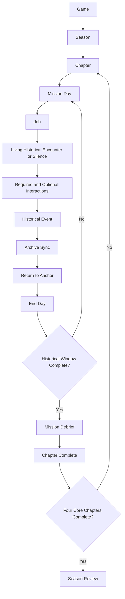
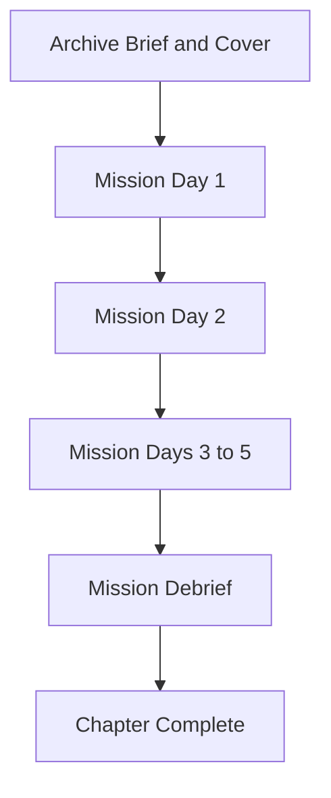
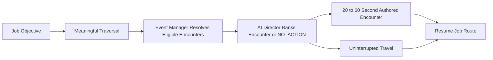
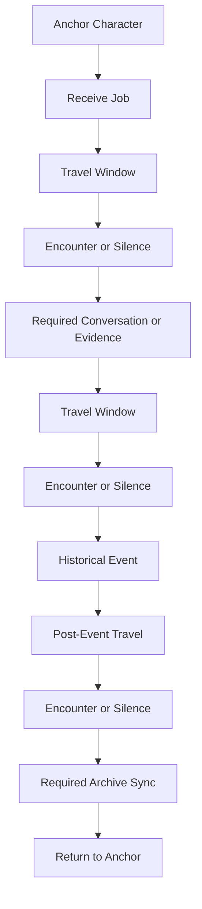
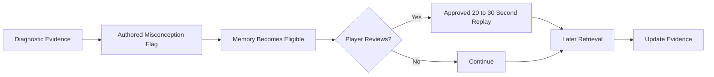
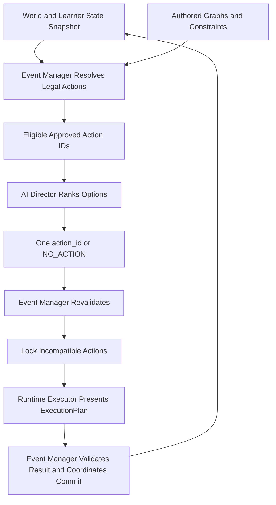
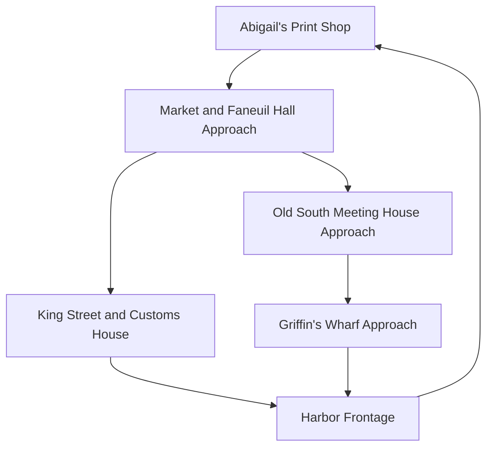
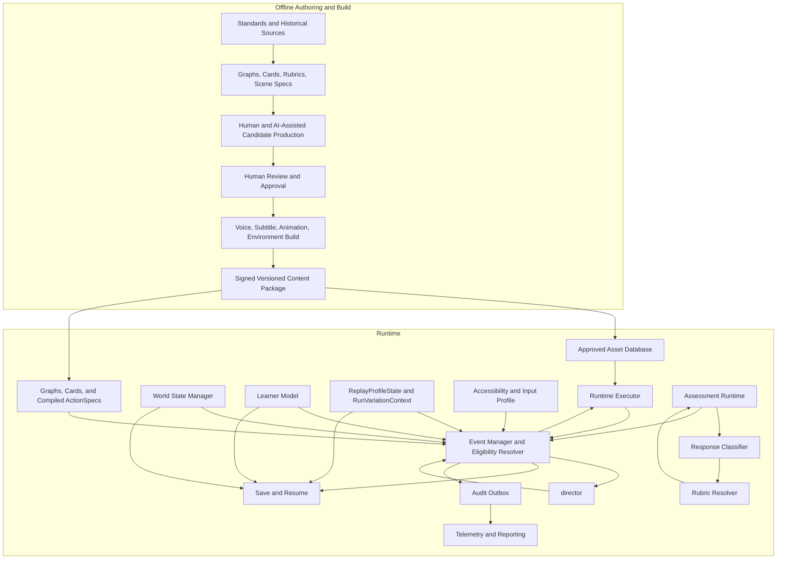
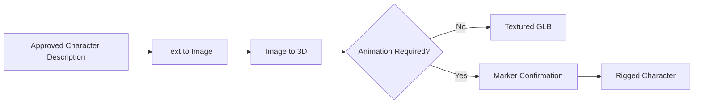

# Project Archive v3

## Canonical Game Design Document

**Document status:** Production source of truth  
**Audience:** Gameplay engineering, AI engineering, technical art, narrative, curriculum, level design, UX, QA, research, and production  
**Curriculum target:** Texas Grade 8 Social Studies, United States history through 1877  
**Reference chapter:** Boston, 1765–1774  
**Version rule:** A shipped content package may be more specific than this document, but it may not contradict it.

## Contents

- 0. How to Use This Document
- Part I — Vision, Fiction, and Product Structure
  - 1. Vision
  - 2. Story
  - 3. Overall Structure
  - 4. Seasons
  - 5. Chapters
  - 6. Mission Days
- Part II — Player Experience, World, and Characters
  - 7. Gameplay Loop
  - 7A. Onboarding and First-Time Experience
  - 7B. Auto-Save and Resume
  - 8. World Design
  - 9. Jobs
  - 9A. Living Historical Encounter System
  - 10. Historical Events
  - 11. Anchor Characters
  - 12. NPC Philosophy
  - 13. Dialogue Bible
  - 14. Subtitle System
  - 15. Interaction Taxonomy
- Part III — The Archive and Assessment Experience
  - 16. Archive
  - 17. Archive Sync
  - 18. Archived Conversations
  - 19. Mission Debriefs
  - 20. Season Reviews
  - 21. Perspective Attribution
  - 22. Archive Memories
- Part IV — Learning, Direction, and Runtime Systems
  - 23. Learning Model
  - 24. Curriculum Graph
  - 25. Scene Graph
  - 26. Misconception Graph
  - 27. AI Director
  - 28. World State Manager
  - 29. Event Manager
  - 30. Asset Selection Pipeline
  - 31. Character Cards
  - 32. Learning Science
  - 33. Adaptation
- Part V — Production, Architecture, and Governance
  - 34. Production Pipeline
  - 35. Authoring Workflow
  - 36. Boston Reference Chapter
  - 37. Technical Architecture
  - 38. Design Rules
  - 39. Success Metrics
  - 40. Future Expansion
- Appendices
  - A. Canonical Glossary
  - B. Required Chapter Package
  - C. Reference Sources
  - D. Final Requirements Matrix
  - E. Character Asset Generation Reference Pipeline

---

## 0. How to Use This Document

### Purpose

This document defines the finished design of Project Archive. It is the authority for what the game is, what each system owns, how systems communicate, what content authors must provide, and which behaviors are prohibited.

### How It Works

The document moves from product intent to player-facing structure, then to learning systems, runtime direction, production, and the complete Boston core-spine reference design. Boston encounter ActionSpecs, final assets/localization/provenance, and validation evidence remain package deliverables rather than completed artifacts. Every major section uses the same contract:

1. **Purpose**
2. **How It Works**
3. **Design Philosophy**
4. **Responsibilities**
5. **Player Experience**
6. **System Interactions**
7. **Implementation Notes — High Level**
8. **Boston Example**
9. **Edge Cases**

Normative words have fixed meanings:

- **Must / never:** mandatory.
- **Should:** expected unless a reviewed exception is recorded.
- **May:** permitted, not required.
- **Authored:** created before release and approved by humans.
- **Runtime-selected:** chosen during play from approved authored content.
- **Generated:** produced during the offline content pipeline. Unless explicitly stated, generation never occurs while a student is playing.

### Design Philosophy

No team should have to infer a game rule from tone, precedent, or a prototype. Player-facing freedom can feel loose; production and runtime contracts must remain deterministic.

### Responsibilities

- The product owner approves changes to the commandments in Section 38.
- Discipline leads own the requirements assigned to their systems.
- Content packages own chapter-specific facts and assets.
- QA verifies both the document-level rules and package-level data.

### Player Experience

The player never sees this specification. They experience a coherent historical world in which every interaction behaves consistently.

### System Interactions

This document defines the boundaries between authored graphs, world state, events, the learner model, the AI Director, approved assets, and telemetry. Chapter packages instantiate those boundaries without redesigning them.

### Implementation Notes — High Level

Each runtime behavior requires one authoritative owner, explicit inputs, legal outputs, a deterministic fallback, and telemetry. Duplicate sources of truth are prohibited.

Identifiers are typed and globally unique:

- `season_id`, `chapter_id`, `mission_day_id`, and `scene_node_id` identify authored hierarchy and progression.
- `action_family_id` identifies one logical opportunity requested by a player or scheduler.
- `action_id` identifies one executable approved variant or action fallback within that family.
- `asset_bundle_id` identifies immutable playable media.
- `concept_id`, `misconception_id`, and `evidence_event_id` identify learning semantics.

IDs are semantically immutable within a package namespace. A meaningful change to an action’s historical meaning, semantic payload, replay experience cluster, eligibility, or outcome requires a new ID; presentation-only media repair may retain the action ID while versioning the asset bundle.

Migration uses a signed manifest keyed by exact source-package hash and target-package hash. An alias is legal only when typed identity, RequiredCarrierContract hash when applicable, experience-cluster semantics, eligibility meaning, and outcome semantic hash are identical; meaningful changes require a new ID plus a tombstone or explicit non-equivalent successor. Alias/tombstone graphs must be acyclic, collision-free, and total for every persisted referenced ID. Audit/telemetry retains the original package hash and ID even when a current display alias exists. An active attempt keeps its pinned immutable package through completion; if retention is impossible, it terminates at an authored migration checkpoint and starts a new attempt/RunVariationContext rather than translating live selector state.

The AI Director can select only an `action_id`. It never selects a Scene node or raw asset bundle. Player requests target an `action_family_id`; every executable variant and fallback has its own globally unique `action_id`. The versioned **ActionSpec Compiler** compiles each executable option into an immutable derived ActionSpec that binds both IDs to its parent Scene node, initiation owner, approved asset bundle, outcome mappings, eligibility predicates, priority metadata, RequiredCarrierContract when applicable, and typed fallback references. Scene Graph is authoritative for progression, Curriculum/Misconception Graphs for learning semantics, Character Cards for character constraints, and the asset manifest for media. Generated ActionSpecs are never hand-edited and carry source hashes plus compiler/schema versions.

### Boston Example

When the Boston Tea Party is ready, the compiled ActionSpec carries its Scene prerequisites, the World State Manager confirms current state, the Event Manager exposes the event action as eligible, and the AI Director selects its `action_id`. The Event Manager locks the action and instructs the Runtime Executor to present its approved cinematic bundle. No NPC system independently starts a competing conversation.

### Edge Cases

If a chapter package conflicts with this document, the package fails validation and cannot ship. If two sections appear to conflict, the stricter constraint governs until the product owner resolves the wording.

---

# Part I — Vision, Fiction, and Product Structure

## 1. Vision

### Purpose

Project Archive exists to deliver the required Grade 8 United States history curriculum as a cinematic historical experience rather than as a conventional sequence of lessons and quizzes. Its diegetic Archive “System” may provide concise authored exposition and assessment whenever doing so is clearer than forcing that content into character dialogue.

### How It Works

The player enters compact historical districts, assumes a credible period identity, performs a job, observes fixed historical events, speaks with people whose occupations shape their viewpoints, and periodically preserves an interpretation in the Archive. Beneath that experience, authored graphs guarantee curriculum coverage and an AI Director selects the best legal authored `action_id` for the current state.

**Mission**

Enable students to master required historical knowledge and reason from evidence while feeling that they lived through the events.

**Primary audience**

- Grade 8 students studying United States history through 1877.
- Learners with mixed prior knowledge, reading fluency, game literacy, and motivation.
- Teachers and schools that need visible standards alignment and trustworthy assessment evidence.

**Secondary audience**

- Families and independent learners using the game outside class.
- Curriculum, accessibility, and research teams evaluating learning outcomes.

**Educational philosophy**

- Historical knowledge and historical reasoning are complementary. Students must know what happened and understand cause, consequence, chronology, context, and perspective.
- STAAR-eligible Grade 8 TEKS define the content boundary. Historical detail outside that boundary may appear only when required to make a TEKS-aligned scene coherent; it is never a concept node, retrieval target, misconception, or scored item.
- Required content is explicitly authored. Discovery changes the surface experience, not the curriculum obligation.
- Retrieval, explanation, feedback, and transfer occur inside believable actions.
- Formal verification is reserved for chapter and season boundaries; most learning remains embedded in play.
- The system diagnoses a small set of authored misconceptions. It does not attempt to model the whole child.

**Product pillars**

1. **Historical presence:** Dense districts, evolving environments, purposeful sound, crowds, and jobs create the feeling of occupying a specific place and moment.
2. **Character continuity:** One anchor character gives each chapter emotional coherence; other NPCs embody distinct evidence and perspectives.
3. **Invisible pedagogy:** The fiction motivates actions that also encode, retrieve, organize, and apply curriculum.
4. **Fixed truth, flexible route:** History, required concepts, and outcomes are fixed. Interaction order and educational support vary within authored bounds.
5. **Directed intelligence:** AI selects approved experiences; no runtime subsystem creates or rewrites player-facing semantic content.
6. **Content scalability:** New chapters are data-and-asset packages built with one reusable grammar.
7. **Combinatorial replay, invariant learning:** Authored encounter, route, dialogue, and support combinations make exact playthrough repetition practically rare while every player receives the same required TEKS and fixed historical spine.

**Core design principles**

- History never branches.
- The player participates but does not become the cause of recorded history.
- Mission Days are the primary gameplay unit.
- One anchor character supports one chapter.
- Jobs move the player through the curriculum.
- The environment creates immersion; interactions create learning.
- Every meaningful interaction has a curriculum, story, character, or pacing responsibility. Most have more than one.
- Assessment asks for evidence-based interpretation, not personal opinion.
- Every runtime choice resolves to an approved action ID or silence.
- Learning support adapts; historical content and outcomes do not.
- Replay variation changes optional experience texture, never required learning or assessment standard.
- The player is never shamed for uncertainty or a misconception.

### Design Philosophy

Project Archive is not a free-form historical sandbox, a branching alternate-history story, an AI tutor, or a textbook rendered in 3D. It is a guided historical simulation whose authored constraints produce the feeling of agency without surrendering historical or instructional control.

The moment-to-moment target is:

> “I am doing a job in Boston while history changes around me.”

The hidden system target is:

> “The player encountered, retrieved, and applied the causes of colonial resistance under controlled conditions.”

Both must be true at the same time.

### Responsibilities

- **Game design:** Maintain the core loop, agency boundaries, cadence, and system commandments.
- **Curriculum design:** Define required knowledge, reasoning skills, misconceptions, assessment evidence, and transfer.
- **Narrative:** Make every required learning beat believable in character and situation.
- **Art and audio:** Make the district credible without making every prop interactive.
- **AI engineering:** Implement constrained selection, classification, and fallback behavior.
- **Research:** Verify that educational claims and outcome measures remain defensible.

### Player Experience

A minimally motivated student can follow a simple job and still encounter the required content. A curious student can choose conversational routes, inspect optional evidence, and receive deeper authored variants. Neither student can accidentally skip the chapter’s historical spine or create a false historical outcome.

### System Interactions

The vision is enforced through:

- Curriculum Graph coverage.
- Scene Graph progression.
- World State and Event Manager locks.
- AI Director constraints.
- Approved asset validation.
- Mission Debrief and Season Review verification.

### Implementation Notes — High Level

The engine must expose the same player-facing grammar across chapters while allowing distinct art direction, jobs, pacing, anchor personalities, and signature scene treatments. “Reusable” means stable contracts, not identical chapters.

### Boston Example

The Boston chapter teaches the assessed relationship among postwar British economic policy, the Stamp Act, mercantilism, lack of representation, resistance, and the Intolerable Acts, plus the assessed roles of Samuel Adams, Crispus Attucks, and John Adams. Fictional occupational and loyalty differences make those TEKS coherent but are not separate learner-state nodes or scored facts.

### Edge Cases

- If fun and curriculum coverage conflict, redesign the interaction; do not hide required content in optional exploration.
- If historical accuracy and dramatic convenience conflict, accuracy wins.
- If a mechanic is engaging but has no recurring responsibility, it does not enter the core engine.

---

## 2. Story

### Purpose

The fiction explains why the same player can enter different eras, why their body and occupation change, why local people accept them, why the Archive observes their reasoning, and why history remains fixed.

### How It Works

**The Archive**

The Archive is a future institution testing controlled temporal observation. Its mission is to preserve not only records of events but also defensible interpretations of how and why those events unfolded.

The player is an Archive Field Agent. Each chapter begins with a brief future-side mission intake:

1. The Archive identifies a historically plausible, low-record role near the required events.
2. It synchronizes the player with an era-appropriate physical presentation, clothing, tools, accent support, and cover history.
3. It inserts the player at the start of an already-authored social relationship, usually as a new or returning junior worker.
4. It states the investigation’s driving question without revealing its answer.
5. It opens the historical window.

**Time-travel framing**

The player enters a self-consistent historical record. Their small actions were always part of unrecorded daily life; recorded anchor events and outcomes are temporally fixed. The Archive’s safety system only opens roles and actions that cannot produce a conflicting record.

This is not a morality rule or an invisible wall around famous people. The authored experience simply contains no action that could kill George Washington, stop a battle, prevent legislation, or produce another timeline.

**Why the player changes identity**

Each chapter requires a different access path. Boston’s cover progresses from printer’s apprentice in 1765 to experienced printer’s assistant and delivery runner in 1773–1774, preserving plausible access across the time jumps. A telegraph runner can plausibly move among officers, stations, and civilians during the Civil War. The persistent player consciousness remains the same, while the visible cover identity, clothing, job tools, and social role change.

**Why history cannot change**

- The temporal system only opens self-consistent observation windows.
- The Scene Graph contains fixed historical outcomes.
- Player choices alter route, dialogue, evidence order, and support—not recorded events.
- The Event Manager rejects any state transition outside the approved historical sequence.
- The content library contains no alternate outcome asset.

**Why NPCs trust the player**

Trust begins with social proof, not mind control:

- The anchor character expects an apprentice, runner, clerk, or assistant.
- The player arrives with the correct clothing, tools, work token, and introduction.
- The anchor vouches for the player.
- Supporting NPCs first trust the role—“Abigail’s apprentice”—and only later trust the person.
- Relationship depth is earned across Mission Days.

NPCs do not disclose private information merely because the player is the protagonist. Access remains profession- and relationship-dependent.

### Design Philosophy

The future is a frame, not a competing setting. At least 90 percent of active play occurs in history. Archive language is restrained, procedural, and never more emotionally important than the people in the historical district.

The fiction protects the game’s constraints:

- Identity creates access.
- Jobs create motivation.
- Fixed time protects truth.
- The Archive justifies capture and replay.

### Responsibilities

- **Narrative:** Define Archive terminology, cover logic, introductions, and relationship progression.
- **Chapter authors:** Choose a role that naturally reaches all required locations and concepts.
- **Scene Graph:** Exclude actions that would require alternate history.
- **World State Manager:** Track cover, relationship, access, and chapter time window.
- **Archive systems:** Brief, record, synchronize, replay, and debrief; never become an omniscient lecturer.

### Player Experience

The player sees a short identity synchronization, then wakes or steps into a workplace already in motion. In Boston, Abigail presses a stack of damp newspapers into their hands before they have time to ask why the city exists for them. Belonging is established through work.

### System Interactions

- Cover identity selects the player model, costume, tools, default knowledge, and legal access tags.
- Character Cards define what each NPC initially knows about the cover.
- Relationship state unlocks authored conversations.
- The Event Manager ensures historical windows and outcomes stay fixed.
- The Archive preserves selected player responses across chapters and seasons.

### Implementation Notes — High Level

Cover identities must be fictional or historically unrecorded enough to avoid contradicting known biographies. A chapter package must specify:

- Role and employer.
- Entry line and visible credentials.
- Allowed locations.
- Skills the player may plausibly perform.
- Knowledge the cover would possess.
- Relationship starting state.
- Historical actions the role cannot perform.

### Boston Example

The player synchronizes in 1765 as **Abigail Mercer’s printer’s apprentice**. They wear a printer’s apron, carry Abigail’s delivery ledger, and know the district’s basic routes. Abigail has agreed to take on help during a busy publication day. Thomas recognizes the bundle seal and calls the player “Mercer’s runner.” A routine royal clerk accepts the legal-proof delivery; Captain Ellis does not appear until the 1770 Mission Day.

Across later Mission Days, the same local cover persists. Abigail’s trust moves from supervisory to personal because the player returns, completes work, and survives the city’s escalating tension with her.

### Edge Cases

- **Player asks an NPC about the future:** No free-text runtime dialogue exists. Authored choices never offer future disclosure.
- **Cover would lack access:** The job, not protagonist privilege, supplies a legal route. If no believable route exists, the chapter premise must change.
- **Historical record names a real apprentice:** Do not overwrite or impersonate that person. Use a fictional role compatible with the record.
- **Player attempts to leave the district:** Streets, duties, and public conditions provide in-world boundaries; the engine does not simulate the rest of the city.

---

## 3. Overall Structure

### Purpose

The hierarchy gives design, production, telemetry, saves, and assessment one shared language.

### How It Works



**Canonical units**

- **Game:** The complete Grade 8 U.S. history experience through 1877.
- **Season:** A major historical era and transfer arc.
- **Chapter:** One place-centered historical investigation with one driving question and one anchor character.
- **Mission Day:** One playable historical episode and the fundamental repeatable unit.
- **Job:** The believable work obligation that routes the player.
- **Living Historical Encounter:** Short authored interruption selected during a traversal window to create historical life and replay variation without carrying required assessment content.
- **Interaction:** A bounded unit of observation, conversation, choice, reasoning, or review.
- **Historical Event:** A fixed authored event whose outcome does not depend on the player.
- **Archive Sync:** One brief, in-world capture of current understanding.
- **Mission Debrief:** The chapter’s deeper explanation and verification sequence.
- **Season Review:** Cross-chapter synthesis and STAAR-style verification.

Progression uses three distinct states:

- **Historical window complete:** The final Mission Day and its End Day transaction are committed.
- **Debrief submitted:** Assessment Runtime has committed either `VALID_SCORED` or terminal `INVALID_UNSCORED`. `UNCLASSIFIED` is a classifier result and `INVALID_REPLACEMENT_PENDING` is nonterminal; neither satisfies submission.
- **Chapter complete:** Both prior states are true; only this state contributes to Season completion.

### Design Philosophy

Macro units organize history; Mission Days create play. Chapters are not forty-minute unbroken sequences. They are containers for several episodes separated by meaningful historical time.

### Responsibilities

- Production plans capacity at Season, Chapter, and Mission Day levels.
- Save systems persist at interaction checkpoints and Mission Day boundaries.
- Curriculum coverage rolls up from interactions to concepts, chapters, and seasons.
- Telemetry uses the same IDs as authored content.

### Player Experience

The player experiences a familiar cadence without seeing the hierarchy as a course menu. A new day in Boston feels like returning to a place that has changed, not selecting “Lesson 2.”

### System Interactions

- The Curriculum Graph assigns concept obligations to chapters and retrieval obligations across seasons.
- The Scene Graph instantiates Mission Days and events.
- World State persists changes between days.
- The learner model persists across the game.
- Mission Debriefs and Season Reviews consume evidence accumulated below them.

### Implementation Notes — High Level

Every content object has a stable ID and parent:

- Season owns Chapters.
- Chapter owns Mission Days, one anchor, one district state family, and one Debrief.
- Mission Day owns exactly one primary Job, one primary Historical Event, and one required Archive Sync. Additional Archive context cards and non-Sync interactions may appear, but no second Sync is permitted.
- Season owns one Review.

Optional scenes may move within authored windows. Parent-child ownership may not be reassigned at runtime.

### Boston Example

Boston is one Chapter inside the Colonies and Revolution Season. It contains four Mission Days, each with one newspaper job, several encounters, one fixed historical event, one required Archive Sync, a return to Abigail, and a changed city state. The fourth day leads to the Boston Mission Debrief. Boston evidence returns in the Season Review when the player compares imperial policy in Boston with arguments for independence in Philadelphia.

### Edge Cases

- A Mission Day may contain a short epilogue event after its Sync, but still has only one primary historical event.
- A chapter may use three to five Mission Days. Anything outside that range requires production and curriculum approval.
- An accessibility break may interrupt a Mission Day without creating a new historical day.
- Optional content never becomes a hidden prerequisite for Chapter completion.

---

## 4. Seasons

### Purpose

Seasons organize the full curriculum into coherent historical eras, space concepts across time, raise the level of reasoning, and provide deterministic cross-chapter verification.

### How It Works

The reference release contains five Seasons and twenty Chapters. Chapter titles may change during content production, but the era coverage and progression may not be removed.

**`SEA01` — Colonies and Revolution (1607–1783)**

- Era question: How did Britain’s North American colonies develop and then become an independent United States?
- Colonial regional development, self-government, imperial conflict, causes of revolution, independence, and war.
- Reasoning emphasis: observation, chronology, explicit cause and effect, and distinguishing perspectives.
- Chapters: `SEA01_CH01_COLONIES` Colonial Worlds; `SEA01_CH02_BOSTON` Boston on the Brink; `SEA01_CH03_INDEPENDENCE` Independence in Philadelphia; `SEA01_CH04_WAR` War for Independence.

**`SEA02` — Constitution and the New Republic (1781–1800)**

- Era question: How did Americans replace a weak confederation with a constitutional republic and begin making it work?
- Articles of Confederation, Constitutional Convention, ratification, Bill of Rights, federalism, early precedents, and political parties.
- Reasoning emphasis: comparing proposals, identifying trade-offs, connecting structural choices to consequences.
- Chapters: `SEA02_CH01_CONFEDERATION` A Fragile Confederation; `SEA02_CH02_CONVENTION` Compromise in Philadelphia; `SEA02_CH03_RATIFICATION` Ratification; `SEA02_CH04_ADMINISTRATION` The First Administration.

**`SEA03` — Growth, Democracy, and Reform (1800–1848)**

- Era question: How did territorial growth, economic change, democratization, and reform reshape the United States?
- Louisiana Purchase, War of 1812, industrial and market change, Jacksonian democracy, Indian Removal, the Second Great Awakening, and reform.
- Reasoning emphasis: continuity and change, policy effects on different groups, and economic-to-political transfer.
- Chapters: `SEA03_CH01_PURCHASE` The Purchase and Expedition; `SEA03_CH02_WAR1812` A Second War; `SEA03_CH03_MARKET` The Market Transforms; `SEA03_CH04_DEMOCRACY` Democracy, Removal, and Reform.

**`SEA04` — Expansion and Sectional Crisis (1820–1861)**

- Era question: Why did territorial expansion and slavery make sectional compromise increasingly difficult?
- Manifest Destiny, Texas, the Mexican-American War, abolition, sectional economies, slavery, failed compromises, and mounting disunion.
- Reasoning emphasis: corroboration, competing claims, long- and short-term causes, and regional comparison.
- Chapters: `SEA04_CH01_WESTWARD` Westward Claims; `SEA04_CH02_MEXICO` War with Mexico; `SEA04_CH03_ABOLITION` Freedom and Abolition; `SEA04_CH04_FRACTURE` The Union Fractures.

**`SEA05` — Civil War and Reconstruction (1861–1877)**

- Era question: How did Civil War and Reconstruction redefine the Union, citizenship, and freedom?
- Secession, wartime strategy, emancipation, civilian and military experiences, constitutional change, Reconstruction governments, resistance, and the contested meaning of freedom.
- Reasoning emphasis: synthesis across sources, consequences, historical change over time, and transfer across the complete course.
- Chapters: `SEA05_CH01_SECESSION` Secession; `SEA05_CH02_WAR` War and Emancipation; `SEA05_CH03_UNION` Union Restored; `SEA05_CH04_RECONSTRUCTION` Reconstruction Contested.

Each Season contains:

- Four Chapters.
- A defined era question.
- Required readiness and supporting standards.
- Cross-chapter concept returns.
- One Season Review using equivalent, approved STAAR-style forms.
- At least one callback to an Archived Conversation or prior anchor.

### Design Philosophy

Seasons are learning arcs, not television-style content drops. Their boundaries occur where a set of historical concepts can be synthesized and transferred before the next era changes the context.

Reasoning support fades deliberately:

- Season 1 explicitly signals evidence and perspective.
- Season 2 asks players to compare structures with less prompting.
- Season 3 requires continuity/change and consequences across groups.
- Season 4 requires corroboration across conflicting sources.
- Season 5 expects independent synthesis and transfer.

The factual standard does not become harder because the AI chooses it. Difficulty progression is authored and common to all players.

### Responsibilities

- **Curriculum lead:** Own era coverage, TEKS mapping, vertical progression, and review blueprint.
- **Narrative lead:** Ensure chapters vary in place, job, rhythm, and emotional tone.
- **Assessment lead:** Build equivalent forms and transfer items.
- **Production:** Balance four chapters without forcing identical asset counts.

### Player Experience

A Season feels like living through a historical transformation. The ending does not merely ask what happened in four chapters; it asks the player to connect them.

### System Interactions

- Curriculum Graph dependencies cross Chapter boundaries.
- Archived Conversations provide emotional and metacognitive callbacks.
- Learner Model evidence is summarized for the Review but does not alter its required standards.
- Season completion unlocks the next era only after the required Review is submitted, not after a mastery threshold.

### Implementation Notes — High Level

Season packages define:

- Era question and date range.
- Four Chapter IDs.
- Required standards and reporting-category coverage.
- Concepts introduced, retrieved, and transferred.
- Archived Conversation callbacks.
- Review blueprint, approved items, rubrics, and equivalent forms.
- Unlock and completion rules.

### Boston Example

Boston introduces the relationship among war debt, imperial taxation, representation, enforcement, and resistance. Philadelphia later retrieves those ideas while the colonies debate independence. The Season Review uses an unfamiliar authenticated source excerpt to assess 8.4(A) content and requires an explanation of how the argument changed by 1776. Point-of-view analysis and any fictional-character callback are unscored process supports.

### Edge Cases

- If a player shows uncertainty in Boston, the Philadelphia chapter still begins on schedule. Approved clarification assets may be selected, but the chapter order does not change.
- A Season Review exposes the common pre-assessment review catalog before form assignment; it never targets a Memory from learner state or replaces the common blueprint and equated form family with an easier test.
- Expansion content may add optional Chapters only after the canonical Season Review. Optional Chapters do not affect core completion, Review scoring, or required evidence and use a separate expansion-progress track.

---

## 5. Chapters

### Purpose

A Chapter turns a historical problem into a place, relationship, sequence of Mission Days, and assessable explanation.

### How It Works

Every Chapter is defined by:

- One driving question.
- One compact historical district.
- One cover identity and job family.
- One anchor character.
- Three to five Mission Days.
- The minimum sufficient set of core concepts, each mapped to the STAAR-eligible Grade 8 TEKS. No numerical quota may cause unassessed content to become a concept.
- Three to five likely misconceptions.
- Multiple occupational and political perspectives.
- One fixed historical spine.
- One signature treatment using an existing interaction type.
- One Mission Debrief.

A signature treatment may also be a memorable composition of the Job and several existing interaction types; it is not itself a new interaction type or engine verb.

The driving question must be:

- Historically significant.
- Answerable through the Chapter’s evidence.
- Broad enough to connect several events.
- Narrow enough for one place-centered arc.
- Expressed as cause, consequence, change, comparison, or evidence—not trivia.

The Chapter grammar is:



### Design Philosophy

One Chapter should be remembered as a place and a person, not as a list of standards. Boston is Abigail’s print shop and a city moving from protest to rupture. The Constitutional Convention is a clerk’s hall full of incompatible proposals. Reuse comes from grammar; distinction comes from setting, job, historical pressure, and anchor character.

### Responsibilities

- **Chapter designer:** Own the driving question, Mission Day arc, fixed sequence, signature treatment, and completion.
- **Curriculum designer:** Own concept coverage, dependencies, misconceptions, transfer, and assessment.
- **Narrative designer:** Own anchor arc, NPC perspectives, dialogue, and emotional pacing.
- **Level designer:** Own district routes, soft funnels, event staging, and state changes.
- **Technical art:** Own state variants, characters, crowds, and cinematic budget.
- **QA:** Verify every required concept has more than one carrier and no required carrier is optional-only.

### Player Experience

The player repeatedly returns to a familiar home base while the district changes. Each day answers part of the same question. By the Debrief, the player has seen enough evidence to construct an explanation rather than guess one.

### System Interactions

- Curriculum Graph defines obligations.
- Scene Graph defines Mission Day sequence and fallback carriers.
- Misconception Graph supplies diagnostic choices and clarifications.
- Character Cards constrain dialogue.
- World State carries environmental and relationship changes.
- AI Director selects optional order and support within the fixed spine.

### Implementation Notes — High Level

A Chapter cannot enter asset production until its design package passes:

1. Historical dossier review.
2. Standards and concept-map review.
3. Driving-question evidence sufficiency review.
4. Mission Day route and pacing review.
5. Misconception and assessment review.
6. Anchor arc and dialogue review.
7. Graph reachability and fallback review.

### Boston Example

**Chapter title:** Boston on the Brink  
**Driving question:** Why did British policy after the French and Indian War push many colonists from protest toward organized resistance?  
**Cover identity:** Printer’s apprentice (1765) → experienced printer’s assistant and delivery runner (1773–1774)  
**Anchor:** Abigail Mercer — Printer  
**District:** Print shop, market/Faneuil Hall approach, King Street and Customs House, Old South Meeting House approach, Griffin’s Wharf, harbor frontage  
**Mission Days:** Stamp Act; Boston Massacre; Tea Party; Port Closure  
**Signature treatment:** The print-delivery Job composes Dialogue Inquiry, Observation, Evidence Selection, Source Evaluation, and Cause/Consequence interactions while physically carrying changing arguments through the same district. It adds no new engine verb.

### Edge Cases

- If the driving question requires several distant cities, split the concept across Chapters.
- If the historical arc has no believable recurring anchor, redesign the cover role or district.
- A Chapter may portray a composite supporting NPC, but cannot use a composite as a real named historical figure.
- If a required concept cannot be carried naturally by at least two scenes, the Chapter is not ready.

---

## 6. Mission Days

### Purpose

Mission Days are the primary gameplay and pacing unit. They distribute history across believable episodes, create repetition without immediate re-testing, support world and relationship change, and give the player a clear beginning and end.

### How It Works

Every Mission Day contains:

1. **Morning / arrival:** Establish date, changed world state, and immediate human context.
2. **Anchor character:** Reconnect with the Chapter’s emotional center.
3. **Job:** Receive one believable work obligation.
4. **Exploration:** Move under player control through the compact district.
5. **Living Historical Encounters:** During authored traversal windows, experience selected short interruptions or deliberate silence.
6. **Required/optional interactions:** Complete three to five meaningful curriculum/story interactions, separated by traversal.
7. **Historical Event:** Witness or participate peripherally in one fixed event.
8. **Archive Sync:** Preserve one interpretation after a meaningful inflection point.
9. **Return:** Rejoin the anchor character and close the work loop.
10. **End Day:** Commit world, relationship, curriculum-exposure, and learner evidence state.


**Reference cadence**

- One primary Job.
- Three to five meaningful interactions.
- Two to four authored Living Encounter slots; every normal certified Mission Day presents two to four short encounters when sufficient support-equivalent content is legal. A slot may resolve to silence only as surplus capacity or under a declared `quiet_exception_id`.
- One primary Historical Event.
- One required Archive Sync.
- One return scene.
- One meaningful traversal, generally 5–20 seconds, between major interactions.
- Typical duration: 12–20 minutes.
- Chapter total: three to five Mission Days.

Mission Days are historical episodes, not literal consecutive twenty-four-hour periods. The next Mission Day may occur hours, months, or years later. The opening clearly states the date and shows what changed.

**Why Mission Days are primary**

A Chapter-scale continuous rhythm would compress years of causation into one implausible afternoon, crowd concepts together, flatten character change, and remove natural boundaries for retrieval. The Chapter remains the investigation container; Mission Days own moment-to-moment pacing and state progression.

### Design Philosophy

The repeatable shape creates security; the historical content creates surprise. The player knows they will return to Abigail, but does not know what Boston will look like the next time.

Each day alternates:

> experiencing history → living in history → experiencing history

Authored interaction is followed by enough traversal and ambient life to restore agency and prevent a dialogue conveyor belt.

### Responsibilities

- **Mission designer:** Own objectives, route, interaction order windows, event timing, Sync placement, and return.
- **Anchor writer:** Bookend the day without summarizing it like a teacher.
- **Level design:** Provide natural traversal and multi-channel guidance.
- **World State Manager:** Load the correct date-state and commit the end state.
- **Event Manager:** Validate, lock, and orchestrate the historical event; Runtime Executor presents its media.
- **AI Director:** Choose among eligible optional interactions and variants; it cannot omit the day’s spine.

### Player Experience

The player starts with a concrete task. They remain in control while walking, looking, and choosing whether to ask or follow. At the defining historical moment, a short cinematic may take control. The Archive captures one thought, then the player returns “home.”

### System Interactions

- Date-state selects environment, crowds, NPC positions, ambient subtitles, and available scenes.
- Job objectives open route-specific interactions.
- Event prerequisites consume required Scene/ActionSpec completions and committed RequiredCarrierContracts—never Living Historical Encounter completion or elapsed time.
- Archive Sync becomes pending only after its authored historical and evidence threshold.
- End Day writes a checkpoint and unlocks the next date-state.

### Implementation Notes — High Level

Required progression is state-based:

- No event starts because five minutes elapsed.
- No Archive Sync opens because three dialogues played unless the authored threshold explicitly requires those evidence carriers.
- An event can have an earliest and latest eligible point.
- When a required event reaches its latest point, optional actions leave the eligible set.

Normal gameplay conversations use medium shots, work animations, gestures, and subtitles. Full facial performance and lip sync are reserved for authored cinematics and selected anchor close-ups.

### Boston Example

On 16 December 1773, Abigail asks the player to carry the afternoon edition and a meeting notice toward Old South Meeting House. The player hears Thomas discuss regulated tea trade, reads an authenticated customs notice representing legal authority, and hears a Loyalist shopkeeper warn against mob action. People leave the meeting; a smaller group proceeds to the ships, and the player follows under soft guidance to Griffin’s Wharf. The Tea Party plays as a locked historical event. After control returns, one Archive Sync asks which accumulated factor best explains why protest escalated that night. The player returns to a darkened print shop where Abigail quietly sets tomorrow’s type.

### Edge Cases

- **Player wanders:** Ambient life continues, route cues escalate, a companion waits or reacquires, and an Archive Assist offer may appear after 30 seconds; the route is revealed only after player acceptance.
- **Player misses an optional interaction:** The required concept remains available through its authored fallback carrier.
- **Player refuses a required Sync:** It may be deferred until the current conversation or traversal ends, then becomes required before End Day.
- **Player quits:** Resume at the latest interaction checkpoint with event and Sync locks restored.
- **Player reaches an event trigger too early:** The world supplies a believable hold scene; the event remains ineligible until prerequisites are met.

---

# Part II — Player Experience, World, and Characters

## 7. Gameplay Loop

### Purpose

The gameplay loop defines what the player does from second to second and prevents curriculum delivery from becoming a passive film or visible test.

### How It Works

The loop is:

> **Walk → Watch → Talk → Choose → Think → Archive → Repeat**

**Walk**

- Move directly through a compact district.
- Follow people and environmental cues rather than permanent waypoint arrows.
- Use one contextual interact input and one optional Archive Assist input.
- Enter authored traversal windows in which a Living Historical Encounter or deliberate silence may be selected.
- No combat, platforming, crafting, inventory management, skill tree, collectibles, or reputation system.
- Jumping is omitted unless a later expansion provides a recurring, curriculum-relevant use.

**Watch**

- Observe ambient labor, crowds, documents, public arguments, environmental change, and short historical cinematics.
- Important observations are framed by composition, sound, motion, and proximity.
- Observation can teach without requiring immediate input.

**Talk**

- Enter short, authored conversations.
- Select what to ask, whether to follow, or how to respond.
- Continue moving during many conversations.
- Hear profession-grounded perspectives rather than exposition from interchangeable NPCs.

**Choose**

- Make two or three bounded dialogue choices; a Living Historical Encounter may expose a fourth control when it is an ordinary route/action option rather than another spoken response.
- Affect route, interaction order, dialogue variant, and the evidence personally encountered.
- Never alter a fixed event or ending.

**Think**

- Predict, distinguish causes, attribute perspectives, assess sources, sequence events, or organize evidence.
- Most thinking interactions last under 20 seconds.
- Open-ended reasoning is reserved for Debriefs, Reviews, and rare earned conversations.

**Archive**

- Complete one brief Archive Sync at a historical inflection point.
- Revisit an optional Archive Memory when useful.
- Enter a longer Archive environment only at chapter and Season boundaries.

**Repeat**

- Return to movement immediately.
- Encounter the next authored opportunity after a meaningful traversal.
- Preserve variation through ReplayProfileState exposure history and a deterministic per-attempt RunVariationContext.

### Design Philosophy

The player should feel alternation, not interruption. Walking provides ownership and atmosphere; interactions provide authored meaning; cinematics give fixed history the stage; Archive moments preserve thought without becoming the dominant fiction.

### Responsibilities

- **Gameplay design:** Keep the verb set small and legible.
- **Level design:** Make movement itself sufficient to find the next beat.
- **Narrative:** Make dialogue choices sound like human participation.
- **Curriculum:** Assign a reasoning purpose only where enough evidence exists.
- **AI Director:** Select the best legal beat and sometimes select silence.

### Player Experience

Within two minutes, a player should have moved, heard a useful ambient line, made one low-cost choice, and seen the next point of interest. Within one Mission Day, the player should have experienced all seven verbs without feeling that the game changed modes.

### System Interactions

- Movement enters Scene Graph trigger volumes.
- Traversal windows expose eligible Living Historical Encounter ActionSpecs.
- Observation completion logs evidence exposure.
- Dialogue and reasoning choices update learner evidence.
- Historical events lock conflicting inputs.
- Archive Syncs consume their prompt once and return control.

### Implementation Notes — High Level

The default control state is free movement. Control changes only through explicit, authored states:

1. **Free movement:** Full character and camera control.
2. **Soft guidance:** Full movement with an NPC lead, environmental funnel, and optional objective text.
3. **Cinematic control:** Movement locked for a short fixed event; camera and skip/accessibility behavior are authored.
4. **Archive overlay:** Locomotion pauses; ambient simulation remains visible but authored progression pauses.

Unexpected control seizure is prohibited. A player action or clearly staged event must precede every cinematic lock.

**Archive Assist contract**

- Archive Assist is a `PLAYER_REQUESTED` ActionSpec available during legal free-movement states.
- It reads the current required objective and approved route from Scene/World state, briefly highlights the next route segment, and may display one authored directional sentence.
- It emits no learner evidence and never changes concept or misconception state.
- Repeated use is allowed after a five-second presentation cooldown and carries no penalty.
- An Accessibility and Input Profile may enable an automatic offer after 30 seconds without progress. Acceptance creates the player request; Assist never starts automatically.
- World State owns the current objective and assist cooldown; Event Manager validates availability; Archive Runtime Controller presents the hologram.
- If route highlighting is unavailable, the approved text/companion fallback plays.

### Boston Example

The player leaves Abigail’s shop with a paper bundle, walks across the market, watches a stamped notice being argued over, asks Thomas why his customers are angry, chooses to continue the delivery or listen longer, predicts what enforcement may do to the protest, completes a ten-second Sync, and walks back through a changed crowd.

### Edge Cases

- If a player supplies no input, NPCs wait, repeat one natural prompt, and then idle; the game does not fail the mission.
- If accessibility settings slow reading, scene timers and cinematic transitions wait for the player.
- If a student repeatedly opens Archive Assist, the route remains available without learner-state penalty.
- Skipping a skippable cinematic marks it viewed for progression but does not count as concept understanding; a later required carrier still supplies the core content.

---

## 7A. Onboarding and First-Time Experience

### Purpose

Onboarding teaches the small verb set, the controls, the Archive fiction, and the player's accessibility setup on the first run, without a separate abstract tutorial level and without adding cognitive load that competes with history. It never introduces a required concept as its sole carrier.

### How It Works

Onboarding is diegetic and embedded in the first synchronization and first Mission Day rather than delivered as a detached lesson. The fiction *is* the tutorial: an Archive Field Agent is being calibrated for their first insertion.

1. **Profile setup first.** Before any fiction, the player selects an Accessibility and Input Profile: reading speed, captions, audio description, input method, and whether Archive Assist may auto-offer. This precedes historical content so every later primer already has a legal presentation form.
2. **Just-in-time verb primers.** Each core verb from the gameplay loop (Walk, Watch, Talk, Choose, Think, Archive) is introduced exactly once, in context, the first time it is needed, with one short authored prompt, then never repeated.
3. **The first intake doubles as a controls primer.** The opening Archive synchronization teaches movement, the contextual interact input, and the Archive Assist input as the player performs each for the first time.
4. **Persistent help.** A low-friction **Archive Manual** overlay is always available on request. It restates controls, the current objective, and accessibility options. It is a `PLAYER_REQUESTED` overlay like Archive Assist, emits no learner evidence, and never changes concept or misconception state.
5. **Deterministic and offline.** All primers are authored `first_run_only` ActionSpecs. Nothing is generated at runtime; onboarding runs with no network and no runtime AI.
6. **Not assessed.** Onboarding carries no scored item and no required curriculum obligation. It may model a verb but can never be the required carrier for a concept.

### Design Philosophy

Teach by doing, and teach the least. A student learns to move by moving and to talk by talking to Abigail, not by reading a manual. Protecting first-session cognitive load for the history — not the interface — is the whole point. Instruction is silent once mastered.

### Responsibilities

- **Narrative:** Author the first-synchronization calibration lines and Manual copy.
- **Gameplay / Level design:** Sequence just-in-time verb introductions across the first district.
- **Accessibility:** Ensure profile setup precedes fiction and every primer has an accessible equivalent.
- **Curriculum:** Guarantee no required concept depends on a `first_run_only` primer.
- **Save/Resume:** Persist onboarding completion so primers never repeat.

### Player Experience

A student launches, chooses how they read, hear, and control the game, then wakes inside the Archive. Within a couple of minutes they have moved, spoken to Abigail, made one low-stakes choice, and started real work — without having read a wall of instructions.

### System Interactions

- ProfileState stores non-learning onboarding completion flags.
- Scene Graph hosts `first_run_only` trigger volumes.
- Event Manager gates each primer to the first run and marks it complete on view.
- Archive Runtime Controller presents the Manual overlay.
- The Accessibility and Input Profile is set before the first historical content.

### Implementation Notes — High Level

- `first_run_only` ActionSpecs are idempotent and committed by Save/Resume on view, so a resume never replays them.
- The Archive Manual is always reachable, is skippable content, and emits no evidence.
- Skipping a primer still marks it complete; the underlying concept, if any, is still delivered by a certified carrier later.
- Onboarding content is excluded from replay signatures and longitudinal novelty gates; it is fixed scaffolding, not variable experience.
- No onboarding step blocks progress beyond a single confirmation.

### Boston Example

At the 1765 synchronization the player picks captions and an input method, then Abigail presses a bundle of newspapers into their hands. A one-line prompt shows the move control as they step toward the door; the interact prompt appears at the first delivery; Archive Assist is introduced once when the route first forks; the first Sync explains the Archive verb. By the second delivery, no primers appear and only the Manual remains on request.

### Edge Cases

- **New device / lost flags:** Onboarding flags travel with the player profile and save; if absent, primers re-show harmlessly and never gate required content.
- **Player skips everything:** The Manual remains available and required carriers still deliver every concept.
- **Accessibility change mid-game:** The profile is editable and any primer can be replayed from the Manual on request.
- **Save corruption:** Primers may re-show after recovery; they never affect scoring or block required content.

---

## 7B. Auto-Save and Resume

### Purpose

Auto-Save and Resume guarantee that a student can stop at any moment — a bell rings, a shared device sleeps, the network drops — and later continue from exactly where they were, with no manual saving, no lost progress, and no way to replay a scored item by quitting. It exposes the player-facing contract over the durable Save/Resume machinery owned by the World State Manager (Section 28), Event Manager (Section 29), and Technical Architecture (Section 37).

### How It Works

1. **Continuous auto-save, no manual slots.** The game saves itself; there is no save button and no save-file menu. The player never manages persistence.
2. **Save points.** State commits at every interaction checkpoint, every Archive Sync boundary, every Mission Day start and end, and every event checkpoint — consistent with the checkpoints already defined in Sections 6, 28, and 37.
3. **One atomic composite.** A single per-player save composite (World State, Learner Model evidence, Replay profile, and attempt context) is committed atomically by Save/Resume under one transaction ID; authoritative revisions publish only after the commit succeeds.
4. **Deterministic resume.** Resume restores the exact checkpoint, re-acquires event and Sync locks, and re-pins the immutable content package and RunVariationContext, so determinism and the practically non-repeating guarantee hold across online, offline, and resumed play.
5. **Beat-level safety.** Quitting mid-encounter or mid-event resumes from that beat's checkpoint or safely restarts the beat; a partial historical outcome is never committed.
6. **Assessment integrity.** An in-progress scored item resumes on the same form without exposing correctness. An administration interrupted after response collection follows the existing invalidate-and-replace rule; quitting never yields a second scored chance.
7. **Offline-first.** Auto-save works with no network. Telemetry is a separate idempotent outbox that syncs later and never blocks a resume.
8. **Crash recovery.** On relaunch the game resumes from the last valid checkpoint; a corrupt save falls back to the last valid Mission Day checkpoint.
9. **Invisible to the player.** Saving is a silent backend operation. There is no save indicator, no saving animation, and no save/resume prompt. On launch the game simply continues from the last checkpoint; the student never sees or thinks about saving at all.

### Design Philosophy

Classroom sessions are interrupted by design — bells, rotations, shared hardware. Saving is the system's job, never the student's, and it is invisible: the player is never shown a save indicator, a save menu, or a resume prompt. The contract is: no progress anxiety, no lost work, nothing to manage, and no assessment that can be gamed by force-quitting.

### Responsibilities

- **Save/Resume:** Sole owner of durable composite persistence, migration, rollback, and recovery.
- **World State Manager:** Expose the versioned snapshot/restore interface.
- **Event Manager:** Commit the composite and outbox atomically under one transaction ID.
- **Assessment Runtime:** Resume on the same form and enforce invalidate-and-replace on interrupted administrations.
- **UX:** Keep saving fully invisible — no save indicator, prompt, or manual slots; resume the last checkpoint automatically on launch.

### Player Experience

A student closes the laptop when the bell rings. Next class they reopen the game and are simply standing exactly where they left off — mid-conversation, same day, same city state — with no prompt, nothing repeated, and nothing lost. They never saw a save happen.

### System Interactions

- Interaction checkpoints, Mission Day boundaries, Sync boundaries, and event checkpoints trigger atomic commits.
- RunVariationContext and the package hash are re-pinned on resume for online/offline/resume selector parity.
- Save-at-every-boundary signature equivalence is a standing validation requirement (Section 34).

### Implementation Notes — High Level

- There are no user-visible save files or slots; there is one authoritative composite plus a recovery journal.
- Commit is transactional and all-or-nothing; power loss mid-commit resumes from the last committed checkpoint.
- Auto-save cadence is bounded so the worst-case lost progress is a single in-progress micro-interaction, never a whole Mission Day.
- Save is keyed to player identity; the certified-attempt lease and fencing prevent two devices from advancing the same certified attempt, while practice replays resume independently.
- Auto-Save and Resume must pass the online/offline selector-parity and save-at-every-boundary tests.

### Boston Example

Midway through the King Street delivery on Mission Day 2, class ends and the student closes the Chromebook. Two days later they reopen the game and resume at the same street corner, mid-route, with the same crowd state and the same pending Sync — no repeated content and no lost choices.

### Edge Cases

- **Power loss mid-commit:** The transaction is all-or-nothing; resume from the last committed checkpoint.
- **Two devices at once:** The certified-attempt lease blocks the second device; independent practice replays are unaffected.
- **Package updated between sessions:** The active attempt keeps its pinned package or ends at an authored migration checkpoint and starts a new attempt, per Section 0.
- **Quit during a scored item:** Resume the same form; if the administration was interrupted after collection, invalidate and replace it rather than granting a free retry.

---

## 8. World Design

### Purpose

World design creates credible historical presence while keeping required interactions visible, traversal short, and production bounded.

### How It Works

Each Chapter uses one dense historical district composed of:

- One anchor home base.
- Three to six primary destinations.
- Connecting streets, alleys, interiors, and sightlines.
- One to four historical-event staging spaces, preferably reusing primary destinations and geometry across date states.
- A living ambient population.
- Several date-state variants of the same geometry.

**Scale rules**

- Normal destination-to-destination traversal: 5–20 seconds.
- Longest required route without meaningful content: 45 seconds maximum.
- Full district circuit: approximately three minutes.
- Required interiors are shallow, readable, and connected to the job route.
- The player sees or hears at least one major landmark from most decision points.

**Dense historical districts**

The map suggests a larger city through facades, distant sound, blocked cross-streets, skyline, traffic, and crowd flow. Only the playable district receives full interaction and state support.

**World evolution**

Geometry is reused while state changes communicate history:

- Newspaper headlines and posted notices.
- Shop inventory, shutters, and closures.
- Patrol size and route.
- Crowd density, composition, and mood.
- Harbor activity.
- Damage, smoke, weather, and lighting.
- Ambient lines and occupations.
- Anchor workplace condition.

**Free-roam philosophy**

The player is free to choose a route within the district. Most ambient people and props are non-interactive. Interactable content is deliberately conspicuous through behavior, eye-line, calling, staging, and sound.

**Gentle funneling**

Important events use at least three simultaneous hooks:

- Visual: crowd movement, smoke, posted notice, line of soldiers.
- Audio: bells, shouting, drums, work stopping.
- Social: a known NPC points, calls, or walks.
- Job: the destination lies on or near the event path.
- Environmental: temporary closure makes the meaningful route easiest.

The irrelevant world remains alive. A baker may work and a cart may pass, but neither opens a meaningless minigame.

### Design Philosophy

> **The environment creates immersion. Interactions create learning.**

The world is a historical set, not a systemic sandbox. A facade that sells Boston is more valuable than a room full of searchable barrels. A crowd that naturally turns the player’s head is more valuable than a glowing objective arrow.

### Responsibilities

- **Level design:** Topology, sightlines, route timing, soft funnels, event staging, and fallback access.
- **Environment art:** Credible material culture and date-state variants.
- **Crowd/audio teams:** Attention cues and living background loops.
- **Historical review:** Architecture, signage, clothing, labor, and spatial claims.
- **Gameplay:** Interactable affordance language and Archive Assist.

### Player Experience

The player can walk away from an objective and still see ordinary life. Within seconds, ordinary life points back toward the historical pressure: a baker mentions the harbor, nearby people turn toward bells, or Abigail’s runner appears at the end of the street.

### System Interactions

- World State selects environment-state bundles.
- Event Manager activates temporary blockers, crowds, and cinematics.
- Scene Graph tags primary, fallback, and ambient zones.
- Living Encounter slots turn selected ordinary-life moments into short foreground ActionSpecs; unselected ambient life remains non-interactive.
- AI Director may select one eligible attention hook; it does not redesign navigation.
- Subtitle System renders ambient reinforcement without opening interaction.

### Implementation Notes — High Level

Ambient systems use authored loops and barks, not autonomous historical simulation. A Living Historical Encounter is an authored foreground promotion of a valid moment, not emergent AI behavior. Crowd state is a controlled presentation layer with explicit modes such as calm, curious, agitated, dispersing, and restricted.

Navigation blockers must have in-world causes and may not trap the player. Archive Assist highlights a route briefly; it never auto-completes the job.

### Boston Example

Boston’s playable circuit connects Abigail’s print shop, the market/Faneuil Hall approach, King Street/Customs House, Old South Meeting House approach, and Griffin’s Wharf. On the Stamp Act day, printed notices and effigies dominate. On the Massacre day, snow, armed sentries, and gathering laborers change the same streets. On the Tea Party day, meeting traffic and ships pull attention toward the harbor. On Port Closure day, idle workers, shuttered stores, and quiet wharves replace bustle.

### Edge Cases

- **Player takes the wrong street:** It loops to a recognizable landmark or a believable closure redirects them.
- **Crowd cue is missed:** Audio, social, and job hooks remain.
- **Ambient subtitle overload:** A channel budget limits simultaneous lines; required dialogue always wins.
- **Historical location is uncertain:** Present only the level of spatial certainty supported by sources and document the reconstruction as interpretive.

---

## 9. Jobs

### Purpose

Jobs provide a believable reason to move, access people and places, carry recurring tools, and encounter the curriculum without accepting abstract quests.

### How It Works

Each Mission Day has one primary Job. A Chapter uses one coherent job family linked to the cover identity.

Good Jobs:

- Move through several required locations.
- Produce natural interruptions and conversation.
- Place the player near historical events without causing them.
- Make the anchor character a credible supervisor.
- Use simple contextual actions.
- Continue to make sense as the world changes.

Reference job families include:

- Deliver newspapers or broadsides.
- Carry messages or dispatches.
- Assist a printer, clerk, quartermaster, telegraph operator, surveyor, or factory supervisor.
- Transport approved supplies or records.
- Gather public information for a work product.

A Job consists of:

- A human request from the anchor.
- One clear work product.
- Two to four route objectives.
- Two to four Living Historical Encounter slots.
- Three to five required/optional curriculum or story interaction opportunities across the Mission Day.
- One return condition.

### Design Philosophy

The Job is a narrative leash that the player accepts because it makes sense, not a list of chores. It should route the player through history while preserving local choice.

The player never gathers arbitrary tokens, crafts unrelated items, or completes an ahistorical errand to unlock a fact.

### Responsibilities

- **Chapter designer:** Choose a job that reaches every required concept.
- **Narrative:** Give the anchor a real reason to assign it.
- **Level design:** Place objectives along a compact, legible route.
- **Gameplay:** Keep work actions contextual and low-friction.
- **Curriculum:** Map each route objective to evidence carriers.

### Player Experience

The player understands what to do in one sentence. The interesting part is what happens on the way.

### System Interactions

- Job acceptance activates a Scene Graph route window.
- Route windows expose date-valid Living Encounter slots without making encounter completion part of the Job requirement.
- Objective completion updates World State.
- Job props authorize access and identify the player to NPCs.
- Required event eligibility depends on meaningful objectives, not on collecting every optional conversation.
- Return completion opens the day-end anchor scene.

### Implementation Notes — High Level

Job verbs are reusable: carry, deliver, retrieve, compare, report, assist, observe, and return. Their presentation changes by profession.

The UI shows a short current obligation only when needed. It avoids checklists of curriculum concepts.

### Boston Example

Abigail gives the player three print-shop items:

- A merchant circular for Thomas at the market.
- A copy of Boston’s reviewed public instructions for the market route.
- A legal proof for a clerk near the Customs House.

Those deliveries expose merchant cost, public argument, and the legal effect of the Stamp Act before the day’s protest. The final task is simply “Return the ledger to Abigail.”

### Edge Cases

- A player may deliver in either authored order when no historical prerequisite requires otherwise.
- If a destination is temporarily blocked, an NPC or alternate handoff completes the same work purpose.
- Losing or abandoning a prop is not simulated; contextual animation restores it at the next objective.
- A Job never fails because the player chose an optional dialogue response.

---

## 9A. Living Historical Encounter System

### Purpose

The Living Historical Encounter System makes travel through historical districts feel spontaneous, inhabited, and replayable while remaining fully authored, historically fixed, and curriculum-safe.

The player should not feel that a city consists only of destinations connected by empty walking. On the way to a Job objective, ordinary life may interrupt: an inspection, argument, blocked route, changed meeting, fallen crate, customs check, rumor, bell, crowd, or unexpected work request.

The player experiences spontaneity. The engine retains complete control.

### How It Works

A **Living Historical Encounter** is a short optional ActionSpec family placed inside an authored traversal window.

Canonical sequence:



Each encounter:

- Lasts approximately 20–60 seconds.
- Uses existing interaction types and controls.
- Has one clear beginning, short complication, and convergent end.
- May alter local route, dialogue, pacing, or temporary NPC state.
- Never changes a Historical Event, required curriculum, Mission Day outcome, or Chapter progression.
- Is authored, voiced, animated, reviewed, tagged, and packaged before release.
- Is selected by `action_id`; no encounter content is generated at runtime.

**Eligibility**

Event Manager computes encounter legality from:

- Chapter and Mission Day.
- Exact historical date/state.
- Player location and route direction.
- Current Job and objective.
- World and NPC state.
- Completed required content.
- Active concept or misconception state only when an encounter offers approved optional reinforcement.
- Current foreground locks and historical progression.
- Recent in-run encounter history and authored cooldowns.
- Accessibility and pacing state.

ReplayProfileState and RunVariationContext are not hard-history or curriculum predicates. They are read only after hard eligibility and higher utility ranks are equal, except for an explicit authored no-repeat safety rule whose alternatives are already support-equivalent.

An encounter is removed before Director ranking if it would:

- Introduce an anachronistic person, authority, object, law, or condition.
- Delay a required Historical Event beyond its authored window.
- Repeat a recent interruption or overuse one category.
- Make required learning depend on optional content.
- Conflict with an active emotional, Archive, or cinematic beat.
- Create an inaccessible route or input demand.

If no eligible encounter improves the journey, `NO_ACTION` remains valid. Silence is intentional direction, not system failure.

#### Encounter Categories

**British / Government Authority**

Purpose:

- Make government, military, customs, and enforcement presence part of ordinary life.
- Create historically bounded tension without combat or alternate history.

Authored examples:

- An officer inspects a paper bundle during a date-state when troops are documented in the district.
- A customs official checks cargo or a delivery record.
- A patrol or checkpoint temporarily redirects the route where historically supportable.
- An official asks the player’s destination and employer.
- Inspectors examine a wagon entering a controlled area.

Date-state restrictions are absolute. Boston cannot use street patrols in a Mission Day when troops were not present in the city. A 1773 tea encounter uses customs/official authority rather than an invented British street patrol.

**Civilian Life**

Purpose:

- Make the district feel inhabited beyond political actors.
- Add low-stakes variation and human-scale stories.

Authored examples:

- A horse breaks loose and briefly blocks the street.
- A merchant drops crates.
- Children cross the route during a game.
- A baker distributes food that cannot be sold.
- A neighbor asks for brief help moving approved supplies.
- A musician or public performer gathers a small crowd.

Civilian encounters may build place and pacing without emitting any learning evidence.

**Political Tension**

Purpose:

- Surface disagreement and public reaction naturally.
- Show that historical communities were not politically uniform.

Authored examples:

- Citizens debate an authenticated newspaper account.
- A town crier announces approved legislation text.
- Someone distributes a sourced or historically plausible pamphlet.
- A rumor moves through the market and is clearly treated as a claim.
- A crowd forms around breaking news.

Fictional dialogue is formative context, not a primary source or scored fact.

**Occupational Encounters**

Purpose:

- Make the cover identity mechanically and socially meaningful.
- Create work-specific complications that route the player through the district.

Examples by cover:

- **Printer’s apprentice/assistant:** Printed material is inspected; a customer requests an extra copy; another printer requests supplies; wet sheets must be moved before weather changes.
- **Messenger:** The recipient has moved; a legal route is blocked; an approved destination update arrives; a handoff requires identity confirmation.
- **Factory worker:** A machine stops; an inspector arrives; a supervisor requests immediate approved assistance.

Occupational complications never become arbitrary fetch quests. They must use the cover’s existing verbs.

**Environmental Encounters**

Purpose:

- Vary rhythm, visibility, crowd movement, and route choice.
- Make Mission Days feel materially different.

Authored examples:

- Rain begins under an approved weather state.
- Church bells interrupt a conversation.
- Harbor traffic increases or becomes restricted.
- Market activity temporarily narrows a street.
- Reviewed smoke or fire activity changes sightlines.
- A historically valid ship arrives.

Environmental presentation cannot imply an unapproved historical event.

#### Choice and Convergence

Most encounters provide two to four ordinary actions:

- Cooperate.
- Explain the Job.
- Ask one relevant question.
- Wait.
- Remain quiet.
- Take an approved side route.
- Continue working.

Four controls are permitted when at least one is a movement/route action; no more than three are spoken responses. Choices remain plausible for the player’s cover and relationship.

Choices may change:

- Dialogue lines.
- Encounter duration.
- Which approved perspective appears.
- Immediate route.
- Temporary NPC activity.
- Which equally valid encounter follow-up becomes eligible.

Choices never change:

- Historical truth or outcomes.
- Required TEKS.
- Historical Event availability at its deadline.
- Chapter/Season order.
- Summative assessment standard.

Every encounter converges into a declared resume node. Encounter failure cannot fail the Job.

#### Practical Replayability

The authored encounter bank is finite, so “infinite replayability” is a product aspiration rather than a literal mathematical claim. The enforceable target is **practically non-repeating, combinatorial play**:

- Each Chapter authors approximately 20–40 encounter families.
- A normal Chapter presents approximately 6–20 encounters across three to five Mission Days; the four-day Boston reference presents 8–16.
- Route order, eligible date-state, encounter family, approved variant, player action, adaptive line, and silence choices combine into a much larger playthrough space.
- A cross-run ReplayProfileState tracks family, variant, semantic-cluster, and sequence exposure. A per-attempt RunVariationContext supplies a fresh deterministic variation seed.
- Unseen or least-recent experience clusters are preferred inside authored utility-equivalence classes; replay state never outranks history, accessibility, required progression, or educational priority.
- The seed never changes required content, historical events, assessment items, or educational support priority.
- Encounter selection is deterministic and reproducible when package, selector version, state, profile snapshot, Chapter attempt, and seed are fixed.

Every player receives guaranteed instruction on the same required semantic payload and is assessed against the same standards and cognitive demand. Optional experience texture should differ so strongly that exact duplication is operationally negligible.

Replay validation uses three versioned signatures. Runtime `slot_instance_id` is never part of cross-attempt equality. Every token instead uses a stable `signature_slot_key = (chapter_id, mission_day_id, authored_slot_id, occurrence_ordinal)`; recreated runtime instances map back to the same key unless the authored graph created an additional occurrence.

- A **selector-trace signature** is the ordered tuple of stable slot key, selected family/action ID or committed `NO_ACTION`, and exact system route/resume ID. It diagnoses deterministic execution but is not the diversity gate.
- A **system-selection signature** is the ordered tuple of exposed non-silence `experience_cluster_id`, stable slot key, and authored route/context class. Action variants in one experience cluster collapse to one token; `NO_ACTION` contributes no novelty token and is measured separately through cadence. Required spine actions and player responses are excluded. This semantic signature is the hard replay gate.
- A **full-experience signature** adds bounded player response/route IDs, optional dialogue order, approved adaptive variants, and exploration decisions. It is a secondary experiential metric and may be computed as a privacy-reviewed local keyed digest rather than transmitted as raw behavior.

Every Chapter package declares versioned certified strata `s`. Each stratum defines a closed joint probability law `D_s` over independent root seeds; uniformly generated 128-bit `chapter_attempt_id` values conditioned on repository-enforced distinctness; attempt-start sequence; certified-completion ordinal/profile-history class; concrete learner/world selector state or formally proven selector-equivalent state class; supported accessibility profile; scripted player-input policy; and execution mode. For signature `i`, `p_{i|s} = Pr_{X~D_s}[signature(X)=i]`, `p₂,s = Σ p_{i|s}²`, and `pmax,s = max_i p_{i|s}`. A certified 10,000-attempt cohort is 10,000 IID draws from one named `D_s`; an aggregate claim must separately preregister mixture weights. Any actual random selector input omitted from `D_s` invalidates certification.

Every Chapter package must satisfy all of the following in every certified stratum, not merely in aggregate:

- For one synchronized ReplayProfileState, none of the first five certified completed Chapter attempts may repeat a prior system-selection signature when the executable transition model contains a support-equivalent alternative under the same higher obligations and scripted player policy. A package without enough legal support fails replay validation.
- The exact/conservatively bounded value or simultaneous one-sided 95 percent upper confidence bound for `p₂,s` must not exceed `0.01 / C(10000,2)`, approximately `2.0 × 10⁻¹⁰`; therefore the union-bound probability of any duplicate pair in the cohort remains below 1 percent.
- `pmax,s` must not exceed `1.0 × 10⁻⁵`, including a simultaneous one-sided 95 percent upper confidence bound when estimated.
- Results are reported for every stratum and their declared worst case; aggregate diversity cannot hide a collapsed subgroup.

The build model-counts the complete versioned executable transition relation: selector and canonical encoder, legal-set/state evolution, ReplayProfileState updates, player-policy transitions, route classes, silence, and the declared seed distribution. It counts paired independent executions for `p₂,s` and input/seed preimage mass for `pmax,s`, under the documented HMAC-SHA-256 PRF assumption. Reproducible simulation supplements this proof. If sampling estimates any term, simultaneous one-sided bounds account for every metric, stratum, and the data-dependent maximum; a 10,000-run smoke simulation with zero observed collisions is not proof of a `2.0 × 10⁻¹⁰` pair probability. Nominal asset counts or randomized player responses are never accepted as proof of system diversity.

### Design Philosophy

History was lived through ordinary disruptions as well as famous events: inspections, rumors, arguments, closures, changing schedules, military or customs presence, work demands, and everyday inconvenience. Project Archive recreates that texture without pretending to simulate an uncontrolled city.

The player should think:

> “I wonder what will happen on the way there.”

They should not need to know that every possibility was authored.

**Research foundation**

- Intrinsic integration research supports aligning learning-relevant activity with the play itself rather than attaching unrelated rewards or quizzes [R28].
- Situated-cognition theory supports embedding knowledge in meaningful activity and context, while not by itself proving transfer or test gains [R29].
- Serious-game evidence supports aligned narrative, feedback, and instructional design; spectacle or randomness alone does not guarantee learning [R15–R16].

The exact encounter-selection architecture has not been experimentally validated as a learning intervention. It is a research-aligned engagement, context, and pacing design. Required-instruction invariance must be proven under `REQ-LEARN-001`; learning effects require `REQ-ASSESS-001` and `REQ-PILOT-001`. No completed evidence is claimed until those records are `PASS`.

### Responsibilities

- **Chapter design:** Define encounter budget, categories, slots, convergence, and relationship to the fixed spine.
- **Historical review:** Approve date, location, authority, occupation, material culture, and action plausibility.
- **Narrative:** Author concise setups, choices, outcomes, and profession-first dialogue.
- **Level design:** Supply safe trigger zones, alternate micro-routes, and resume nodes.
- **Curriculum:** Confirm that optional reinforcement remains TEKS-aligned and never becomes a sole carrier.
- **Event Manager:** Resolve hard eligibility, repetition limits, initiation owner, and locks.
- **AI Director:** Rank legal encounter ActionSpecs or select `NO_ACTION`.
- **ReplayProfileState repository:** Own cross-run family, variant, experience-cluster, recency, and prior-signature exposure without storing learner understanding.
- **RunVariationContext:** Supply the pinned per-attempt seed, replay ordinal, selector version, and profile revision.
- **QA:** Exhaustively validate the declared finite transition/state abstraction, property-test the seed domain, and independently verify convergence, replay gates, and required-content invariance.

### Player Experience

The player receives a clear Job and begins moving. A journey may remain quiet or become a short story:

- An authority figure checks the work bundle.
- A wagon blocks the route.
- A messenger announces a location change.
- A crowd debates a new paper.

Twenty to sixty seconds later, the player is moving toward the same authored objective with history intact.

Across replays, the player recognizes the district and fixed historical events but discovers encounters, route variations, lines, and combinations they did not receive before.

### System Interactions

Typical Mission Day flow:



- Scene Graph defines encounter slots and resume nodes.
- World State owns route, date-state, recent committed encounter history, and cooldowns.
- ReplayProfileState owns cross-run exposure history; RunVariationContext owns the current attempt seed and pinned selector inputs.
- Event Manager filters compiled encounter ActionSpecs.
- AI Director ranks only the legal set.
- Runtime presenters play approved media and return typed results.
- Learner Model receives no understanding or misconception update from an ordinary encounter choice.
- Living Historical Encounters never satisfy a RequiredCarrierContract. They may reinforce an obligation only after its required carrier is guaranteed elsewhere.

### Implementation Notes — High Level

Each Chapter contains approximately 20–40 encounter families. Every family compiles into one or more ActionSpecs and declares:

- `action_family_id` and executable `action_id` variants.
- Category and initiation owner.
- Chapter, Mission Day, date, location, route direction, and slot tags.
- Required World, NPC, Job, relationship, and progression state.
- Historical provenance and prohibited states.
- Setup, choice, convergence, and resume node.
- Duration and pacing cost.
- Recent-repeat cooldown and per-run maximum.
- First-run/replay weighting.
- Optional TEKS reinforcement tag, if any; it can never bind or satisfy a RequiredCarrierContract.
- Explicit declaration that it is not an assessment.
- Accessibility/input requirements.
- Primary and typed fallback media/actions.

The build emits one versioned **ReplayValidationManifest**, not a possibility-only asset count. It contains package/compiler/selector/encoder hashes; stable signature slot keys and runtime-instance mapping; every family, variant, experience cluster, variation-equivalence class, typed rank field, legal `NO_ACTION`, route/context/resume class, and fallback; the complete eligibility/World/profile transition relation; exposure and attempt-commit mappings; supported accessibility and execution modes; and every certified stratum’s probability law and scripted player policy. Weighted model counting and simulation execute this manifest directly. Any omitted selector input, transition, probability weight, or signature field invalidates replay certification.

**Selection diversity**

Each replay-bearing ActionSpec declares an `experience_cluster_id` and `variation_equivalence_class_id`. An experience cluster groups variants that would feel substantially the same despite different IDs. A variation-equivalence class contains only options already proven equal in history, safety, required progression, educational value, character continuity, accessibility, and pacing cost.

For every bucket tied on ranks 1–4 of the global policy, package validation requires all maximal candidates to belong to one variation-equivalence class before class-scoped novelty ranks are compared. A legal `NO_ACTION` CandidateSpec declares an explicit class and authored pacing rank. Multiple incomparable classes in one maximal bucket are a build error, never a runtime tie.

Deterministic selection uses the one flattened tuple and byte-level tie-break defined in Section 27. This section does not define a second ordering: experience-cluster, family, and variant novelty; category balance; sequence distance; recency; seeded rank; and candidate identity appear only in Section 27’s exact order and encoding.

Before seeded ranking during synchronized certified attempts one through five, a compiled no-repeat safety-game controller applies a hard constraint. Offline build computes backward winning sets over selector choices versus every external transition allowed by the certified stratum’s scripted player policy and state abstraction. At runtime the controller permits only candidates whose every allowed external successor remains in a winning set from which some selector strategy guarantees a terminal signature different from all prior certified signatures; if multiple support-equivalent winning candidates remain, normal deterministic ranking applies. If no winning strategy exists, the package lacks a legal alternative for that state and cannot certify that stratum. The package exhaustively model-checks this controller and ships its hash in ReplayValidationManifest. The seed is an input to deterministic ranking, not runtime content generation.

**Longitudinal novelty**

Family IDs alone do not prove perceived novelty. Each Chapter manifest may strengthen but never weaken these initial numeric gates:

- `encounter_frequency = exposure-reached encounter resolutions / unique reached slot resolutions`. Each reached stable slot contributes exactly once to the denominator. `NO_ACTION`, cancellation/failure before the exposure boundary, and terminal no-exposure contribute zero to the numerator; a missing resolution invalidates the attempt.
- Every normal Mission Day exposes two to four encounters in every certified stratum when at least two support-equivalent non-silence clusters are schedulable across reached slots. `NO_ACTION` remains legal only in surplus slots or under a package-authored `quiet_exception_id` approved for a specific historical, safety, accessibility, or pacing constraint; exceptions remain in the cadence denominator and cannot weaken collision gates.
- Let `C_t` be the ordered exposed experience-cluster sequence for attempt `t`, `S_t` its distinct-cluster set, and `P_t` the set exposed before the attempt began. Empty `C_t`, unresolved slots, or zero denominators are validation failures. During attempts two through five, the count of clusters in `S_t` but not `P_t` must be at least `ceil(0.50 × |C_t|)` whenever that many unseen clusters are schedulable; otherwise every schedulable cluster in `S_t` but not `P_t` is used before a seen equivalent. A cluster counts unseen at most once per attempt.
- Against each prior attempt `j` among the first five, set overlap `|S_t ∩ S_j| / |S_t ∪ S_j|` and ordered overlap `LCS(C_t,C_j) / min(|C_t|,|C_j|)` are each at most 0.60. LCS compares exact experience-cluster IDs in order and retains duplicates. If the safety-game model cannot guarantee these limits under every allowed external transition while preserving higher obligations, the content package lacks sufficient replay breadth and fails rather than silently waiving the gate.

When unseen content is exhausted, the selector maximizes deterministic recency and sequence distance while preserving all higher constraints. `NO_ACTION` remains eligible where authored, but repeated silence cannot inflate novelty or reduce the denominator.

**Coverage invariant**

Exhaustive graph/model validation over the declared finite state abstraction, supplemented by property-based seed tests, must show:

- 100 percent RequiredCarrierContract completion at every committed `required_by_state` across every legal path.
- 100 percent fixed Historical Event completion/reachability by its authored deadline.
- No encounter-dependent assessment prerequisite.
- No encounter deadlock or non-convergent route.
- No historically invalid encounter in any date-state.

### Boston Examples

**Example 1 — 1770 paper inspection**

While the player completes a print delivery during the documented troop-presence Mission Day, a British sergeant stops the bundle:

> “Hold there. What is in the papers?”

Actions:

- Cooperate and show the bundle.
- Explain the delivery.
- Ask the purpose of the inspection.
- Take an already approved side route before the inspection begins.

Every path converges at the next delivery point. The encounter is unavailable in Boston date-states without documented street troops.

**Example 2 — Overturned wagon**

A wagon overturns and blocks the normal street. The player takes an approved alley and overhears two merchants disagreeing about Parliament. The dialogue is contextual and unscored. The alley rejoins the route before the required scene.

**Example 3 — Meeting changed**

A young messenger crosses the route:

> “The meeting has moved!”

If the current Scene Graph allows the location variant, the Job’s next handoff uses the alternate approved destination. The fixed Historical Event and required evidence remain unchanged.

**Example 4 — Newspaper crowd**

A crowd forms around a newly delivered paper. The player may stop for one short exchange or continue. The encounter records only that it occurred; it does not infer understanding from stopping or walking past.

### Edge Cases

- **No encounter is beneficial:** Select `NO_ACTION`; uninterrupted travel protects pacing.
- **Unseen encounter conflicts with history:** History wins. The encounter remains unavailable regardless of replay priority.
- **All unseen encounters are exhausted:** Use per-family, variant, and experience-cluster recency plus prior-signature distance to choose the least-recent legal combination.
- **Two players have identical learner/world states:** Independent 128-bit attempt seeds select within the same utility-equivalent legal set; cohort collision gates still apply. Their required obligation set and semantic payload remain identical.
- **Player repeatedly avoids encounters:** Required learning and progression continue; avoidance is not interpreted as low understanding.
- **Encounter threatens an event deadline:** Optional encounter leaves the legal set.
- **Player quits mid-encounter:** Resume from its declared checkpoint or restart the encounter; convergence and Job state remain valid.
- **Replay profile unavailable:** Continue the complete core path, but mark replay guarantees unavailable and exclude the attempt from certified uniqueness metrics until the profile snapshot is restored; never silently substitute learner state.
- **Variation creates category imbalance:** Per-day category caps and authored diversity constraints correct the legal set before ranking.

---

## 10. Historical Events

### Purpose

Historical Events deliver the fixed public spine of each Chapter and establish the consequences against which the player tests predictions and explanations.

### How It Works

A Historical Event is an authored sequence with:

- Verified date, place, participants, and outcome.
- Scene Graph prerequisites.
- Earliest and latest eligible states.
- Player staging position.
- Participation boundary.
- Cinematic and accessibility behavior.
- State changes applied on completion.
- Required concept carriers.
- Post-event Archive Sync eligibility.

Events range from:

- Public protests and meetings.
- Debates and speeches.
- Policy announcements.
- Military patrols or confrontations.
- Elections and government proceedings.
- Battles represented from an appropriate player role.
- Economic or workplace changes.

**Trigger philosophy**

Events are state-based. The Event Manager exposes an event only when:

- Required prior scenes are complete.
- The player is in a valid staging state.
- No incompatible scene is active.
- The historical date-state is correct.
- Required assets are loaded.

The AI Director may choose when within the legal window to start the event. At the authored latest point, the event becomes mandatory and optional actions are removed.

**Player role**

The player may:

- Witness.
- Move with a crowd.
- Deliver something that places them nearby.
- Help a fictional person reach safety.
- Observe and choose where to look.
- Make a prediction before the outcome.

The player may not:

- Decide the recorded outcome.
- Replace a historical figure.
- originate a famous document or argument.
- Prevent a death, law, battle, or public act.

### Design Philosophy

History is allowed to be larger than the player. Short cinematic control is appropriate when free movement would obscure the event. Participation creates proximity; it does not grant causal ownership.

### Responsibilities

- **Historical design:** Verify the event and identify uncertainty.
- **Cinematics:** Stage the fixed action and viewpoint.
- **Event Manager:** Validate, lock, orchestrate execution, validate the result, and coordinate state transactions.
- **World State:** Persist the outcome.
- **Curriculum:** Define what the event demonstrates and what requires later explanation.
- **AI Director:** Select only eligible `action_id` values.

### Player Experience

The player approaches under their own control, recognizes the event forming, and understands why control changes. After the fixed sequence, control returns in a world that visibly changed.

### System Interactions

- Prior predictions attach to the event outcome.
- Event completion may activate a required Archive Sync.
- Character Cards select post-event mood variants.
- World State applies environment, crowd, access, and relationship deltas.
- Mission Debrief later retrieves the event as evidence.

### Implementation Notes — High Level

Event packages separate:

- Verified facts.
- Plausible staging.
- Fictional connective action.
- Direct quotation.
- Interpretive reconstruction.

Historical figures’ words must be sourced or clearly presented as paraphrased public positions. The event package logs source provenance.

### Boston Example

At the Tea Party, the player reaches the harbor with the crowd but does not decide whether tea is destroyed. The cinematic shows the public movement from Old South Meeting House toward Griffin’s Wharf, men boarding the ships, and tea entering the water. The player may choose which group to watch, but all camera branches converge on the same verified outcome.

### Edge Cases

- If the player is not at the ideal marker, a short authored repositioning transition places them in a plausible nearby viewpoint.
- If an event is skipped under accessibility settings, a concise approved recap and required evidence carrier remain.
- If historians dispute a detail, the event avoids false precision or presents the disagreement through sourced perspectives.
- Event completion is transactional: an interrupted load resumes from a safe event checkpoint and never applies half a world-state update.

---

## 11. Anchor Characters

### Purpose

The anchor character gives one Chapter continuity, emotional stakes, a home base, work, and a human measure of historical change.

### How It Works

Every Chapter has exactly one anchor character. The anchor is usually the player’s employer or senior coworker because that relationship naturally supports repeated contact and assignments.

The anchor:

- Introduces the cover role.
- Starts and ends every Mission Day.
- Assigns Jobs.
- Maintains a stable home base.
- Has a profession that intersects the Chapter’s concepts.
- Changes mood, priorities, and material circumstances as history advances.
- Earns one or two Archived Conversations.
- Appears in the Mission Debrief or its emotional transition.

**Relationship progression**

1. **Role trust:** The anchor accepts the player as a worker.
2. **Reliability:** The player completes ordinary duties.
3. **Shared pressure:** Both experience a historical disruption.
4. **Earned candor:** The anchor shares a more personal or uncertain observation.
5. **Farewell / preservation:** The Chapter closes and the Archive retains the relationship.

The player cannot lose the anchor relationship through a dialogue choice. Tone may vary, but the authored arc converges.

### Design Philosophy

Supporting NPCs make history legible; the anchor makes it matter. One deep relationship is more memorable than several shallow “important” characters.

The anchor is not the teacher. They speak from profession, goals, and lived experience. They may know more than the player, but they do not know the future or the curriculum.

### Responsibilities

- **Narrative:** Character arc, voice, work logic, and boundaries.
- **Curriculum:** Concepts the profession can naturally carry.
- **Character Card:** Knowledge, perspective, goals, mood, and allowed topics.
- **World State:** Relationship and day-state.
- **AI Director:** Select approved variants without changing the arc.

### Player Experience

The anchor becomes “home.” Returning after a chaotic event creates relief, context, and emotional comparison. The player notices history through the anchor’s changed workspace and behavior before anyone explains it.

### System Interactions

- Jobs originate from the anchor.
- Relationship state gates rare Archived Conversations.
- Misconception clarifications may use the anchor only when natural.
- World State selects mood and workplace variants.
- Season Reviews may replay the anchor’s archived voice and the player’s stored response.

### Implementation Notes — High Level

An anchor package requires:

- Full Character Card.
- Day-by-day state arc.
- Job motivations.
- Entry and return scenes.
- Standard, clarification, reinforcement, and advanced line banks where appropriate.
- Relationship thresholds.
- Archived Conversation eligibility.
- Final callback asset.

### Boston Example

Abigail Mercer begins as a busy printer who needs a runner. By 1770 she is more guarded after violence near King Street. By 1773 public meetings dominate her orders. By the 1774 port closure, fewer customers can pay, relief notices share space with political print, and she trusts the player enough to ask what has changed most—not as a quiz, but because she must decide what the next edition should make clear.

### Edge Cases

- The anchor may hold a historically limited or biased perspective; supporting NPCs and evidence prevent that perspective from becoming the game’s truth.
- If the anchor is fictional, the document must label the character as a composite in production metadata, not in player-facing subtitles.
- If an anchor’s profession cannot credibly reach later Mission Days, the Chapter needs a different anchor rather than a second co-anchor.
- The AI may skip repeated explanation for a strong learner; it may not remove the anchor’s emotional scenes.

---

## 12. NPC Philosophy

### Purpose

NPC categories define production depth, dialogue authority, historical risk, interaction rights, and educational responsibility.

### How It Works

**Anchor characters**

- Exactly one per Chapter.
- Full multi-day arc and relationship state.
- Assign work and bookend days.
- Highest authored dialogue and animation budget outside major historical figures.

**Supporting NPCs**

- Fictional or documented local people with a bounded Chapter role.
- Carry one or two occupational, political, regional, or social perspectives.
- Receive short dialogue trees and limited adaptive variants.
- May recur across Mission Days when continuity helps.

**Historical figures**

- Real named people whose identity and public role are historically verified.
- Appear only where their presence is supportable.
- Use sourced quotations, documented actions, or carefully reviewed paraphrases.
- Never deliver invented private confessions or behave as an all-knowing explainer.
- The player does not replace, command, romance, recruit, or defeat them.

**Ambient NPCs**

- Create labor, commerce, family life, movement, and social texture.
- Use authored loops and short barks.
- Are normally non-interactive.
- Do not update the learner model directly.

**Crowds**

- Present collective public pressure and world state.
- Use authored composition, movement, chants, and dispersal.
- Are not treated as one unanimous political mind.
- Include visibly varied occupations and stances where sources support them.

### Design Philosophy

NPC importance is not measured by name recognition. A fictional merchant may be the clearest experiential scaffold for an assessed economic relationship, but authenticated records carry scored historical evidence. A famous figure may appear only in a public speech. Historical figures preserve the record; fictional workers make ordinary experience playable.

### Responsibilities

- Narrative assigns category and scope.
- Historical review verifies real figures and composite plausibility.
- Character Cards constrain knowledge and language.
- Crowd design prevents “all colonists agreed” staging.
- AI Director selects only within the NPC’s approved line bank.

### Player Experience

The player quickly learns who can be approached. A named, staged supporting NPC calls out or responds. Ambient people remain alive but do not expose empty dialogue wheels.

### System Interactions

- NPC category controls interaction affordance, subtitle format, state depth, and asset budget.
- World State controls location, activity, and mood.
- Scene Graph controls availability.
- Character Card controls legal content.
- Dialogue assets carry concept and misconception tags.

### Implementation Notes — High Level

Each NPC is tagged as anchor, supporting, historical, ambient, or crowd-role. Category changes at runtime are prohibited.

Historical-figure content requires citation metadata. Composite characters require an internal plausibility note describing occupation, status, and source basis.

### Boston Example

- **Anchor:** Abigail Mercer — Printer, fictional composite.
- **Supporting:** Thomas Bell — Merchant; Captain Edward Ellis — British Officer; Edward Clarke — Loyalist Shopkeeper.
- **Historical figures:** Samuel Adams at a public meeting; Thomas Hutchinson through proclamations and public policy; Crispus Attucks represented in the documented King Street event.
- **Ambient:** Apprentices, sailors, market sellers, domestic workers, cart drivers.
- **Crowds:** Meeting attendees, protesters, observers, soldiers, and workers whose behavior is not uniformly Patriot.

### Edge Cases

- A supporting NPC may quote a circulating rumor, but the dialogue and feedback must mark it as a claim rather than fact.
- A crowd chant cannot stand as evidence of universal belief.
- If a historical figure’s presence is uncertain, use a document, reported speech, or fictional witness instead of placing them physically.
- Ambient lines cannot introduce a required concept without a required fallback carrier.

---

## 13. Dialogue Bible

### Purpose

The Dialogue Bible makes instruction natural, historically credible, age-accessible, producible, and safe for runtime selection.

### How It Works

**Core rules**

1. Characters speak because they want something in the scene.
2. Profession determines what a character notices, knows, and asks.
3. Exposition is distributed across people, action, documents, and environment.
4. One line should carry one main idea.
5. Historical vocabulary is retained and understood through context.
6. Questions request help, judgment, prediction, or clarification—not a recitation.
7. Characters ask for evidence-based interpretation, never the player’s modern political opinion.
8. Dialogue choices are two or three short, meaningfully distinct responses.
9. Incorrect options represent plausible partial models or misconceptions, not jokes.
10. No line depends on runtime generation.

**Length standards**

- Ambient bark: 2–12 words; normally under 5 seconds.
- Subtitle-only passing exchange: one or two turns; under 12 seconds.
- Walk-and-talk beat: one to three short turns at a time; 10–30 seconds before a natural pause.
- Supporting conversation: 30–75 seconds total.
- Anchor arrival or return scene: 45–120 seconds.
- Archived Conversation: 45–90 seconds.
- Historical speech excerpt: only as long as needed for the event; source and adaptation reviewed.
- Normal speaker turn: one or two sentences and normally no more than 30 spoken words.

**Vocabulary**

- Target clear Grade 8 syntax without flattening historical terms.
- Introduce assessed terms such as Parliament, representation, mercantilism, federalism, tariff, abolition, secession, and emancipation in situations that reveal meaning.
- Avoid invented antique spelling and excessive “thee/thou.”
- Avoid modern internet slang, therapy language, and twenty-first-century political labels.
- If a document’s original language is difficult, present a sourced excerpt plus a natural in-world paraphrase from a character with reason to explain it.

**Exposition philosophy**

Never place the complete model in one mouth. Use contrast:

- Merchant: practical cost and trade.
- Officer: imperial debt, law, and order.
- Printer: circulation of arguments and representation.
- Loyalist shopkeeper: stability, risk, and continuing attachment to empire.

**Profession-first dialogue**

An anchor’s question must solve a professional or human problem:

- Printer: “I have room for one headline. What changed today?”
- Telegraph operator: “Only one report can go first. Which one matters?”
- Quartermaster: “These numbers do not match what people are saying. What is the situation?”

**Natural reflection**

Do not write:

> “Which factor most contributed to colonial unrest?”

Write:

> Abigail sets two versions of the front page beside the player. “Taxes in one. Parliament in the other. Which story are people actually arguing about?”

The underlying assessment may be identical; the surface language must belong to Abigail.

### Design Philosophy

The player should feel that they are continuing a conversation, not answering a disguised worksheet. Natural does not mean vague: dialogue still conveys enough explicit history to support STAAR-level reasoning.

### Responsibilities

- Narrative writes and tags every line.
- Historical review verifies claims, terminology, and social plausibility.
- Curriculum review verifies concept function and misconception quality.
- Voice direction preserves occupation, mood, age, and regional restraint without caricature.
- AI Director selects variants; it never edits them.

### Player Experience

Characters speak briefly, keep working, walk, gesture, and react to the world. Important lines are concrete. The player can ask a relevant follow-up rather than endure a monologue.

### System Interactions

Dialogue assets reference:

- Character Card.
- Scene and World State.
- Concept and misconception IDs.
- Required prior lines.
- Incompatibilities and cooldowns.
- Subtitle and voice assets.
- Animation and camera treatment.
- Learner evidence emitted by each player response.

### Implementation Notes — High Level

Every line enters an approved asset bank:

- Core.
- Clarification.
- Reinforcement.
- Advanced.
- Character callback.
- Living Historical Encounter families and approved response/route variants.
- Archive Sync.
- Archive Memory.

Standard gameplay uses body language, work activity, medium shots, and generic talking animation. Full lip sync is reserved for cinematics and selected close-ups. When a character describes visible consequences, camera direction should show those consequences.

### Boston Example

**Thomas — Merchant**

> “The stamp is not the largest bill I pay. It is the part where men across the ocean decide the bill and call that consent.”

Player choices:

- “So the money matters less than who decides?”
- “But Britain paid for the war here.”
- “I should finish the delivery.”

Each response is natural, bounded, and tied to a different authored follow-up. None changes Thomas’s role or the day’s event.

### Edge Cases

- If a line sounds like a test when read without UI, rewrite it.
- If a clarification would repeat a fact heard moments ago, the AI Director must prefer silence or another concept.
- If an original quotation contains offensive historical language, historical, curriculum, age-appropriateness, and contextualization review determine whether and how it appears.
- Humor may reveal character or relieve tension; it may not trivialize suffering or turn a misconception option into ridicule.

---

## 14. Subtitle System

### Purpose

Subtitles guarantee readable access to voiced content and continuously reinforce who is speaking, what work or historical role shapes the speaker, and how perspectives differ.

### How It Works

Every voiced line displays:

> **Name — Occupation / Historical Role**  
> Spoken text

Examples:

- **Abigail Mercer — Printer**
- **Thomas Bell — Merchant**
- **Captain Edward Ellis — British Officer**
- **Edward Clarke — Loyalist Shopkeeper**
- **Samuel Adams — Patriot Organizer**
- **Dockworker — Harbor Laborer**

Rules:

- No allegiance color-coding.
- Name and role appear on every subtitle turn, not only first introduction.
- Historical role uses a concise, reviewed phrase.
- Unknown ambient speakers use an occupational label.
- Two simultaneous lines are not rendered in the same instructional channel.
- Required dialogue takes priority over ambient subtitles.
- Subtitles are on by default and remain enabled in the instructional build.
- Size, background opacity, contrast, line width, reading speed, and speaker-label treatment are accessibility settings.

### Design Philosophy

Role labels are a low-friction retrieval cue, not a substitute for characterization. The game never assumes that displaying words guarantees learning. Voice, staging, action, and later retrieval remain necessary.

### Responsibilities

- Narrative owns canonical names and role labels.
- Historical review owns historical-role accuracy.
- Accessibility owns readability and timing.
- Audio and localization own synchronization.
- Runtime owns channel priority and collision handling.

### Player Experience

The player can understand speech in a noisy classroom and repeatedly associates a claim with the person and occupation that produced it.

### System Interactions

- Character Cards provide labels.
- Dialogue assets provide approved text and timing.
- Crowd and ambient systems request lower-priority channels.
- Perspective Attribution reuses the same portrait, name, and role presentation.
- Archived Conversation replay restores the original subtitle identity.

### Implementation Notes — High Level

Subtitle text is authored and approved before release. It is not automatic speech recognition output. Localized voice and text packages retain the same concept and timing metadata.

Accurate synchronized captions have a strong accessibility basis and can support comprehension [R22, R27]. Because simultaneous narration, identical text, and dense relevant visuals can compete for attention, lines remain concise, corresponding visuals are shown when possible, and no required visual inspection competes with dense subtitle reading. Accessibility captions are never removed merely to satisfy a simplistic redundancy rule.

### Boston Example

As the player passes the Customs House:

**Captain Edward Ellis — British Officer**

> “Parliament paid to defend these colonies. Someone must answer for the debt.”

Seconds later:

**Thomas Bell — Merchant**

> “Debt does not give Parliament our consent.”

The repeated role labels prepare the player to attribute each argument later.

### Edge Cases

- If a historical figure holds several roles, use the role relevant to the current scene.
- If a crowd speaks in unison, label the documented group where supportable; otherwise use **Crowd — Meeting Attendees** rather than a political claim.
- If a subtitle cannot fit the reading-time budget, shorten or split the spoken line; do not accelerate unreadably.
- Speaker identity must never rely on color alone.

---

## 15. Interaction Taxonomy

### Purpose

The taxonomy limits the engine to a small, reusable set of interactions, gives each one an educational reason, and prevents arbitrary game mechanics from entering Chapter production.

### How It Works

Project Archive has twelve canonical interaction types. Delivery context may vary, but a shipped interaction must declare one primary type. New types require core design, curriculum, UX, and engineering approval.

### Type 1 — Observation

**Purpose:** Encode context without interrupting flow.

**Behavior:** The player watches, listens, reads, or follows. A focused observation may use camera framing or a short hold; ambient observation requires no input.

**Boston behavior:** Watch printers set type, overhear a market dispute, read a stamped notice, or observe soldiers’ position on King Street.

**Evidence emitted:** Exposure only. Observation never proves understanding.

### Type 2 — Dialogue Inquiry

**Purpose:** Let the player control which relevant explanation arrives first.

**Behavior:** Select one of two or three questions or leave the conversation.

**Boston behavior:** Ask Thomas about cost, Parliament, or regulated imperial trade.

**Evidence emitted:** Interest and encountered-content state, not mastery.

### Type 3 — Experiential Choice

**Purpose:** Preserve agency over route, stance, and participation without branching history.

**Behavior:** Follow or continue; ask or stay silent; inspect or deliver; stand near one witness or another.

**Boston behavior:** Follow the crowd toward the harbor or finish the nearby delivery first. Both authored paths converge before the Tea Party.

**Evidence emitted:** Normally none. Route choice is not treated as knowledge.

### Type 4 — Prediction

**Purpose:** Require generation before an outcome and make later evidence diagnostic.

**Behavior:** Select the most likely next action or consequence from plausible options. The fixed event then occurs.

**Boston behavior:** Predict whether officials will repeal, enforce, or broaden a policy after resistance.

**Evidence emitted:** Response and evidence-strength tags compared with the authored outcome later. Self-reported confidence remains `UNKNOWN` unless the prediction explicitly includes a separate confidence control.

### Type 5 — Evidence Selection

**Purpose:** Identify which observed evidence best supports or challenges a claim.

**Behavior:** Choose one item, statement, witness, or scene from a short set.

**Boston behavior:** Select whether the debt ledger, stamped notice, or crowd chant best supports the claim that financial pressure shaped British policy.

**Evidence emitted:** Support/challenge relation and misconception indicators.

### Type 6 — Evidence Organization

**Purpose:** Build a causal or categorical schema from several pieces of evidence.

**Behavior:** Rank, group, connect, or place three to six approved evidence cards. Used in Debriefs and Reviews, not as an unexplained mid-street puzzle.

**Boston behavior:** Organize British debt, taxation policy, lack of colonial representation, enforcement, and resistance into a causal chain.

**Evidence emitted:** Relationship-level understanding.

### Type 7 — Chronology

**Purpose:** Distinguish sequence from causation and secure essential order.

**Behavior:** Place a small set of events in order or identify what occurred before a quoted response.

**Boston behavior:** Order postwar British economic policy → Stamp Act/representation dispute → tea destruction as context for punitive policy → Intolerable Acts/Boston Port Act. The Boston Massacre and Tea Party are not independently scored chronology facts.

**Evidence emitted:** Chronological accuracy; not automatically causal understanding.

### Type 8 — Cause and Consequence

**Purpose:** Identify immediate triggers, underlying causes, and effects.

**Behavior:** Match an event to the most direct cause or consequence, or distinguish long-term pressure from immediate trigger.

**Boston behavior:** Distinguish the Tea Act as an immediate focus from the longer argument over representation.

**Evidence emitted:** Causal-level tags and misconception signals.

### Type 9 — Source Evaluation

**Purpose:** Teach sourcing, context, corroboration, and fit-for-question.

**Behavior:** Judge which source is best positioned to answer a specific question and explain or select why.

**Boston behavior:** An authenticated customs record may be useful for official enforcement rationale; a provenance-bearing historical merchant document may be stronger for documented trade effects. Fictional dialogue can scaffold the distinction but is never scored as a primary source. No source is “the most reliable” for every question.

**Evidence emitted:** Source-purpose match, not a universal trust score.

### Type 10 — Perspective Attribution

**Purpose:** Associate claims with historically situated people and require contextualized perspective reasoning.

**Behavior:** Given a new statement, identify which known character would most likely hold it based on occupation, interests, allegiance, and evidence.

**Boston behavior:** Attribute “Parliament may tax the colonies after paying for their defense” to Captain Ellis rather than Thomas or Abigail.

**Evidence emitted:** Perspective-model fit and relevant misconception tags.

### Type 11 — Archive Memory

**Purpose:** Offer concise corrective review tied to a memorable person and moment.

**Behavior:** Accept or decline a 20–30 second approved replay, then return to play. A later retrieval interaction—not the replay alone—checks whether the model changed.

**Boston behavior:** Replay Captain Ellis explaining imperial debt when the player repeatedly attributes every British policy to malice.

**Evidence emitted:** Review accepted/completed; never marks a concept understood by itself.

### Type 12 — Open-Ended Explanation

**Purpose:** Capture synthesis that bounded options cannot show.

**Behavior:** Short learner-generated response at a Mission Debrief, Season Review, or rare earned conversation. Approved modalities may include typing, speech transcription, or an accessible symbol/evidence-supported composition interface that still requires the learner to construct the response. Every Type 12 response routes through Assessment Runtime in either scored or formative mode. Response Classifier returns allowlisted labels and technical confidence; pure Rubric Resolver maps valid labels to authored evidence/score status and one approved feedback asset. A scored Type 12 item never falls back to ordinary selected response merely because classification, consent, or an input modality failed; if no preapproved learner-generated construct-equivalent modality can run, the item ends `INVALID_UNSCORED`.

**Boston behavior:** “Using evidence from Boston, explain why resistance escalated between 1765 and 1774.”

**Evidence emitted:** Rubric-aligned concept, evidence, reasoning, and misconception tags. Classifier confidence remains technical metadata; learner self-confidence is unknown unless an explicit authored control asks for it. Raw voice is not required for scoring or retention.

### Design Philosophy

Interactions reproduce useful historical actions—observe, source, contextualize, corroborate, sequence, explain—without turning them into arbitrary puzzles. Variety comes from context and evidence, not from inventing a new control scheme every Chapter.

### Responsibilities

- Curriculum assigns purpose and evidence.
- Narrative supplies in-world framing.
- UX supplies one reusable presentation pattern per type.
- AI Director selects only approved prompt variants.
- Learner Model consumes declared evidence, never hidden guesses.
- QA verifies the interaction does not claim more than it measures.

### Player Experience

Most interactions are one decision and immediate return. The player encounters a mix across a Mission Day rather than repeating the same multiple-choice shell.

### System Interactions

Every interaction declares:

- Type.
- Concept and skill IDs.
- Prerequisite evidence.
- Prompt and response assets.
- Misconception mapping.
- Learner evidence emitted.
- Feedback or follow-up behavior.
- Accessibility treatment.
- Fallback and timeout behavior.

### Implementation Notes — High Level

Observation, Dialogue Inquiry, and Experiential Choice are primarily experiential. Prediction through Perspective Attribution are formative. Archive Memory is corrective review. Open-Ended Explanation is reserved and higher cost.

No interaction may infer knowledge from movement speed, route preference, camera direction, cosmetic choices, or use of accessibility support.

### Boston Example

One Tea Party sequence uses the taxonomy without changing mechanics:

1. Observe the Old South meeting crowd.
2. Ask Thomas why the tea remains disputed.
3. Choose whether to follow immediately or complete a nearby delivery.
4. Predict the likely official response.
5. Watch the fixed event.
6. Select the evidence that best explains escalation.
7. Later attribute imperial-authority language to Captain Ellis.
8. Organize the complete causal chain in the Mission Debrief.

### Edge Cases

- If an option has no plausible reasoning model, remove it; distractors cannot be nonsense.
- If multiple perspectives could reasonably fit, the prompt must narrow the historical context or accept all defensible mappings.
- If formative open-ended classification confidence is low, store `UNCLASSIFIED`, present the authored bounded equivalent, and emit no open-response evidence. For a scored item, invalidate that administration and use its preassigned construct-equivalent replacement without revealing feedback. Authorized research review is asynchronous and does not affect progression.
- If a player declines an Archive Memory, required progression continues and the concept returns through authored spacing.

---

# Part III — The Archive and Assessment Experience

## 16. Archive

### Purpose

The Archive unifies the time-travel fiction, captures the player’s developing historical interpretations, provides brief formative interactions, preserves meaningful conversations, and hosts chapter and Season synthesis.

### How It Works

The Archive has four player-facing forms:

1. **Mission intake:** Assigns the historical window, cover identity, driving question, and concise prerequisite context.
2. **Archive Sync:** Briefly captures one interpretation during a Mission Day.
3. **Archive Memory and Archived Conversation replay:** Retrieves an approved historical moment or a preserved player interaction.
4. **Mission Debrief / Season Review:** Provides a dedicated environment for deeper organization, explanation, and verification.

The Archive behaves like a diegetic System interface: authoritative, concise, visually clear, and conveniently timed. It may state:

- “Identity synchronization complete.”
- “Context record: Parliament passed the Stamp Act to raise revenue after the French and Indian War.”
- “Historical term indexed: representation.”
- “Historical inflection recorded.”
- “Archive synchronization requested.”
- “Conversation archived.”
- “Retrieving field memory.”

It may provide approved facts, dates, definitions, maps, names, and short causal context. It does not decide the player’s interpretation or generate an explanation for them.

**What the Archive does**

- Frames the mission.
- Delivers short authored exposition when a character would not plausibly explain required TEKS content.
- Identifies dates, places, people, terms, and prior events.
- Preserves observations and player responses.
- Presents approved prompts and evidence.
- Presents concise approved corrective information after formative responses.
- Offers approved replay.
- Displays the investigation’s current driving question.
- Hosts deterministic assessment.
- Connects earlier characters and responses to later synthesis.

**What the Archive never does**

- Deliver a long lecture or become a conversational tutor.
- Invent or revise a historical fact.
- Generate, rewrite, summarize, translate, or synthesize player-facing semantic content or authored media at runtime.
- Announce mastery during historical play.
- Shame, praise, or rank a student publicly.
- Tell the player which political side to support.
- Change a historical outcome.
- Replace a historical character as the source of lived context.
- Infer a student’s identity, emotion, disability, or motivation.

### Design Philosophy

The Archive is the game’s diegetic System: it frames, explains, records, and assesses through authored assets. It is not an improvisational teacher avatar. Historical characters embody lived experience; the Archive efficiently supplies context that would otherwise make their dialogue unnatural.

### Responsibilities

- Mission framing and identity UI.
- Authored context cards, term definitions, date/place labels, and prerequisite recaps.
- Archive Sync notification and overlay.
- Memory catalog and replay.
- Archived Conversation preservation.
- Debrief and Review environments.
- Presentation of consent status; Archive Catalog/Response Store and Assessment Runtime own persisted response references under the versioned privacy policy.

### Player Experience

The player hears a synthetic chime and a futuristic holographic panel materializes over Boston. A clear notification header, concise System message, and large response buttons make the interaction immediate. The historical world remains visible around and through the panel. Longer Archive use occurs only after leaving a Chapter or Season, when a deliberate change of pace feels justified.

### System Interactions

- Event Manager raises authored Archive opportunities.
- AI Director selects one eligible approved Archive action.
- Learner Model receives declared evidence.
- Asset bank supplies UI, voice, prompts, memories, and feedback.
- Privacy policy controls retention of typed, spoken, and selected responses.

### Implementation Notes — High Level

**Visual language**

- A floating, translucent holographic pane anchored in the player’s view.
- Darkened glass surface with cool cyan/white luminous type and restrained alert accents.
- Thin geometric frame, subtle scan line or projection noise, and an Archive glyph.
- A fixed uppercase header such as **ARCHIVE NOTIFICATION**, **MISSION UPDATE**, **CONTEXT RECORD**, **SYNCHRONIZATION REQUIRED**, or **MEMORY AVAILABLE**.
- One concise message block.
- Zero to four large, controller-readable response controls on one page. Four are reserved for authored formative or assessment choices; ordinary dialogue remains limited to two or three responses.
- A brief materialization and dismissal animation; no decorative delay.
- The panel remains legible against every historical environment and has a non-translucent high-contrast accessibility mode.
- Flicker, glitch, bloom, and motion can be reduced or disabled. Information never depends on those effects.

The Archive UI has four presentation depths:

- **Context card:** Five to twenty seconds of authored exposition, shown during a load, arrival, observation, or player-requested lookup.
- **Overlay:** Transparent, one interaction, historical world visible.
- **Memory view:** Short replay, immediate return.
- **Archive room:** Dedicated space for Debriefs and Reviews.

Archive operation cannot advance an active historical event in the background. Ambient animation may continue visually while progression is locked.

### Boston Example

After the Boston Massacre, the Archive records the inflection, identifies the date, and clearly labels the eventual five deaths as a **later verified record**, because two wounded men died after the night of the shooting. It distinguishes immediate observation from later printed and trial records, then loads an authenticated source packet for corroboration.

### Edge Cases

- Core Archive UI, context, and required prompts are local and have no remote “Archive service” dependency.
- If the classifier is unavailable, mark formative open input unclassified and use its authored bounded equivalent. A scored administration becomes invalid and uses its preassigned construct-equivalent replacement without prior correctness feedback.
- If the remote response store or telemetry is unavailable, local gameplay and scoring continue under the SaveRecord/outbox policy.
- Without open-text retention authorization, store only prompt/rubric version, validated labels, status/confidence, and transaction ID. Authored response IDs apply only to bounded choices.
- The Archive never exposes one student’s responses to another student.

---

## 17. Archive Sync

### Purpose

Archive Syncs provide frequent, brief retrieval and diagnostic evidence without turning active historical play into a test session.

### How It Works

An Archive Sync is eligible only when both conditions are true:

1. History has reached an authored inflection point.
2. The player has encountered the minimum evidence required for the prompt to be meaningful.

Valid triggers include:

- Conflicting perspectives have been encountered.
- A major Historical Event has completed.
- A new conceptual layer changes the driving question.
- A prediction can now be compared with the outcome.
- Progression is about to leave a historical window.

Invalid triggers include:

- A timer expired.
- The player walked a fixed distance.
- The game wants generic engagement.
- A single line was heard without enough context.

**UX sequence**

1. A chime announces that a System message is pending after the active beat.
2. If dialogue or a cinematic is finishing, a small edge indicator waits until the beat clears.
3. A central holographic panel materializes with the header **SYNCHRONIZATION REQUIRED**.
4. The historical world remains visible; locomotion and authored progression pause.
5. The player completes one interaction using large holographic buttons or a compact evidence control.
6. The System displays one approved confirmation or corrective context line, then **FIELD RECORD UPDATED**. It does not use a punitive red X.
7. The panel dematerializes and control returns to the exact prior orientation.

**Cadence and length**

- Exactly one required Sync per Mission Day.
- Target completion: 10–20 seconds.
- Hard content maximum: 30 seconds.
- Exactly one primary interaction.
- No multi-page sequence.
- No open-ended response during a normal Sync.

**Permitted interaction types**

- Prediction.
- Evidence selection.
- Cause and consequence.
- Chronology.
- Source evaluation.
- Perspective Attribution.
- A very small evidence organization action.

### Design Philosophy

A Sync is a snapshot of current thinking, not a final judgment. It should occur when a historian would naturally reconsider an interpretation because new evidence or an event has changed the context.

### Responsibilities

- Scene and Curriculum Graphs define eligibility and required evidence.
- Event Manager exposes the approved Sync IDs.
- AI Director selects the best eligible prompt variant or defers within the legal window.
- Learner Model records the declared evidence.
- UX restores play immediately.

### Player Experience

The player recognizes the visual language of a powerful futuristic System. It is allowed to feel overtly game-like and convenient while remaining diegetic: history continues to be the world, and the Archive is the interface through which the future briefs and tests the field agent.

### System Interactions

- Prompt variants target the same concept obligation but may address different active misconceptions.
- Required Sync completion can gate End Day, never the Historical Event that made it meaningful.
- Results may make a clarification asset or Archive Memory eligible later.
- A Sync cannot directly resolve a misconception; later evidence must confirm revision.

### Implementation Notes — High Level

Each Sync ActionSpec declares:

- Historical inflection trigger.
- Evidence prerequisites.
- Concept and skill target.
- Prompt variant family.
- For each response: `response_id`, declared `evidence_event_id`, approved `feedback_asset_id`, and response-outcome mapping. This is separate from the ActionSpec’s ExecutionResult status.
- Deferral window.
- Required-before state.
- Default neutral feedback asset for invalid input.
- Accessibility timing.

### Boston Example

After the Stamp Act protest, the overlay asks:

> “Which explanation best connects the Stamp Act to colonial resistance?”

The four approved responses are: higher cost; Parliament imposing an internal tax while colonists lacked representation there; all colonists already wanted independence; and evidence insufficient. The panel responds with the canonical authored context line: “Cost contributed to opposition. The assessed dispute also concerns Parliament taxing colonists who had no representatives in Parliament.” Section 36 owns the exact Sync IDs and response mappings.

### Edge Cases

- **Player delays:** The icon remains quiet. Before Return or End Day, the Sync becomes required.
- **A cinematic is active:** Notification waits until control returns.
- **Reading takes longer than expected:** Accessibility timing overrides the target; no penalty.
- **No valid adaptive variant exists:** Play the core approved prompt.
- **AI returns an illegal, stale, or non-argmax ID:** Event Manager rejects it, re-resolves the legal set, and uses the authoritative deterministic Selection Policy Engine.

---

## 18. Archived Conversations

### Purpose

Archived Conversations preserve rare, natural exchanges with an anchor character so that historical ideas remain tied to relationships and the player can later compare earlier and later interpretations.

### How It Works

Archived Conversations occur once or twice per Chapter and only after the relationship has earned them.

Eligibility normally requires:

- At least two completed Mission Days.
- A shared Historical Event or material consequence.
- Sufficient anchor relationship state.
- A meaningful interpretation worth preserving.
- No recent Archived Conversation.

The surface sequence is ordinary:

1. The player returns or works beside the anchor.
2. The anchor raises a natural concern connected to profession and the day.
3. The player selects an authored response or, rarely, gives a short open response.
4. The conversation continues without scoring language.
5. A subtle chime and “Conversation archived” appear at the end.

The player may choose a natural silence/decline response. The anchor scene still completes, but the Archive stores no player-response reference and no later callback may imply that the player answered.

The Archive may later replay:

- The anchor’s exact approved line and performance.
- The player’s selected authored response.
- The text transcript of an open response only when the versioned policy and explicit authorization permit text retention.
- Original player audio only under explicit consent and institutional policy; synthetic replay of the player’s voice is prohibited.

Archived Conversations are formative evidence with lower diagnostic weight than a purpose-built assessment. They are not summative tests.

### Design Philosophy

The anchor has one reason to speak; the Archive has another reason to preserve. The anchor is living through uncertainty. The Archive is recording how an interpretation looked at that point in history.

### Responsibilities

- Narrative earns and writes the moment.
- Character Card constrains the anchor’s concern and wording.
- Learner Model records only declared response evidence.
- Archive replay preserves context and consent rules.
- Season Review uses callbacks sparingly and purposefully.

### Player Experience

The player remembers a human scene, not an item. When it returns hours later, they hear Abigail and recognize their earlier response before being asked to reconsider it with new evidence.

### System Interactions

- Relationship World State gates the scene.
- AI Director may select among approved conversation variants but cannot force one before the threshold.
- Archive Catalog/Response Store owns consent-authorized replay references; Learner Model owns derived response evidence.
- Curriculum Graph identifies a later retrieval or transfer destination.

### Implementation Notes — High Level

An Archived Conversation package includes:

- Earned-state requirements.
- Anchor setup and work animation.
- Two or three natural authored responses.
- Optional open-response rubric if used.
- Replay assets.
- Later callback destinations.
- Privacy and retention classification.

### Boston Example

After the Tea Party, Abigail works silently at the press:

> “This morning I thought the tea was the story. Tonight it feels like the argument has been waiting years for a place to break open.”  
> “What changed most—the money, the law, or what people believe they can do about it?”

The player answers naturally. The Archive marks the conversation only after Abigail returns to setting type. Philadelphia later uses a separate formative callback. After all four core Season Chapters, the Season Review may replay the exchange before an unscored reflection on how the Declaration changed the argument.

### Edge Cases

- If the player has not earned the relationship state, use a normal return scene and preserve the conversation for a later day.
- For a bounded response, persist the authored response ID. For open input without text-retention authorization, persist only prompt/rubric version, validated tags, status/confidence, and transaction ID.
- An unclassified open response may be replayed only if its text was authorized and retained; otherwise omit the player-response callback.
- A callback may invite revision; it may not mock the earlier response.

---

## 19. Mission Debriefs

### Purpose

Mission Debriefs require the player to organize a Chapter’s evidence into a defensible historical explanation and provide a reliable checkpoint before the next Chapter.

### How It Works

One Mission Debrief occurs after every Chapter in the dedicated Archive environment.

**Target duration:** 3–5 minutes.

**Canonical structure**

1. **Re-establish the driving question.**
2. **Retrieve:** Select or recognize evidence without replaying the whole Chapter.
3. **Organize:** Build a short chronology, causal chain, comparison, or evidence grouping.
4. **Attribute:** Match one new statement or source to a Chapter perspective.
5. **Explain:** Provide one short open-ended explanation at important Chapters; otherwise use a bounded synthesis.
6. **Feedback:** Play approved feedback tied to rubric tags.
7. **Carry forward:** Name, in fiction, what the Archive will compare in a later Chapter without revealing a lesson objective.

The Debrief uses three to five interactions. Only one may require typing or speech.

**Open-ended reasoning**

Prompts require history and evidence:

> “Using at least two pieces of evidence from Boston, explain why resistance escalated between 1765 and 1774.”

The Response Classifier maps the normalized response to allowlisted prompt-specific labels:

- Accurate claim.
- Relevant evidence.
- Causal reasoning.
- Chronological coherence.
- Authored misconception indicators.
- No-response or unclassified.

The classifier returns only status, label confidences, and classifier version. A deterministic **Rubric Resolver** validates those labels and maps the authored rubric version to score status, EvidenceEvents, and one approved feedback ID. The classifier never returns a score, feedback ID, misconception state, or action ID.

### Design Philosophy

The Debrief is allowed to feel more reflective because the player has left the historical window. It still behaves like an investigation, not a score screen.

Completion requires submission, not a mastery threshold. A weak response changes future support but does not trap the player in Boston.

### Responsibilities

- Assessment design owns prompts and rubrics.
- Curriculum owns required evidence and concept coverage.
- AI classifier produces structured tags with confidence.
- Assessment Runtime deterministically scores bounded items.
- Rubric Resolver maps valid open-response labels to the authored 0–2 rubric, EvidenceEvents, and approved feedback.
- Approved asset bank supplies all feedback.
- Research validates that scores mean what the game claims.

### Player Experience

The player sees familiar faces, documents, and scenes arranged as field evidence. They construct an explanation, receive concise content-specific feedback, and move to the next assignment.

### System Interactions

- Consumes the Chapter’s guaranteed evidence catalog; learner-state history may affect formative support before, but never the official form, item order, rubric, or cognitive demand.
- Opens one common pre-assessment review window before form assignment. Every player receives the same eligible review catalog; no concept-targeted Memory is injected after the official form is assigned.
- Writes Chapter verification evidence.
- Schedules authored retrieval and transfer in later Chapters.
- Does not alter the next Chapter’s historical sequence.

### Implementation Notes — High Level

The open-response classifier input is limited to prompt ID, rubric version, consent-authorized normalized response text, locale, and the allowlisted label schema. It uses:

- Prompt-specific labels only.
- Minimum confidence threshold.
- Schema validation.
- Neutral fallback.
- Audit logging without exposing chain-of-thought.
- Human review path for research samples where permitted.

Voice input may be transcribed, but runtime historical feedback remains approved and prebuilt.

**Attempt policy**

- Bounded Debrief items have one scored submission.
- The first terminal administration under attempt purpose `OFFICIAL_INITIAL`—whether `VALID_SCORED` or `INVALID_UNSCORED`—is the immutable recorded initial attempt. Technical replacement remains part of that same attempt until terminal.
- Blank, timed-out, or low-confidence/unclassified output sets `INVALID_REPLACEMENT_PENDING` and receives a preassigned learner-generated replacement form certified for the same construct and cognitive demand; the invalid response remains unscored and supplies no feedback before replacement.
- A valid replacement commits `VALID_SCORED`. If no authorized/runnable equivalent exists or the replacement also fails technically, Assessment Runtime commits terminal `INVALID_UNSCORED`; progression may continue, but no scored evidence is emitted.
- Optional Archive Memory review occurs only in the common pre-assessment review window. Review use is recorded as preparation metadata for validity analysis, not as learner weakness.
- After feedback, one optional revision may be stored as formative learning evidence, but it never replaces the first recorded score.
- Authorized human review is asynchronous and never blocks Chapter progression or silently changes the in-game result.

### Boston Example

The player:

1. Orders the assessed causal records from postwar British policy through the Stamp Act and Intolerable Acts.
2. Links British war debt to revenue policy.
3. Links lack of representation and enforcement to resistance.
4. Identifies point of view and authorship in an authenticated imperial-authority source.
5. Explains escalation using the Stamp Act, an authenticated colonial grievance, and the Boston Port Act/Intolerable Acts record.

If representation is missing, the game selects:

> “Your explanation connects debt and taxation. The Archive has not yet found evidence in it about who colonists believed had authority to make those decisions.”

No new sentence is generated.

### Edge Cases

- **Blank response:** Mark that item administration invalid and offer the preassigned construct-equivalent replacement without prior correctness feedback; no open-response score is inferred.
- **Off-topic or hostile text:** Store no inferred psychological state; select the no-evidence feedback path.
- **Classifier disagreement:** For formative input, mark `UNCLASSIFIED` and use only the authored bounded fallback evidence. For scored input, set `INVALID_REPLACEMENT_PENDING` and use the preassigned learner-generated construct-equivalent replacement; if unavailable or invalid, commit terminal `INVALID_UNSCORED`.
- **Accessibility:** Assessment Runtime selects an approved equivalent input/presentation form before response collection. Equivalence review must preserve construct, evidence, and cognitive demand—not merely the same concept label.

---

## 20. Season Reviews

### Purpose

In the canonical release, Season Reviews verify retained knowledge, synthesis, and transfer across Chapters using a common, deterministic assessment aligned to the form and cognitive demands of Grade 8 STAAR Social Studies. Expansion packages substitute their approved assessment contract without changing the runtime Review system.

### How It Works

One Season Review occurs after the fourth Chapter of each Season in the Archive environment.

**Target duration:** 12–18 minutes.  
**Target size:** 12–18 scored items plus one optional reflection callback.  
**Forms:** Human-authored, reviewed, and equated within a Season.

**Content mix**

- Previously encountered evidence in a new prompt.
- Unfamiliar short primary or secondary source excerpts.
- Cross-Chapter cause, consequence, chronology, geography, government, citizenship, economics, culture, and technology as appropriate.
- Perspective and source evaluation.
- One prompt-specific short constructed response when the Season blueprint requires it.

**STAAR-style item forms**

- Multiple choice.
- Multiselect.
- Multipart.
- Match-table grid.
- Drag-and-drop categorization or chronology.
- Hot spot when spatial evidence warrants it.
- Short constructed response scored with a reviewed 0–2 prompt-specific rubric.

The Review does not copy secure STAAR items. Released public items are used only when licensing and use terms permit. Production normally creates original STAAR-style items mapped to current TEKS and reviewed against public exemplars.

**Verification**

- Every player receives the same required standards and cognitive demand.
- Adaptive dialogue may occur during instruction. Before the Review, one common review window is available; targeted support closes before official form assignment.
- The scored Review does not become easier because of prior uncertainty.
- Equivalent forms may vary surface evidence while preserving blueprint and difficulty.
- Form, reviewed item order, and accessibility-equivalent assignment are independent of replay seed/profile, route, optional-character exposure, learner state, misconception state, support history, and prior responses.

### Design Philosophy

Immersive formative assessment and formal verification serve different purposes. The game needs a stable ground truth for what the learner can retrieve and transfer without scene-specific prompting.

### Responsibilities

- Assessment lead owns blueprint, item writing, rubrics, form assembly, and equating.
- Curriculum lead owns TEKS mapping.
- Historical review owns source accuracy and context.
- Research owns validity, reliability, fairness, and outcome analysis.
- AI may classify the short response; it cannot author, rescore, or replace the rubric.

### Player Experience

The Archive presents a synthesis mission, not a report card. Familiar character callbacks create continuity, but the scored items remain clear and legible. Feedback is delayed until the form is submitted so later items are not coached by earlier answers.

### System Interactions

- Pulls required standards from the Curriculum Graph.
- Uses the Archive catalog for callbacks.
- Writes assessment evidence separately from formative telemetry.
- Updates lightweight learner state after scoring.
- Unlocks the next Season on submission.

### Implementation Notes — High Level

The current Texas assessment includes four reporting categories:

1. History.
2. Geography and Culture.
3. Government and Citizenship.
4. Economics, Science, Technology, and Society.

Season blueprints sample only standards actually taught to that point while preserving item-type familiarity. The complete game evaluation covers the full assessed curriculum.

Assessment Runtime preassigns a reviewed `form_id`, `form_version`, and `order_variant_id` from a separately versioned assessment-allocation policy before administration. Every order variant is reviewed as part of the form; stimuli and multipart dependencies are never shuffled independently. Assignment may balance approved forms across a cohort but may read only assessment administration metadata, never gameplay or learner-adaptation state. Route-dependent callbacks and characters not guaranteed to every player are restricted to unscored reflection.

The supported accessibility matrix is closed at build time. Every scored item has a legal presentation/input form for every supported profile, preserving source access, construct, cognitive demand, rubric, and score interpretation. An alternate form is chosen before collecting a response. A technical or classifier failure after collection invalidates that administration and launches a preassigned replacement without exposing correctness feedback; it is not a second scored chance.

For the current canonical release, social-studies process TEKS may shape an item’s stimulus and reasoning demand but receive no independent STAAR-aligned points when they are absent from TEA’s assessed-curriculum list. Every scored point maps to an eligible content standard.

Scores displayed to students emphasize concepts and reasoning, not predictive claims about an official STAAR score. Official score prediction is outside the game’s design.

A 12–18-item Season Review is a low-stakes, STAAR-informed practice set. It is never represented as a psychometrically equivalent shortened STAAR form, and its score cannot predict an official STAAR result.

### Boston Example

At the end of Season 1, the player receives a new excerpt defending Parliament’s authority and:

- Identifies the excerpt’s documented authorship, historical point of view, and relevant context.
- Selects authenticated Boston evidence that complicates the claim.
- Orders Boston, Lexington and Concord, and the Declaration.
- Explains how an argument about representation developed into an argument for independence.

An Archived Conversation with Abigail may play before an unscored reflection: “Would you describe the conflict the same way now?”

### Edge Cases

- If a player exits mid-Review, resume from a secure item checkpoint without changing the form.
- If an item is later found flawed, version the form, invalidate that item’s score, and preserve the raw response for audit under policy.
- If a constructed response is blank, times out, or cannot be classified confidently, mark that item `INVALID_REPLACEMENT_PENDING` and present its preassigned learner-generated replacement certified against the same construct and cognitive demand. Do not reveal correctness feedback first. A failed/unavailable replacement becomes terminal `INVALID_UNSCORED`. Human review may support authorized research but never blocks progression or silently changes the in-game score.
- Accommodations change presentation and input, not the construct, evidence requirement, cognitive demand, rubric, or standard being measured.

---

## 21. Perspective Attribution

### Purpose

Perspective Attribution is Project Archive’s signature reasoning mechanic. It requires the player to infer which historically situated person would most likely hold a claim and justify that inference through role, interests, context, and evidence.

### How It Works

The player first meets and observes characters in context. Later, a new statement appears without a speaker. The player selects the character most likely to support it.

A valid item requires:

- At least two previously encountered characters.
- A statement that reflects an authored historical perspective.
- Enough contextual evidence to infer the answer.
- Plausible alternatives based on real partial overlap.
- A clear time and question context.
- Reviewed mapping between claim and Character Cards.

Perspective Attribution is not “Who said this?” It does not test verbatim recall. The statement should be new or paraphrased.

**Reasoning sequence**

1. Recall the character.
2. Recall occupation, position, incentives, and prior evidence.
3. Contextualize the new claim.
4. Compare candidates.
5. Attribute the perspective.

### Design Philosophy

Historical reasoning requires treating claims as situated, not floating facts. Repeated characters become durable retrieval cues, but the mechanic avoids reducing people to one label. Advanced items include a claim a character might support only at a specific moment or for a specific reason.

### Responsibilities

- Character Cards define perspective boundaries.
- Curriculum identifies the historical-thinking target.
- Narrative supplies observed evidence.
- Assessment writes new claims and defensible distractors.
- Learner Model records perspective reasoning separately from fact recall.

### Player Experience

The player sees portraits and the same role labels used in subtitles. The mechanic feels like remembering people they know, not matching terms.

### System Interactions

- Subtitle identity supports encoding.
- Archived Conversations deepen the anchor model.
- Misconception Graph maps systematic misattribution.
- Archive Memory may replay the relevant character.
- Season Reviews transfer the mechanic to unfamiliar source excerpts.

### Implementation Notes — High Level

Character candidates must not differ only by political color or faction icon. The item must remain readable without color and defensible from dialogue or event evidence.

Scoring distinguishes:

- Correct attribution.
- Plausible partial attribution.
- Misconception-linked attribution.
- Insufficient evidence / not sure.

Character-based Perspective Attribution is formative and supports the TEKS point-of-view skill; fictional character dialogue is never treated as a primary source or scored historical fact. Season Review scoring transfers the same reasoning to authenticated excerpts with documented authorship.

### Boston Examples

**Example A — Imperial authority**

> “Parliament may collect revenue from colonies after Britain paid to defend them.”

Best attribution: **Captain Edward Ellis — British Officer**.

**Example B — Representation**

> “The amount is not the central question. The question is who had a voice when the law was made.”

Best attribution: **Abigail Mercer — Printer** or **Thomas Bell — Merchant**, depending on the specific evidence previously authored. A production item must narrow the context so only one is best.

**Example C — Order and commerce**

> “Another night of destruction will close more shops than any tax.”

Best attribution: **Edward Clarke — Loyalist Shopkeeper**.

**Example D — New source transfer**

A previously unseen newspaper excerpt defends obedience to law. The player identifies which Boston character would consider it credible and selects the occupational reason.

### Edge Cases

- If two characters could equally support a statement, revise the item or accept both; never force a false distinction.
- Do not equate a group with a single view. Characters may share an allegiance and disagree about method.
- Avoid presentist moral labels as shortcuts.
- A correct guess from portrait familiarity is insufficient for high-confidence understanding; later items vary order and require a reason.

---

## 22. Archive Memories

### Purpose

Archive Memories provide short, optional, character-linked review either through learner-triggered formative support or through a common learner-state-independent pre-assessment catalog.

### How It Works

An Archive Memory is a 20–30 second approved replay or reconstruction assembled during production. It may show:

- A previously experienced line.
- A concise alternate angle on the same documented evidence.
- A character callback.
- A document and the scene in which it mattered.

Archive Memories have two mutually exclusive eligibility modes:

- **`FORMATIVE_TARGETED`:** Requires a relevant authored misconception/uncertainty flag, a Memory mapped to that flag, no recent replay, and a natural break in pacing.
- **`COMMON_PREASSESSMENT`:** Uses a package-defined, learner-state-independent catalog containing only guaranteed prior evidence. Every player receives the same catalog before official form assignment; route, optional-character exposure, replay state, and misconception flags cannot add or remove entries.

The modes never overlap at one decision point. Closing the common pre-assessment window freezes the assessment form assignment and disables targeted Memory offers until submission.

The player receives an offer:

> “Review Captain Ellis field memory?”

They may accept or decline. Completion records review exposure only. A later, differently worded retrieval opportunity checks whether understanding changed.

**Misconception correction sequence**



### Design Philosophy

The game rewards curiosity and preserves dignity. It does not punish an incorrect response with a compulsory lecture. A memory reconnects an idea to a person and place, but replay is not confused with learning.

### Responsibilities

- Misconception Graph maps flags to memories and later checks.
- Narrative and historical review approve the replay.
- AI Director may select an eligible `FORMATIVE_TARGETED` offer or silence; it has no authority over the common pre-assessment catalog.
- Learner Model records accepted, declined, and later evidence.
- UX returns the player to the exact prior state.

### Player Experience

The player recognizes a person and moment, receives one clear contrast, and returns in under half a minute. No score screen appears.

### System Interactions

- `FORMATIVE_TARGETED` may be offered after a Sync or during a later authored lull.
- `COMMON_PREASSESSMENT` is a mandatory System-opened window before official form assignment. The complete common catalog is shown; the player may review any entry or continue.
- Cannot interrupt an active Historical Event or emotional anchor scene.
- May unlock a clarification line only if the Scene Graph permits it.
- Later retrieval is authored in the Curriculum Graph.

### Implementation Notes — High Level

Memory banks are packaged with dialogue, voice, subtitles, animation/camera, concept tags, misconception tags, prerequisites, cooldown, and target retrieval destination. Runtime never edits or summarizes them.

### Boston Example

The player twice selects explanations that treat British policy as pure hostility. The AI Director later chooses the eligible **Captain Ellis: War Debt** memory. Ellis stands beside a requisition ledger and states that Britain emerged from the French and Indian War with major debt and expected the colonies to share costs. In the Mission Debrief, the player must still connect debt to policy and distinguish motive from legitimacy.

### Edge Cases

- If the player declines, do not immediately re-offer; use later authored evidence.
- If the same misconception remains, choose a different approved carrier before replaying the same memory.
- A memory cannot contradict what the player originally saw; reconstructions are labeled internally and historically reviewed.
- If no mapped memory exists, use the core path. Runtime generation is not an acceptable substitute.

---

# Part IV — Learning, Direction, and Runtime Systems

## 23. Learning Model

### Purpose

**Canonical runtime component name: Learner Model.** This section is titled “Learning Model” to describe its design function.

The Learner Model stores the smallest useful representation of what the player has demonstrated so the game can select appropriate authored support without becoming an opaque intelligent tutor.

### How It Works

The model separates exposure, understanding, learner self-report, evidence strength, misconception, assessment participation, and scored evidence.

**Per-concept state**

- **Encounter state:** not encountered or encountered. This records coverage only.
- **Understanding state:** not evidenced, unsure, or understood.
- **Self-reported confidence:** low, medium, high, or unknown; present only when an authored control asks for it.
- **Evidence strength:** weak, moderate, or strong according to versioned content rules.
- **Misconception flags:** zero or more authored misconception IDs, each suspected, active, or resolved.
- **Assessment participation:** not submitted or terminally submitted for each required Debrief/Review, with attempt purpose `OFFICIAL_INITIAL`, `PRACTICE_REPLAY`, or `AUTHORIZED_RETAKE`.
- **Assessment evidence:** formative only, Chapter assessed, or Season assessed, with attempt purpose, instrument/form/rubric version, valid-score status, and score/evidence tags. “Assessed” does not mean mastered.
- **Recent evidence:** a bounded history of response IDs, interaction types, dates in play order, and rubric tags.

These fields are not collapsed into one “mastery percentage.”

**Update rules**

- Watching or hearing a carrier changes encounter state only.
- One correct bounded response is positive evidence but does not establish understood.
- Explicit “not sure,” inconsistent responses, or missing causal links may support unsure.
- A misconception flag becomes active only through an authored evidence pattern, not one arbitrary wrong click unless the prompt is uniquely diagnostic.
- Every understanding transition and conflict precedence is defined by the concept’s versioned rule table. The standard rule requires consistent evidence from at least two distinct interactions, including one retrieval after intervening content or one valid Chapter/Season assessment result.
- Season-assessed status requires submission and a valid score from the common blueprint’s assigned reviewed form; formative adaptation cannot award it. An unscored or unclassified response cannot raise assessment-evidence status.
- Only `OFFICIAL_INITIAL` or policy-approved `AUTHORIZED_RETAKE` may update official Chapter/Season assessed status. `PRACTICE_REPLAY` is stored separately and may emit formative evidence only; it never replaces, averages with, or enters official reporting.
- A resolved misconception remains in history for spacing decisions but is not treated as currently active.

**What AI may read**

- Current concept states.
- Active authored misconception IDs.
- Self-reported confidence, evidence strength, and classifier confidence as distinct fields.
- Recent response evidence.
- Concepts due for authored retrieval.
- Assessment participation and valid-score status.

**What the system ignores**

- Demographics and protected characteristics.
- Facial expression, inferred emotion, or mental-health state.
- Accent, dialect, and grammar unrelated to the historical rubric.
- Response speed as a knowledge proxy.
- Route choice, camera movement, cosmetic choice, or use of accessibility features.
- Time spent in free roam as evidence of learning.
- Personal political opinion.
- Teacher or peer comparisons as a selection signal.

### Design Philosophy

The model should be legible enough that a curriculum designer can explain why an asset became eligible. It tracks evidence about historical understanding, not a personality profile.

### Responsibilities

- Store structured evidence and current lightweight states.
- Apply human-authored update rules.
- Expose a compact snapshot to the AI Director.
- Separate formative evidence from scored verification.
- Preserve auditability and privacy.

### Player Experience

The player does not see hidden labels. They notice only that repeated explanations are skipped when unnecessary and that a later character may clarify an idea they have not yet connected.

### System Interactions

- Interactions emit declared evidence.
- Response Classifier maps open responses to an approved schema.
- Curriculum Graph supplies concept and retrieval IDs.
- Misconception Graph supplies versioned transition-rule IDs and resolution evidence; Learner Model is the sole writer of misconception status. Graph links never activate a flag without declared evidence.
- AI Director reads but does not write state directly.
- Rubric Resolver is a pure mapper. Assessment Runtime owns form/attempt records and submits resolved assessment evidence to Event Manager for the atomic Learner/Save transaction.

### Implementation Notes — High Level

State transitions are versioned with the content package. Every evidence update records:

- Source interaction ID.
- Rule version.
- Prior state.
- Emitted tags.
- Resulting state.

Selection/presentation history and cooldowns are not stored here; they come from World State in the combined runtime snapshot.

The model supports reset, export, and deletion under institutional policy. Raw voice is not required to persist after transcription.

### Boston Example

The player has encountered British debt and correctly predicts continued revenue policy, but later selects “Britain wanted to punish Boston” as the only cause. The model records:

- British debt: encountered; understanding unsure.
- Imperial authority: encountered; understanding not evidenced.
- Self-reported confidence: unknown, because no explicit confidence control was shown.
- Evidence strength: weak.
- Misconception `BOS_MALICE_ONLY`: suspected, not yet active.

After a second diagnostic response and a missing representation link in the Debrief, the misconception becomes active. One clarification and a later retrieval become eligible.

### Edge Cases

- Contradictory evidence produces unsure, not a forced average.
- A guessed correct answer with low confidence remains weak evidence.
- A sophisticated answer with minor spelling errors is evaluated on historical rubric tags.
- When the classifier is uncertain, no misconception state worsens.

---

## 24. Curriculum Graph

### Purpose

The Curriculum Graph is the human-authored source of truth for what must be taught, in what conceptual order, through which experiences, and where knowledge must be retrieved and transferred.

### How It Works

Each concept node contains:

- Stable concept ID and canonical definition.
- Current TEKS alignment and reporting category.
- Required factual knowledge.
- Required historical-reasoning operation.
- Prerequisite concept IDs.
- Common authored misconceptions.
- Minimum evidence-carrier diversity.
- Introduction, retrieval, Debrief, and Review obligations.
- Transfer destinations in later Chapters.
- Approved assessment claims.

Each required introduction, retrieval, Debrief, and Review obligation binds a versioned **RequiredCarrierContract** containing:

- Stable `obligation_id`, concept/TEKS IDs, and contract version.
- Canonical propositions and distinctions every player must receive.
- Required authenticated evidence/source IDs and historical context.
- Required reasoning operation and cognitive demand.
- Minimum complete-presentation and interaction criteria.
- Obligation scope and `required_by_state` such as Mission Day end, `chapter_complete`, or `season_complete`.
- Legal carrier variants, recap/accessibility equivalents, and their human-reviewed semantic-equivalence record.
- Completion statuses that may satisfy the obligation.
- A semantic hash over the approved contract and bound content versions.

Different characters, routes, media, or wording may carry one obligation only when review certifies the same propositions, evidence, reasoning demand, and completion criteria. Binding the same concept ID or `action_family_id` alone is not proof of equivalence.

**Scope rule**

For the canonical Project Archive release, no core node exists without a current STAAR-eligible Grade 8 TEKS mapping. Contextual details may be attached to a scene for historical coherence, but they remain untracked and unassessed. An expansion must declare a separately approved standards and assessment package; “historically interesting” alone is never sufficient reason to enter any Curriculum Graph.

Edges represent:

- **Dependency:** Understanding one idea supports another.
- **Cause/consequence:** A historical relation the learner must construct.
- **Contrast:** Concepts that must be distinguished.
- **Retrieval:** A later authored return to an earlier concept.
- **Transfer:** Application in a new context.

The Graph does not dynamically invent a path. It defines a common required route and optional approved support opportunities.

### Design Philosophy

Curriculum is authored before scenes. Historical spectacle cannot determine coverage after production begins. AI personalizes delivery inside the Graph; it never adds, deletes, or rewrites a node.

### Responsibilities

- Guarantee standards coverage.
- Define concept dependencies and precise meanings.
- Prevent one-scene exposure from being labeled learning.
- Schedule authored spacing and transfer.
- Supply graph-level validation and coverage reporting.

### Player Experience

The player never sees a dependency diagram. They experience it as ideas returning with greater stakes and less support.

### System Interactions

- Chapter briefs consume concept obligations.
- Scene Graph maps nodes to carriers.
- Misconception Graph maps wrong mental models to nodes.
- Learner Model stores evidence by node.
- AI Director receives which eligible assets serve under-supported nodes.
- Season Review samples taught nodes according to its blueprint.

### Implementation Notes — High Level

Graph validation rejects:

- Required nodes with no scene carriers.
- Concepts carried only by ambient or optional content.
- Required obligations without a complete RequiredCarrierContract.
- A carrier, recap, localization, accessibility presentation, or action fallback whose declared contract/version differs from its obligation.
- A concept that fails its declared minimum independent-carrier diversity.
- Transfer edges with no later interaction.
- Assessment prompts whose prerequisites were never guaranteed.
- Circular dependencies without an explicit co-development rationale.

The compiler model-checks a universal completion invariant at each deadline: every reachable execution that commits a state named by `required_by_state`, across every legal route/response branch, terminal outcome, fallback, supported accessibility profile, AI-offline mode, and save/resume boundary, has committed every obligation due at that state under its exact RequiredCarrierContract. Chapter obligations are checked at `chapter_complete`; cross-Chapter retrieval and Review obligations remain pending until their authored later Chapter or `season_complete`. Seed simulation supplements but never replaces this proof.

Curriculum dependency edges are authoring and coverage constraints, not learner-mastery gates. They require guaranteed prior carrier exposure and authored ordering. Runtime progression legality exists only in compiled Scene ActionSpecs; the player is never held back because an understanding state is not “understood.”

### Boston Example

The Boston causal spine is:

> French and Indian War costs → British debt → revenue and enforcement policy → colonial arguments about representation and authority → resistance and counter-enforcement → punitive policy → wider colonial coordination

Process obligations map only to eligible Grade 8 skills such as chronology, cause and effect, source corroboration, and historically contextualized point of view. Scene context that lacks an eligible TEKS mapping remains untracked and unassessed.

The transfer edge from representation points to the Declaration, Constitutional Convention, ratification, and later federal power disputes.

### Edge Cases

- A concept can have more than one prerequisite path; the authored Chapter still guarantees a minimum path.
- TEKS revisions require a versioned curriculum package and impact review, not silent graph edits.
- A historically important detail without a course obligation may appear for context but cannot crowd out required nodes.
- Optional expansion Chapters may add retrieval edges without becoming prerequisites for the core release.

---

## 25. Scene Graph

### Purpose

The Scene Graph defines the legal flow of each Chapter: fixed historical sequence, Mission Day structure, scene prerequisites, optional windows, convergence, locks, and fallback carriers.

### How It Works

The Graph has two layers:

**Fixed spine**

- Mission Day arrivals.
- Anchor briefings and returns.
- Primary Jobs.
- Required concept carriers.
- Historical Events.
- Required Archive Syncs.
- Mission Debrief.

**Flexible windows**

- Order of selected supporting conversations.
- Living Historical Encounter slots, selected encounter families, and declared silence.
- Which approved clarification variant plays.
- Optional observations and memories.
- Short route choices.
- Amount of breathing room inside authored bounds.

Every node declares:

- Node type and parent Mission Day.
- Prerequisites and blockers.
- Earliest and latest legal state.
- Required/optional status.
- Concept and character tags.
- Incompatible active nodes.
- Completion result.
- World-state delta.
- Required curriculum-carrier fallback, when applicable.
- Bound RequiredCarrierContract obligation/version and legal satisfying terminal statuses, when it is a carrier.

All experiential branches converge before the next fixed historical state.

At build time, each runnable opportunity is compiled into an ActionSpec. Scene nodes remain the authority for progression semantics. Asset bundles contain media and availability metadata only; they do not independently redefine Scene prerequisites, world deltas, curriculum evidence, or locks.

### Design Philosophy

The Graph creates bounded agency. The player may choose how to arrive at an event and which perspective to hear first; the event and Chapter destination remain fixed.

### Responsibilities

- Define legal progression.
- Guarantee required coverage.
- Prevent simultaneous conflicting scenes.
- Supply authoritative Scene inputs to the ActionSpec Compiler; Scene Graph does not own learning or asset semantics.
- Provide deterministic fallback and resume points.

### Player Experience

The world appears responsive because conversations and routes vary. It never appears broken because a required event waits, an NPC knows the correct state, and the player always has a coherent next action.

### System Interactions

- World State satisfies or blocks prerequisites.
- Event Manager evaluates compiled ActionSpecs and builds the eligible `action_id` set.
- AI Director selects one `action_id` from that set.
- Event Manager gives the Runtime Executor an immutable ExecutionPlan containing the approved `asset_bundle_id`.
- Runtime Executor presents media and returns a typed ExecutionResult; it cannot write authoritative state.
- Event Manager validates the result and coordinates the declared World and Learner transactions.

### Implementation Notes — High Level

The Graph is a directed, state-conditioned content graph, not a generative planner. Automated validation checks reachability, deadlocks, duplicate ownership, missing fallback, non-convergent branches, historical ordering, and the universal RequiredCarrierContract completion invariant. Mere existence of one complete core path does not pass.

### Boston Example

On Tea Party day:

- Abigail briefing must complete.
- The required authenticated meeting record and Tea Act/mercantilism context carrier must be encountered.
- Thomas and Clarke may occur in either order.
- A clarification line may replace the standard line.
- The Old South crowd node then becomes required.
- The Tea Party becomes eligible only after the player enters a valid approach state.
- All route branches converge at Griffin’s Wharf.
- Event completion unlocks the Sync and return scene.

### Edge Cases

- If an optional node becomes unreachable, progression continues through its fallback carrier.
- If no legal node exists, the Graph fails automated validation; runtime should never improvise.
- A logical Scene node is never removed because media is missing. Package load applies the typed fallback invariant defined in Section 29; otherwise Chapter launch fails.
- Save/Resume restores the owning action and reacquires declared locks. Raw mutex/lock state is never serialized by itself.

---

## 26. Misconception Graph

### Purpose

The Misconception Graph defines the small set of historically meaningful incorrect or partial mental models the game is prepared to diagnose and address.

### How It Works

Each misconception node contains:

- Stable ID.
- Linked concept IDs.
- Plain-language mental model.
- Why it is plausible.
- Diagnostic response patterns.
- Evidence that must not be overinterpreted.
- Approved clarification assets.
- Approved Archive Memories.
- Later retrieval check.
- Resolution evidence.
- Cooldown and maximum intervention count.

Misconceptions may connect when one supports another. For example:

- “British policy was only malicious” can obscure debt and imperial governance.
- “The Revolution was only about high taxes” can obscure representation and authority.
- “All colonists wanted independence from the beginning” can erase chronology and Loyalist/undecided perspectives.

The Graph does not contain every possible wrong answer. Each Chapter authors three to five high-value misconceptions.

### Design Philosophy

A misconception is a diagnostic opportunity, not a character flaw. The system responds through better evidence and a different perspective, not repeated correction.

### Responsibilities

- Define what evidence can activate a flag.
- Map flags to bounded support.
- Prevent repetitive or contradictory remediation.
- Require later retrieval before resolution.
- Support curriculum and narrative authors with a common model.

### Player Experience

The player never sees a label such as “malice-only misconception.” They may hear a British officer explain debt, see a Loyalist shop stay open, or receive an optional memory that complicates the current explanation.

### System Interactions

- Interactions emit diagnostic tags.
- Learner Model is the sole writer of flag status and applies the Misconception Graph’s versioned rule IDs.
- AI Director reads eligible clarification opportunities.
- Character Cards ensure the selected speaker can plausibly carry the clarification.
- Curriculum Graph schedules later checks.

### Implementation Notes — High Level

Activation uses authored rules and generally more than one signal. A clarification asset cannot fire if:

- Its character lacks the knowledge.
- Its scene is complete or incompatible.
- The same idea was just stated.
- It would interrupt a fixed event.
- Maximum intervention count is reached.

Links among misconceptions are explanatory only; they never propagate or activate a second flag without its own declared EvidenceEvents. Every suspected, active, resolved, and recurrent transition records required evidence, prohibited evidence, rule version, and audit transaction.

### Boston Example

`BOS_COST_ONLY`:

- Mental model: Colonial resistance was simply anger at paying expensive taxes.
- Diagnostic evidence: Repeatedly selects cost-only explanations; omits authority/representation in Debrief.
- Clarifications: Thomas distinguishes cost from consent; Abigail compares two headline framings; Captain Ellis notes that some taxes were less important than legal authority.
- Memory: Abigail’s Stamp Act print run.
- Later retrieval: Attribute a representation claim and explain why repeal of one tax did not end conflict.
- Resolution: Consistent later evidence connecting policy authority and representation.

### Edge Cases

- One incorrect click normally creates “suspected,” not “active.”
- A learner may hold two compatible partial models; interventions must not compete in the same scene.
- If a response supports a historically defensible minority interpretation, do not encode it as misconception.
- Resolved flags may recur only after new contradictory evidence, not because time elapsed.

---

## 27. AI Director

### Purpose

The AI Director selects the single best next authored experience at explicit action boundaries from legal options supplied by deterministic systems. Required learning remains highest priority; Living Historical Encounters may serve history, character, pacing, and replay variation without becoming assessments.

It is not a teacher.  
It is not a storyteller.  
It is not the curriculum.  
It is the director.

### How It Works

The runtime decision cycle is:



**Decision triggers**

Selection is event-driven, not a polling loop. A DecisionRequest is created only after:

- Foreground action termination.
- A legal player request that permits Director-selected variants.
- A relevant committed World/Learner/asset-readiness revision.
- A required-action latest boundary.
- An authored Archive safe point.

Selecting `NO_ACTION` commits a durable slot-specific SilenceResolution before reevaluation is suppressed. The same slot instance cannot be reconsidered after another trigger or reload unless an authored invalidation rule creates a new slot instance.

**Inputs**

- Current Season, Chapter, Mission Day, scene, objective, location, and event state.
- Anchor and supporting NPC state.
- Pending required transitions and latest legal points.
- A request ID and pinned World State, Learner Model, content-package, and asset-readiness revisions.
- Eligible approved `action_id` values and their soft-ranking metadata.
- Lightweight learner-state snapshot.
- Recent interaction and asset history.
- Pinned ReplayProfileState revision and RunVariationContext, including Chapter attempt ID, replay ordinal, selector version, and attempt seed.
- Pacing state, including last meaningful traversal and interruption.
- Accessibility/pacing snapshot already used by the Event Manager to resolve legality.

**Output**

Exactly one:

- An ID already present in the eligible set.
- `NO_ACTION` when silence/free movement is legal.

The Director returns no prose, script, fact, rubric, score, animation instruction, or new ID.

**Initiation ownership**

Every ActionSpec declares one initiator:

- **Player-requested:** A legal interact request executes without Director replacement. The Director may choose only an approved variant inside the requested interaction family.
- **Director-scheduled:** The Director may select this unsolicited opportunity.
- **Mandatory-System:** At the latest authored boundary, Event Manager removes `NO_ACTION` and optional actions so the due family is the only legal family. The deterministic Selection Policy Engine returns its due `action_id`; Event Manager alone starts it.

**Eligibility boundary**

The Event Manager—not the Director—removes any ActionSpec that violates history, curriculum-carrier obligations, Scene prerequisites, World or Learner state, Character Cards, repetition/intervention limits, asset readiness, accessibility, safety, or active locks. The Director cannot remove, restore, or reinterpret legality.

**Decision policy**

The authoritative Selection Policy Engine is deterministic code inside the AI Director boundary. It lexicographically maximizes this one flattened versioned tuple over the already legal set:

1. `required_progression_rank: u16`
2. `educational_opportunity_priority: u16`
3. `character_story_continuity_priority: u16`
4. `pacing_fit: u16`
5. `cluster_unseen: u8`
6. `family_unseen: u8`
7. `variant_unseen: u8`
8. `category_balance_score: u16`
9. `sequence_distance_score: u16`
10. `recency_distance: u64`
11. `seeded_rank: u256`

Higher values win every component. Fields 1–4 are authored. For a non-Living action, fields 5–10 are zero. For a Living Encounter, unseen bits are `1` only when absent from the pinned pre-attempt ReplayProfileState; a `NO_ACTION` CandidateSpec uses zero. `category_balance_score = 65535 - min(65535, current-attempt exposed count for the candidate category)`. `sequence_distance_score = floor(65535 × (1 - max_j(LCS(candidate_cluster_prefix, prior_sequence_j) / max(1, |candidate_cluster_prefix|))))`, with `max(empty) = 0` when no prior certified sequence exists; a silence candidate leaves the prefix unchanged and gains no novelty. The current recency ordinal is the reserved certified-completion ordinal for a certified attempt, or pinned `certified_completion_count + 1` for an uncertified attempt. An unseen cluster uses `recency_distance = 2^64 - 1`; a cluster with a last-seen certified ordinal uses the unsigned difference from the current ordinal; a cluster seen only in merged uncertified exposure uses fixed `recency_distance = 0`, below every truly unseen or certified-recency candidate. The selector rejects missing, out-of-range, floating-point, model-produced, or incomparable values.

Package validation proves that every bucket tied on fields 1–4 has exactly one variation-equivalence class before fields 5–11 are compared. If every numeric field ties, the selector chooses the lexicographically smallest canonical candidate-identity byte string.

Canonical binary encoder `PA-CANON-v1` uses no delimiters or hex text. Authored IDs are NFC strings of 1–255 UTF-8 bytes with ASCII control bytes prohibited. `str(x) = u32be(byte_length(NFC_UTF8(x))) || NFC_UTF8(x)`; `u32be` and `u64be` are fixed-width unsigned big-endian integers; a package hash is exactly 32 raw SHA-256 bytes. Domain separation is `ASCII(label) || 0x00`, where `0x00` is one NUL byte. Ordinary candidate identity bytes are `0x00 || str(action_id)`. Selector rank is the full 32-byte HMAC output interpreted as one unsigned big-endian integer:

`HMAC-SHA-256(key = raw_16_byte_attempt_seed, message = ASCII("PA.SELECT.RANK.v1") || 0x00 || raw_32_byte_package_hash || str(selector_version) || str(chapter_attempt_id) || str(chapter_id) || str(mission_day_id) || str(authored_slot_id) || u32be(occurrence_ordinal) || candidate_identity_bytes)`.

`NO_ACTION` is represented by a typed slot-specific synthetic CandidateSpec only when no required action is at its latest boundary. Its collision-free identity bytes are `0x01 || str(chapter_id) || str(mission_day_id) || str(authored_slot_id) || u32be(occurrence_ordinal)`; its human-readable label is non-authoritative. It declares an explicit variation-equivalence class plus all typed rank fields. Runtime `slot_instance_id` never affects its identity or seeded rank.

The selector specification publishes cross-platform golden vectors for canonical field bytes, attempt-seed derivation, ordinary action rank, `NO_ACTION` rank, and final argmax.

**Selection considerations**

- Which legal option has the highest authored educational-opportunity priority?
- Was the same person or concept just used?
- Has there been meaningful traversal since the last interruption?
- Would an optional scene improve understanding without delaying the spine?
- Is no action the best action?

### Design Philosophy

The Director optimizes the order and delivery of a human-approved possibility space. Intelligence is valuable at the point of selection, not historical invention.

The Director thinks in educational opportunities:

> “A representation clarification is useful and legal here.”

It does not judge a child:

> “This student is bad at representation.”

### Responsibilities

**The AI Director may**

- Choose a standard, clarification, reinforcement, advanced, or callback line.
- Choose among eligible optional scene orders.
- Choose an eligible Living Historical Encounter variant or `NO_ACTION`.
- Choose an eligible Archive Sync variant.
- Offer an eligible `FORMATIVE_TARGETED` Archive Memory; the mandatory common pre-assessment window is System-owned.
- Choose one approved follow-up.
- Defer a non-required opportunity within its authored window.
- Choose silence.

**The AI Director may never**

- Generate or edit dialogue, subtitles, voice, animation, questions, feedback, curriculum, or facts.
- Create an event, character, asset ID, misconception, or graph edge.
- Change a historical event, outcome, date, or Chapter order.
- Change the cover identity, anchor, map topology, or required Job.
- Decide official mastery or Season Review score.
- Lower the standard of a summative item.
- Infer emotion, disability, demographic identity, political belief, or intent.
- Select an illegal ID even if it seems pedagogically useful.
- Keep a player in remediation instead of advancing the fixed story.

### Player Experience

The Director should be invisible. The player experiences a well-paced world in which the right person tends to say the useful line and unnecessary repetition disappears.

### System Interactions

- Event Manager owns eligibility and validation.
- World State Manager owns current world facts.
- Learner Model owns learning evidence.
- Authored graphs own content truth and dependencies.
- Asset bank owns playable media.
- Response Classifier is separate; it tags open responses and does not direct scenes.

### Implementation Notes — High Level

The Director may use a constrained model or hybrid to propose an eligible ID or produce diagnostics, but the proposal is advisory. Deterministic code computes the authoritative argmax. The Event Manager accepts the result only when it equals that argmax under the pinned selector version and inputs; otherwise it uses the computed argmax and records a policy-conformance failure.

Required safeguards:

- Schema-constrained output.
- Eligible-ID allowlist.
- Decision timeout.
- Pinned-revision request ID, including ReplayProfileState revision and RunVariationContext, returned with the decision.
- One Selection Policy Engine and selector version shared by online, offline, and degraded execution.
- Revalidation of both legality and deterministic-argmax conformance after selection.
- Decision telemetry with input IDs, selected ID, fallback status, and policy version.
- No chain-of-thought storage requirement.

If the advisory model fails, times out, returns an unavailable ID, returns stale revisions, or is offline, the Event Manager resolves a fresh legal set and invokes the same deterministic Selection Policy Engine. This is AI-offline default selection, not a media, action, or carrier fallback. Fixed inputs produce the same selected ID in online, offline, resume, and degraded modes.

During student play, no runtime subsystem may create, rewrite, summarize, translate, or synthesize player-facing semantic content or authored media. Runtime models may return only allowlisted `action_id` values, rubric tags, confidence values, and status codes. Approved templates may be filled only with allowlisted authored values. Speech recognition is input conversion; verbatim assistive text-to-speech and procedural rendering may present approved wording but may not alter meaning.

### Boston Examples

**Example A — Misconception support**

State:

- British debt: understood.
- Representation: unsure.
- `BOS_COST_ONLY`: active.
- Current scene: Abigail’s print shop.
- Eligible: standard line, representation clarification, unrelated callback, silence.

Selection:

> `SEA01_CH02_BOSTON.MD03.ACT.ABIGAIL_REPRESENTATION_CLARIFY_02`

The approved line compares the cost of a stamp with who had authority to impose it.

**Example B — Silence**

The player just completed a Sync and walks toward the harbor. A clarification is legal but the same concept appeared twice in the previous minute. The Director selects `NO_ACTION`, preserving traversal and avoiding repetition.

**Example C — Due history**

The Tea Party reaches its latest authored start point. Optional Thomas dialogue leaves the eligible set. The only legal required option is the event ActionSpec; the Director selects its `action_id`. It cannot postpone history for remediation.

### Edge Cases

- If two options are educationally equivalent, the declared ranking fields and stable `action_id` break the tie.
- If learner state is unavailable, use the core path and standard assets.
- If all optional assets are blocked, select silence or required progression.
- If a required ActionSpec fails the typed fallback launch invariant in Section 29, Chapter launch fails; runtime never generates a replacement.
- If the Director repeatedly favors one character, cooldown and diversity metadata constrain the eligible set.
- If any pinned revision changes before action start, Event Manager rejects the decision and creates one fresh DecisionRequest.

---

## 28. World State Manager

### Purpose

The World State Manager is the authoritative record of what is currently true in the playable historical world.

### How It Works

It tracks:

- Current game, Season, Chapter, Mission Day, historical date, and checkpoint.
- Player cover identity, location, control state, current Job, and objective.
- Completed, active, pending, and reserved Scene Graph nodes. Blocked and eligible status is derived by the Event Manager and is not persisted.
- Historical Event status.
- NPC location, activity, availability, mood, and relationship state.
- Anchor relationship progression.
- Environment-state bundle.
- Crowd mode, patrol routes, closures, and event staging.
- Recent committed `action_id`/asset presentation history, in-run encounter history, and cooldown counters used by eligibility. This is the sole owner of current-run selection history; Learner Model does not duplicate it. Cross-run encounter history belongs only to ReplayProfileState.

It does not own:

- Historical truth definitions.
- Curriculum dependencies.
- Learner understanding.
- AI selection policy.
- Asset content.

Those systems are referenced by ID.

### Design Philosophy

The AI must query the world, not imagine it. One authoritative state prevents Abigail from appearing at the shop and harbor simultaneously or a crowd from returning to calm after the Port Act without an authored transition.

### Responsibilities

- Load the correct date-state.
- Provide immutable snapshots for eligibility and selection.
- Apply validated state deltas transactionally.
- Expose a versioned snapshot/restore interface to Save/Resume.
- Expose state to presentation systems.
- Reject contradictory transitions.

### Player Experience

State continuity makes the district feel responsive: a closed shop stays closed, Abigail remembers the day, and patrols reflect the latest event.

### System Interactions

- Scene Graph defines legal deltas.
- Event Manager reads snapshots and submits transactions.
- AI Director receives a read-only subset.
- Asset systems bind state IDs to visuals and audio.
- Save/Resume alone owns durable composite persistence, migration, rollback, and recovery.
- The Accessibility and Input Profile is a separate read-only input; World State references its active profile ID but does not own the settings.

### Implementation Notes — High Level

State updates occur only on validated action start/completion boundaries. Event completion is atomic. Presentation may interpolate, but authoritative state changes once.

The system supports content-version migration or a safe checkpoint restart; it never silently maps unknown IDs.

### Boston Example

**Mission Day 1 state**

- Abigail: busy; print shop open.
- Thomas: trading; shelves stocked.
- Royal troop occupation: not present in the 1765 state.
- Harbor: active.
- Crowd: tense but dispersed.

**Mission Day 4 state**

- Abigail: financially strained; printing relief and political notices.
- Thomas: reduced trade; stock low.
- Royal naval/official enforcement: active.
- Harbor: closed under the Boston Port Act.
- Crowd: quieter, angrier, and organized around relief.

### Edge Cases

- A selected action with stale prerequisites is rejected and eligibility recalculates.
- Save corruption returns to the last valid Mission Day checkpoint.
- Optional visual state may degrade on low hardware; historical and interaction state may not.
- Learner-model reset does not roll back historical world state.

---

## 29. Event Manager

### Purpose

The Event Manager is the sole action-lifecycle and transaction coordinator. It resolves eligibility, validates, reserves, locks, starts, and completes authored actions and coordinates authoritative state commits.

### How It Works

For each decision point, it:

1. Reads pinned revisions of compiled ActionSpecs, World State, Learner Model, Character Cards, ReplayProfileState, RunVariationContext, asset readiness, accessibility/input profile, and package policy.
2. Evaluates every hard eligibility predicate, intervention limit, cooldown, prerequisite, blocker, initiation owner, and latest boundary.
3. Processes legal player requests immediately or produces the complete Director-scheduled legal `action_id` set.
4. Sends the set and soft-ranking metadata to the AI Director when selection is required.
5. Revalidates the selected ID and all pinned revisions.
6. Reserves the action, stages it, and locks incompatible actions.
7. Sends an immutable ExecutionPlan to the appropriate presenter: Runtime Executor for world/media actions or Archive Runtime Controller for holographic System actions.
8. Receives zero or more typed nonterminal ExecutionProgress signals and exactly one terminal ExecutionResult.
9. Validates the result against the ActionSpec’s terminal-outcome mapping; a selected `NO_ACTION` instead prepares its typed SilenceResolution.
10. Prepares declared World deltas, Learner EvidenceEvents, applicable ReplaySelection/Exposure/Route deltas or SilenceResolution, any due ReplayAttemptCommit, assessment/Archive updates, Scene-slot resolution, and an idempotent audit-outbox record without publishing any revision.
11. Save/Resume atomically commits the full composite transaction and outbox under one transaction ID; authoritative revisions publish only after success.
12. Releases locks and recalculates eligibility.

The legal set may include:

- Required event ActionSpec.
- Required Job ActionSpec.
- Dialogue ActionSpec.
- Archive Sync ActionSpec.
- Archive Memory offer ActionSpec.
- Ambient ActionSpec.
- Slot-specific `NO_ACTION` CandidateSpec when legal.

### Design Philosophy

The Director ranks; the Event Manager determines legality and orchestrates execution. It applies authored educational eligibility rules but never invents a pedagogical judgment. The Director never bypasses legality.

### Responsibilities

- Deterministic eligibility.
- Prerequisite and blocker evaluation.
- Concurrency locks.
- Asset readiness validation.
- Event lifecycle.
- State transaction.
- Fallback execution.

### Player Experience

Only one authored foreground beat competes for attention. Crowds, conversations, Archive prompts, and cinematics do not start over each other.

### System Interactions

- Consumes compiled ActionSpecs plus read-only World, Learner, Character Card, ReplayProfileState, RunVariationContext, asset-readiness, accessibility, and package-policy snapshots.
- Supplies eligible `action_id` values to the AI Director.
- Supplies ExecutionPlans to the Runtime Executor and receives nonterminal ExecutionProgress signals plus one terminal ExecutionResult.
- Sends validated deltas/events to their authoritative state owners.
- Coordinates Save/Resume durable commit and an idempotent telemetry outbox.

### Implementation Notes — High Level

Each ActionSpec declares reversible `start_effects`, a separate Event Manager mapping for pre-start reservation cancellation, and independent terminal mappings for every exact ExecutionResult status below. World delta, Scene completion, learner evidence, replay exposure, RequiredCarrierContract completion, and recovery are mapped independently. Generic failure commits no historical outcome.

`start_effects` are reversible staging/presentation effects and are not an ExecutionResult. A presenter may emit nonterminal `ExecutionProgress.EXPOSURE_REACHED` only at a declared exposure boundary. Event Manager commits the resumable exposure checkpoint while retaining locks and the owning action, then instructs the presenter to continue; progress never executes terminal World/Scene/carrier mappings or recalculates eligibility.

Runtime presenters terminate with exactly one ExecutionResult:

- `COMPLETED`
- `SKIPPED_WITH_RECAP`
- `CANCELLED_AFTER_START`
- `FAILED_RETRYABLE`
- `FAILED_TERMINAL`

Pre-start reservation cancellation is an Event Manager lifecycle result, not an Executor status. Every status has an explicit ActionSpec mapping; no generic “success” delta exists.

`NO_ACTION` has no presenter. Its SilenceResolution contains runtime slot instance, stable signature slot key, decision ordinal, request ID, pinned revisions, selector version, canonical candidate identity/rank digest, ReplayProfileState revision, RunVariationContext ID, typed `NO_ROUTE`, authored traversal resume-node ID, and transaction ID. Save/Resume commits the resolution, ReplaySelectionDelta, and ReplayRouteDelta to Scene progress and the audit outbox atomically. System-selected silence is distinct from a player choosing an authored “remain quiet” response inside an encounter.

Fallback mechanisms are distinct:

- **Media fallback (`media_fallback_bundle_id`):** Presentation bundle certified against the same RequiredCarrierContract when one applies; its chain terminates in a locally runnable bundle.
- **Action fallback (`action_fallback_action_id`):** Alternate approved ActionSpec whose acyclic chain terminates in an ActionSpec with a locally runnable primary/media bundle. Sharing an `action_family_id` is insufficient: a required fallback must bind the exact same obligation and RequiredCarrierContract version.
- **Curriculum-carrier fallback (`carrier_fallback_action_id`):** Later required ActionSpec that commits the exact same RequiredCarrierContract when an optional non-Living-Encounter carrier is missed.
- **AI-offline selection:** The same versioned deterministic Selection Policy Engine applied to a freshly resolved legal set.
- **Interrupted-action recovery:** Event checkpoint or full action restart.

Launch invariant: every required ActionSpec must bind a runnable primary bundle and a legal equivalent path for every supported accessibility/input profile, using either a local media fallback or local action fallback certified against the same RequiredCarrierContract and cognitive demand. Every required curriculum obligation carried by an optional non-Living-Encounter action must also declare a required carrier fallback. A terminal status satisfies an obligation only when its mapping explicitly commits the contract: `COMPLETED` normally qualifies; `SKIPPED_WITH_RECAP` qualifies only when the completed recap itself binds the same contract; cancellation, incomplete presentation, and failure never qualify. Any chain cycle, missing terminal bundle, unsupported profile, semantic mismatch, or required action that fails this invariant prevents Chapter launch.

### Boston Example

Before the Tea Party:

- Job delivery complete: yes.
- Required Tea Act/mercantilism context and authenticated meeting record encountered: yes.
- Old South crowd node complete: yes.
- Valid wharf approach: yes.
- Conflicting event active: no.

The Event Manager exposes `SEA01_CH02_BOSTON.MD03.ACT.TEA_PARTY_EVENT`. After selection and start-boundary revalidation, it blocks optional conversations and Archive Sync, stages the player, sends the approved cinematic ExecutionPlan, validates completion, coordinates the `tea_party_occurred` World delta, and makes the post-event Sync eligible.

### Edge Cases

- Selection reserves an event but does not start it. If the player leaves before the start boundary, the reservation is cancelled and eligibility recalculates. After start, authored control prevents leaving and recovery uses event checkpoints.
- If a cinematic asset fails before start, use the approved recap fallback and apply only its declared state.
- If failure occurs mid-event, resume from an event checkpoint or restart the event; never commit a partial outcome.
- If the advisory AI service is unavailable, apply the same deterministic Selection Policy Engine to the current legal set.

---

## 30. Asset Selection Pipeline

### Purpose

The pipeline creates a broad but bounded bank of historically and educationally approved content before release so runtime can personalize selection without generating media.

### How It Works

**Offline generation and authoring**

For each scene, production prepares approved variants:

- Core.
- Clarification.
- Reinforcement.
- Advanced.
- Character callback.
- Archive Sync.
- Archive Memory.
- Fallback.

AI tools may draft:

- Dialogue variants.
- Misconception-specific clarifications.
- Ambient lines.
- Assessment candidates.
- Voice prototypes and final voice where licensed and approved.
- Subtitle timing.
- Animation suggestions.
- Metadata and coverage reports.

Human specialists review every asset before approval:

- Historical accuracy and source provenance.
- Standards and misconception validity.
- Character voice and naturalness.
- Age appropriateness and cultural representation.
- Assessment quality.
- Accessibility.
- Voice, likeness, licensing, and safety.

**Media build**

Approved text proceeds to:

- Voice production.
- Final subtitle.
- Timing and localization metadata.
- Generic talk, gesture, work, or full cinematic animation.
- Camera direction.
- Lip sync only where the shot requires it.
- Packaging and automated validation.

**Runtime binding and presentation**

At package build, the ActionSpec Compiler binds each immutable ActionSpec to an approved asset bundle. Package load validates hashes and availability only; it never mutates or completes a binding. The AI Director selects the ActionSpec’s `action_id`; it never selects a raw `asset_bundle_id`. Runtime never calls dialogue, voice, subtitle, translation, summary, or animation generation services.

### Design Philosophy

AI expands and validates the possibility space during production. Runtime intelligence chooses within that space. Human-approved content remains the source of truth.

### Responsibilities

- Authoring tools generate candidates and expose coverage gaps.
- Review workflow approves or rejects.
- Asset database versions and packages.
- Event Manager verifies availability.
- AI Director selects eligible `action_id` values only.

### Player Experience

Players receive fast, stable, voiced interactions with consistent subtitles and animation. Network or vendor availability cannot change historical content during play.

### System Interactions

Every approved asset carries:

- Stable ID and version.
- Scene, character, and bank.
- Voice, subtitle, animation, and camera references.
- Duration and pacing cost.
- Localization and accessibility metadata.
- Historical and curriculum approval records.
- `media_fallback_bundle_id` for semantically identical presentation only.

The ActionSpec Compiler derives concept targets, misconception suitability, eligibility predicates, incompatibilities, learner-state rules, outcome mappings, `action_fallback_action_id`, and `carrier_fallback_action_id` from their authoritative source graphs. The compiled ActionSpec is immutable generated output, not an independent source of truth. The build rejects source disagreement and emits source hashes, compiler version, and schema version for audit.

### Implementation Notes — High Level

Reference Chapter planning range:

- Core spine, dialogue, Archive, Memory, and fallback bundles: approximately 70–120 voiced assets.
- Living Historical Encounter bank: approximately 20–40 families producing roughly 60–160 short setup/response/outcome bundles.
- Combined Chapter range: approximately 130–280 voiced bundles before localization.

These are capacity ranges, not quotas that justify filler. Encounter breadth may be reduced only if replay-collision and city-life targets still pass.

Normal conversations use generic talking, body language, work animation, and medium framing. Full lip sync and facial animation are reserved for major cinematics and selected anchor moments.

### Boston Example

Abigail’s Day 2 print-shop scene has:

- `AST.SEA01_CH02_BOSTON.MD02.ABIGAIL_RETURN.CORE_01`: Standard discussion of witness reports.
- `AST.SEA01_CH02_BOSTON.MD02.ABIGAIL_RETURN.CLARIFY_SOURCE_01`: Distinguishes an eyewitness from a later political broadside.
- `AST.SEA01_CH02_BOSTON.MD02.ABIGAIL_RETURN.CLARIFY_MALICE_01`: Introduces debt and enforcement without excusing violence.
- `AST.SEA01_CH02_BOSTON.MD02.ABIGAIL_RETURN.ADVANCED_SOURCE_CONTEXT_01`: Asks how authorship and historical context shape a printed account.
- `AST.SEA01_CH02_BOSTON.MD02.ABIGAIL_RETURN.MEDIA_FALLBACK_01`: Semantically identical core line with reduced animation.

The runtime plays one approved bundle containing text, voice, subtitles, gesture, and camera.

### Edge Cases

- Missing voice uses an approved semantically identical text/subtitle media fallback only if the ActionSpec explicitly allows it.
- An unapproved generated candidate can never be addressed by runtime ID.
- If localization changes meaning or rubric alignment, the localized asset requires curriculum and historical reapproval.
- Vendor-generated voices and likenesses require documented rights and age-appropriate safeguards.

---

## 31. Character Cards

### Purpose

Character Cards constrain what each speaking character knows, believes, wants, may discuss, and can teach, ensuring adaptive selection never breaks character or history.

### How It Works

Every anchor, supporting NPC, and historical figure has a Card containing:

- Stable character ID and category.
- Name and subtitle role.
- Historical/fictional/composite status.
- Date-specific biography and social position.
- Occupation and daily work.
- Knowledge boundaries.
- Perspective and uncertainty.
- Goals and current stakes.
- Relationship to player cover.
- Concepts the character may carry.
- Misconceptions the character may clarify.
- Allowed and prohibited topics.
- Vocabulary and sentence style.
- Humor and emotional boundaries.
- Mood states by Mission Day.
- Approved scene and line-bank IDs.
- Source provenance for historical figures.

Cards do not prompt a runtime model to improvise. They constrain authoring, validation, and asset eligibility.

### Design Philosophy

Perspective is produced by a life, not a label. “Merchant” influences Thomas’s evidence; it does not make every merchant identical. Characters may be informed, biased, uncertain, or wrong within approved historical bounds.

### Responsibilities

- Narrative owns voice, goals, and relationship.
- Historical review owns plausibility and factual boundaries.
- Curriculum owns legal teaching concepts.
- Asset validation rejects lines outside the Card.
- AI Director uses Card-compatible assets only.

### Player Experience

Characters remain recognizable across days even as mood and circumstances change. Their lines feel selected for the moment, not emitted by a generic history chatbot.

### System Interactions

- Subtitle System reads name and role.
- World State selects mood.
- Scene Graph selects legal scenes.
- Misconception Graph identifies potential clarifiers.
- Asset bank maps variants.

### Implementation Notes — High Level

Card changes are content-version changes and require revalidation of every linked asset. Historical figures receive the narrowest allowed-topic scope.

### Boston Examples

**Abigail Mercer — Printer**

- Status: Fictional composite.
- Knowledge: Print trade, circulating arguments, public notices, customer pressures; no future knowledge.
- Perspective: Increasingly sympathetic to representation claims; wary of careless rumor.
- Goals: Keep the shop operating, publish credible material, protect workers.
- Teaching concepts: Lack of representation and TEKS-aligned source point of view/corroboration. Print-trade and public-opinion detail remains scene context.
- Mood arc: Busy → guarded → urgent → strained and resolute.
- Prohibited: Claiming all colonists agree; predicting independence as inevitable in 1765.

**Captain Edward Ellis — British Officer**

- Status: Fictional composite.
- Knowledge: Orders, garrison conditions, imperial debt rationale, street enforcement.
- Perspective: Authority and order; capable of recognizing civilian cost.
- Goals: Carry out orders, prevent disorder, preserve legitimacy.
- Teaching concepts: Debt, imperial authority, enforcement, soldier/civilian tension.
- Physical scene availability: 1770 Mission Day only; later use is limited to approved Archive Memory/callback.
- Prohibited: Knowing private Parliamentary motives not available to an officer; serving as the game’s objective narrator.

### Edge Cases

- If a line fits the curriculum but violates the Card, select another character or rewrite the scene.
- A mood state may alter tone, not historical knowledge.
- A historical figure cannot be made more accessible by inventing private modern-sounding dialogue.
- Composite status must remain visible in production metadata and fact-checking.

---

## 32. Learning Science

### Purpose

Learning science explains why the game uses retrieval, spacing, prediction, feedback, perspective, and bounded synthesis—and defines the limits of what Project Archive may claim.

### How It Works

The principles below are built into authored structure. The player encounters gameplay, not named study techniques.

**Retrieval practice**

- **Evidence:** Practice testing and retrieval generally improve delayed retention compared with restudy, including in classroom settings and directly relevant Grade 8 U.S. history research; transfer is positive on average but moderator-dependent [R1–R3, R18–R20].
- **Invisible implementation:** Archive Syncs, predictions, perspective items, Debriefs, and Reviews ask the player to recall and use prior evidence.
- **Boston:** After the Tea Party, the player retrieves the earlier debt and representation evidence rather than rereading a glossary.
- **Constraint:** Do not over-test every line. Retrieval follows sufficient encoding and receives corrective information when needed.

**Distributed practice and authored spacing**

- **Evidence:** Distributing practice across time is robustly associated with better long-term retention than massed practice [R1, R4].
- **Invisible implementation:** Concepts return across Mission Days, Chapters, and Seasons through the Curriculum Graph. There is no opaque personalized spacing scheduler.
- **Boston:** Representation appears in the Stamp Act, returns after the Tea Party, is explained in the Debrief, and transfers to Philadelphia and the Constitution.
- **Constraint:** A narrative time jump is not automatically spacing. The player must actually retrieve or apply the concept.

**Generation and prediction**

- **Evidence:** Generating information can improve memory, and prediction can focus attention when followed by outcome and feedback; benefits are context-dependent [R5].
- **Invisible implementation:** The player predicts official response or historical consequence before the fixed event.
- **Boston:** Predict Britain’s response to destroyed tea, then compare with the Port Act.
- **Constraint:** Predictions never branch history and cannot remain uncorrected.

**Self-explanation**

- **Evidence:** Prompted self-explanation and brief writing-to-learn activities can improve learning when prompts target meaningful relationships and do not overload the learner [R6, R26].
- **Invisible implementation:** One short explanation appears in important Mission Debriefs and Season Reviews.
- **Boston:** Explain how debt, authority, enforcement, and resistance connect.
- **Constraint:** Do not ask “why?” after every choice. Open responses remain scarce.

**Feedback**

- **Evidence:** Effective feedback is specific to the task, identifies the gap, and supports a next step; average effects are positive but highly heterogeneous, and simple praise or a correctness mark is limited [R7–R8, R21].
- **Invisible implementation:** Approved feedback names the present historical relation and the missing relation. Clarification occurs later in character.
- **Boston:** “Your explanation connects debt and taxation; it has not yet explained who colonists believed had authority to tax.”
- **Constraint:** Never shame, reveal hidden labels, or generate improvised feedback.

**Interleaving and discrimination**

- **Evidence:** Interleaving can improve discrimination among categories, but benefits vary by material and design [R9].
- **Invisible implementation:** Economic, political, military, geographic, and cultural evidence appears together where history connects them.
- **Boston:** Merchant cost, Parliamentary authority, street enforcement, and printed persuasion are distinguished in one causal model.
- **Constraint:** Do not randomize concepts merely to claim interleaving. Sequence remains historically coherent.

**Historical thinking: sourcing, contextualization, corroboration**

- **Evidence:** Historical expertise and successful document-literacy interventions involve examining source, context, corroboration, and claim-evidence links rather than reading claims as neutral facts [R10–R12, R24–R25].
- **Invisible implementation:** Source Evaluation, multiple occupational perspectives, evidence comparison, and Perspective Attribution.
- **Boston:** The player distinguishes a soldier’s position on orders, a merchant ledger on trade effects, and a broadside on persuasion.
- **Constraint:** Perspective does not make all claims equally accurate. Historical truth and evidence still govern.

**Multiple perspectives and Perspective Attribution**

- **Evidence:** Structured comparison of perspectives can support contextualized historical reasoning when students have enough background knowledge [R10–R12].
- **Invisible implementation:** Recurrent characters embody bounded perspectives; later items present new claims.
- **Boston:** Captain Ellis, Thomas, Abigail, and Clarke disagree for profession- and position-based reasons.
- **Constraint:** Do not reduce groups to stereotypes or ask for unsupported empathy.

**Multimedia learning and cognitive load**

- **Evidence:** Coherence, signaling, segmenting, and temporal/spatial alignment can reduce extraneous processing; segmenting effects are positive on average, while redundant narration plus on-screen text is moderator-dependent [R13–R14, R23].
- **Invisible implementation:** Compact districts, one foreground interaction, concise subtitles, visible referents, short cinematics, and one-action Syncs.
- **Boston:** When Abigail mentions the closed harbor, camera framing shows idle ships and workers rather than holding on her face.
- **Constraint:** Subtitles support access and role encoding but are not assumed to “force” attention or guarantee learning.
- **Traversal boundary:** Compact traversal is a pacing and segmentation design inference. It carries no essential assessed content and is not claimed to consolidate memory by itself.

**Game-based and situated learning**

- **Evidence:** Digital games can support learning when objectives, feedback, and instructional design align; spectacle alone does not guarantee outcomes [R15–R16].
- **Invisible implementation:** Jobs, environments, and consequences provide meaningful context for required reasoning.
- **Boston:** A print apprentice handles arguments as work products rather than receiving detached fact cards.
- **Constraint:** Engagement metrics never substitute for assessment.

**Transfer**

- **Evidence:** Transfer is difficult and improves when underlying structures are made retrievable across varied contexts [R6, R17].
- **Invisible implementation:** Curriculum Graph edges deliberately re-use concepts in later historical problems and Reviews.
- **Boston:** Representation moves from Parliament and the colonies to the Constitution’s structures and later federal disputes.
- **Constraint:** Repeating the same wording is retention practice, not transfer.

**Misconception-aware instruction**

- **Evidence:** Corrective feedback and contrasting cases can help revise prior models, but simply exposing a misconception can reinforce it if correction is weak [R7–R8].
- **Invisible implementation:** Plausible diagnostic options, targeted clarification, optional memory, and later retrieval.
- **Boston:** Cost-only explanations are contrasted with authority and representation, then checked again later.
- **Constraint:** Always present the accurate model clearly; do not repeat a false claim without correction and context.

### Design Philosophy

Research informs constraints and hypotheses; it does not license guaranteed claims. Project Archive must measure whether its implementation works with its actual students, content, devices, and classroom conditions.

### Responsibilities

- Curriculum embeds principles in authored content.
- UX manages cognitive load and accessibility.
- Research validates outcomes and wording of claims.
- Telemetry checks whether intended opportunities actually occur.
- Production protects pacing from over-assessment.

### Player Experience

The player remembers people, places, and consequences while repeatedly performing the same reasoning operations in new forms. The techniques remain beneath the fiction.

### System Interactions

- Curriculum Graph owns spacing and transfer.
- Interaction Taxonomy owns retrieval and explanation forms.
- Misconception Graph owns corrective opportunities.
- AI Director controls selection frequency within authored limits.
- Season Reviews provide independent verification.

### Implementation Notes — High Level

Every Chapter brief includes a learning-science plan that names:

- What is encoded.
- What is retrieved and after what intervening content.
- Where feedback occurs.
- Which relation is explained.
- Where transfer is attempted.
- Which claim is design inference rather than directly established research.

### Boston Example

The player first encounters postwar debt/policy through the required Archive context, the Stamp Act and representation dispute through required authenticated records and Abigail’s core fallback, and optional lived perspectives through Thomas and Ellis. After intervening travel and a public event, a Sync retrieves the distinctions. A later day asks for prediction. The Debrief organizes the causal chain. Philadelphia transfers representation to independence. The Season Review uses a new authenticated source and a short explanation.

### Edge Cases

- If a mechanic harms pacing or comprehension in playtests, citing research does not protect it from redesign.
- If a learner has not encoded the content, retrieval becomes guessing; supply a required carrier first.
- If subtitles compete with visual evidence, segment the presentation.
- If pilot evidence contradicts an expected benefit, investigate implementation and revise the design claim.

---

## 33. Adaptation

### Purpose

Adaptation provides useful individual support while preserving one historical story, one required curriculum, manageable production scope, and fair verification.

### How It Works

**What may change**

- Standard versus clarification, reinforcement, advanced, or callback dialogue asset.
- Which eligible supporting NPC speaks first.
- One approved follow-up question.
- Which approved evidence receives subtle framing.
- Which equivalent formative Archive Sync variant appears.
- Whether and when an eligible `FORMATIVE_TARGETED` Archive Memory is offered; `COMMON_PREASSESSMENT` timing and catalog are fixed System behavior.
- Optional scene order inside a convergence window.
- Which eligible Living Historical Encounter family/variant appears during a traversal window, influenced by ReplayProfileState and RunVariationContext only inside a variation-equivalence class after all higher priorities are equal.
- Amount of free-roam breathing room within authored bounds.
- Whether the AI Director selects silence.

**What never changes**

- Historical facts, dates, participants, outcomes, and fixed sequence.
- Season and Chapter order.
- Cover identity, primary Job family, anchor character, and district topology.
- Required concepts, standards, and minimum carriers.
- Required curriculum coverage and assessment prerequisites across every variation seed.
- Historical Events and cinematics.
- Mission Day spine and Chapter completion.
- Summative Review standard and scored blueprint.
- Character knowledge boundaries.
- Approved dialogue wording and media.
- The rule that the player advances after submission, not after a hidden mastery threshold.

**Adaptation hierarchy**

1. Select a different approved line.
2. Select an equivalent formative prompt.
3. Frame a different approved evidence carrier.
4. Offer one optional follow-up or Archive Memory.
5. Defer support to a later authored Chapter when that context is better.

No adaptation creates a new scene, encounter, map, ending, or event.

### Design Philosophy

Learner Model supplies structured evidence; Event Manager derives legal support opportunities from compiled ActionSpecs; AI Director ranks those legal opportunities. No learning-state component directly selects content. Most educational value comes from strong common authoring; adaptation is a light layer.

### Responsibilities

- Curriculum defines equivalent targets.
- Misconception Graph defines support.
- Scene Graph defines legal windows.
- AI Director selects.
- Assessment preserves common verification.
- Research tests whether adaptation helps rather than distracts.

### Player Experience

Two players can compare Boston and recognize the same Chapter. One may hear a concise representation clarification; another may hear an advanced question about whether repeal would resolve the authority dispute.

### System Interactions

- Learner state affects eligibility metadata, not graph truth.
- Event Manager enforces hard bounds.
- Asset bank supplies all variants.
- Telemetry records selected versus fallback paths.
- Season Review remains comparable.

### Implementation Notes — High Level

Every adaptive family declares:

- Common concept target.
- Eligible learner states.
- Equivalence boundaries.
- Maximum frequency.
- Cooldown.
- Core fallback.
- Later verification point.

### Boston Examples

- **Unsure:** Abigail adds one approved sentence distinguishing tax amount from authority.
- **Active `BOS_ALL_INDEPENDENCE`:** Clarke’s contextual non-unanimity scene becomes preferred when legal.
- **Understood:** Repeated basic explanation is skipped; Abigail asks whether repeal would settle the larger argument.
- **No reliable state:** Standard core dialogue plays.

### Edge Cases

- If several misconceptions are active, only one natural opportunity is selected; others remain for later.
- If adaptive variants are exhausted, return to core content or silence.
- If adaptation would delay a due event, the event wins.
- If equivalent Review forms cannot be demonstrated, use one common form.

---

# Part V — Production, Architecture, and Governance

## 34. Production Pipeline

### Purpose

The Production Pipeline converts standards and historical research into a validated Chapter package whose runtime contains only approved content.

### How It Works

The canonical pipeline is:


**Stage 1 — Standards brief**

- Current TEKS and assessed curriculum.
- Reporting-category obligations.
- Historical-reasoning targets.
- Prior and later concept dependencies.
- Assessment blueprint.

**Stage 2 — Historical dossier**

- Timeline.
- Verified people, places, events, material culture, and quotations.
- Areas of scholarly uncertainty.
- Represented and missing perspectives.
- Source provenance and rights.

**Stage 3 — Experience design**

- Driving question.
- Cover identity and Job.
- Anchor character.
- Mission Days.
- District and state changes.
- Historical spine.
- Living Historical Encounter budget, categories, traversal slots, and replay-variation targets.
- Interaction and Archive cadence.

**Stage 4 — Graph authoring**

- Curriculum nodes and transfer.
- Scene prerequisites, locks, and fallbacks.
- Encounter-family source declarations, convergence nodes, repeat rules, and seeded variation metadata for offline ActionSpec compilation.
- Misconceptions, clarifications, memories, and later checks.
- Character Cards.

**Stage 5 — Drafting**

- Human writers create core scenes and voice.
- Human writers author the Chapter’s 20–40 encounter families before variant generation.
- AI tools may batch-draft bounded variants and metadata.
- Generated candidates remain unapproved.

**Stage 6 — Review**

- Historian / primary-source review.
- Curriculum and assessment review.
- Narrative and character review.
- Cultural representation and age-appropriateness review.
- Accessibility and privacy review.
- Legal, voice, likeness, and source-rights review.

**Stage 7 — Media**

- Final text lock.
- Character concept/mesh/optional rig production, including the offline reference chain in Appendix E where appropriate.
- Voice recording or licensed synthesis.
- Subtitle and timing.
- Work, gesture, generic talk, and cinematic animation.
- Camera and staging.
- Environment state bundles.
- Music and sound.

**Stage 8 — Integration and validation**

- ID and schema validation.
- ActionSpec Compiler output with source hashes, compiler/schema version, and immutable generated manifest.
- Graph reachability plus universal RequiredCarrierContract completion model checking.
- Required semantic-obligation coverage and independent-carrier diversity.
- Fallback and asset availability.
- Supported accessibility-profile coverage for every required carrier, event, route, and scored item.
- Historical ordering.
- Subtitle timing and collision.
- Performance tiers.
- Save/resume, online/offline selector parity, and save-at-every-boundary signature equivalence.
- Complete executable ReplayValidationManifest defined in Section 9A, including transition/probability model and artifact hashes.
- Deterministic selector golden vectors across supported platforms.
- Reproducible replay report containing package/selector/signature versions, representative state and player-policy strata, raw collision counts, confidence bounds, concentration, first-five-attempt novelty, historical eligibility, convergence, and required-content invariance.

**Stage 9 — Playtest**

- Unprompted student navigation.
- Comprehension and reading load.
- Teacher observation.
- Historical/curriculum specialist review.
- Telemetry and assessment pilot.

**Stage 10 — Content lock**

- Approved immutable package.
- Versioned graphs, assets, rubrics, and source record.
- Change control for post-lock fixes.

### Design Philosophy

Writing is part of engineering. A deterministic, reviewed content package is the build artifact; AI services are production accelerators, not runtime authors.

### Responsibilities

- Production owns gates and version schedule.
- Discipline leads sign their review layer.
- Build tooling enforces machine-checkable contracts.
- QA verifies the packaged experience, not only source files.
- Product owner approves deviations from Chapter grammar.

### Player Experience

The pipeline is invisible, but its quality appears as natural dialogue, synchronized media, historical consistency, responsive support, and no network-dependent improvisation.

### System Interactions

The output package supplies every runtime graph, Character Card, approved asset, fallback, rubric, and environment state. Runtime telemetry returns coverage and failure data to the next production version but cannot mutate the installed package.

### Implementation Notes — High Level

No asset enters final voice or cinematic production before text and concept lock. Expensive media follows approval, not draft generation.

Change classes:

- **Metadata-only:** Revalidation.
- **Text/voice/subtitle:** Historical, curriculum, narrative, localization, and media reapproval.
- **Graph or rubric:** Full integration and assessment impact review.
- **Historical event:** Chapter-level regression and source review.

### Boston Example

The Tea Party event cannot proceed from storyboard because it “looks right.” Production verifies the meeting route, ships and wharf interpretation, destruction outcome, represented perspectives, dialogue provenance, event prerequisites, post-event Sync, and port-closure transfer. Only then do crowd animation, camera, voice, and final sound enter production.

### Edge Cases

- If historical review rejects a core scene, redesign it before media; do not hide uncertainty in metadata.
- If AI drafts introduce unsupported claims, reject and update candidate-generation constraints.
- If a source has unresolved rights, replace it with a cleared source or paraphrased reviewed content.
- If schedule pressure removes a variant, preserve the core path and fallback before adaptive breadth.

---

## 35. Authoring Workflow

### Purpose

The workflow defines how a cross-disciplinary team creates one Chapter from a blank brief without inventing engine behavior or leaving implementation gaps.

### How It Works

**Step 1 — Establish Chapter contract**

Author:

- Chapter title and stable ID.
- Date range and district.
- Driving question.
- Season function.
- Cover identity and access logic.
- Anchor character.
- Three to five Mission Days.

Exit criterion: The place, person, and question can sustain the full arc.

**Step 2 — Build the historical dossier**

Document:

- Fixed event timeline.
- Verified public actions and quotations.
- Material and spatial references.
- Occupational and political perspectives.
- Uncertainty and anachronism risks.

Exit criterion: Historical reviewers can distinguish fact, plausible connective fiction, and reconstruction.

**Step 3 — Build the curriculum slice**

Define:

- Eight to twelve core concepts.
- Factual knowledge.
- Reasoning skills.
- Dependencies.
- Three to five misconceptions.
- Later retrieval and transfer.
- Debrief and Season Review evidence.

Exit criterion: Every assessment claim has guaranteed prior evidence.

**Step 4 — Design the anchor and supporting cast**

Complete Character Cards, day-state arc, relationship progression, subtitle roles, and perspective coverage.

Exit criterion: No required perspective depends on an implausible speaker.

**Step 5 — Author Mission Day beat sheets**

For each day specify:

- Arrival state.
- Anchor briefing.
- Job and route.
- Two to four Living Historical Encounter slots with eligible categories, silence, and convergence.
- Three to five interactions.
- Meaningful traversals.
- Fixed event.
- Archive Sync.
- Return.
- State delta.

Exit criterion: The day is playable from start to end on paper.

**Step 6 — Build graphs**

Author fixed spine, optional windows, encounter-family source declarations, replay variation, prerequisites, blockers, fallbacks, concept carriers, misconception opportunities, and cooldowns. The offline ActionSpec Compiler alone emits executable ActionSpecs.

Exit criterion: Automated reachability, universal due-obligation completion, and replay-transition validation pass.

**Step 7 — Write core dialogue and interactions**

Write core path first. Apply Dialogue Bible, historical sources, and interaction templates.

Exit criterion: A player on the core path can understand and complete the Chapter without adaptation.

**Step 8 — Write bounded variants**

Add only justified clarification, reinforcement, advanced, callback, memory, and fallback assets.

Exit criterion: Every variant has an eligibility reason and later verification point.

**Step 9 — Author Debrief and Review hooks**

Create prompt-specific rubric, bounded items, approved feedback, and transfer callback.

Exit criterion: Scoring and classification have deterministic fallbacks.

**Step 10 — Produce and integrate media**

Lock text; create voice, subtitles, animation, camera, world states, and final package.

Exit criterion: Full AI-offline playthrough succeeds.

**Step 11 — Validate with people**

Observe students without coaching; review with teachers, historians, curriculum specialists, accessibility experts, and QA.

Exit criterion: Critical historical, navigation, comprehension, and assessment failures are resolved.

### Design Philosophy

The team authors from truth and curriculum outward, not from a spectacular cutscene backward. The core path is completed before adaptive variation.

### Responsibilities

- Chapter owner coordinates the complete package.
- Each discipline signs explicit exit criteria.
- Production prevents downstream work before upstream lock.
- QA maintains the Chapter requirements matrix.

### Player Experience

The result is a Chapter that feels singular while obeying known controls, pacing, Archive behavior, and assessment logic.

### System Interactions

Every workflow artifact maps to a runtime owner:

- Dossier → approved historical content.
- Curriculum slice → Curriculum Graph.
- Beat sheets → Scene Graph.
- Misconceptions → Misconception Graph.
- Cast → Character Cards.
- Dialogue/media → asset bank.
- Debrief/Review → assessment package.

### Implementation Notes — High Level

Authoring tools should show:

- Required versus optional nodes.
- Concept carrier count.
- Fallback coverage.
- Unused or unreachable assets.
- Character Card violations.
- Historical source links.
- Runtime selection traces.

### Boston Example

The Boston author begins with the 1765–1774 escalation question, not with the Tea Party cinematic. They establish debt, representation, enforcement, diverse colonial views, and the Port Act; choose Abigail and the newspaper route; design four dated Mission Days; verify all concept carriers; then produce the Tea Party as Day 3’s fixed event.

### Edge Cases

- If a signature treatment requires a new engine verb, redesign it with the existing taxonomy first.
- If the core path is unclear without a clarification variant, move that information into core.
- If playtesters consistently miss a required scene, fix level/event design rather than lowering the learning state.
- If a Chapter would require more than five Mission Days, split it rather than compressing chronology or exceeding the canonical three-to-five-day range.

---

## 36. Boston Reference Chapter

### Purpose

Boston is the gold-standard **core-spine reference design**. It specifies required player flow, historical/curriculum behavior, system ownership, core prompts, outcomes, and fallback contracts. Encounter ActionSpecs/variants, final assets/localization/item-level provenance, and validation results remain pending package artifacts. The separate build manifest must enumerate every final ActionSpec, Scene node, asset bundle, localization, source, and validation result before the Chapter is shippable.

The Chapter teaches no standalone content outside the current assessed Grade 8 TEKS. Non-TEKS details exist only where required to stage a credible scene and are not tracked, retrieved, or scored.

### How It Works

#### Chapter Contract

**Title:** Boston on the Brink  
**Season:** Colonies and Revolution  
**Date range:** 14 August 1765–1 June 1774  
**Driving question:** Why did British policy after the French and Indian War push many colonists from protest toward organized resistance?  
**Cover identity:** Abigail Mercer’s printer’s apprentice (1765) → experienced printer’s assistant and delivery runner (1773–1774)  
**Anchor:** Abigail Mercer — Printer  
**Mission Days:** Four nonconsecutive historical episodes  
**Primary Job family:** Print-shop production and newspaper/broadside delivery  
**District:** Print shop, market/Faneuil Hall approach, King Street and Customs House, Old South Meeting House approach, Griffin’s Wharf, harbor frontage  
**Mission Debrief target:** Analyze the connected causes of the American Revolution represented in Boston  
**Living Encounter library:** 32 specified family concepts pending final ActionSpec/ReplayValidationManifest evidence; approximately eight intended date-valid families per Mission Day, with two to four normally presented  
**Normal Chapter duration:** 55–75 minutes plus a 3–5 minute Debrief

#### Curriculum Scope

**Primary content standard**

**8.4(A), Readiness Standard:** Analyze causes of the American Revolution, including:

- The Stamp Act.
- Lack of representation in Parliament.
- British economic policies following the French and Indian War.
- Mercantilism, applied through the regulated imperial trade context.
- The Intolerable Acts, with the Boston Port Act as the Chapter’s concrete case.

The Proclamation of 1763 is introduced in the preceding Chapter and appears only in the opening prerequisite recap. It is not retaught or separately assessed here.

**Supporting individual standard**

**8.4(B), Supporting Standard:** Explain relevant roles played during the American Revolution:

- Samuel Adams: organizer, political writer, and participant in coordinated resistance.
- Crispus Attucks: one of the five people killed in the Boston Massacre; his death became part of Patriot memory of the conflict.
- John Adams: defended the British soldiers, demonstrating the role of law and contested evidence even amid Patriot politics.

Abigail Adams and the other named individuals in 8.4(B) are taught in Chapters where their documented roles are directly relevant. **Abigail Mercer is fictional and is never presented as Abigail Adams.**

Formal Boston assessment scores map only to STAAR-eligible content standards 8.4(A) and relevant 8.4(B) roles.

**Current Grade 8 process TEKS — instructional only, not STAAR-assessed**

- **8.29(A):** Use primary and secondary sources.
- **8.29(B):** Apply chronology, cause and effect, comparison, prediction, inference, and conclusion.
- **8.29(C):** Organize timelines, maps, and other visuals.
- **8.29(D):** Identify bias and points of view created by historical context.
- **8.29(E):** Support a point of view on a social studies issue or event.
- **8.29(F):** Evaluate source validity through authorship and corroboration.
- **8.30(A):** Use social studies terminology correctly in authored responses and the Debrief.
- **8.30(C):** Create a written, oral, or visual presentation only when the player actually produces that form. A bounded accessibility equivalent maps to 8.4 content evidence and is not reported as 8.30(C).

Process interactions remain valuable game mechanics and may produce separate formative telemetry, but they do not contribute points to the STAAR-aligned Boston score.

For 8.29(E), the player supports a historically grounded claim or explains a documented position with evidence; the game does not solicit the player’s personal political allegiance.

**Explicitly not assessed in Boston**

- Names of all ships, soldiers, tea consignees, or protest organizers.
- The number or monetary value of tea chests.
- Street trivia, costume trivia, and exact travel distances.
- Whether a student personally approves of protest, Parliament, Loyalism, or crowd action.
- Any historical detail without a listed TEKS function.

#### Required Historical Model

By Chapter end, the player must be able to construct this TEKS-aligned explanation:

1. The French and Indian War contributed to British debt and new imperial revenue policies.
2. The Stamp Act placed an internal tax on printed and legal materials.
3. Many colonists objected not only to cost but also to taxation by a Parliament in which they lacked representation.
4. Mercantilist regulation and later economic policy kept the argument over imperial authority active.
5. Enforcement, contested events, organized resistance, and competing public accounts increased mistrust.
6. Destruction of the tea produced the Intolerable Acts, including closure of Boston’s port.
7. Punishing Boston broadened rather than ended resistance and helped turn a local crisis into intercolonial coordination.

#### Prerequisite System Brief

Before the first historical insertion, the Archive presents a concise holographic context sequence:

> **ARCHIVE CONTEXT RECORD**  
> French and Indian War concluded: 1763.  
> British national debt increased substantially.  
> Parliament pursued tighter imperial control and new revenue.

> **PRIOR RECORD RETRIEVED**  
> Proclamation of 1763: restricted colonial settlement west of the Appalachian Mountains.  
> Mercantilism: colonies existed inside a regulated imperial trade system.

The sequence lasts under 25 seconds, uses one map and one causal arrow, and ends with:

> **FIELD QUESTION**  
> Why did these policies produce organized resistance?

No extra facts are scored.

#### Cover and Temporal Continuity

The player enters as a junior worker in Abigail Mercer’s fictional print-and-stationery shop. Abigail is a widowed printer who produces job printing, legal forms, notices, and pamphlets and distributes newspapers from documented Boston presses. Her shop does not replace or claim authorship of the *Boston Gazette* or another real publication.

Between Mission Days, the Archive advances the cover presentation to match the elapsed years. Clothing wear, body presentation, work confidence, and Abigail’s greeting reflect continuity. The cover progresses from apprentice in 1765 to experienced printer’s assistant and delivery runner by 1773–1774; the fiction never asks the player to remain an apprentice or appear unchanged for nearly nine years.

If player avatar presentation would conflict with a typical documented apprenticeship, the cover explicitly establishes accepted household/shop status and Abigail’s sponsorship. The chapter does not pretend eighteenth-century gender and labor norms were absent.

#### District Layout



The diagram is topological, not a literal historical street map. Final level geometry must use reviewed period maps and state where spatial compression occurs.

#### Core Cast

**Abigail Mercer — Printer**

- Fictional composite and sole anchor.
- Runs a small job-printing and distribution shop.
- Carries Stamp Act, representation, press/source, and public-argument concepts.
- Wants accurate copy, a viable shop, and safety for workers.
- Progresses from supervisory distance to earned candor.

**Thomas Bell — Merchant**

- Fictional composite.
- Carries assessed trade-policy/mercantilism context and the distinction between economic cost and political authority.
- Does not represent all merchants.

**Captain Edward Ellis — British Officer**

- Fictional composite; first appears after troops are stationed in Boston.
- Carries imperial debt, Parliamentary authority, orders, and enforcement.
- Never excuses violence as historical truth and never possesses private Parliamentary knowledge.

**Edward Clarke — Loyalist Shopkeeper**

- Fictional composite.
- Carries continued attachment to empire, fear of disorder, and economic risk from protest.
- Prevents the false model that all colonists supported escalating resistance.

**Samuel Adams — Patriot Organizer**

- Historical figure.
- Appears through reviewed public action, writing, organizing, speaking, and sourced/paraphrased public positions.
- Is not depicted as personally directing every crowd action or ordering the Tea Party.

**Crispus Attucks**

- Historical figure.
- Appears in the fixed Boston Massacre event and Archive record.
- His TEKS role is explained without inventing private dialogue.

**John Adams**

- Historical figure.
- Appears through an authored System context record and later source material explaining his legal defense of the soldiers.
- Is not inserted into the shooting scene.

**Context-only historical officials**

Andrew Oliver, Thomas Hutchinson, and other officials may be named only where necessary to make the assessed causes coherent. Their names are not retrieval targets in this Chapter.

#### Curriculum and Misconception Nodes

**Core concept IDs**

- `BOS_FIW_DEBT_POLICY`: British economic policy after the French and Indian War.
- `BOS_STAMP_ACT`: Stamp Act as internal revenue measure affecting printed/legal material.
- `BOS_REPRESENTATION`: Lack of colonial representation in Parliament.
- `BOS_MERCANTILISM`: Imperial regulation of colonial trade.
- `BOS_INTOLERABLE_ACTS`: Punitive response, centered on Boston Port Act.
- `BOS_SAMUEL_ADAMS_ROLE`: Samuel Adams’s assessed role in organized resistance.
- `BOS_JOHN_ADAMS_ROLE`: John Adams’s assessed role in defending the accused British soldiers.
- `BOS_ATTUCKS_ROLE`: Assessed role of Crispus Attucks in the Boston Massacre.

**Priority misconception IDs**

- `BOS_COST_ONLY`: Colonists resisted only because taxes were expensive.
- `BOS_MALICE_ONLY`: British economic policy existed only to punish colonists, unrelated to debt or imperial policy.
- `BOS_ALL_INDEPENDENCE`: All colonists wanted independence from the beginning.
- `BOS_ONE_SOURCE`: One newspaper image or witness account is sufficient to establish the full Boston Massacre record.
- `BOS_TEA_ALONE`: The Tea Party alone caused the Revolution, disconnected from earlier policy and representation disputes.

#### Required Carrier Manifest

- **Day 1 required:** Archive policy record; authenticated Stamp Act/legal-form evidence; fixed protest event; Sync 1; `SEA01_CH02_BOSTON.MD01.ACT.ABIGAIL_COST_AUTHORITY_CORE` as the required cost/authority carrier. Thomas and Clarke are optional contextual perspectives.
- **Day 2 required:** Fixed King Street event; later verified Crispus Attucks record; authenticated later source packet in Sync 2; John Adams context record. Ellis and Thomas are optional contextual perspectives.
- **Day 3 required:** `SEA01_CH02_BOSTON.MD03.ACT.TEA_CONTEXT_CORE` for Tea Act/mercantilism; Abigail’s prediction ActionSpec; sourced reconstruction of Samuel Adams’s documented role at the meeting; fixed tea-destruction event; Sync 3. Thomas, Clarke, and the context-only customs official enrich the scene but are not sole carriers.
- **Day 4 required:** Authenticated Boston Port Act excerpt; reviewed correspondence linked to Samuel Adams; fixed enforcement event; Sync 4. Thomas is optional.
- **Debrief required:** Authenticated trial-source excerpt supplies the second John Adams carrier. Fictional dialogue is never the sole source for a scored historical claim.

Every optional non-Living-Encounter carrier that may satisfy a curriculum obligation binds the same RequiredCarrierContract as its named required fallback above. Required/optional status and legal satisfying outcomes are authored in the Scene/Curriculum sources, compiled into immutable ActionSpecs, and cannot be changed by the AI Director.

An optional contextual scene that owns no curriculum obligation needs no carrier fallback. If its metadata claims a required concept obligation, package validation requires the exact RequiredCarrierContract and an explicit contract-equivalent `carrier_fallback_action_id` before build. Living Historical Encounters may reinforce but never satisfy an obligation.

#### Boston Living Encounter Manifest

The 32-family reference design is distributed across authority/government, civilian life, political tension, occupational, and environmental categories. These are specified concepts, not production-complete ActionSpecs; the final manifest must prove every family’s date lock.

- **1765 pool:** Royal clerk inspects covered print work; paper supply is delayed; a handcart blocks the market route; competing handbills draw a crowd; rain threatens uncovered sheets; a customer requests a corrected legal proof; children cross the delivery route; bells summon a gathering. No British troop patrol appears.
- **1770 pool:** A documented troop-presence paper inspection; soldiers temporarily narrow a street; a print customer seeks the latest sheet; snow slows a wagon; a rumor is explicitly marked unverified; a shop requests spare type; a civilian argument disperses; bells redirect foot traffic.
- **1773 pool:** A customs-document check; a meeting-location update; a wagon blockage leading past merchant debate; a crowd gathers around a paper; wet weather threatens notices; another printer requests supplies; harbor-watch activity redirects the route; a context-only official changes a legal handoff. No invented British street patrol appears.
- **1774 pool:** Naval/customs enforcement redirects a wharf route; relief correspondence needs a new handoff; reduced waterfront work blocks an entrance; a merchant moves remaining stock; rain damages an outdoor notice; a crowd reads Port Act news; a permitted food/fuel wagon creates a route change without implying that later relief has already arrived; bells mark a meeting. Captain Ellis never appears physically.

The shipped build manifest expands each family into ActionSpecs with exact provenance, location, variants, convergence, fallbacks, and category caps. None is a required carrier or assessment prerequisite.

#### World Evolution

**1765**

- Active print work, Stamp Act notices, political broadsides, and crowded meeting routes.
- No standing British troop occupation is staged.
- Abigail’s shop is financially active but legally uncertain.

**1770**

- Troop presence, guarded Customs House, winter conditions, and a visibly tense King Street.
- Abigail separates witness reports from advocacy copy.

**1773**

- Tea notices, meeting traffic, watched wharves, and arguments over legal unloading and imperial trade.
- The district’s routes pull toward Old South and the harbor.

**1774**

- Closed port, idle waterfront labor, reduced stock, relief notices, stronger military enforcement, and wider correspondence.
- Abigail’s shop prints fewer commercial jobs and more relief and political material.

---

### Mission Day 1 — The Stamp Act Crisis

**Date:** 14 August 1765  
**TEKS target:** 8.4(A): Stamp Act, lack of representation, postwar British economic policy  
**Instructional process target (unscored):** 8.29(B/D): cause, inference, and historical point of view  
**Historical Event:** Organized protest against stamp distributor Andrew Oliver; later crowd escalation remains fixed  
**Primary Job:** Deliver and collect three print-shop items

#### Arrival

The Archive hologram materializes over the press:

> **TEMPORAL INSERTION COMPLETE**  
> Boston, Massachusetts Bay  
> 14 August 1765  
> Cover: Printer’s Apprentice

Then:

> **POLICY RECORD**  
> Stamp Act passed by Parliament.  
> Effective date: 1 November 1765.  
> Stamped paper required for newspapers, legal documents, and other printed material.

The panel closes. Abigail immediately hands the player a drying rack and tells them not to smudge the sheets.

#### Anchor Briefing

Abigail needs:

- A merchant circular delivered to Thomas.
- A reviewed excerpt from Boston’s documented instructions or petition against the Act carried toward the market.
- A proof returned from a legal clerk who is uncertain whether work can continue after the Act takes effect.

Her exposition remains occupational:

> “Many legal forms, licenses, newspapers, and other covered papers are about to carry Parliament’s mark. The charge hurts. The part people cannot stop arguing over is who gave Parliament the right to set it.”

#### Route and Interactions

**Interaction 1 — Thomas’s ledger**

- Primary type: Dialogue Inquiry.
- Player may ask about price, trade, or why merchants support protest.
- Core line: Thomas explains that business cost matters but decisions made without colonial representation create a larger dispute.
- Learner evidence: encounter only unless the player selects a causal follow-up.

**Interaction 2 — Legal proof**

- Primary type: Evidence Selection. Observation is the presentation method.
- The player compares an ordinary legal form with the requirement for stamped paper.
- The Archive provides the definition of an internal tax in one authored context card.
- No stamp-design trivia is assessed.

**Interaction 3 — Loyalist warning**

- Primary type: Dialogue Inquiry.
- Clarke accepts Parliament’s legal authority and fears street coercion.
- This establishes that resistance is not unanimous.

**Experiential choice**

- Continue the assigned route or pause near the gathering crowd.
- Both routes see the assessed evidence and converge at the protest staging area.

#### Fixed Historical Event

The event is locked to 14 August 1765: effigies of stamp distributor Andrew Oliver and Lord Bute appear at the Liberty Tree; the procession moves toward Oliver’s dock; a structure believed intended as a stamp office is pulled down; and the crowd later damages Oliver’s property. The sequence ends there. It does not merge in the separate 26 August destruction of Thomas Hutchinson’s house. The player cannot join, stop, or redirect the event, and the scene does not claim Samuel Adams ordered the violence.

#### Archive Sync 1

The hologram panel appears:

> **SYNCHRONIZATION REQUIRED**  
> Which explanation best connects the Stamp Act to colonial resistance?

Approved responses:

1. “Printed and legal material would cost more.”
2. “Parliament imposed an internal tax while colonists lacked representation there.”
3. “All colonists already wanted independence.”
4. “Evidence insufficient.”

Response 2 is the complete current model. Response 1 is partial and may activate `BOS_COST_ONLY` only with later confirming evidence. Response 3 supports `BOS_ALL_INDEPENDENCE`.

Approved System feedback:

> **ARCHIVE CONTEXT**  
> Cost contributed to opposition. The assessed dispute also concerns Parliament taxing colonists who had no representatives in Parliament.

#### Return to Abigail

Abigail prints a restrained account that separates opposition to the Act from approval of property destruction. She asks the player to stack two competing broadsides but does not test them again.

#### End-Day State

- Stamp Act, debt-policy context, and representation encountered.
- Thomas and Clarke encounter flags are stored only if those optional conversations occurred.
- Protest occurred.
- Abigail relationship: role trust established.
- World advances to 1770.

#### Day 1 Edge Cases

- If the player avoids the crowd, the Job route reaches a safe edge viewpoint before the event begins.
- If the player skips Thomas, Abigail’s core return line carries the required cost/authority distinction; Thomas remains optional flavor only after fallback fires.
- If the player chooses “all colonists,” Clarke’s scene or later callback becomes preferred, but Day 2 starts normally.

---

### Mission Day 2 — King Street

**Date:** 5 March 1770  
**TEKS target:** 8.4(B): Crispus Attucks and John Adams  
**Instructional process target (unscored):** 8.29(A/D/F): source type, point of view, corroboration  
**Historical Event:** Boston Massacre  
**Primary Job:** Deliver the evening sheet and complete a routine print-shop collection near the Customs House

#### Arrival

The player’s cover is visibly older and more capable. The Archive gives the exact date and only the TEKS-relevant bridge:

> **TEMPORAL INSERTION — BOSTON**  
> 5 March 1770  
> Cover status: Senior Print-Shop Apprentice and Runner  
> Parliament continued economic regulation.  
> British troops entered Boston in 1768 amid resistance and enforcement disputes.

No troop-regiment trivia is indexed.

#### Anchor Briefing

Abigail refuses to print rumor as fact. Before the shooting, she sends the player to:

- Deliver one sheet near the Customs House.
- Ask Thomas what he personally observed about current street conditions.
- Collect a routine print order from a clerk near the Customs House.

> “A crowd’s version and a sentry’s version are still versions. Bring me what each person could actually know.”

#### Route and Interactions

**Interaction 1 — Captain Ellis**

- Primary type: Dialogue Inquiry.
- Ellis explains orders and the imperial enforcement position.
- If `BOS_MALICE_ONLY` is suspected, an approved line recalls postwar debt and policy without presenting it as moral justification.

**Interaction 2 — Thomas**

- Primary type: Dialogue Inquiry.
- Thomas distinguishes what he personally observed from what he heard.
- Because Thomas is fictional, this scene teaches the distinction experientially but emits no scored source-validity evidence.

**Interaction 3 — King Street conditions**

- Primary type: Observation.
- Sentry, crowd, winter street, and escalating confrontation are staged.
- The player may choose a viewing position; no choice changes the event.

#### Fixed Historical Event

The confrontation escalates and British soldiers fire. Three people die immediately and two wounded men die later; five people die as a result, including Crispus Attucks. The scene is brief, non-gratuitous, and fixed. The player cannot save Attucks, provoke the volley, command the soldiers, or change the arrests.

After the scene, the future Archive distinguishes immediate observation from the later verified record:

> **LATER VERIFIED RECORD**  
> Five people died as a result of the shooting.  
> Crispus Attucks was among them.

#### Archive Sync 2

> **SYNCHRONIZATION REQUIRED**  
> *Source Check*  
> Later authenticated source packet loaded.  
> Which method gives the Archive the strongest account of what happened on King Street?

Approved responses:

1. Accept Paul Revere’s later engraving—advertised 26 March 1770 and derived from Henry Pelham’s design—as the complete record.
2. Accept later-1770 defense/trial testimony as the complete record.
3. Corroborate witness accounts, physical evidence, authorship, and later trial records.
4. Select whichever source agrees with the player.

Response 3 is the process-standard model. Feedback states:

> **ARCHIVE CONTEXT**  
> A source reveals both evidence and point of view. Corroboration is required when accounts conflict.

The dates and design relationship are source-provenance metadata, not learner recall targets.

#### Anchor Return — Not Archived

Back at the press that night, Abigail asks how to label a preliminary account:

> “If I call it murder before I sort the witnesses, the word may outrun the evidence. If I print nothing, someone else’s version becomes the record.”  
> “Tonight, we can print only what we have actually confirmed: soldiers fired; people are dead and wounded; accounts conflict.”

This is a normal anchor return. It is not stored as an Archived Conversation and does not use the later engraving or trial record as if they already existed.

#### John Adams Context Record

At End Day, before the historical jump, the System presents:

> **LATER RECORD — 1770**  
> John Adams defended the accused British soldiers in court.  
> His role demonstrates that Patriot politics and commitment to legal defense could coexist.

The Chapter later retrieves the role through an authenticated trial-source excerpt in the Debrief; it does not test trial dates or verdict details.

#### End-Day State

- Crispus Attucks role encountered.
- John Adams role encountered.
- Source corroboration attempted.
- `BOS_ONE_SOURCE` may activate.
- Abigail relationship: shared pressure; candid conversation becomes eligible on Day 3.

#### Day 2 Edge Cases

- A reduced-intensity setting changes framing and sound, not the five deaths or Attucks’s role.
- Skipping the cinematic plays an approved factual recap before Sync 2.
- If a player selects one-source certainty, the next print-related scene uses a contrasting approved source; it does not replay the shooting.

---

### Mission Day 3 — Tea at the Harbor

**Date:** 16 December 1773  
**TEKS target:** 8.4(A): mercantilism, lack of representation, British economic policy; 8.4(B): Samuel Adams  
**Instructional process target (unscored):** 8.29(B/D): prediction, cause, point of view  
**Historical Event:** Boston Tea Party  
**Primary Job:** Deliver meeting notices and the afternoon edition

#### Arrival

> **TEMPORAL INSERTION — BOSTON**  
> 16 December 1773  
> Cover status: Printer’s Assistant and Delivery Runner

> **ARCHIVE CONTEXT RECORD**  
> Tea Act: Parliament allowed the East India Company to sell tea under regulated terms while retaining the disputed tea duty.  
> Boston opponents connected the tea to Parliament’s claimed taxing authority.

The UI does not ask students to memorize company finances, ship names, or chest counts.

#### Anchor Briefing

Abigail’s shop is crowded. She sends the player to:

- Deliver notices toward Old South Meeting House.
- Carry Thomas’s copy near the waterfront.
- Obtain the latest public decision before the press run.

Abigail says:

> “Cheap tea is still tea sold on Parliament’s terms. Print that carelessly and people will think the argument is only about the price.”

**Required Prediction Interaction — Abigail**

- Primary type: Prediction.
- Abigail asks: “If that tea goes into the harbor tonight, what do you think Parliament does next?”
- Responses: abandon its authority claim; punish Boston and strengthen enforcement; evidence insufficient.
- The response is stored for Day 4. This required anchor interaction has a local media fallback and does not depend on optional Thomas content.

#### Route and Interactions

**Interaction 1 — Thomas**

- Primary type: Dialogue Inquiry.
- Explains how imperial trade rules and selected channels affect merchants.
- Connects mercantilist regulation to the assessed policy dispute.

**Interaction 2 — Clarke**

- Primary type: Dialogue Inquiry.
- Argues that destroying property will invite punishment and destabilize trade.
- Reinforces non-unanimity without making Loyalism a misconception.

**Interaction 3 — Royal customs notice**

- Primary type: Cause and Consequence.
- A context-only customs official and authenticated notice establish that legal cargo and duties will be enforced.
- An advanced prompt asks whether cheaper tea resolves an authority dispute.

**Interaction 4 — Old South Meeting House approach**

- Primary type: Observation.
- Samuel Adams is identified as a prominent organizer, political writer, and speaker at the meeting.
- Any line uses a sourced or reviewed paraphrase.
- The scene does not claim he gave a proven secret signal ordering destruction.
- Production provenance uses the National Park Service December 16 timeline and Massachusetts Historical Society Tea Party document collection. The observed scene is an Archive reconstruction; no post-event newspaper account is presented as a document physically available before the event. Any post-event excerpt appears only under a **LATER RECORD** label.

#### Fixed Historical Event

People leave the meeting; a smaller group proceeds to the ships at Griffin’s Wharf. The player follows under soft guidance. A short cinematic depicts men boarding the tea ships and destroying the cargo. Camera choices may emphasize crowd, waterfront labor, or Abigail’s assistant viewpoint; all converge on the same outcome.

No tea quantity is made a learner target.

Historical characters call the act “the destruction of the tea” or describe what occurred; “Boston Tea Party” is the future Archive/catalog label. If disguise is shown, it uses rough soot, cloaks, and historically reviewed Indigenous motifs—not polished stereotypical costumes. The scene states no exact participant count.

#### Archive Sync 3

> **SYNCHRONIZATION REQUIRED**  
> *Causal Record*  
> Which earlier dispute is still visible in tonight’s action?

Responses:

- “Only the retail price of tea.”
- “Parliament’s authority to regulate and tax colonists without colonial representation.”
- “A unanimous plan for immediate independence.”
- “No earlier dispute; this event stands alone.”

The System feedback states the complete TEKS relation and records `BOS_TEA_ALONE`, `BOS_COST_ONLY`, or `BOS_ALL_INDEPENDENCE` where supported.

#### Archived Conversation 1 — Return to Abigail

Abigail has stopped the press to verify what happened. After two completed Mission Days and the shared harbor event, the earned conversation threshold is satisfied.

> “The destruction is a fact. What Britain thinks that destruction means is another matter.”  
> “After everything that led here, do you think Parliament reads tonight as a dispute over tea—or a challenge to its authority?”

The player selects one of three natural authored responses:

- “A challenge to Parliament’s authority.”
- “Only a dispute over tea.”
- “I do not have enough evidence yet.”

After Abigail returns to setting type, the hologram briefly displays **CONVERSATION ARCHIVED**. This conversation is formative and is never scored as a historical source.

#### End-Day State

- Mercantilism applied to the tea policy context.
- Samuel Adams role encountered.
- Tea destruction occurred.
- Prediction stored for Day 4 feedback.
- First Archived Conversation stored.
- Port-punishment event unlocked in the next historical window.

#### Day 3 Edge Cases

- If the player wanders, meeting crowds, bells, Thomas, and the Job destination all point toward Old South.
- If the player delays following, the lead NPC waits and the meaningful district routes converge; the event does not happen offscreen.
- If the player misses Clarke, Abigail’s later line supplies non-unanimity; Clarke’s personal detail is not required.

---

### Mission Day 4 — The Port Closes

**Date:** 1 June 1774  
**TEKS target:** 8.4(A): Intolerable Acts and their causal role; 8.4(B): Samuel Adams  
**Instructional process target (unscored):** 8.29(B/C): cause/effect, comparison, visual interpretation  
**Historical Event:** Boston Port Act takes effect; Royal Navy enforcement restricts most commercial shipping  
**Primary Job:** Deliver closure notices and relief correspondence

#### Arrival

The harbor loads shortly before the Act’s enforcement begins. Workers and merchants are attempting final business under visible naval pressure. The System displays:

> **TEMPORAL INSERTION — BOSTON**  
> 1 June 1774  
> Cover status: Printer’s Assistant and Delivery Runner  
> The Boston Port Act takes effect today.  
> It became the first of the punitive measures colonists called the Intolerable Acts.  
> The Act will close Boston’s port to most commercial shipping until its conditions are met.

The full package of measures is not presented as already complete on this date.

The level does not depict an instantly empty harbor. Limited residual and excepted activity may remain where supported; those statutory details are unscored scene context.

#### Anchor Briefing

Abigail expects her commercial orders to collapse as enforcement begins. She gives the player:

- A closure notice for Thomas.
- A relief-request copy for the waterfront.
- A letter recording pledges and correspondence of support from outside Boston; later material aid is not depicted as already delivered that morning.

> “Parliament meant to isolate this town. These letters make it look less isolated by the hour.”

#### Route and Interactions

**Interaction 1 — Harbor frontage**

- Primary type: Observation.
- Last commercial activity, anxious workers, and naval staging show what is about to be restricted.
- The System identifies the Port Act as part of the Intolerable Acts.

**Interaction 2 — Thomas**

- Primary type: Cause and Consequence.
- The player distinguishes immediate commercial effect from broader political effect.

**Interaction 3 — Port Act record**

- Primary type: Source Evaluation.
- An authenticated excerpt from the Boston Port Act establishes official purpose and context.
- The player identifies what the source can establish and which point of view its authorship represents.
- Captain Ellis does not physically return as an unsupported tea/port enforcement authority.

**Interaction 4 — Correspondence and Samuel Adams**

- Primary type: Evidence Organization.
- Reviewed correspondence is placed on a simple map/causal visual showing pledges of support beyond Boston.
- Samuel Adams’s role in correspondence and resistance is identified.
- The player selects what the source can establish: coordination and response, not universal colonial opinion.

#### Fixed Historical Event

Royal Navy enforcement begins restricting most commercial shipping. Waterfront work is severely disrupted rather than represented as universally and instantaneously ended. The player witnesses consequences rather than causing the closure.

The System then resolves the Day 3 prediction:

> **PREDICTION RESOLVED**  
> Parliament answered the destruction of tea with punishment and stronger enforcement.  
> The Boston Port Act became part of the measures colonists called the Intolerable Acts.

If the player predicted punishment, the record notes supported reasoning. Otherwise it states the same outcome without a penalty animation.

#### Archive Sync 4

> **SYNCHRONIZATION REQUIRED**  
> *Synthesis Check*  
> How did the Intolerable Acts affect the conflict represented in Boston?

Responses:

1. “They ended resistance by isolating one town.”
2. “They punished Boston and helped turn local grievances into wider colonial coordination.”
3. “They removed Parliament’s authority over the colonies.”
4. “They mattered only to tea merchants.”

Response 2 is the complete Chapter model. Feedback links the Port Act to the Intolerable Acts and the growing cause of revolution.

#### Return, Archived Conversation 2, and Chapter Exit

Abigail sets relief notices beside old Stamp Act sheets:

> “Nearly nine years ago this shop argued over a stamp. Now the harbor is closed.”  
> “If I print one line explaining how we got from there to here, what belongs in it?”

Player responses are authored causal summaries:

- Debt and policy → taxation without representation → resistance → punishment and wider coordination.
- Tea was destroyed, so the port closed; nothing earlier matters.
- Everyone wanted independence from the start.

If the player chooses not to answer, Abigail accepts the silence and the Archive stores no player-response reference. Relationship completion and Chapter progression do not depend on archiving an answer.

Abigail gives the player a final bundle addressed beyond Boston. The player carries it to the district boundary. The future hologram opens:

> **HISTORICAL WINDOW COMPLETE**  
> Required field evidence secured.  
> Return to Archive for synthesis.

#### End-Day State

- Intolerable Acts and port consequence encountered.
- Samuel Adams role reinforced.
- All required 8.4(A) Boston nodes available for Debrief.
- All Chapter misconceptions have a final diagnostic point.
- World remains historically fixed; next Chapter moves toward intercolonial response and independence.

#### Day 4 Edge Cases

- Supporting NPCs are optional. The authenticated Boston Port Act excerpt remains the required fallback carrier; an authored closure notice and Abigail line are scaffolds only.
- If the player declines Archived Conversation input, a bounded response is required only in the Debrief; relationship completion still occurs.
- If AI is offline, core lines, Sync 4, and Chapter exit follow authored fallback priority.

---

### Boston Mission Debrief

#### Structure

**Scoring boundary:** Every scored point maps to 8.4(A) or a relevant 8.4(B) individual role. Chronology, source, point-of-view, and communication process evidence is recorded separately as formative telemetry and never contributes an independent STAAR-aligned point.

**Interaction 1 — Chronology**

Order the assessed cause records:

- Postwar British economic policy.
- Stamp Act and the representation dispute.
- Resistance and the destruction of tea as context for punitive policy.
- Intolerable Acts / Boston Port Act.

The scored relation is the order and cause/effect connection among eligible 8.4(A) content. The Boston Massacre, ship names, tea quantities, and other contextual event trivia are not independent chronology targets.

**Interaction 2 — Causal organization**

Connect:

- French and Indian War debt.
- British economic and revenue policy.
- Stamp Act.
- Lack of representation.
- Resistance and enforcement.
- Tea destruction.
- Intolerable Acts.
- Wider coordination.

**Interaction 3 — Relevant individual roles**

Match:

- Samuel Adams → organized and communicated resistance.
- Crispus Attucks → one of the people killed in the Boston Massacre.
- John Adams → defended the accused soldiers within a legal process.

No other individual is added merely for variety.

**Interaction 4 — Source reasoning**

Given an authenticated Patriot print, a trial-source excerpt documenting John Adams’s defense role, and a second legal/witness record, identify point of view and explain why corroboration is needed. This is John Adams’s second guaranteed carrier.

**Interaction 5 — Open-ended explanation**

> “Using evidence from Boston, explain how British policy after the French and Indian War contributed to organized colonial resistance.”

Prompt-specific rubric:

- **2 points:** Accurate causal claim; at least two relevant TEKS-aligned pieces of evidence; explains the relationship among policy, representation, resistance, and/or Intolerable Acts.
- **1 point:** Partially accurate claim or evidence with incomplete causal reasoning.
- **0 points:** A valid, classifiable response that is inaccurate, irrelevant, or unsupported. Blank, unclassifiable, or technically invalid administrations are unscored and follow the replacement/terminal-invalid policy.

The runtime classifier emits allowlisted labels and confidence only. The deterministic Rubric Resolver maps valid labels to score/evidence status and one reviewed feedback asset.

#### Approved Feedback Families

- Complete causal model.
- Missing postwar debt/policy.
- Cost-only model.
- Missing representation.
- Tea-event isolation.
- All-colonists/inevitability model.
- Evidence present but causal link missing.
- Unclassified / neutral.

#### Archive Memory Options

- **Ellis: Postwar Debt and Policy** for `BOS_MALICE_ONLY`.
- **Abigail: Stamp Cost Versus Representation** for `BOS_COST_ONLY`.
- **Clarke: Continued Loyalism** for `BOS_ALL_INDEPENDENCE`.
- **King Street: Corroborating Accounts** for `BOS_ONE_SOURCE`.
- **Abigail: Stamp Sheets Beside Port Notice** for `BOS_TEA_ALONE`.

Memories are optional before the first scored submission and do not award points.

---

### Season Review Transfer

Boston scored items return only where the Season blueprint requires 8.4(A) or relevant 8.4(B). Process-skill interactions may frame an item or appear as unscored formative telemetry, but they do not supply independent STAAR-aligned points.

Approved callbacks:

- Use a fictional-character Perspective Attribution only as an unscored warmup; the scored authenticated excerpt asks an 8.4(A) content question, while point-of-view analysis remains unscored process evidence.
- Compare a Boston grievance with a grievance in the Declaration of Independence.
- Use Boston chronology to distinguish long-term cause from trigger.
- Explain Samuel Adams, Crispus Attucks, or John Adams in a new item context.
- Replay Abigail’s final Archived Conversation before an unscored reflection.

The Review does not ask for tea-chest counts, ship names, or fictional-character biography.

---

### Design Philosophy

Boston uses famous events only when they carry assessed content. The Tea Party is not a trivia destination; it connects mercantilism and representation to the Intolerable Acts. The Massacre is not spectacle; it establishes Crispus Attucks’s role and creates a source-corroboration problem. The Archive System handles concise exposition and direct checks so Abigail, Thomas, Ellis, and Clarke can remain people rather than lesson dispensers.

### Responsibilities

- **Chapter design:** Preserve the four-day spine and convergence.
- **Curriculum:** Enforce the listed TEKS boundary and rubric.
- **Historical review:** Verify every fixed event, source, role, date, and reconstruction.
- **Narrative:** Maintain Abigail’s arc and profession-first dialogue.
- **Level design:** Build the compact district and four readable state bundles.
- **Archive UX:** Deliver the holographic context, notification, prompt, feedback, and replay panels.
- **AI Director:** Select only eligible approved support.
- **Assessment:** Maintain deterministic bounded scoring and the open-response rubric.

### Player Experience

The player begins by carrying paper through a busy town and ends by carrying relief correspondence through a closed port. The same streets and relationship make the causal change visible. Futuristic System messages efficiently establish dates, policies, terms, and tests; historical characters show what those policies mean in daily life.

### System Interactions

**Reference decision trace**

1. Player chooses a cost-only answer on Day 1.
2. Learner Model marks `BOS_COST_ONLY` suspected.
3. On Day 2, Event Manager reads the suspected flag and evaluates Ellis’s precompiled low-intensity clarification ActionSpec as legal under its Misconception Graph-derived predicate.
4. Event Manager confirms that the ActionSpec does not conflict with the approaching King Street sequence.
5. AI Director may select Ellis’s approved debt/policy line before the event.
6. Archive Sync 2 tests sources, not the same misconception again.
7. Day 3 Sync supplies the second cost-versus-authority diagnostic and may activate the flag.
8. If active, an optional Memory may become eligible during formative play. The official Debrief later opens the same common pre-assessment review catalog for every player and does not target from this flag.
9. Debrief evidence determines whether the misconception remains active or resolves.

### Implementation Notes — High Level

**Required package validation**

These are acceptance criteria, not claims of completed evidence. Before `REQ-BOS-001` becomes `PASS`, the final Boston package must demonstrate:

- Every core concept maps to the listed assessed TEKS.
- No required concept relies on an optional NPC.
- Every required obligation binds a versioned RequiredCarrierContract, and every legal path commits all obligations due at each path’s `required_by_state`.
- All four events have approved skip/recap and resume behavior.
- All historical-figure content has provenance.
- Abigail’s composite status and print-trade plausibility are documented.
- Every System panel is under its reading-time budget.
- Every adaptive family has a core fallback.
- The complete Chapter passes with runtime AI disabled.
- Online/offline, uninterrupted/resumed, and every supported platform produce the same selector-trace and system-selection signatures for fixed inputs.
- The complete Boston ReplayValidationManifest passes historical date-state, convergence, accessibility, encounter-frequency, first-five-attempt no-repeat, cohort collision, and concentration gates.
- Every supported accessibility profile completes all required carriers, events, routes, and scored items with equivalent semantic payload and cognitive demand.
- The Debrief classifier has an invalid-administration path to a preassigned construct-equivalent replacement.

**System UI treatment**

Boston uses the global holographic language:

- Floating cyan-white panel over a dark translucent projection surface.
- Header, one concise message, and up to four large response controls on one page; ordinary dialogue remains limited to two or three.
- Context panels may use one map, timeline, portrait, or document crop.
- Required Mission-Day Archive Sync prompts use **SYNCHRONIZATION REQUIRED**. Context, prediction-resolution, Memory, Debrief, and Review panels use their own approved headers and do not count as additional Syncs.
- Optional Memories use **MEMORY AVAILABLE** with **REVIEW** and **CONTINUE**.
- High-contrast mode removes translucency, flicker, and bloom.

### Boston Example

**Concrete gameplay sequence**

The player walks out of Abigail’s shop on 1 June 1774 expecting a delivery route they already know. Harbor activity is reduced and Royal Navy enforcement is visible. A holographic panel materializes:

> **CONTEXT RECORD**  
> The Boston Port Act takes effect today.

The panel dematerializes. Thomas’s shelves are thin, waterfront workers face severe disruption, and reviewed naval/official enforcement restricts the wharf. In one playthrough, a permitted food wagon blocks the direct route and an official checks the player’s correspondence; in another, a merchant moving stock creates a different alley route; in another, the Director chooses silence. All paths rejoin before the player watches enforcement begin. Only then does **PREDICTION RESOLVED** compare the Day 3 response with the Port Act. The player completes one causal Sync and returns to see Abigail place a 1765 stamped-paper proof beside the 1774 port notice. The Chapter’s nearly nine-year causal arc is visible before the Debrief asks for it.

### Edge Cases and Fallback Matrix

**Player ignores the objective**

- Ambient routes remain alive but non-interactive.
- Multi-channel cues point toward the required destination.
- Lead NPC waits and reacquires.
- After 30 seconds without progress, automatic mode may display an Archive Assist offer. Highlighting begins only when the player accepts and creates the player request.
- No learner penalty is recorded.

**Player defers a Sync**

- The hologram collapses to a small edge notification.
- It reopens after the current traversal or before Return.
- End Day waits for the required response.

**Player misses an optional perspective**

- A required core carrier supplies the concept.
- The missing NPC may appear only in a later unscored callback when the encounter occurred; scored items never depend on optional-character exposure.

**Player selects a misconception**

- No punitive animation.
- The System supplies the accurate minimum context.
- A natural clarification may become eligible later.
- Resolution requires later retrieval.

**Open response is unclassifiable**

- Record classifier result `UNCLASSIFIED`; it is not an assessment completion status.
- For formative input, present the authored bounded equivalent and use only its deterministic bounded evidence for progression.
- For scored input, set `INVALID_REPLACEMENT_PENDING` and use the preassigned learner-generated construct-equivalent replacement without prior correctness feedback; only `VALID_SCORED` or terminal `INVALID_UNSCORED` satisfies submission.
- Do not infer an open-response score or misconception.
- Never invent a score or misconception.

**Advisory AI service unavailable**

- Event Manager invokes the authoritative deterministic Selection Policy Engine.
- Core dialogue, all events, all Syncs, and Debrief remain complete.

**Adaptive asset unavailable**

- Remove it from eligibility.
- Use core or declared fallback.
- Do not call runtime generation.

**Historical cinematic skipped**

- Play approved factual recap and required TEKS role/context card.
- Do not count the skip as understanding.

**Student uses accessibility support**

- Extend reading and input time.
- Preserve TEKS and scoring target.
- Record presentation mode only for QA, never as a learner weakness.

---

### Boston Source Dossier — Minimum Approved Set

- Texas Education Agency, Grade 8 assessed curriculum and current Grade 8 Social Studies TEKS.
- U.S. National Park Service, “Britain Begins Taxing the Colonies: The Sugar & Stamp Acts.” <https://www.nps.gov/articles/000/sugar-and-stamp-acts.htm>
- U.S. National Park Service, “Anger and Opposition to the Stamp Act.” <https://www.nps.gov/articles/000/anger-and-opposition-to-the-stamp-act.htm>
- U.S. National Park Service, “Boston Massacre.” <https://www.nps.gov/articles/000/boston-massacre.htm>
- U.S. National Park Service, “Old South Meeting House.” <https://www.nps.gov/bost/learn/historyculture/osmh.htm>
- U.S. National Park Service, “Boston Tea Party Timeline.” <https://www.nps.gov/articles/000/boston-tea-party-in-real-time.htm>
- U.S. National Park Service, “Boston Harbor.” <https://www.nps.gov/places/boston-harbor.htm>
- Library of Congress, “No Taxation Without Representation.” <https://loc.gov/exhibits/magna-carta-muse-and-mentor/no-taxation-without-representation.html>
- Library of Congress, *The Boston Gazette, Or, Country Journal* catalog record. <https://www.loc.gov/item/sn83021292/>
- Massachusetts Historical Society, Boston Tea Party collections and primary documents. <https://www.masshist.org/features/boston-tea-party>
- Massachusetts Historical Society, Adams Papers Digital Edition, including John Adams’s post–Tea Party record and Port Act materials. <https://www.masshist.org/publications/adams-papers/>
- Massachusetts Historical Society, “Mapping Colonial Boston.” <https://www.masshist.org/teaching-history/document-sets/mapping>
- Massachusetts legal/history resources on John Adams and the Boston Massacre defense. <https://www.mass.gov/guides/john-adams-the-massachusetts-constitution>
- American Antiquarian Society, early Boston newspaper-carrier evidence. <https://collections.americanantiquarian.org/earlyamericannewsmedia/items/show/102>
- American Antiquarian Society, Margaret Draper and the competing Boston press. <https://collections.americanantiquarian.org/earlyamericannewsmedia/items/show/58>

Every quoted line, visual document, map, and historical-figure action requires item-level provenance beyond this minimum list.

---

## 37. Technical Architecture

### Purpose

The technical architecture defines high-level system boundaries and runtime data flow without prescribing implementation language, engine, vendor, or model.

### How It Works



**Logical components**

- **Content Package Loader:** Validates version, signatures, schemas, and asset availability.
- **ActionSpec Compiler:** Offline sole owner of deterministic ActionSpec derivation from authoritative Scene, Curriculum, Misconception, Character Card, package-policy, and asset-manifest inputs; emits immutable artifacts with source hashes and compiler/schema versions.
- **Graph/Action Database:** Read-only Curriculum, Scene, and Misconception Graphs, Character Cards, and compiled ActionSpecs.
- **World State Manager:** Authoritative historical runtime state.
- **Learner Model:** Authoritative lightweight learning evidence.
- **ReplayProfileState:** Non-learning, player-scoped cross-run state. Per Chapter it stores atomic `certified_completion_count`, the prior four certified canonical system-selection token sequences/digests, family/variant/experience-cluster exposure counts, deterministic last-seen attempt keys, bounded category history, and active lease ID/owner/epoch; profile-level fields include opaque `profile_id`, schema/package namespace, variation root seed, and revision. It never changes curriculum, learner evidence, or assessment.
- **RunVariationContext:** Immutable per-Chapter-attempt state containing opaque `save_id` and `chapter_attempt_id`, attempt-start sequence, reserved `certified_completion_ordinal` when applicable, lease ID/epoch, package hash, pinned ReplayProfileState revision/hash, selector/signature versions, and 128-bit attempt seed.
- **Event Manager / Eligibility Resolver:** Sole legal-set, action-lifecycle, Archive-queue, and transaction coordinator.
- **AI Director:** One eligible ID or no action.
- **Archive Runtime Controller:** Presentation-only controller for approved holographic context, Sync, Memory, and Review actions. It implements the same ExecutionPlan/ExecutionResult presenter contract as Runtime Executor, owns transient panel/input state, and has no authoritative state-write access.
- **Archive Catalog:** Non-student authored Memory, conversation, and replay asset metadata.
- **Response Store:** Consent-authorized bounded/open player-response references under the privacy policy. It is separate from Archive Catalog, Learner Model, and World State.
- **Assessment Runtime:** Owns forms, reviewed item order, attempt purpose/status, bounded scoring, replacement administration, and immutable official/practice/retake records.
- **Response Classifier:** Prompt-specific status and allowlisted labels for rare open responses.
- **Rubric Resolver:** Deterministically maps valid labels through an authored rubric to score status, EvidenceEvents, and approved feedback.
- **Approved Asset Database:** Dialogue, voice, subtitle, animation, camera, event, UI, and fallback bundles.
- **Runtime Executor:** Presents an immutable ExecutionPlan and returns a typed ExecutionResult; it has no authoritative state-write access.
- **Accessibility and Input Profile:** Versioned authority for reading time, contrast, motion/flicker, intensity, subtitle, input, and equivalent-presentation settings. It never updates learner understanding.
- **Save/Resume:** Sole owner of durable atomic checkpoints, version migration, rollback, and recovery.
- **Telemetry/Audit Outbox:** Idempotent typed records committed with gameplay transactions and delivered asynchronously.
- **Teacher Reporting:** Role-scoped aggregate completion and assessed-TEKS evidence derived from Assessment Runtime; raw open responses are excluded by default.

**Runtime transaction**

1. Load immutable package, ActionSpecs, approved assets, ReplayProfileState, RunVariationContext, and a composite SaveRecord.
2. At an action boundary, Event Manager pins World, Learner, package, asset, ReplayProfileState, and RunVariationContext revisions.
3. Resolve legal ActionSpecs and handle legal player requests or request Director ranking.
4. Revalidate, reserve, stage, and lock one ActionSpec.
5. Send an immutable ExecutionPlan to Runtime Executor or Archive Runtime Controller.
6. Receive and validate any declared nonterminal ExecutionProgress checkpoints, then exactly one terminal ExecutionResult.
7. For every Type 12 input, Assessment Runtime invokes Classifier and pure Rubric Resolver in the ActionSpec’s declared scored or formative mode.
8. Event Manager prepares the declared World delta, EvidenceEvents, applicable ReplaySelection/Exposure/Route deltas or SilenceResolution, any due ReplayAttemptCommit, assessment updates, Archive references, and audit outbox record.
9. Save/Resume commits the composite transaction atomically under one transaction ID.
10. Release locks, deliver telemetry asynchronously, and wait for the next decision trigger.

### Design Philosophy

Deterministic systems own truth, legality, and final selection. Models may advise among allowlisted legal IDs and classify prompt-specific open responses, but they never control the authoritative ranking tuple or argmax. The game remains playable and replay-identical for fixed inputs when model services are absent.

### Responsibilities

- Architecture owns contracts and failure isolation.
- Content systems own immutable packages.
- Runtime systems own state and execution.
- AI systems own constrained inference only.
- Security/privacy own student-data boundaries.
- QA owns offline, degraded, resume, and invalid-output paths.

### Player Experience

No loading, vendor outage, invalid model output, or missing optional asset should cause an improvised line, broken history, or blocked Chapter.

### System Interactions

Ownership is exclusive:

- Historical definitions: authored package.
- Current world truth: World State Manager.
- Legal next actions: Event Manager.
- Best legal next action: AI Director.
- Current learning evidence: Learner Model.
- Cross-run encounter history: ReplayProfileState repository.
- Per-attempt variation and deterministic seed: RunVariationContext.
- Media definition: Approved Asset Database.
- Media presentation: Runtime Executor.
- Open-response labels: prompt-specific Classifier.
- Open-response score/evidence/feedback mapping: Rubric Resolver.
- Forms and attempt records: Assessment Runtime.
- Archive presentation: Archive Runtime Controller.
- Durable persistence: Save/Resume.
- Accessibility/input settings: Accessibility and Input Profile.

### Implementation Notes — High Level

Required nonfunctional behavior:

- Local core path and fallbacks.
- Versioned schemas and IDs.
- Deterministic replay for QA.
- Build-blocking accessibility coverage matrix proving every required carrier, event, route, and scored item has a legal semantic/cognitive equivalent for every supported profile.
- Decision and scoring audit logs.
- Data minimization and role-based access.
- No runtime generation, rewriting, summarization, translation, or synthesis of player-facing semantic content or authored media.
- Graceful performance tiers that preserve required content.

**Replay state and identity**

Replay identifiers are opaque and non-semantic. One `profile_id` binds exactly one Learner Model owner and one ReplayProfileState; shared devices never reuse either across students. A new profile receives exactly 32 CSPRNG bytes as `variation_root_seed`. Starting any Chapter attempt allocates a globally unique `chapter_attempt_id` and monotonically increasing attempt-start sequence, then derives the attempt seed as the leftmost 16 bytes of:

`HMAC-SHA-256(key = raw_32_byte_variation_root_seed, message = ASCII("PA.RUN.SEED.v1") || 0x00 || raw_32_byte_package_hash || str(chapter_id) || u64be(attempt_start_sequence) || str(chapter_attempt_id))`,

using `PA-CANON-v1` from Section 27. No hex conversion occurs. QA-injected root/attempt seeds are explicitly marked and excluded from production metrics.

Each SaveRecord represents exactly one human player. “Two players” in replay metrics means two independent single-player attempts; multiplayer/co-op, shared choices, and shared World State are outside the canonical architecture.

Save templates and classroom provisioning never clone profile IDs, root seeds, save IDs, or attempt IDs. A true resume preserves them. For the first five certified completions, the profile repository grants one exclusive `(profile_id, chapter_id)` lease before RunVariationContext is constructed. The lease carries a unique lease ID, owner `chapter_attempt_id`, monotonic fencing epoch, expiry, expected profile revision, and reserved `certified_completion_ordinal = certified_completion_count + 1`; the count advances only when ReplayAttemptCommit succeeds, so cancellation/expiry never consumes one of the first five. A second concurrent or unsynchronized offline attempt may remain playable but is explicitly uncertified and cannot claim the hard no-repeat guarantee. Later/concurrent attempts use optimistic ReplayProfileState revisions; uncertified exposure deltas may merge idempotently but never append, evict, or alter certified signature history. Offline attempts reconcile before the next certified attempt begins.

**SaveRecord**

A composite SaveRecord contains package ID/hash, schema versions, opaque profile/save IDs, serialized World and Learner snapshots (or immutable content-addressed snapshot references) plus their revisions, ReplayProfileState ID/revision/content hash and either all selection-relevant profile fields or an immutable content-addressed snapshot reference retained through attempt completion, the complete RunVariationContext including lease ID/owner/epoch and reserved certified ordinal, committed transaction IDs, authoritative per-slot ReplaySelection/Exposure/Route state, resolved SilenceResolution state, Scene progress, the Event Manager’s pending Archive queue, pre-overlay camera transform, selected Archive catalog IDs, authorized Response Store references, Assessment form/version/item-order/attempt records, active accessibility profile ID, and any resumable action token. A resumable token pins selected ActionSpec ID, package hash, runtime slot instance, stable signature slot key, selector version, decision ordinal, exposure phase, checkpoint phase, and profile/context revisions. Quiescent, exposure-boundary, event-internal, and Review-item checkpoints are distinct. Raw locks are not stored; the owning action is reconstructed and its declared locks are reacquired.

Save/Resume rejects a replay-profile hash mismatch during an active attempt and uses the persisted pinned snapshot until that attempt completes. Stateless per-decision hashing means no PRNG stream position exists to lose. Package acceptance tests must prove that uninterrupted play and save/resume at every action and exposure boundary produce the same selector-trace and system-selection signatures; no proof is claimed until the corresponding traceability record is `PASS`.

**Replay exposure commit**

Every reached replay slot first commits a ReplaySelectionDelta containing profile/package/attempt IDs, stable signature slot key, runtime slot instance, selected action or `NO_ACTION`, decision ordinal, selector version, and transaction ID. `NO_ACTION` completes through the same transaction as SilenceResolution.

Every Living Encounter ActionSpec declares an `exposure_commit_boundary`, the first authored point at which its defining setup has been presented. At that point the presenter pauses and emits nonterminal `ExecutionProgress.EXPOSURE_REACHED`; Event Manager atomically commits ReplayExposureDelta, the resumable exposure phase, authoritative per-slot attempt state, and profile outbox while retaining locks and action ownership, then instructs presentation to continue. A crash before that commit replays the setup and records no exposure; a crash after it resumes after the boundary and never leaves viewed content marked unseen. Terminal processing adds the authored route/context class to the same stable slot record. Retries update one slot record idempotently rather than manufacturing extra signature tokens.

Terminal slot processing commits an idempotent ReplayRouteDelta containing profile/package/attempt IDs, stable signature slot key, decision ordinal, exact route ID, exact resume-node ID, authored route/context class, terminal outcome, and transaction ID. `NO_ACTION` commits the typed `NO_ROUTE` route ID plus the slot’s authored traversal resume-node ID in its SilenceResolution transaction. ReplayAttemptCommit requires one complete selection and route record for every reached stable slot and one exposure status for every selected encounter; missing state invalidates certification.

At `chapter_complete`, Event Manager canonically orders complete authoritative stable-slot records by decision ordinal, then by canonical signature-slot-key bytes, and atomically commits ReplayAttemptCommit with the selector-trace token sequence/digest, system-selection token sequence/digest, cadence counts, profile/package/attempt IDs, selector/signature versions, and transaction ID. A certified commit compare-and-swaps the active unexpired lease ID, owner attempt, fencing epoch, expected profile revision, and reserved ordinal; only then does it increment `certified_completion_count`, append certified history, and release the lease in one repository transaction. A stale/expired holder becomes uncertified and cannot mutate certified history. An attempt is not certified if only telemetry or an undelivered outbox contains its signature.

ReplayProfileState is subject to the same owner isolation, retention, export, deletion, reset, package migration, and roster-access rules as other student-linked state. It is excluded from Learner Model inference and teacher reporting.

**Chapter replay lifecycle**

Starting a replay creates a new Chapter attempt and resets historical World/Scene state, current-run cooldowns, encounter-slot resolutions, pending Archive queue, resumable actions, and uncommitted responses to the Chapter’s authored start snapshot. It preserves the player owner, accessibility/input settings, ReplayProfileState, unlocked Archive catalog entries, immutable first-attempt assessment records, and Learner Model history. Required carriers run again regardless of prior exposure. Formative support may adapt from preserved evidence but cannot replace a required carrier.

The first terminal `OFFICIAL_INITIAL` Chapter Debrief and Season Review administrations—`VALID_SCORED` or `INVALID_UNSCORED`—remain immutable official initial records. Replay assessments use `PRACTICE_REPLAY` by default and cannot overwrite, average with, improve, or enter reporting for the official score. A versioned institutional retake policy may create `AUTHORIZED_RETAKE` only with a fresh reviewed form and separate immutable record. Cancelling a replay leaves prior records intact; deleting or resetting ReplayProfileState never deletes learning or assessment records.

**Archive queue**

Event Manager owns one foreground-action lock and one ordered Archive request queue. Active Historical Events and anchor scenes cannot be preempted. A required Sync remains pending and gates End Day. Optional Memories may defer or expire and never overtake a required Sync. A checkpoint before response commit reopens the same Archive action and restores its saved camera transform; a committed response is idempotent and never presented twice.

**Student Data and Privacy Policy**

The project must publish and version a policy referenced by package ID; the canonical policy namespace is `SDP`, with the initial approved revision recorded as `SDP-1` when ratified. No build may invent a default policy. At minimum:

- Bounded responses persist authored response IDs and derived evidence.
- `open_text_processing_authorized` and `open_text_retention_authorized` are separate policy decisions.
- If open-text processing is not authorized, formative prompts may use an authored bounded equivalent. A scored Type 12 item instead preselects an approved local learner-generated construct-equivalent modality; if none is authorized and runnable, it is not administered and ends `INVALID_UNSCORED`.
- Raw voice is transient and deleted after authorized transcription unless explicit retention is permitted.
- Open-response text is transient by default; without retention authorization, store only prompt/rubric version, validated labels, status/confidence, and transaction ID.
- Open-response replay and human review are unavailable without authorized text retention.
- Export, deletion, retention period, institutional access, and research use are explicit.
- Learner, assessment, Archive-response, and telemetry stores remain logically separated.

**Telemetry contract**

Typed events include eligibility resolution, selection, action start/result/commit, Archive response, assessment submission/result, Archive Assist, and technical failure. Pre-commit events use `request_id` and `action_attempt_id`; `transaction_id` is optional until a commit exists. Committed events carry transaction ID, package/policy version, typed object IDs, and consent class. Player `response_id` and raw content are excluded from general telemetry by default and remain in the policy-governed assessment/Response Store domain. No-commit audit entries use a separate retry-safe technical outbox. Telemetry is never authoritative gameplay state.

Replay telemetry mirrors but never replaces authoritative replay state through a field allowlist: pseudonymous `chapter_attempt_id`, decision ordinal, signature-schema and selector versions, package hash, stable `signature_slot_key`, runtime `slot_instance_id`, encounter `action_family_id`, selected `action_id` or committed `NO_ACTION`, `experience_cluster_id`, authored route/context class and resume ID, exposure status, transaction ID, and execution mode. Transaction ID deduplicates retries; decision ordinal and stable slot key restore order; missing committed ordinals invalidate rather than silently shorten a signature. No raw response, dialogue, learner-state label, accessibility profile ID, root/attempt seed, or direct student identifier is emitted. A full-experience signature, when research consent permits it, is computed locally as a versioned keyed digest and never exposes its raw behavioral sequence.

**Teacher reporting contract**

- Audience: authenticated teachers and authorized school administrators for their assigned roster only.
- Data: Mission Day/Chapter completion, terminal official Debrief/Review status, valid scored evidence from `OFFICIAL_INITIAL` and policy-selected `AUTHORIZED_RETAKE` records by eligible TEKS, and instrument/form version. `PRACTICE_REPLAY` is excluded.
- Exclusions: hidden misconception labels, inferred traits, raw voice, and raw open-response text by default.
- Refresh: after a committed assessment transaction; offline results synchronize idempotently.
- Export: role-authorized standards report with content/package and assessment versions; no official STAAR-score prediction.
- Student and guardian access, correction, export, and deletion follow the versioned Student Data and Privacy Policy.

### Boston Example

The player completes `SEA01_CH02_BOSTON.MD01.ACT.THOMAS_DIALOGUE_CORE`. Runtime Executor returns its declared completion result; the ActionSpec maps that result to a formative, unscored EvidenceEvent for concept `BOS_FIW_DEBT_POLICY`. After validation, Event Manager coordinates the World State and Learner Model transaction. It then resolves Abigail clarification, ambient traversal, and the next delivery as legal. The Director selects the delivery `action_id` because immediate clarification would repeat the same concept. All media comes from the Boston package.

### Edge Cases

- Invalid package signature: Do not launch the Chapter.
- Schema mismatch: Migrate through a tested version path or return to a compatible checkpoint.
- Director timeout: Re-resolve legality and use the authoritative deterministic Selection Policy Engine.
- Classifier timeout: Mark the scored administration `INVALID_REPLACEMENT_PENDING` and use its preassigned learner-generated construct-equivalent replacement without feedback; formative input may use its authored bounded fallback.
- Telemetry offline: Queue under policy; gameplay and assessment continue locally.
- Optional high-resolution asset unavailable: Use approved performance-tier asset without changing historical or curriculum state.

---

## 38. Design Rules

### Purpose

These commandments are the fastest acceptance test for any feature, scene, tool, or content proposal.

### How It Works

1. **History never branches.**
2. **Historical outcomes never depend on the player.**
3. **Player agency changes experience, not truth.**
4. **Mission Days are the primary gameplay unit.**
5. **Every Chapter has exactly one anchor character.**
6. **Every Mission Day has one primary Job.**
7. **Jobs route the curriculum; they do not add arbitrary chores.**
8. **The environment creates immersion; interactions create learning.**
9. **Worlds are compact, dense, alive, and selectively interactive.**
10. **One meaningful traversal separates major interactions whenever pacing permits.**
11. **Historical Events are fixed, authored, and state-triggered.**
12. **Choices are bounded and converge quickly: normally two or three; a Living Historical Encounter may offer a fourth nonverbal route/action control.**
13. **No combat, crafting, inventory grind, collectibles, morality, reputation, XP, or skill tree enters the core game.**
14. **The Archive frames, explains, records, and assesses; historical characters embody the lived history.**
15. **One Archive Sync asks one thing.**
16. **Archived Conversations are rare, earned, and human.**
17. **Open-ended responses are reserved for meaningful synthesis.**
18. **Questions ask for evidence-based historical judgment, not personal political opinion.**
19. **Perspective Attribution uses context, not quotation recall.**
20. **A misconception receives evidence and later retrieval, never shame.**
21. **The learner model remains lightweight and auditable.**
22. **Exposure is not understanding.**
23. **Accessibility behavior is never treated as learner weakness.**
24. **AI selects eligible approved ActionSpecs by `action_id`; ActionSpecs bind the approved assets.**
25. **Runtime AI returns only allowlisted IDs, rubric tags, confidence values, and status codes; it never creates or rewrites player-facing semantic content or authored media.**
26. **The Event Manager determines legality; the AI Director chooses within legality.**
27. **Every runtime AI function has a deterministic fallback.**
28. **The core path works without adaptation or network AI.**
29. **Human approval is the final authority on historical and educational content.**
30. **The player should feel like they are living history, not taking a test.**
31. **STAAR-eligible Grade 8 TEKS are the canonical release boundary; an expansion must supply an approved replacement standards/assessment package, and contextual history never becomes extra tested content.**
32. **Living Historical Encounters are authored, optional, convergent, and unscored; no required concept or assessment prerequisite depends on receiving one.**
33. **Replay variation changes encounter sequence, route texture, and approved variants—not history, required curriculum, events, or assessment standards.**
34. **Replay uniqueness is a release contract: system-selected signatures satisfy the declared within-profile no-repeat and 10,000-attempt cohort collision gates, while committed silence remains a valid authored decision.**
35. **At every committed `required_by_state`, each legal player path has committed the same versioned RequiredCarrierContracts due there; concept labels, family IDs, or sampled reachability are not substitutes for semantic equivalence.**
36. **Assessment form, reviewed order, construct, and cognitive demand are independent of replay state, route, learner state, optional exposure, and support history.**
37. **Every supported accessibility profile preserves required semantic payload and assessment construct; unsupported required paths prevent launch.**

### Design Philosophy

Constraints are the product. They focus production investment on writing, atmosphere, historical events, characters, and learning evidence rather than on systems that dilute the mission.

### Responsibilities

Every discipline applies the commandments during review. A violation requires an explicit product-level design change, not a local exception.

### Player Experience

Consistency builds trust. The player knows they can explore without breaking history, make a mistake without punishment, and return to a recognizable rhythm.

### System Interactions

Automated validation enforces machine-readable commandments; review checklists enforce narrative and experiential ones.

### Implementation Notes — High Level

Each Chapter requirements matrix maps these rules to evidence: graph validation, asset metadata, playtest observation, or sign-off.

### Boston Example

One Boston player may encounter a paper inspection, overturned wagon, and meeting update; another may receive a supply request, newspaper crowd, and deliberate silent traversal. Both still encounter the same required Stamp Act, representation, Samuel Adams, Crispus Attucks, John Adams, mercantilism, and Intolerable Acts content; neither can decide whether the fixed historical events occur. Abigail remains the single anchor, and the AI cannot compose a new encounter or speech.

### Edge Cases

- “It would be fun” does not override a commandment.
- A Chapter-specific cinematic technique is allowed if it does not create a new core verb.
- Future expansion may amend commandments only through a versioned engine-design decision and regression review.

---

## 39. Success Metrics

### Purpose

Success metrics determine whether Project Archive produces measurable learning, usable gameplay, sustained completion, and valid STAAR-aligned evidence without confusing engagement with education.

### How It Works

Metrics are grouped by claim. Before collection, each receives a stable ID in the versioned Metric Registry defining population and analysis unit; numerator/denominator; inclusions, exclusions, invalid/abandoned/missing-data rules; instrument and version; time window; estimator and uncertainty interval; comparison; subgroup strata; and release threshold. A bullet below is a required metric family, not an operational definition by itself. Undefined aliases such as “valid sessions” or “full pilot” cannot gate release.

**Educational learning**

- Matched-form pre/post change on taught TEKS.
- Chapter Debrief claim/evidence/reasoning rubric change.
- Misconception activation and later resolution rate.
- Accuracy on unfamiliar transfer items.
- Reporting-category performance across the complete release.

**Retention**

- Delayed matched-form performance two to four weeks after play.
- Fraction of immediate gain retained at delay.
- Delayed Perspective Attribution and causal explanation.

**STAAR-style verification**

- Season Review item difficulty and discrimination.
- Short constructed-response 0–2 rubric reliability.
- Performance by TEKS and item type.
- Form/order effects and differential item functioning by replay attempt, route/seed stratum, pre-assessment review use, and supported accessibility presentation. Use one common form until equivalent-form evidence passes the preregistered fairness gate.
- Relationship between in-game evidence and independent approved assessment.
- Official STAAR improvement only in ethically approved comparative studies; the game does not infer an official score from internal telemetry.

**Engagement**

- Meaningful session return.
- Voluntary Chapter replay and completion after replay.
- Mission Day and Chapter completion.
- Voluntary optional conversation and Memory use.
- Archive Sync abandonment.
- Cutscene skip and subtitle/accessibility use, interpreted descriptively rather than as knowledge.

**Usability and pacing**

- Time to first valid objective.
- Time spent without a legal, discoverable next action.
- Archive Assist frequency.
- Living Encounter frequency, category balance, route resumption, and opt-out behavior.
- First-five-attempt family, variant, and experience-cluster novelty plus sequence overlap.
- System-selection-signature collision probability, maximum-signature probability, confidence bounds, and any-duplicate cohort risk across simulated and observed attempts.
- Full-experience-signature diversity as a secondary product metric, never as proof of selector diversity.
- Adult rescue rate in unprompted student tests.
- Archive Sync median and upper-percentile duration.
- Dialogue interruption and subtitle collision defects.

**Production and reliability**

- Required semantic obligations: 100 percent of contracts due at each committed `required_by_state` on every legal execution, including all supported routes, fallbacks, accessibility profiles, AI-offline paths, and save/resume boundaries.
- Required concept scope: 100 percent mapped to the active approved standards package; for the canonical release, that package is current STAAR-eligible Grade 8 TEKS.
- Required event fallback coverage: 100 percent.
- Runtime-generated player-facing semantic content or authored media: zero.
- Critical historical-accuracy defects at content lock: zero.
- Deadlocks and invalid AI selections escaping revalidation: zero.
- AI-offline Chapter completion: 100 percent in automated and QA paths.
- Required-content and Historical Event invariance across the full selector domain and every legal completion path: 100 percent.
- Historically invalid encounter/date-state combinations across simulation: zero.
- Same-profile system-selection-signature repeats during the first five certified completed attempts of every Chapter when a support-equivalent alternative exists: zero.
- For every Chapter and every certified probability law `D_s`, exact/conservatively bounded weighted model counting—or a statistically powered estimator with simultaneous one-sided preregistered 95 percent bounds—places `p₂,s = Σ p_{i|s}²` at or below `0.01 / C(10000,2)`. Report each stratum and the worst case; an aggregate mixture cannot substitute.
- For every certified `D_s`, `pmax,s = max_i p_{i|s}` including its simultaneous one-sided upper bound is at most `1.0 × 10⁻⁵`; report the data-dependent maximum and worst stratum.
- Every certified completion passes Section 9A’s encounter-cadence/resolution gates. Certified attempts two through five also pass unseen-cluster, Jaccard-overlap, and normalized-LCS gates; each stable reached slot contributes exactly once to the cadence denominator.

**Initial pilot gates**

The initial protocols below are versioned before recruitment; a later protocol may replace them only prospectively.

**`BOS-UX-1` — Navigation/usability**

- Population: at least 24 currently enrolled Grade 8 U.S. history students from at least two classrooms, including students who use the supported accommodations present in those classrooms.
- Task: Mission Day 3 on target school hardware and headphones, with no gameplay coaching.
- Adult navigation rescue: an adult tells the student which route/interaction to choose or takes control; technical setup help does not count.
- Gate: at least 90 percent finish the Mission Day without adult navigation rescue.
- Lost-state gate: no student remains more than 60 continuous seconds without a legal discoverable next action after using or being offered Archive Assist.

**`BOS-PACE-1` — Archive pacing**

- Population/task: every required Sync administration reached in `BOS-UX-1` and `BOS-COMP-1`, from panel-open commit through response/continue commit. Abandoned, invalid, and technically failed administrations remain in the completion denominator.
- Gate: at least 95 percent commit the Sync; among completed administrations, median duration is at or below 20 seconds and 90th percentile at or below 30 seconds, excluding time explicitly added by the active Accessibility and Input Profile. Missing timestamps are technical failures, not exclusions.

**`BOS-COMP-1` — Chapter completion**

- Population: at least 40 Grade 8 students across at least two classrooms.
- Intended setting: one 90-minute block or two 45-minute sessions on target school hardware, excluding setup.
- Gate: at least 80 percent commit `chapter_complete` without researcher navigation rescue. Every started administration remains in the denominator; a blocking technical failure counts as non-completion.

**`BOS-REL-1` — Runtime reliability**

- Population/task: every started Project Archive administration in `BOS-UX-1`, `BOS-COMP-1`, and the Project Archive treatment arm of `BOS-LEARN-1` on target hardware; the active-comparison arm is excluded. Overlapping participation is deduplicated by stable administration ID.
- Assigned terminal state: `mission_day_complete` for the Mission-Day-only `BOS-UX-1` task and `chapter_complete` for full-Chapter administrations.
- Blocking technical failure: crash, unrecoverable save/profile error, deadlock, required asset/input failure, or outage that prevents the administration’s assigned terminal state after the approved recovery path.
- Gate: at least 98 percent of started administrations complete without a blocking technical failure, with zero unrecoverable save corruption and zero historical/curriculum state corruption.

**`BOS-LEARN-1` — Learning and retention**

- Population: sample size determined by a preregistered power analysis and never fewer than 100 students, assigned to Project Archive or an active TEKS-aligned comparison condition.
- Instrument: independent matched forms covering only preregistered Boston 8.4(A) and relevant 8.4(B) content; no fictional-character recall. Process-skill outcomes are reported separately as secondary, unscored measures.
- Windows: pretest, immediate post-test, and delayed test 14–28 days later.
- Analysis: preregistered intention-to-treat primary population with missing-data handling, covariates, estimator, and two-sided 95 percent confidence intervals fixed before unblinding.
- Immediate gate: the adjusted difference-in-change `(treatment_post − treatment_pre) − (comparison_post − comparison_pre)` has standardized point estimate at least 0.20 and a two-sided 95 percent confidence interval whose lower bound exceeds zero on the primary composite.
- Retention gate: the adjusted delayed difference-in-change remains positive and satisfies the preregistered noninferiority condition `delayed_adjusted_contrast ≥ 0.60 × immediate_adjusted_contrast`, with the one-sided 95 percent confidence bound for that contrast difference at or above zero.

**Access review**

- For any preregistered demographic or accommodation subgroup with at least 20 participants, a completion gap greater than 10 percentage points or a navigation-rescue gap greater than 10 percentage points triggers a blocking access review.
- Smaller subgroup samples are reported descriptively as inconclusive and are not used to claim parity.
- A trigger sets `REQ-PILOT-001` to `BLOCKED`. Closure requires documented remediation and a prospectively registered retest that meets the threshold, or an explicit `WAIVED` traceability record naming approver, evidence-based reason, affected population, mitigation, and expiry. Descriptive inconclusive results cannot close a triggered review.

Commercial claims about STAAR improvement require an adequately powered, ethically reviewed comparison using independent measures. Engagement alone never supports such a claim.

### Design Philosophy

The project succeeds when students know more and reason better, not merely when they play longer. Metrics diagnose design; they do not manipulate students into engagement loops.

### Responsibilities

- Research owns instruments, study design, analysis, and claims.
- Assessment owns item quality and rubrics.
- Product owns pilot gates and release decisions.
- Engineering owns accurate, minimal telemetry.
- Privacy owns consent, retention, and access.
- Curriculum and narrative interpret findings without rewriting history to chase metrics.

### Player Experience

Students see useful progress and feedback, not experimental dashboards or predictive labels. Teachers receive aggregate, standards-aligned evidence appropriate to their role.

### System Interactions

- Learner Model supplies formative evidence.
- Season Reviews supply independent verification.
- Telemetry supplies pacing and reliability.
- Content versions allow valid comparison.
- Analytics never changes runtime content directly.

### Implementation Notes — High Level

All outcome reports separate:

- Exposure.
- Formative interaction performance.
- Chapter verification.
- Season verification.
- Independent pre/post/delayed assessment.

Missing data, attrition, accommodations, and prior knowledge are reported. No metric is used outside its validated purpose.

### Boston Example

Boston evaluation compares a pretest and independent post-test on debt, taxation, representation, chronology, source purpose, and cause. It checks whether players can explain a new imperial-policy source, not whether they remember Abigail’s exact line. Telemetry separately checks whether students found the harbor without teacher intervention.

### Edge Cases

- High completion with no learning gain triggers instructional redesign, not celebratory reporting.
- Learning gain with excessive navigation failure triggers UX redesign.
- A model correlation with STAAR-style items does not justify official score prediction.
- Small subgroup samples are reported as inconclusive rather than generalized.

---

## 40. Future Expansion

### Purpose

The expansion model allows new Chapters, eras, countries, languages, and historically grounded subjects to use the same engine contracts without changing runtime architecture.

### How It Works

A new content pack supplies:

- Standards or learning-framework package.
- Curriculum, Scene, and Misconception Graphs.
- Historical dossier and source provenance.
- Season, Chapter, Mission Day, Job, and event definitions.
- Character Cards.
- Approved dialogue, Archive, assessment, voice, subtitle, animation, environment, and fallback assets.
- Localization, accessibility, telemetry, and evaluation plan.

The engine continues to provide:

- World State.
- Event eligibility and lifecycle.
- AI Director selection contract.
- Learner evidence model.
- Interaction presentations.
- Archive UX.
- Save, telemetry, accessibility, and package validation.

**Expansion paths**

- Additional U.S. history Chapters before 1877.
- A U.S. history since 1877 course package with new standards and Seasons.
- World-history country and era packs using the same fixed-history rules.
- Civics packages centered on institutions, documents, and public decision processes.
- Local-history packs that use verified regional sources.
- Localization that changes language and culturally specific accessibility while preserving concept IDs and evidence.

### Design Philosophy

Expansion means authoring new truth and experiences into stable contracts. It does not mean asking runtime AI to become an expert in a new country or subject without approved content.

### Responsibilities

- Platform team maintains backward-compatible package contracts.
- Expansion team owns subject expertise and source review.
- Curriculum team defines new graphs and assessment validity.
- Localization owns meaning, not word substitution.
- QA runs the full commandment suite for every pack.

### Player Experience

A player entering a new era recognizes Mission Days, Jobs, the Archive, and interaction grammar while experiencing a distinct place, profession, cast, and historical pressure.

### System Interactions

Package manifests declare engine compatibility and content versions. New interaction types are not required for expansion; signature treatments remix existing types.

### Implementation Notes — High Level

An expansion cannot:

- Invoke runtime content generation, rewriting, summarization, translation, or synthesis.
- weaken historical review.
- reuse a misconception model without subject validation.
- assume a Texas assessment blueprint applies elsewhere.
- change core state ownership.

Engine changes are justified only by a reusable platform requirement, not one Chapter’s spectacle.

### Boston Example

A Spanish localization of `SEA01_CH02_BOSTON` preserves Season/Chapter, Scene, concept, misconception, ActionSpec, rubric, and EvidenceEvent IDs. It replaces approved voice, subtitle, UI text, and any language-dependent layout with reviewed Spanish bundles that retain the same TEKS meaning and timing class. Package validation rejects launch if a required Spanish bundle, subtitle-role label, or rubric-equivalent prompt is missing; it falls back to English only when the deployment explicitly permits that locale fallback. This adds a Boston language package without changing engine ownership or runtime generation rules.

### Edge Cases

- A subject without fixed historical events must still define immutable truth and authored outcomes; otherwise it requires a separate product design.
- A new country’s disputed history requires explicit source and interpretation governance, not neutral-looking AI synthesis.
- If a locale changes assessment expectations, provide a new assessment package while retaining runtime contracts.

---

# Appendices

## Appendix A — Canonical Glossary

- **Anchor character:** The one recurring employer/mentor who starts and ends a Chapter’s Mission Days and carries its emotional arc.
- **ActionSpec:** Compiled executable variant binding one `action_family_id` and selectable `action_id` to its Scene node, initiation owner, approved media, eligibility predicates, outcome mappings, priorities, and typed fallbacks.
- **ActionSpec Compiler:** Versioned offline owner that deterministically derives immutable ActionSpecs from authoritative graphs, cards, package policy, and asset manifests.
- **Approved asset:** Human-reviewed text, media, prompt, rubric, event, or fallback addressable by stable ID.
- **Archive Memory:** Optional 20–30 second approved replay tied to a misconception or missing relation.
- **Archive Sync:** One brief formative interaction after a historical inflection point.
- **Archived Conversation:** Rare, earned anchor conversation preserved for later replay.
- **Chapter:** One place-centered investigation with one driving question and one anchor.
- **Character Card:** Authoring and eligibility constraints for a character’s knowledge, perspective, goals, mood, and legal topics.
- **Core path:** The complete, required, non-adaptive route through a Chapter.
- **Curriculum Graph:** Human-authored truth for concepts, dependencies, coverage, retrieval, and transfer.
- **Eligible action:** An approved action ID whose prerequisites, state, assets, and constraints are currently valid.
- **Event Manager:** Runtime owner of eligibility, validation, locks, execution orchestration, and state-transaction coordination.
- **ExecutionPlan / ExecutionProgress / ExecutionResult:** Immutable presentation request, optional typed nonterminal checkpoint signal, and exactly one typed terminal completion/skip/failure response; none gives Executor authority to mutate state.
- **Historical Event:** Fixed authored event whose outcome cannot be changed by the player.
- **Job:** One believable work obligation that routes a Mission Day.
- **Learner Model:** Lightweight evidence state for encounter, understanding, confidence, misconceptions, and verification.
- **Living Historical Encounter:** Optional 20–60 second authored interruption selected during a traversal window; convergent, unscored, and never able to satisfy a RequiredCarrierContract.
- **Mission Day:** Primary gameplay unit containing anchor, Job, interactions, event, Sync, and return.
- **Mission Debrief:** Chapter-end organization and explanation sequence.
- **Misconception Graph:** Authored diagnostic models, support assets, and later checks.
- **RequiredCarrierContract:** Versioned obligation contract defining canonical propositions, evidence, reasoning demand, completion criteria, deadline state, legal equivalents, and semantic hash that every player path must satisfy when that `required_by_state` commits.
- **Perspective Attribution:** Inferring which known character would most likely hold a new claim.
- **Scene Graph:** Authored legal flow, prerequisites, locks, convergence, and fallbacks.
- **ReplayProfileState:** Non-learning cross-run state containing family, variant, experience-cluster, category, recency, and the prior four canonical system-selection token sequences/digests; it never contains learner understanding.
- **RunVariationContext:** Per-Chapter-attempt state containing opaque attempt identity, attempt-start sequence, optional reserved certified-completion ordinal and lease fence, pinned ReplayProfileState revision, selector version, and deterministic 128-bit attempt seed.
- **ReplaySelectionDelta:** Idempotent authoritative record of one stable replay-slot selection, including exact selected action or system silence.
- **ReplayExposureDelta:** Idempotent checkpoint record committing family, variant, experience-cluster, category, stable slot, and attempt exposure at an ActionSpec’s declared presentation boundary.
- **ReplayRouteDelta:** Idempotent terminal slot record containing stable slot, decision ordinal, exact route/resume IDs, route/context class, outcome, and transaction.
- **ReplayAttemptCommit:** Atomic Chapter-completion record containing canonical selector-trace and system-selection token sequences/digests plus cadence totals; certified attempts update ReplayProfileState through this record.
- **SilenceResolution:** Durable slot-specific transaction recording deterministic system silence; distinct from a player choosing a silent response.
- **Signature slot key:** Cross-attempt-stable `(chapter, Mission Day, authored slot, occurrence ordinal)` identity used for signature equality; runtime slot instances are idempotency state only.
- **Selector-trace signature:** Exact deterministic diagnostic sequence of stable slot keys, selected action IDs or system silence, and route/resume IDs.
- **System-selection signature:** Canonical ordered exposed non-silence experience-cluster, stable-slot, and route/context-class sequence used for the hard semantic replay-collision gate; player responses and required spine actions are excluded.
- **Full-experience signature:** Secondary privacy-reviewed digest that may add bounded player responses, exploration, dialogue order, and adaptive variants.
- **Experience cluster:** Authored grouping of variants that are perceptually or semantically similar enough to count as the same replay experience.
- **Variation-equivalence class:** Authored set of optional actions already equal on all history, safety, progression, educational, character, accessibility, and pacing obligations before seeded variation is applied.
- **Season:** Four-Chapter era and transfer arc ending in a Review.
- **Season Review:** Common blueprint with reviewed, equated STAAR-style cross-Chapter verification forms.
- **World State Manager:** Authoritative record of what is currently true in the historical world.

## Appendix B — Required Chapter Package

Every Chapter ships with:

- Chapter contract and driving question.
- Historical dossier and source log.
- Standards and assessment map.
- Curriculum Graph slice and versioned RequiredCarrierContracts.
- Three to five Mission Day specifications.
- One cover identity and one anchor Character Card.
- Supporting, historical, ambient, and crowd character definitions.
- District map and environment-state plan.
- Scene Graph with core path, optional windows, locks, and fallbacks.
- Living Historical Encounter library of approximately 20–40 families plus the complete executable ReplayValidationManifest, convergence, repeat policy, and replay-validation evidence.
- Misconception Graph with three to five priority misconceptions.
- Dialogue and Subtitle Bible compliance report.
- Approved asset banks and media.
- Historical Events with provenance.
- Archive Syncs, one or two Archived Conversations, and Memories.
- Mission Debrief and Season hooks.
- Online/offline deterministic selector contract and cross-platform golden vectors.
- ReplayProfileState/RunVariationContext schemas, seed/attempt persistence, exposure transaction, migration, and deletion contracts.
- Reproducible replay report covering first-five-attempt no-repeat, cohort collision risk, concentration, semantic-cluster novelty, and required-content invariance.
- Supported accessibility-profile matrix, privacy/telemetry field allowlists, versioned Metric Registry, and evaluation plan.
- Universal legal-completion-path carrier proof, save/resume equivalence report, automated validation, and human sign-off record.

## Appendix C — Reference Sources

### Curriculum and assessment

- **Texas Education Agency.** “Current Social Studies TEKS.” Current standards implemented beginning in the 2024–2025 school year. <https://tea.texas.gov/educators/subject-areas/social-studies/social-studies>
- **Texas Education Agency.** *STAAR Grade 8 Social Studies Assessment Eligible Texas Essential Knowledge and Skills*, revised August 2024. <https://tea.texas.gov/student-assessment/staar/staar-8-social-studies-assessed-curriculum.pdf>
- **Texas Education Agency.** “STAAR Social Studies Resources.” <https://tea.texas.gov/data-reports/staar/staar-social-studies-resources>
- **Texas Education Agency.** “STAAR Released Test Questions.” <https://tea.texas.gov/data-reports/staar/staar-released-test-questions>
- **Texas Education Agency.** *Scoring Process for STAAR Constructed Responses*. <https://tea.texas.gov/data-reports/staar/scoring-process-staar-constructed-response-1.pdf>

### Learning research

- **[R1]** Dunlosky, J., Rawson, K. A., Marsh, E. J., Nathan, M. J., & Willingham, D. T. (2013). “Improving Students’ Learning With Effective Learning Techniques.” *Psychological Science in the Public Interest, 14*(1), 4–58. <https://doi.org/10.1177/1529100612453266>
- **[R2]** Roediger, H. L., & Karpicke, J. D. (2006). “Test-Enhanced Learning: Taking Memory Tests Improves Long-Term Retention.” *Psychological Science, 17*(3), 249–255. <https://doi.org/10.1111/j.1467-9280.2006.01693.x>
- **[R3]** Rowland, C. A. (2014). “The Effect of Testing Versus Restudy on Retention: A Meta-Analytic Review.” *Psychological Bulletin, 140*(6), 1432–1463. <https://doi.org/10.1037/a0037559>
- **[R4]** Cepeda, N. J., Pashler, H., Vul, E., Wixted, J. T., & Rohrer, D. (2006). “Distributed Practice in Verbal Recall Tasks: A Review and Quantitative Synthesis.” *Psychological Bulletin, 132*(3), 354–380. <https://doi.org/10.1037/0033-2909.132.3.354>
- **[R5]** Slamecka, N. J., & Graf, P. (1978). “The Generation Effect: Delineation of a Phenomenon.” *Journal of Experimental Psychology: Human Learning and Memory, 4*(6), 592–604. <https://doi.org/10.1037/0278-7393.4.6.592>
- **[R6]** Bisra, K., Liu, Q., Nesbit, J. C., Salimi, F., & Winne, P. H. (2018). “Inducing Self-Explanation: A Meta-Analysis.” *Educational Psychology Review, 30*, 703–725. <https://doi.org/10.1007/s10648-018-9434-x>
- **[R7]** Hattie, J., & Timperley, H. (2007). “The Power of Feedback.” *Review of Educational Research, 77*(1), 81–112. <https://doi.org/10.3102/003465430298487>
- **[R8]** Shute, V. J. (2008). “Focus on Formative Feedback.” *Review of Educational Research, 78*(1), 153–189. <https://doi.org/10.3102/0034654307313795>
- **[R9]** Brunmair, M., & Richter, T. (2019). “Similarity Matters: A Meta-Analysis of Interleaved Learning and Its Moderators.” *Psychological Bulletin, 145*(11), 1029–1052. <https://doi.org/10.1037/bul0000209>
- **[R10]** Wineburg, S. S. (1991). “Historical Problem Solving: A Study of the Cognitive Processes Used in the Evaluation of Documentary and Pictorial Evidence.” *Journal of Educational Psychology, 83*(1), 73–87. <https://doi.org/10.1037/0022-0663.83.1.73>
- **[R11]** Reisman, A. (2012). “Reading Like a Historian: A Document-Based History Curriculum Intervention in Urban High Schools.” *Cognition and Instruction, 30*(1), 86–112. <https://doi.org/10.1080/07370008.2011.634081>
- **[R12]** van Drie, J., & van Boxtel, C. (2008). “Historical Reasoning: Towards a Framework for Analyzing Students’ Reasoning about the Past.” *Educational Psychology Review, 20*, 87–110. <https://doi.org/10.1007/s10648-007-9056-1>
- **[R13]** Mayer, R. E., & Moreno, R. (2003). “Nine Ways to Reduce Cognitive Load in Multimedia Learning.” *Educational Psychologist, 38*(1), 43–52. <https://doi.org/10.1207/S15326985EP3801_6>
- **[R14]** Mayer, R. E. (2021). *Multimedia Learning*, 3rd ed. Cambridge University Press. <https://doi.org/10.1017/9781316941355>
- **[R15]** Wouters, P., van Nimwegen, C., van Oostendorp, H., & van der Spek, E. D. (2013). “A Meta-Analysis of the Cognitive and Motivational Effects of Serious Games.” *Journal of Educational Psychology, 105*(2), 249–265. <https://doi.org/10.1037/a0031311>
- **[R16]** Clark, D. B., Tanner-Smith, E. E., & Killingsworth, S. S. (2016). “Digital Games, Design, and Learning: A Systematic Review and Meta-Analysis.” *Review of Educational Research, 86*(1), 79–122. <https://doi.org/10.3102/0034654315582065>
- **[R17]** Barnett, S. M., & Ceci, S. J. (2002). “When and Where Do We Apply What We Learn? A Taxonomy for Far Transfer.” *Psychological Bulletin, 128*(4), 612–637. <https://doi.org/10.1037/0033-2909.128.4.612>
- **[R18]** Yang, C., Luo, L., Vadillo, M. A., Yu, R., & Shanks, D. R. (2021). “Testing Boosts Classroom Learning: A Systematic and Meta-Analytic Review.” *Psychological Bulletin, 147*(4), 399–435. <https://doi.org/10.1037/bul0000309>
- **[R19]** Carpenter, S. K., Pashler, H., & Cepeda, N. J. (2009). “Using Tests to Enhance 8th Grade Students’ Retention of U.S. History Facts.” *Applied Cognitive Psychology, 23*(6), 760–771. <https://doi.org/10.1002/acp.1507>
- **[R20]** Pan, S. C., & Rickard, T. C. (2018). “Transfer of Test-Enhanced Learning: Meta-Analytic Review and Synthesis.” *Psychological Bulletin, 144*(7), 710–756. <https://doi.org/10.1037/bul0000151>
- **[R21]** Wisniewski, B., Zierer, K., & Hattie, J. (2020). “The Power of Feedback Revisited: A Meta-Analysis of Educational Feedback Research.” *Frontiers in Psychology, 10*, 3087. <https://doi.org/10.3389/fpsyg.2019.03087>
- **[R22]** Gernsbacher, M. A. (2015). “Video Captions Benefit Everyone.” *Policy Insights from the Behavioral and Brain Sciences, 2*(1), 195–202. <https://doi.org/10.1177/2372732215602130>
- **[R23]** Rey, G. D., Beege, M., Nebel, S., Wirzberger, M., Schmitt, T. H., & Schneider, S. (2019). “A Meta-Analysis of the Segmenting Effect.” *Educational Psychology Review, 31*(2), 389–419. <https://doi.org/10.1007/s10648-018-9456-4>
- **[R24]** Britt, M. A., & Aglinskas, C. (2002). “Improving Students’ Ability to Identify and Use Source Information.” *Cognition and Instruction, 20*(4), 485–522. <https://doi.org/10.1207/S1532690XCI2004_2>
- **[R25]** Barzilai, S., Mor-Hagani, S., Zohar, A. R., Shlomi-Elooz, T., & Ben-Yishai, R. (2020). “Making Sources Visible: Promoting Multiple-Document Literacy with Digital Epistemic Scaffolds.” *Computers & Education, 157*, 103980. <https://doi.org/10.1016/j.compedu.2020.103980>
- **[R26]** Graham, S., Kiuhara, S. A., & MacKay, M. (2020). “The Effects of Writing on Learning in Science, Social Studies, and Mathematics: A Meta-Analysis.” *Review of Educational Research, 90*(2), 179–226. <https://doi.org/10.3102/0034654320914744>
- **[R27]** W3C Web Accessibility Initiative. “Understanding WCAG 2.2 Success Criterion 1.2.2: Captions (Prerecorded).” <https://www.w3.org/WAI/WCAG22/Understanding/captions-prerecorded.html>
- **[R28]** Habgood, M. P. J., & Ainsworth, S. E. (2011). “Motivating Children to Learn Effectively: Exploring the Value of Intrinsic Integration in Educational Games.” *Journal of the Learning Sciences, 20*(2), 169–206. <https://doi.org/10.1080/10508406.2010.508029>
- **[R29]** Brown, J. S., Collins, A., & Duguid, P. (1989). “Situated Cognition and the Culture of Learning.” *Educational Researcher, 18*(1), 32–42. <https://doi.org/10.3102/0013189X018001032>

## Appendix D — Final Requirements Traceability Matrix

This Appendix is a release ledger, not a prose assertion that unbuilt evidence exists. Each record has a stable requirement ID, accountable owner, normative source, required evidence, and current document-level status. Allowed statuses are `SPECIFIED`, `PENDING_PACKAGE_EVIDENCE`, `PENDING_PILOT_EVIDENCE`, `PASS`, `WAIVED` with approver/reason/expiry, or `BLOCKED`. Only `PASS` or a current approved `WAIVED` record may ship.

- **REQ-GOV-001 — Product definition and hierarchy**  
  **Owner:** Product. **Source:** Sections 1–8 and 38. **Evidence:** Approved vision, fiction, hierarchy, loop, and commandments review. **Status:** `SPECIFIED`.
- **REQ-HIST-001 — Fixed historical truth and provenance**  
  **Owner:** Historical review. **Source:** Sections 10, 25, 34–36. **Evidence:** Item-level source log, chronology validator, event/fallback review, and zero critical accuracy defects. **Status:** Boston reference design `SPECIFIED`; build evidence `PENDING_PACKAGE_EVIDENCE`.
- **REQ-LEARN-001 — Invariant required semantic instruction**  
  **Owner:** Curriculum with QA. **Source:** Sections 23–25, 29, and 38. **Evidence:** Versioned RequiredCarrierContracts, independent-carrier report, accessibility equivalence, and universal legal-completion-path proof. **Status:** Contract `SPECIFIED`; Boston proof `PENDING_PACKAGE_EVIDENCE`.
- **REQ-REPLAY-001 — Practically non-repeating authored play**  
  **Owner:** Gameplay systems with QA/research. **Source:** Sections 9A, 27–29, 37, and 39. **Evidence:** Complete executable ReplayValidationManifest and artifact hashes, selector/encoder golden vectors, profile lease/attempt transaction tests, first-five semantic no-repeat/cadence/overlap report, and 10,000-attempt cohort collision/concentration proof with simultaneous bounds. **Status:** Contract `SPECIFIED`; Boston evidence `PENDING_PACKAGE_EVIDENCE`.
- **REQ-RUNTIME-001 — Exclusive runtime ownership and deterministic recovery**  
  **Owner:** Architecture. **Source:** Sections 27–30 and 37. **Evidence:** Versioned schemas, ActionSpec Compiler manifest, ownership review, failure-injection tests, online/offline parity, and save-at-every-boundary equivalence. **Status:** `PENDING_PACKAGE_EVIDENCE`.
- **REQ-ASSESS-001 — Common construct and fair assessment**  
  **Owner:** Assessment with research. **Source:** Sections 19–20, 23, and 39. **Evidence:** Reviewed forms/order variants, allocation-policy audit, accessibility alternatives, rubric reliability, form/order effects, and differential-item-functioning analysis. **Status:** Contract `SPECIFIED`; operational evidence `PENDING_PILOT_EVIDENCE`.
- **REQ-ACCESS-001 — Accessibility and student-data protection**  
  **Owner:** Accessibility and privacy. **Source:** Sections 14–15, 23, 33, and 37. **Evidence:** Supported-profile coverage matrix, input/navigation review, telemetry allowlists, policy/version review, retention/deletion tests, and small-cell reporting controls. **Status:** `PENDING_PACKAGE_EVIDENCE`.
- **REQ-BOS-001 — Boston reference Chapter**  
  **Owner:** Chapter production. **Source:** Section 36. **Evidence:** Final 32-family ActionSpec manifest, all assets/localizations, source records, RequiredCarrierContracts, validation reports, and sign-offs required above. **Status:** Reference design `SPECIFIED`; shippable build `PENDING_PACKAGE_EVIDENCE`. The document must not describe Boston as production-complete until this record is `PASS`.
- **REQ-PILOT-001 — Student usability, reliability, learning, retention, and access**  
  **Owner:** Product/research with accessibility and engineering. **Source:** Section 39 protocols `BOS-UX-1`, `BOS-PACE-1`, `BOS-COMP-1`, `BOS-REL-1`, `BOS-LEARN-1`, and Access review. **Evidence:** Versioned Metric Registry, preregistered protocol/power analysis, deidentified result reports, reliability traces, access-review closure or approved waiver, ethics/privacy approvals, and release decision. **Status:** `PENDING_PILOT_EVIDENCE`.
- **REQ-PROD-001 — Package and content lock**  
  **Owner:** Production. **Source:** Sections 34–35 and Appendix B. **Evidence:** Immutable signed package, complete trace links, human approvals, performance results, and no unresolved launch-blocking validator failures. **Status:** `PENDING_PACKAGE_EVIDENCE`.
- **REQ-SCOPE-001 — Canonical standards boundary and expansion**  
  **Owner:** Product/curriculum. **Source:** Sections 4, 23–24, 38, and 40. **Evidence:** Active standards/assessment package and expansion impact review. **Status:** Canonical current STAAR-eligible Grade 8 content-TEKS boundary `SPECIFIED`.
- **REQ-MEDIA-001 — Offline authored-media production**  
  **Owner:** Technical art/production. **Source:** Appendices B and E. **Evidence:** Human-approved assets, source/rights records, vendor configuration verification, and no runtime semantic generation. **Status:** Pipeline contract `SPECIFIED`; package evidence `PENDING_PACKAGE_EVIDENCE`.

No implementation depends on reading the brainstorming transcript. Every release review updates this ledger with evidence links, versions, dates, and approvers rather than changing status by narrative assertion.

## Appendix E — Character Asset Generation Reference Pipeline

### Scope

This is an **offline production-tooling reference**, not a runtime game service. It creates a rig-ready character concept, converts it to a textured GLB, and optionally sends the mesh through a human-confirmed rigging step.

The pipeline uses three chained stages:



API base URL, authentication headers, current model names, parameters, endpoint behavior, and credit pricing must be verified against the vendor’s current documentation before implementation. No credential belongs in a Character Card, prompt, source file, or build log.

### Stage 1 — Text to Image

**Request**

`POST /openapi/v1/text-to-image`

The author’s approved description is inserted into a fixed scaffold. The variable description controls era, costume, appearance, occupation, personality, and approved visual style. The fixed scaffold controls pose, hands, background, framing, and lighting.

```json
{
  "ai_model": "nano-banana-pro",
  "prompt": "Full-body character concept render of {{USER_DESCRIPTION}}. Standing in a natural relaxed A-pose, arms at sides, hands empty and open (no held props), facing slightly angled toward camera. Plain white studio background, soft even studio lighting, full body visible head to feet, high detail, realistic textures.",
  "aspect_ratio": "3:4",
  "moderation": true
}
```

**Boston example**

`{{USER_DESCRIPTION}}`:

> “Abigail Mercer, a fictional 1774 Boston printer and stationer in her early forties, warm but tired, practical expression, period-accurate work dress and ink-stained apron, no jewelry that implies wealth, realistic historical style.”

The description must come from an approved Character Card and historical costume brief. Free-text user input is never sufficient for a production asset without historical, narrative, safety, and art review.

**Completion**

Poll:

`GET /openapi/v1/text-to-image/:id`

Continue only when the task reports `SUCCEEDED`. Capture the task ID and approved `image_urls[0]`. A failed, moderated, malformed, or historically rejected image ends the chain and returns to author review.

### Stage 2 — Image to 3D

**Request**

`POST /openapi/v1/image-to-3d`

Use `input_task_id` to chain directly from Stage 1 when supported:

```json
{
  "input_task_id": "<task id from stage 1>",
  "should_texture": true,
  "enable_pbr": true,
  "hd_texture": true,
  "pose_mode": "a-pose",
  "ai_model": "latest",
  "target_formats": ["glb"],
  "texture_prompt": "Natural period-appropriate fabric, leather, ink, hair, and skin materials; realistic wear; neutral studio-lighting response.",
  "moderation": true
}
```

Poll:

`GET /openapi/v1/image-to-3d/:id`

Continue only when the task reports `SUCCEEDED`. Capture `model_urls.glb`.

**Automated intake checks**

- GLB opens and has the expected scale and orientation.
- Full body and extremities are present.
- Hands are empty and separable.
- A-pose is suitable for the target rig.
- Topology has no critical holes, disconnected limbs, or fused clothing that prevents animation.
- PBR textures are present and mapped correctly.
- Costume remains historically approved after 3D interpretation.
- No unintended symbols, text, props, or identity changes were introduced.

Failure returns the asset to Stage 1 prompt revision or Stage 2 regeneration. Production never repairs a historically wrong character solely to preserve API credits.

### Stage 3 — Optional Rigging

Use the vendor’s current Rigging endpoint only when the character requires skeletal animation.

The rigging stage remains **human in the loop** because marker confirmation is required:

1. Submit the approved GLB.
2. Open the marker-confirmation UI.
3. A technical artist verifies joints, hands, feet, pelvis, head, and character orientation.
4. Confirm and run rigging.
5. Validate the output with the Project Archive locomotion, work, gesture, and generic-talk animation set.

Do not pipeline blind rigging. A failed marker placement can make every downstream animation unusable.

### Prompt Scaffold Rules

- Preserve the exact pose language: “natural relaxed A-pose, arms at sides, hands empty and open, no held props.”
- Preserve plain white background, soft even light, full-body framing, and 3:4 aspect ratio.
- Never request a tool, newspaper, weapon, bag, or hand-held prop in the source portrait. Props are separate game assets.
- Put historically variable detail only in `{{USER_DESCRIPTION}}`.
- Use moderation for arbitrary or untrusted descriptions when supported.
- Generate only GLB when no other format is required.

### Production Integration

The generated character does not enter the approved asset bank until it passes:

- Character Card match.
- Historical costume and material review.
- Representation and age-appropriateness review.
- Technical mesh and texture review.
- Rig and animation validation when applicable.
- LOD, performance, collision, and engine-import validation.
- Voice, subtitle role, and final scene-scale review.

The final approved asset receives a stable Character Asset ID and version. Runtime AI may select only an eligible character ActionSpec by `action_id`; that ActionSpec binds the approved animation/dialogue bundle. Runtime cannot invoke this generation pipeline.

### Cost Planning

Current working estimates supplied with this pipeline are approximately:

- Text-to-image with `nano-banana-pro`: 9 credits per attempt.
- Image-to-3D with PBR and HD texture: 30 credits per attempt.

These figures are planning notes, not contractual prices. Production must recheck current pricing and budget for rejected generations, historical revisions, rigging, LOD creation, and technical-art cleanup.

