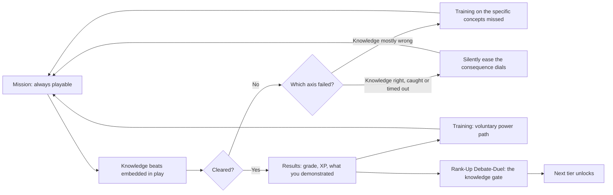
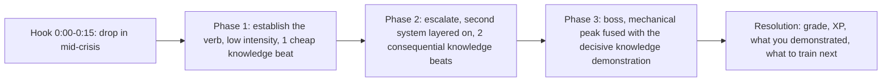

# Project Archive: "The System" — Game Concept

> # SUPERSEDED — DO NOT BUILD FROM THIS DOCUMENT
>
> **Status as of 25 July 2026: stale.** This document is no longer the design authority for the game concept layer. The owner restructured the game after it was written, and the restructure invalidates most of the systems described below. It is retained only because parts of it have not been re-homed yet, and because the record of what was rejected is worth keeping. **A full rewrite is a pending todo** (`doc-reconcile` in the plan). Until that lands, treat every section below as history unless one of the current sources confirms it.
>
> **Current authority, in order:**
>
> 1. `docs/chapters/boston-1765/Mission-Slate.md` — the governing design laws, mission shape, boss duel, grading architecture, and M1 at build resolution.
> 2. `.cursor/plans/pvp_and_mastery_redesign_aeaa8e2b.plan.md` — restructured progression, attempts and XP decay, PvP, the assessment's role, and the build order.
>
> ## What in this document is dead
>
> - **Focus** (§8.5, §14.1). The learning-powered bullet-time resource is cut entirely, along with its dials and its Codex/Rank coupling.
> - **The five stats** — Insight, Fieldcraft, Standing, Craft, Nerve (§8.1, §14.2). Cut. Standing's survival is the one open question, because it is the only one implemented in code.
> - **The eight ability verbs** — Fold-Wrap, Roof Route, Break Grip, Cause a Commotion, Eavesdrop, Steady Hands, Second Wind, Silver Tongue (§14.2). Cut as a list and as a framing. Abilities now unlock at Level milestones, are chapter-scoped in PvE, are permanent in the PvP loadout, and **may be magical or fantastical**, justified by the time-traveler fiction. No mission may require one.
> - **The E-through-S Rank ladder** (§8.6, §14.2). Ranks are now integers. Every ten Levels advances one Rank. The lettering is gone from the design and must come out of the hub.
> - **The five-band difficulty scale and the danger-tier ladder** (§8.6, and `hubState.ts`). There is one difficulty for everyone. No tiers, no bands, no mission levels, no player-minus-mission delta, no silent per-player consequence easing (§7.1), and no Easy mode or two-mode Normal/Easy model.
> - **PvE leaderboards, flawless runs, S-rank chasing, ghosts, and async challenges** (§10, §15). PvE has no competitive layer. Competition lives only in PvP.
> - **The no-input-forgiveness law** (§4.1, §4.2, §8.1, §8.3, §8.4). Its stated justification was score comparability, and the scores it protected no longer exist. The input bar is simply authored once, low enough for a trackpad.
> - **NPC dialogue knowledge checks as the mission knowledge layer** (§4.3, §5). Missions now contain **zero** knowledge checks. The three minutes of mission are pure uninterrupted gameplay, and every knowledge beat has moved into the boss duel.
>
> Also dead, and easy to miss because the owner's list above does not name them:
>
> - **The non-violent conflict pillar and the weapon-free guardrail** (§13, §17). Every mission now ends in a **gun duel**. Guns are a deliberate, settled owner decision.
> - **The Debate-Duel** (§11.5, §12) and **the Rank-Up Assessment as a playable Debate-Duel** (§14.3). The boss is a six-round gun duel with a free-response question before each round; the assessment is a deterministic multiple-choice content gate that does not touch Rank.
> - **Mission anatomy at 5–8 minutes with three phases and four gating knowledge beats** (§5), and the content counts derived from it (§16.2). A mission is 3:00 of play plus a 2:00 duel, and the duel asks six questions.
> - **Training as the voluntary power path that pays XP** (§3, §7.2). Learning modules are always exactly 3 minutes, are mandatory before the first attempt and before every retry, and pay zero XP. Missions are the only payer of XP.
> - **"Open-ended can never affect an outcome"** (§4.3 Law 4, §14.4). Free-response answers now drive the duel's bullet economy. The underlying guarantee survives in a narrower form: the progression gate is still deterministic multiple choice, and a grading timeout awards the maximum, so progression still never waits on a model.
> - **The opening calibration drill's danger-tier recommendation** (§9). There is no tier to recommend.
>
> ## What is still usable
>
> The product bedrock (§1), the design philosophy (§2), the osu-shape vocabulary (§4.2), seeded selection from authored pools (§6), the five scenario shapes (§11.1–§11.4), the production-reality reasoning (§16), and the appendix of deliberately dropped ideas. Everything else needs re-derivation.
>
> ## The one change that reorganizes everything
>
> **Missions are optional-outcome fun; the assessment is the mandatory learning spine.** A player who cannot clear missions still does the modules, still reaches the assessment, still must reach 100%, and is still routed back into training until they do. Learning is guaranteed by the assessment loop entirely independently of mission success. That is why removing Easy mode is safe and why the action can be genuinely hard without endangering the educational claim.

**Historical status line, retained for context.** This doc owned *what the game is*: the learning loop, how missions are composed, how difficulty responds to the player, how progression and assessment work, and what the social layer may and may not do.

It was **subordinate** to:
- `PRODUCT-REQUIREMENTS.md` — product guarantees (path-invariance, determinism, accessibility, privacy). Nothing here overrides a product principle or FR. **One exception is pending an owner call:** PRD §17 currently lists XP, skill trees, collectibles, and morality meters as non-goals; this concept requires an amendment (see §18).
- `Interaction-Spec.md` — interaction and UX micro-rules.
- `World-Design-Bible.md` — look, layout, atmosphere, traversal, multi-era reuse.

It sat **upstream** of the systems docs that implement it: `Gameplay-Design.md` (the stealth, suspicion, heat, chase, and traversal systems this concept composes from and depends on), `Mechanics-Spec.md` (per-mechanic constraint-as-lesson entries), and the chapter content docs. Reconciling those docs with this concept is pending — see §18.

---

## 0. The thesis

> **The only thing you cannot adapt your way past is knowing the history.**

Every mechanical demand in this game flexes to the player — but it flexes on one side only. **The world's reaction bends; the player's input never does.** Detection radii, landing noise, suspicion rates, escalation timers, quotas, pursuer counts, stamina, and what a mistake costs all move, silently and generously, until the player can express themselves. Hit windows, input tolerances, and required jump distances do not move for anyone. Neither does the knowledge bar. Not for a slow reader, not for a kid with bad reflexes, not for a kid on a Chromebook trackpad, not for the class's best gamer.

Three consequences fall out of that, and they organize this entire document:

- **The mechanical layer is a difficulty curve made of consequences.** It is instrumented, diagnosed, and tuned per player by changing how the world responds — never by lowering what the player's hands must do (§8.1).
- **The input layer is a constant.** One bar, set low enough for a Chromebook trackpad, identical for everyone at every level. This is what makes scores comparable, mastery meaningful, and support invisible.
- **The knowledge layer is a gate.** It is authored, deterministic, route-independent, and identical for everyone. It is never eased, never scaled to inferred ability, and never traded away for engagement.

Everything below is an implementation of that three-way split.

---

## 1. Product bedrock (non-negotiable)

These predate this concept and constrain it. They are not up for redesign.

- **Path-invariance.** Required history is learned on every legal path.
- **Select, never generate.** The runtime selects authored, approved, deterministic content. It never generates player-facing semantic content.
- **Route-independent formal record.** The formal assessment record does not vary by replay route, support history, or learner-state label.
- **Accessibility preserves meaning.** An accessible presentation may change input or timing, never ownership, information, meaningful options, stakes, or consequence range.
- **Carrot, not punishment.** No penalty zones, no streak-shaming, no dark patterns, no dead-ends.
- **Historical accuracy wins.** Dramatic convenience and engagement optimization lose to reviewed history.
- **Chromebook-capable.** Web delivery, WebGPU where available, WebGL2 fallback, no local install.
- **Privacy-safe telemetry.** No raw answers, no direct identifiers, no inferred mastery labels in general telemetry.

---

## 2. Design philosophy (why the game looks like this)

**P-1. Invert the ed-game trap.** Pick the genuinely fun verb **first**, then find the historical situation where that verb is authentic. Do not pick verbs for thematic fit and hope they turn out fun. The Sons of Liberty were functionally a secret crew running night operations — that is a gift, and it is the reason this game gets to be good.

**P-2. The fantasy is clever outlaw, not diligent tradesman.** Chore verbs are rejected outright: sorting, tallying, hauling as an objective, complying, filing, counting. A verb earns its place by being fun with the history stripped out. Then we put the history back and it becomes meaningful.

**P-3. Movement feel is the highest-leverage, cheapest thing to prototype.** Build one rooftop slice and make running, vaulting, and climbing feel great **with no objective at all**. If moving through Boston is not fun with nothing to do, no amount of structure saves the game. This is the first build task, before any mission exists.

**P-4. Honest calibration of the bar.** The target is *a genuinely good small action game* — good enough to beat everything else school offers. It is not "out-fun Fortnite." Chasing that second bar is the single most reliable way to over-scope and ship nothing.

**P-5. The concept is a force, not a button.** Where history enters a mechanic, it enters as pressure that reshapes how you play, never as a labeled interaction. You should never be able to point at "the tax button." You feel the Stamp Act because it attacks the thing you were enjoying.

**P-6. Failure should feel like a near-miss.** Short missions make "one more run" cheap. Instant retry, no load screen, no lecture, no shame. Tune fail states so the player's own instinct is *I almost had it*.

---

## 3. The learning loop (hybrid model)

The old model was a toll booth: train first, then you may play. That model is rejected. It creates "eat your vegetables for dessert," and it creates an exploit where a kid deliberately tanks missions to unlock the training that makes them easy.

The hybrid model:

- **Missions are always playable.** Never gated behind training, ever. A player can attempt any unlocked mission at any time.
- **Missions carry real learning.** Genuine exposure plus light application, sufficient to satisfy the exposure contract on a mission-only path. Missions are not a fun wrapper around a syllabus that lives elsewhere.
- **Training is the power path, not a prerequisite.** It carries the heavy cognitive load and the depth. It takes a mission from **hard -> comfortable -> trivial**. It is always voluntarily available, for every topic, from the start.
- **Rank-up is gated on demonstrated knowledge.** This is the only hard gate in the game (§14).
- **Ratio inside a mission: roughly 80% gameplay, 20% knowledge demonstration.**
- **Each mission tests 2-3 Boston concepts.**

Because training is always open and always powerful, there is nothing to farm by failing. Because missions are always open, there is no toll booth. Because rank-up is knowledge-gated, there is no route around the history.

---

## 4. Mission composition: the three primitives

**This is the key architecture.** Every mission in the game is composed from three primitives. There is no bespoke mechanic per mission. Variety comes from tuning, setting, objective, and boss — not from new code.

### 4.1 Primitive 1 — Free traversal / parkour

- Real, analog, player-controlled movement: run, vault, climb, slide, drop, balance, roof-route.
- **Explicitly NOT rhythm-gated.** Osu-railed movement — where you may only move on a beat — is forbidden. It destroys expressiveness and turns the best-feeling part of the game into a metronome.
- This is the connective tissue and the majority of minute-to-minute time. It is also where the game's feel lives (P-3).

**Level-design law: traversal difficulty comes from routing, speed, and detection — never from precision platforming.**

This is forced by the no-input-forgiveness rule (§8.1). With no input assist available anywhere in the game, a required precise jump would permanently hard-stick a low-dexterity player no matter how much they train, and the access guarantee would break. Consequence forgiveness cannot rescue a player whose failure is "missed the gap" — there is no consequence to soften, they simply did not get there. So we do not ask for precision in the first place.

- **Generous landing zones, wide ledges, multiple viable lines** through every space. If a careful player can miss a jump, the geometry is wrong, not the player.
- **The challenge is choosing a good route and holding momentum** while patrols sweep. This is the Mirror's Edge model: forgiving platforming, pressure supplied by speed and pursuit.
- **Falls cost noise and seconds, never the run.** A fall converts into a consequence — you land loud and slow, the patrol turns, your window closes — rather than a hard fail. Traversal failure therefore lands inside the consequence-forgiveness system, which is the one place the build can actually help (§8.3).

### 4.2 Primitive 2 — Osu-style precision interactions

- **Discrete actions only:** work the press, pry the crate, pick the lock, cut the rope, force a shutter, steady a lantern.
- **Reserved for moments that deserve tension.** Not on every interaction. Sprinkled on everything, this becomes QTE soup and the game gets worse.
- The system ships several **shapes**, each mapped to a physical action so the input reads as the thing you are doing:
  - **Tap sequence** — rhythmic repeated action (working the press, hammering, rowing).
  - **Hold-and-steady** — maintain a value inside a band under drift (lifting a crate quietly, holding a door, carrying something fragile).
  - **Precision-stop** — halt a moving indicator inside a window (picking a lock, setting a register, timing a jump onto a moving cart).
  - **Traced path** — follow a stroke with tolerance (cutting a rope, prying a seam, forging a seal).
- **A different pattern every run**, drawn from an authored pool (§6).

**Hit windows are constant. Difficulty scales through speed and density.**

- **Timing tolerance is identical for every player at every level.** It is set generously, once, for a Chromebook trackpad. No build, stat, diagnosis, or danger tier ever widens or narrows it.
- **What scales is pattern speed and note density**, and that is a property of the **danger tier**, not of the player. This mirrors how real osu separates OD (hit window) from star rating (density and speed) as independent parameters — and it is why osu scores are comparable at all.
- **What training changes instead:** how many notes you must land, how many misses you can absorb, and what a miss costs. A botched sheet is wasted paper for a trained printer; for an untrained one it is a noise that brings the officer.

### 4.3 Primitive 3 — NPC dialogue knowledge checks

This is the knowledge layer, and it carries four hard laws.

**Law 1 — knowledge checks are ACTIONS, not questions.** Never a popup quiz. The check is always something you *do* under the fiction:

- choose the right document to grab as the raid closes on the shop;
- take the route only a player who understands the enforcement net would recognize as safe;
- spot the officer's bluff about what his writ actually permits;
- answer an NPC's "why are you doing this?" in a way that holds up;
- pick which of three claims to make to the crowd so they follow you instead of dispersing.

**Law 2 — dialogue answers are never tightly twitch-timed.** A tight clock makes slow readers fail knowledge checks for non-knowledge reasons, and it destroys the two-axis diagnosis (§7) by contaminating the knowledge signal with reaction time. Consequences are **diegetic**: suspicion rises while you deliberate, the guard finishes his turn, the safe route closes, the crowd starts to drift. Pressure, not a countdown. There is no build-scaled answer window, because there is no answer clock to scale.

**Law 3 — dialogue density is high, and dialogue lives in the valleys.** The knowledge load is deliberately substantial: a lot of dialogue, both multiple-choice and open-ended.

- **Placement law: dialogue lives in the valleys, not the peaks.** An action game needs recovery beats between intensity spikes regardless, so put the talking there — crouched behind crates waiting out a patrol, climbing a long ladder, catching your breath after the crate is stashed, walking the last stretch back.
- Because the valleys were already downtime, dialogue volume can be high **without ever stopping the game.** Nothing is added to the runtime; existing downtime is upgraded.
- **Prefer many short one-or-two-line exchanges at high frequency** over a few long conversations. Tempo survives volume only if each exchange is small.
- This never overrides Law 1, and it does not spend the 80/20 budget (§3). Valley dialogue plays over play the player is still in control of — crouched, climbing, walking — so it never reads as a stop. The 20% covers the four gating checks, not every line spoken.

**Law 4 — multiple choice gates; open-ended deepens.** The division of labor is forced by bedrock, not chosen for convenience.

- **Multiple choice is deterministic, so it is the only thing that can legally gate.** MC is therefore the load-bearing knowledge layer — the checks that actually decide pass and fail — and it runs inline during the valleys.
- **Open-ended can never gate**, because LLM grading may never block progression (§14.4). It carries depth and teacher-facing evidence instead.
- **Placement rule for open-ended: the boss finisher, the debrief, the hub, and Codex reflections. Never mid-action.** Typing a paragraph during a chase is absurd, and it is worse on a Chromebook.

### 4.4 Composition law

- Every mission is a sequence of primitive instances with authored parameters. If a proposed mission needs a fourth primitive, it does not ship until the primitive itself is justified across at least three missions.
- Each mission still has **one signature verb** — the thing it is *about* — expressed through the primitives. Variety lives across missions; focus lives within one.

---

## 5. Mission anatomy (~5-8 minutes)

- **Hook (0:00-0:15).** You drop straight into an already-tense situation. No walk-in, no briefing corridor, no "go talk to X." The goal is legible in the first three seconds.
- **Phase 1 — establish.** The mission's signature verb at low intensity, so the player learns it by doing it safely. Carries **one low-stakes knowledge beat**, deliberately cheap and early. This front-loading is load-bearing for the diagnosis system (§7.4).
- **Phase 2 — escalate.** A second system layers on top of the verb (patrols join the traversal; a timer joins the precision work; a pursuer joins the route). Carries **two consequential knowledge beats** — wrong answers cost something real and visible.
- **Phase 3 — boss.** The mechanical peak fused with the decisive knowledge demonstration. Non-violent (§13). Multi-beat: the boss escalates and you adapt.
- **Resolution.** Grade, XP, an explicit statement of *what you demonstrated*, and a specific pointer to what to train next. No shaming, no percentage, no mastery label.

Four gating knowledge beats per mission (1 + 2 + 1), spread across the mission's 2-3 concepts. **All four sit in valleys, never on an intensity peak** (§4.3, Law 3). Around them runs a much larger volume of short, static, non-gating valley dialogue, and the boss finisher carries the mission's one open-ended prompt.

---

## 6. Run variation: seeded selection from authored pools

Each run of the same mission asks slightly different things — a different osu pattern, a different dialogue question, a different patrol layout.

- **Implementation is seeded selection from authored pools. Never procedural generation.** This is the roguelite pattern: authored rooms, seeded arrangement. It preserves the select-not-generate bedrock and keeps replay byte-deterministic (same package + seed + state produces the same run).
- Every variant in every pool is authored, reviewed, approved, and versioned, exactly like any other content.
- What varies per run:
  - which osu pattern fills each precision slot;
  - which authored item fills each **gating** knowledge check;
  - which authored arrangement of patrols, sightlines, and obstacles the space uses;
  - which authored boss line-up and tell order the boss uses.
- What never varies: the concept tested at each slot, the number of beats, the exposure contract, or the correctness bar.

**Pools are required only on gating beats.** Seeded variation exists for exactly one reason — anti-memorization — so it is required only where memorizing would break something: the gating multiple-choice checks (§4.3, Law 4). Ambient, flavor, and valley dialogue is **static and freely reused** across missions and Acts. Dialogue volume multiplied by full variation would detonate the content budget for no integrity gain, because nobody cheats by memorizing a line of flavor text. Open-ended prompts need no pools either — they cannot be defeated by remembering which option was right, and they never gate.

**Integrity side effect, and it is a big one.** Because a retry serves a *different* item from the pool, a player cannot brute-force by memorizing "it was option B," and cannot copy the answer from the kid sitting next to them. This closes the guess-spam hole that otherwise makes unlimited retries an integrity problem. Pool depth is therefore a correctness requirement, not a polish item (§17).

---

## 7. Two-axis failure diagnosis

**The signature system.** When a player fails, the game asks *which axis failed* and responds differently. Both axes are instrumented independently, every run.

### 7.1 The four cases

- **Knowledge beats mostly wrong, mechanics fine** -> route to training on the **specific concepts missed**. The player returns at the **same mechanical difficulty they were already clearing**. Never lower a bar they have already cleared; that is insulting and it wastes the diagnosis.
- **Knowledge beats correct, but caught or timed out** -> **do not send to training.** Silently ease the **consequence dials** (§8.1) and put them straight back in. They understand it; the game is in their way.
- **Both wrong** -> address knowledge first, then ease consequences on the following attempt if the mechanical failure repeats. Fixing two things at once teaches the player nothing about which one mattered.
- **Cleared** -> no intervention. Offer, never impose, the training that would raise the grade next time.

**What easing may and may not touch.** Easing moves consequence dials only. It never widens a hit window, never shortens a jump, and never changes osu pattern speed or density — those are properties of the danger tier, identical for every player at that tier, and changing them would both violate §8.1 and make leaderboard scores incomparable (§15). Tier itself is visible and player-chosen; only the consequence layer moves silently.

### 7.2 Two-strikes rule

Fail the same mission twice and training is no longer optional — but the framing is everything:

- **Frame as the System granting power.** *"Your Fieldcraft is insufficient for this gate. Training unlocked."* The System is handing you a weapon, not sending you to detention.
- **Never frame as punishment, remediation, or a consequence of failing.** No "you missed 2 of 4," no red, no retry counter shown.
- **The lesson makes the mission achievable, not automatic.** After training, the player still has to run it. Training that clears the mission for you removes the only thing that made clearing it feel good.

### 7.3 Pedagogical justification

This is **productive failure** (Kapur): learners who attempt a problem *before* instruction build deeper, more transferable understanding than learners who are instructed first, even when their initial attempts fail. The hybrid loop is not a motivational compromise — attempting the mission first and being routed to targeted instruction on exactly what you could not do is the pedagogically stronger sequence. Cite this when the "why not teach first?" question comes up, because it will.

### 7.4 Edge cases (both must be handled, or the system is a lie)

- **Failure before any knowledge beat gives no knowledge signal.** A player who is caught 40 seconds in has told us nothing about what they know. Mitigation: **front-load one cheap knowledge beat early in every mission** (Phase 1, §5). If fewer than two beats were reached, classify as *no knowledge signal*: ease the consequence dials, do not route to training, do not credit knowledge.
- **A single correct beat is not knowledge.** Guessing works. Require **multiple correct beats** before classifying knowledge as sufficient.

Classification rules (first pass, tunable):

- **Sufficient** — at least 3 of 4 beats correct, and no tested concept was answered wrong on every one of its beats.
- **Insufficient** — 2 or more beats wrong, or any single tested concept wrong on all of its beats. Route to training on that concept specifically.
- **No signal** — fewer than 2 beats reached. Ease mechanics only.

### 7.5 Anti-sandbagging

Grade and XP scale with **the difficulty actually cleared at**. A player who lets the dials ease all the way down clears the mission and gets a low grade and low XP for it. Coasting is always available, always non-punitive, and always unrewarding. There is nothing to farm by being bad on purpose.

### 7.6 Determinism requirement

The current ease level is **committed player state**, not a live adjustment. It is written at the same commit boundaries as everything else, so a replay from a given package, seed, and state reproduces the same dials. Difficulty easing must never introduce a hidden runtime roll.

---

## 8. Difficulty curve and the build-sensitive dials

### 8.1 The universal rule: no input forgiveness, consequence forgiveness only

**The build never makes the player's input easier. It only changes how the world reacts.** This is the load-bearing rule of the entire mechanical layer, and it overrides any dial anywhere in this document that would contradict it.

**Removed as build dials, permanently:**

- coyote time
- ledge-grab assist radius
- jump and miss forgiveness
- any widening of a timing window, hit window, or input tolerance

Input demands are identical for every player, at every level, in every mission, at every danger tier.

**Kept and expanded as build dials — this is where the entire dynamic range lives:**

- landing noise radius
- suspicion fill rate when glimpsed
- time available to break line of sight before escalation
- recovery time from a botched landing
- guard reaction speed
- detection radius
- patrol speed and aggression
- quota size
- timer length
- stamina
- pursuer count
- error tolerance — how many misses you can absorb, and what a miss costs

**Why this is the right rule.** A player who needed help experiences it as **making the jump**, not as the game lowering the bar for them. No label, no toggle, no visible assist, nothing to notice and nothing to feel bad about. This is the same reasoning that keeps the calibration drill from ever showing a verdict (§9), and it is what lets the two-axis diagnosis ease things silently (§7.1) without reading as pity.

**The fiction does the explaining.** High Fieldcraft does not mean the game catches your missed jumps; it means **you move like someone who has done this before** — you land quietly, you recover fast, you are already moving when the patrol turns. High Standing does not mean guards are blind; it means **the street reads you as belonging.**

### 8.2 The shape of the curve

- **A truly gifted player with zero training can one-shot a mission at base danger.** That has to be true or the mechanical layer is fake.
- **"Gifted" means gifted on both axes.** A pure-reflex player with no knowledge hits the 20% knowledge wall and cannot clear the mission no matter how well they move. This is the thesis, expressed as a difficulty rule.
- **The vast majority of players with zero training will fail and will need to train.** That is the intended, healthy outcome.
- **Fully trained plus maxed skills equals trivially easy at base danger.** This is the **access-guarantee floor**, not a tuning failure. Every child who does the work gets through. Non-negotiable.
- **Challenge then relocates for maxed players.** Higher danger tiers, the S-rank grade chase, secrets, superbosses. This is the fix for the inverted reward curve — the problem where the kids who studied hardest would otherwise be handed the most boring version of the game.

### 8.3 Where the dynamic range comes from: the consequence dials

The range between "untrained and struggling" and "fully trained and trivial" is large, and all of it comes from **consequence dials** (§8.1) — how loud a mistake is, how fast the world notices, how long you have to fix it, and what it costs when you cannot. Grouped by what they actually do:

- **Noise and visibility** — landing noise radius, detection radius, cone angle, suspicion fill rate when glimpsed.
- **Time to recover** — window to break line of sight before escalation, recovery time from a botched landing, guard reaction speed from glimpse to challenge.
- **Pressure** — patrol speed and aggression, pursuer count, pursuer closing speed.
- **Demand** — quota size, timer length, stamina pool and regen, notes required to land.
- **Cost of a mistake** — misses absorbable, and what a single miss actually does to the world.

**Not** from timing windows, input tolerances, landing-zone size, or required jump distance. Those are fixed for everyone. That distinction is what keeps the game fair on a Chromebook trackpad, what makes leaderboard scores comparable (§15), and what lets us honestly claim a huge dynamic range without a huge twitch ceiling.

### 8.4 The input bar is set once, for everyone

- **The input bar is a design-time decision, not a runtime dial.** It is set low — comfortable on a Chromebook trackpad for a player with ordinary reflexes — and then it never moves for anybody, in either direction.
- **"Not naturally twitchy" is a first-class supported player**, not an accessibility case. Most 13-year-olds on a school Chromebook are in this group, and the bar is set for them.
- **The osu layer's ceiling is pattern reading, not reaction time.** It rises through speed and density (§4.2), which a player masters by playing — never through a window a build could widen.
- **Genuine motor-accessibility equivalents remain a separate, non-negotiable axis** (FR-10). They exist for disability, not for easing difficulty; they are configured, not earned; and they may legitimately alter input requirements in ways the build never can. The two systems must never be conflated in code or in UI.

### 8.5 Tuning ranges per dial (first pass, all tunable)

Base danger tier. Ranges are stated **untrained -> fully trained**. Every entry is a consequence dial; there are no input entries, by construction (§8.1).

**Noise and visibility**

- **Landing noise radius:** 14 m -> 5 m
- **Watcher cone range:** 12 m -> 6 m
- **Watcher cone half-angle:** 55 deg -> 30 deg
- **Suspicion fill rate when glimpsed:** 1.0x -> 0.45x
- **Suspicion decay rate:** 1.0x -> 1.8x

**Time to recover**

- **Window to break line of sight before escalation:** 1.5 s -> 4.5 s
- **Recovery time from a botched landing:** 1.4 s -> 0.4 s
- **Guard reaction speed, glimpse to challenge:** 0.4 s -> 1.2 s

**Pressure**

- **Patrol move speed:** 1.0x -> 0.75x
- **Patrol re-check frequency:** every 4 s -> every 9 s
- **Pursuer count on a failed check:** 3 -> 1
- **Pursuer top speed relative to a fresh sprint:** 0.98x -> 0.85x

**Demand**

- **Quota size (press run, handbill count, crates moved):** 12 -> 6
- **Phase timer:** 90 s -> 150 s
- **Stamina pool:** 100 -> 180 units
- **Stamina regen:** 1.0x -> 1.6x
- **Osu notes required to land:** 14 of 16 -> 9 of 16

**Cost of a mistake**

- **Osu misses absorbable per pattern:** 1 -> 5
- **What one osu miss does:** raises the alarm a step -> wastes a sheet, no world reaction
- **What one fall does:** loud landing plus a long fumble that turns the nearest patrol -> a quiet stumble you are already running out of

**Focus** (§14.1)

- **Focus charges:** 1 -> 4
- **Focus duration per charge:** 2.0 s -> 4.0 s
- **Focus regen:** 1.0x -> 1.5x

**Constant for every player at every level — these are not dials and never will be**

- osu hit window and timing tolerance
- traced-path tolerance
- hold-and-steady band width
- landing-zone size and required jump distance
- input buffering and control response
- osu pattern speed and note density (a property of the danger tier, not the player — §8.6)
- **knowledge:** beat count, item pool, and correctness bar. There is no knowledge dial. There never will be.

### 8.6 Danger tiers

- Danger tiers use the same letter ladder as Rank: **E -> D -> C -> B -> A -> S**.
- Every mission ships with a **base tier** (Act 1 missions are base E) plus optional tiers above it.
- A higher tier steps the **consequence dials** in the hard direction, well past the untrained baseline, and raises **osu pattern speed and note density**. It never touches a hit window or an input tolerance, never adds knowledge requirements, and never changes the knowledge pool.
- **Pattern speed and density are properties of the tier, identical for everyone playing it.** That is what makes a tier's leaderboard meaningful (§15).
- Tier is **visible and player-chosen.** The diagnosis system never silently moves a player between tiers; it only moves consequence dials within one (§7.1).
- Higher tiers pay better grades, better XP, and better placement on that tier's board.

---

## 9. Opening calibration drill

At first play, a short osu-style drill — diegetically a **printing-press drill**, the shop teaching a new runner the job — doubles as the controls tutorial.

Rules, all of them load-bearing:

- **It sets an initial estimate only.** The estimate is then continuously refined from real play. A single sample is noisy; treating one 45-second drill as a verdict on a child's motor skill is bad measurement.
- **It is never surfaced as a verdict or a label.** No score screen, no tier name, no "you seem to prefer a slower pace." The player experiences it as learning the controls, full stop.
- **It calibrates the mechanical layer only, and never the knowledge requirements.** Letting poor reflexes lower a kid's learning bar is simultaneously an equity failure and an assessment-validity failure. This is the single most important rule in this section.
- **What it actually sets: a recommended starting danger tier plus opening positions for the consequence dials** (§8.3). It cannot adjust hit windows or input tolerances, because those are constant for everyone (§8.1). The recommended tier is presented as a property of the mission on offer — "Danger E" — never as a statement about the player, and any tier remains selectable.
- **Sandbagging gains nothing.** Rewards and the formal record are tied to the knowledge axis and to the difficulty actually cleared at (§7.5). Deliberately bombing the drill lowers your tier, which lowers your grade and XP, and changes your learning requirements not at all.
- It ships with a full accessibility path, and using that path feeds no inference about ability (FR-10).

---

## 10. Rewarding the hardest studiers

The reframe that makes this work: **training should expand what you can DO, not merely shrink difficulty numbers.** A trivialized mission is only boring if it is *the same mission*.

- **Knowledge unlocks secrets, shortcuts, and alternate solutions that do not exist for other players.** Talk past a guard entirely because you know what his writ does and does not permit. Skip a whole phase because you know where the Loyal Nine kept the back key. Take a route only someone who understands the enforcement net would read as safe. **Studying pays out as cleverness**, which is the most satisfying currency a game has.
- **Clearing is trivial; S-rank mastery is not.** The osu model: everyone passes, almost nobody perfects. And because hit windows are constant (§4.2), an S-rank means exactly the same thing for every player in the class, which is what makes it worth chasing.
- **Danger tiers** with better rewards and better placement on that tier's board (§8.6).
- **Superbosses gated behind full Codex mastery** — optional encounters that only open once a chapter's Codex is complete.
- **Titles and rare badges** for authored feats ("Clean Hands", "Silver Tongue", "Never Seen").

Guardrail: none of these are ever on the required path. They are the ceiling, not the floor.

---

## 11. The five Boston scenario shapes

Composed from the three primitives. These are the reusable shapes; individual missions are configurations of them.

### 11.1 Handbill Run

- Post handbills across town before dawn while patrols sweep.
- **Primitives:** traversal-dominant (rooftops, alleys, timing), light precision (tacking under a watchman's line), knowledge beats at the choice of *where* to post and *what* to say to whoever stops you.
- **Signature verb:** route mastery under a closing clock.

### 11.2 Smuggle the Crate

- Get contraband off a ship and past customs. A heist.
- **Primitives:** traversal plus concealment, precision (pry the crate, work the hoist quietly), knowledge beats on what the officer may lawfully do and which manifest to hand him.
- **Signature verb:** moving something that must not be seen.

### 11.3 Steal the Stamp Shipment

- A heist with a **scripted set-piece crew**. Teammates act on cue at authored moments — they are choreography, not commandable AI. Commandable squad AI is dramatically more expensive to build and tune, and it buys nothing this mission needs.
- **Primitives:** all three, at their densest. The crew creates the cue structure for precision beats and the pressure for knowledge beats.
- **Signature verb:** the coordinated job.

### 11.4 The Clandestine Press

- **The osu-style precision mission.** Framing matters enormously: this is **sedition printed at night under threat of raid** — the Sons of Liberty underground press — **not a tradesman's day job**. The difference between those two framings is the difference between a great mission and the chore verb we explicitly rejected (P-2).
- **Keep it short and intense, like a real osu map: 1-2 minutes.** Do not stretch it.
- **Droppable as a high-intensity phase inside other missions.** This is its highest-value property: any mission can cut to two minutes of press work under a closing raid.
- **Primitives:** precision-dominant, traversal as the escape, knowledge beats on what to print and what to burn.

### 11.5 Debate-Duel

- The rhetorical boss, and the form the Rank-Up Assessment takes (§14). Full mechanics in §12.

---

## 12. The Debate-Duel

Model: Ace Attorney (present the right evidence, catch the lie) crossed with Punch-Out (read the tell, time the counter), ending on an open-ended finisher. Non-violent; the weapons are facts.

### 12.1 Meters

- **The boss's Authority** — his credibility with the watching crowd. This is his health. Drain it to zero and his position collapses.
- **Your Composure** — your health. It drains on intimidation and on wrong or weak counters. At zero you falter, and you retry instantly.
- A visible crowd sways toward whoever is winning. The crowd is the scoreboard.

### 12.2 Moveset

- **Counter** — play the evidence card that actually refutes *this specific claim*. Right card damages Authority; a true-but-irrelevant card costs Composure. Knowing a fact is not the same as knowing what it answers.
- **Object** — call out a lie or a fallacy for big damage plus a stagger. **Optional and opt-in:** Object is an interrupt available during the boss's speech. Missing it costs nothing, and the same content remains fully answerable, untimed, afterward. This is how the duel keeps a skill expression without twitch-gating a knowledge check (§4.3). Its window is generous and **identical for every player** — no build, stat, or scaffolding widens it (§8.1).
- **Brace** — blunt incoming damage when you do not have the counter. The "I do not know this yet" safety valve. Nobody is ever hard-stuck.

### 12.3 Beat types

- **Exchange beats** — card selection, Object, tell-reading. Deterministic, fast, the majority of the duel; they carry the tempo. Selection itself is untimed; the boss's escalation supplies the pressure.
- **Argue beats** — open-ended typed or spoken reasoning. The dramatic pivots: a phase-ender "make your case," a "seize the moment" opening, the finisher. Roughly 2-4 per duel. The duel is a **legal home for open-ended** under §4.3, Law 4 because it is stationary and untimed; Argue beats sit at phase boundaries and the finisher, never during traversal or pursuit.
- Argue-beat damage scales with rubric quality, with a **floor** so the fight always progresses. Strong reasoning can mint a new evidence card, extend a combo, or open the finisher early. If the model is slow or offline, the player gets the deterministic baseline hit and an authored acknowledgment and continues — the duel never waits on a model.

### 12.4 Knowledge as ammunition

- **Evidence cards are the facts you have learned.** The Codex is your deck.
- Optional content grants more and better cards. Deep understanding wins with the base deck; prepared players simply have more options. Nobody is gated by deck size.

### 12.5 Phases, retry, scaffolding

- **Phase 1** — basic claims, teaching the counter grammar.
- **Phase 2** — he adapts: faster, combos, crowd propaganda, at least one bluff.
- **Phase 3** — desperation and intimidation ramp, then a **stagger**, then the open-ended finisher.
- **Lose** -> instant retry with the weak spot named plainly and without judgment. Scaffolding for strugglers is **consequence-side only**: hint-highlighted cards, reduced Composure damage, slower Authority recovery. Never a wider window (§8.1).
- **Accessibility equivalent** — fully paused/turn-based presentation, finisher as a graded select-from-options. Same learning, same outcome (FR-10).
- **Determinism** — authored and seeded argument order, tells, and correct-counter mapping. Only the open finisher is formatively graded, and it is committed as a rubric label, never as raw text.

---

## 13. The conflict pillar: non-violent encounters

The game needs the tension, skill, adrenaline, and win/lose stakes that make combat compelling, delivered **without weapons or lethal combat**. This is historically correct for this era's resistance and it is what makes the product adoptable in classrooms. It is a signature strength, not a compromise.

- **The "enemy roster" is the enforcement apparatus:** watchers, informers, customs officers, and — in the later Acts — soldiers. You defeat an encounter by out-thinking it, never by harming anyone.
- **Encounter verbs:** stealth, pursuit and chase, confrontation (comply / talk down / run), and misdirection.
- **Bounded non-lethal physical-struggle tier:** break a guard's grab, shove through a soldier's line, brace and hold ground in a surging mob, wrestle free of an arrest. Visceral and PG. No weapons, no defeating, no killing.
- **Escalating danger across the four Acts:** dodge patrols (1765) -> soldiers and raids (1770) -> tea under armed watch (1773) -> slip an occupied port (1774). A real threat curve while the player stays a civilian.
- **Guardrails:** historically truthful, non-lethal, weapon-free, carrot-not-punishment, deterministic and authored, with an accessibility equivalent for every encounter.

---

## 14. Progression, Focus, and assessment

### 14.1 Focus — the learning-powered bullet time

The signature reward mechanic, and the cleanest diegetic expression of the thesis.

- **Focus slows the world, not the pattern.** Spend it and the *threat* dilates: guards react slower, escalation clocks stretch, patrols and pursuers move as if underwater. It never slows an osu pattern, widens a hit window, or extends an input window — that would be input forgiveness (§8.1).
- **It surfaces tells.** A bluff shimmers, an officer's micro-tell reads, a forged seal flickers, a patrol's next turn telegraphs. Focus is as much an information resource as a time resource.
- Mechanically, Focus is a **burst of the two most valuable consequence dials at once** — time to break line of sight, and guard reaction speed (§8.3). That is what makes it powerful without making it an assist.
- **Capacity, duration, and regen are set by Codex and Rank.** Studying between missions literally buys you more time to think. Nothing else in the game says "knowledge is power" as directly.
- **It refills in-mission on a timer but is never grinded mid-fight.** The action never stops for a quiz. The learning layer and the action layer stay cleanly separated.
- Focus is **not** the accessibility path. Motor-accessibility equivalents are a separate axis (§8.4).

### 14.2 Progression axes

Solo Leveling "System" framing throughout: a diegetic system that quantifies you, congratulates you, and hands you power.

- **Level / XP** — from missions and from training. Scales with difficulty actually cleared (§7.5).
- **Rank E -> S** — the macro spine. Advanced only by clearing a Rank-Up Assessment (§14.3). The four Boston Acts map onto the ladder: Stamp Act 1765 is E->D, Massacre 1770 is D->C, Tea Party 1773 is C->B, occupation 1774 is B->A/S.
- **Stats: Insight, Fieldcraft, Standing, Craft, Nerve.** Each maps to specific **consequence dials** from §8.3, and not one of them touches an input window (§8.1):
  - **Fieldcraft** — landing noise radius, detection radius, suspicion fill rate, recovery time from a botched landing. You move like someone who has done this before.
  - **Nerve** — stamina pool and regen, misses absorbable, and the window to break line of sight before escalation. It **no longer widens timing, struggle, or Object windows.**
  - **Craft** — error tolerance and quota requirements on precision work, and what a botched attempt costs the world. It **no longer makes mini-game timing more forgiving.**
  - **Standing** — spot-check frequency, guard reaction speed, crowd blending. The street reads you as belonging.
  - **Insight** — tells and surfaced information.
- **Ability verbs** — unlockable actions that change how a mission can be played: Fold-Wrap, Roof Route, Break Grip, Cause a Commotion, Eavesdrop, Steady Hands, Second Wind, Silver Tongue.
- **Titles** — authored feat achievements. Cheap, flex-worthy, small diegetic bonus.
- **Codex** — the collection of figures, documents, and concepts you have extracted. The completion drive, and simultaneously the learning record and the Debate-Duel deck.

**Coupling rule.** Levels and stats may rise from play. **Codex and Rank — which set Focus capacity and gate the knowledge-locked unlocks — advance only on demonstrated knowledge.** That keeps "leveling is learning" honest exactly where it matters, without pretending that clearing a hard mission earns you nothing.

### 14.3 The Rank-Up Assessment is a playable Debate-Duel

This resolves the tension between "we need a real knowledge gate" and "LLM grading may never gate progression."

- **The Rank-Up Assessment is a Debate-Duel boss fight**, not a quiz screen.
- **Its deterministic layer IS the knowledge gate:** authored correct-counter mapping, evidence-card selection, and bluff detection — which claim is false and which card answers it. All authored, all approved, all replay-stable, all selected untimed. Deterministic enough to gate legitimately. The optional Object interrupt adds damage and flourish but is never part of the gate (§12.2).
- **The open-ended Argue beats are enrichment on top.** They add damage, drama, teacher-facing evidence, and quality titles. They never determine pass or fail.
- **Prefer applied and transfer-style authored items over recall trivia.** "Which of these arguments actually answers his claim" beats "in what year."
- Fair floor: never a dead-end. A miss routes to re-exposure and a retry, per FR-6.

### 14.4 The open-ended LLM-graded layer and its guardrails

A first-class assessment modality for critical thinking — with hard limits. The division of labor is set in §4.3, Law 4: **deterministic multiple choice gates; open-ended never does.** Volume here is high, but placement is strict.

- **Never gates or blocks progression.** Progression can never wait on or depend on a model. Model slow or unavailable means authored fallback acknowledgment and the player continues.
- **Never mid-action.** Open-ended lives at the boss finisher, the Act debrief, the hub, and Codex reflections. Never during traversal, stealth, precision work, or pursuit.
- **Deterministic participation reward.** *Attempting* an open response grants a fixed, deterministic XP and stat reward. The model's judgment drives feedback and quality titles, never progression.
- **Quality is committed once as a rubric label, never as raw text**, so replay stays byte-stable.
- **Raw responses are encrypted server-side for educator review only.** Excluded from saves, telemetry, student-visible labels, and the deterministic event log.
- **The formal record stays route-independent.** Open-ended formative grading informs feedback and teacher evidence, not the official assessment form.
- Rubric dimensions: claim, use of evidence seen in-world, causal reasoning, perspective-taking, transfer.

---

## 15. Social layer

Designed for a 13-year-old in a school, which means designed against moderation liability and against shaming.

- **Friends by code only.** No user search, no discovery, no suggested friends. You get a code, you give it to someone, they add you.
- **Leaderboards rank mission performance only** — grades, times, combo scores. **Never learning or assessment results.** Ranking children publicly by how much history they know is a shaming vector and it violates carrot-only and privacy at the same time. This is a hard line.
- **Boards are per mission, per danger tier.** Because pattern speed and note density vary by tier (§8.6), a sparse-pattern run and a dense-pattern run are simply not comparable — exactly as osu boards are per beatmap difficulty. There is no cross-tier board.
- **Constant hit windows are what make scores comparable at all within a tier** (§4.2). If the build widened windows, two identical-looking scores would mean different things and the board would be noise. This is a direct payoff of the no-input-forgiveness rule (§8.1).
- **More boards means more kids can be top of one**, which is good for motivation and costs nothing to provide.
- **Friends-only boards matter more than global boards.** A 13-year-old cannot compete with the global number one and knows it. They will absolutely try to beat the kid sitting next to them. Design the UI so the friends board is the default and the loud one.
- **No free-text chat.** Not a scope decision — a viability decision. Free-text chat between minors is the moderation liability that gets a product rejected at the district level. Async challenges instead: *"Your friend ran this at Danger C. Beat their time."*
- **Ghost and near-miss comparisons on the results screen** are the highest-value, lowest-cost social feature in this list. Build them first.
- **Display names must not be real names.** Authored name components or a handle, never a roster name.
- Asynchronous only. No shared sessions, no co-op, no real-time multiplayer.

---

## 16. Production reality

### 16.1 The reuse claim

- **Three primitives** (§4) and **five scenario shapes** (§11), reused across roughly **12-15 mission configurations** across the four Boston Acts, with authored variant pools per beat slot.
- **Bespoke mechanics per mission is rejected as unbuildable.** A team this size cannot build, tune, QA, and accessibility-certify a new mechanic fifteen times. Every attempt to do so ships three good missions and twelve unfinished ones.
- **Variety comes from tuning, setting, objectives, and boss — not from new code.**

### 16.2 Rough content counts (first-pass estimate)

- **Missions:** 12-15 configurations, roughly 3-4 per Act.
- **Knowledge beat slots:** 4 per mission, so 48-60 slots. At 4-6 authored variants per slot: **roughly 200-350 authored knowledge beats.** This is the single largest authoring line item and it is the one that protects assessment integrity (§6).
- **Osu patterns:** 4 shapes x roughly 6 authored patterns x 3 difficulty bands: **roughly 70 patterns**, reused across every mission that has a precision slot.
- **Spatial arrangements:** 4-6 authored patrol/obstacle arrangements per mission: **roughly 60-90 arrangements.**
- **Bosses:** 5 shape-level boss templates, re-dressed into 12-15 mission bosses.
- **Debate-Duels:** 4 Rank-Up duels (one per Act) plus roughly 3 in-mission duels. Each needs 12-20 authored exchange beats, 3-4 argue beats, and 8-12 evidence cards.
- **Rough time budget:** 12-15 missions x 5-8 min gives roughly 75-110 minutes of mission time on the main path, plus training, Rank-Up duels, and retries. Recommended play lands in the 3-4 hour range; completionist play with danger tiers, secrets, and the grade chase is open-ended by design.

### 16.3 What gets cut first, in order

1. **Superbosses and the upper danger tiers.** Keep exactly one optional tier above base.
2. **Title and badge breadth, and global leaderboards.** Keep friends-only boards and ghosts; they are nearly free and they carry most of the social value.
3. **Mission count per Act:** 4 -> 3 -> 2. Hold all five scenario shapes across the chapter rather than within each Act.
4. **The scripted crew in "Steal the Stamp Shipment"** degrades to a single scripted partner.
5. **The opening calibration drill** degrades to a plain controls tutorial with a flat initial estimate; continuous refinement from real play still carries the calibration.

**Never cut:** knowledge variant pools below 3 per slot; one Rank-Up Debate-Duel per Act; accessibility equivalents; the two-axis instrumentation. Each of those is a correctness requirement, not a feature.

---

## 17. Guardrails checklist

Hard lines this concept must never cross. Any change that violates one of these is a change to the product, not to the game.

- Required history is **learned on every legal path**. The mission-only path must satisfy the exposure contract without training.
- The runtime **selects, never generates**. Run variation is seeded selection from authored pools.
- **No knowledge dial exists.** No difficulty setting, calibration result, accessibility profile, or diagnosis outcome may change what a player must know.
- The **formal record is route-independent** and is never an official STAAR score.
- **LLM grading never gates.** Progression never waits on a model.
- **Every mechanic has an accessibility equivalent** that preserves meaning, and using it feeds no inference about ability.
- **No dead-ends.** Every failure has an authored continuation and a retry.
- **Carrot only.** No penalty zones, no streaks, no shaming, no dark patterns. Forced training is framed as a grant of power.
- **Leaderboards never rank learning.** No public knowledge comparison, ever.
- **No free-text chat**, no real-time multiplayer, no display of real names.
- **Non-violent throughout.** No weapons, no lethal combat, no defeating a person.
- Difficulty easing is **committed state**, never a live roll. Replay stays byte-stable.
- **Knowledge-check pools stay deep enough** that a retry serves a different item.
- New physical assets follow the pipeline; **no procedural visible stand-ins**.

---

## 18. Open questions for the owner

1. **PRD §17 non-goals conflict.** The PRD explicitly lists XP, skill trees, collectibles, morality meters, and endless-engagement loops as non-goals, and `Gameplay-Design.md` L-G restates it. This concept is built on XP, Rank, stats, an unlock tree, Titles, and a Codex collection drive. The PRD needs an amendment that permits learning-coupled reward loops and records the guardrails (§17) as the replacement constraint. **Owner call and a PRD revision are required before build.**
2. **PRD §17 also lists "a multiplayer or cooperative game" as a non-goal.** The social layer (§15) is asynchronous only, but the amendment needs to carve this out explicitly, or the social layer is out of spec on paper.
3. **PRD §17 lists "a system that changes assessment difficulty based on inferred ability."** The two-axis system changes *mechanical* difficulty based on inferred ability and never touches assessment, which is compliant in spirit. The wording needs tightening so the compliance is visible to a reviewer.
4. **Does the exposure contract survive a mission-only path?** Bedrock requires at least 3 tracked exposures, at least 2 exposure types, a first-understanding check, and a same-day applied demonstration per required concept. With 12-15 missions at 2-3 concepts each over roughly 12 core concepts, the arithmetic is tight. Either some missions become required, or the mission pool must be authored to guarantee the contract with training excluded. **This needs a coverage ledger and a decision.**
5. **How hard is "forced" in the two-strikes rule?** Genuinely blocking the mission conflicts with "missions are always playable" and with no-dead-ends. The provisional reading written into §7.2 is that the System routes you into a short training beat that completes in flow, while the mission itself is never removed. Confirm or tighten.
6. **Spaced retrieval has no explicit home.** The predecessor design had a post-mission "Appraisal" drill carrying spaced repetition over a curated concept set. The hybrid model folded that into missions and training, which means the *scheduling* of spaced recurrence is currently unowned. Does training own the spacing schedule, or does a lightweight results-screen beat return?
7. **Do eased-difficulty players get visibly worse leaderboard placement?** Grade scales with difficulty cleared, and difficulty cleared correlates with training, which correlates with knowledge. So a mission-performance leaderboard is an indirect knowledge leaderboard. Options: segment boards by danger tier, show only personal-best deltas, or accept the correlation. **This is the residual shaming risk in §15 and it needs a call.**
8. **Hub and instancing model.** Missions are compressed and near-zero dead traversal, which implies instanced arenas rather than walking across an open district. The predecessor design locked "portal-menu instanced dungeons from an Archive Hub" and left hub presentation open (full 3D space versus a rich System-window UI over a static scene). Confirm the instancing model and pick the hub presentation.
9. **Does the existing Boston open district survive as anything?** Related to 8. The traversal primitive wants a real space to move through, and `Gameplay-Design.md` §4A describes a living continuous district with zones, a clock, and a crowd. Decide whether that district is retained as a hub/practice space, harvested as set-piece geometry for instanced missions, or retired.

---

## Appendix: what was deliberately dropped from the predecessor plan

Recorded so nobody re-imports it by accident.

- **The training-first toll booth** and the coupling rule "skills level only via training." Superseded by the hybrid loop (§3), which also removes the tank-the-mission-to-unlock-training exploit.
- **"Missions do not have to teach much."** Superseded. Missions now carry genuine exposure and light application and must satisfy the exposure contract on a mission-only path.
- **"The raw layer stays genuinely twitchy; there is no assist slider for being bad."** Directly contradicted by the lowered twitch ceiling (§8.3) and the silent mechanical easing (§7.1). The new position is that "not naturally twitchy" is a first-class supported player.
- **Learning as the accessibility path for slow reflexes.** Focus is a reward, not an accommodation. Motor accessibility is a separate, configured, non-earned axis.
- **The "Pressure/Craft" archetype and "The King's Debt" mission** as authored (sort, tally, and haul dutiable goods on a rising quota). These are the chore verbs rejected by P-2. The debt-to-revenue concept remains required; it needs a new carrier built from the three primitives.
- **The named "Appraisal" loop stage** as a separate post-mission drill screen. Folded into the results screen and training; see open question 6.
- **Daily Training streaks.** Streak mechanics are an engagement dark pattern and conflict with PRD §17. Voluntary training stays; the streak does not.
- **The predecessor time budget** (roughly 2.5-3 hours main path). Re-derived in §16.2 from the new mission counts.
- **Commandable crew AI** for the heist. Explicitly replaced by a scripted set-piece crew (§11.3).
