# M1 Covenant World Build — execution-ready plan

**Status: PLAN ONLY. Nothing here is built.** This is the canonical, single-source
world-build plan for the 1774 Solemn League and Covenant courier run. It supersedes the
**world/traversal** sections of `docs/design/M1-Mission-Build.md` (that doc's audit numbers
remain valid history; its *build order* for world/traversal is replaced here). Mission
fiction of record stays `docs/design/M1-Remedial-Slice.md`.

**Owner sequencing (verbatim spirit, 30 Jul):** build/re-author the WORLD first, *then* close
traversability; design traversal INTO each asset at the concept stage so the visible surface
makes the path and collision follows it (never force traversability into an asset that never
considered it); re-authoring/moving locations is allowed — keep what worked, cut useless
circles and long detours; do not start building until the owner says go.

**What "covert traversal" means (owner refinement, 30 Jul).** This is NOT an explicit geometric
"no-ground" rule — being a few feet off the ground does not "count," and there is **no tracked
line-of-sight system** (that reads as buggy). The intent is the *feel*: you move **above the
street — on roofs, ledges, planks and paths** where, in theory, you are out of sight of people on
the ground. Rooftop/elevated reads as covert **by convention**; the street reads as exposed by
convention. So the real requirement is **connectivity, not a node count**: the elevated network
must be continuous enough that a player *can* stay up across the run (this is what closing the
three islands / the G1–G2 gaps achieves). Ground contact is by **authored intent** — dropping to a
contact, or a deliberate crossing (the dead harbour; the elm→yard climax) — never an accidental
hole in the roofline. The Phase-2 gate is reframed accordingly (Section E): assert the covert line
is a **connected elevated path with ground touches only at authored beats**, not "zero ground nodes."

**Legacy docs describe a DIFFERENT game — do not carry them over (owner, 30 Jul).** The old
open-world Boston game is not this game. Much surviving documentation describes it, and its
constructs must **not** be imported: the open-world **roam**, **Thomas "opens the dock route,"** the
`Day-1.md` **order-free errands / day clock / People·Notes·Routes panels**, and any "wander the
city" framing. This build is the **focused, linear-spine M1 mission** (lesson → Covenant courier
run → boss duel → capstone). Where a legacy cast note carries an open-world job (e.g. Thomas
"opening a route"), keep only the concept role (Thomas = the merchant whose mark you need;
non-importation + the closure's blast radius) and drop the open-world mechanic. Read old docs for
**historical facts and asset inventory**, never for **mechanics or structure**.

**Verified state this plan is written against (measured, not asserted):**
- Branch `workflow/m1-evasion-loop`, worktree off `main` @ `440677c`, clean. Baseline **2889
  tests / 0 failing** — must stay there.
- No-ground route-graph BFS over the *current* `M1_EFFIGY_RUN` (reproduced this session):
  **67/166 nodes on GROUND**; the SAFE guided line start→post has **11 ground-contact nodes**
  (G1 = `A_ALLEY_FLOOR, B_STREET_W, B_VAULT_IN, B_VAULT_OUT, B_DUCK, B_STREET_MID,
  B_CRATES_FOOT`; G2 = `B_STREET_E, B_EXIT, C_SQUARE_N, C_SCAFF_FOOT`); the elevated network is
  **3 islands** (START `A_LEADS`; the Shambles canopy tier; the long spine holding `F_POST`);
  `F_POST` is **not** reachable off-ground from START. Post→arena (G3) has 8 ground nodes and is
  the **intentional climax exposure — exempt**.
- Clip-fidelity (`scripts/check-clip-fidelity.mjs`, IK live, `playerboy-rigged.glb`): **HANG_DROP
  SEVERE — foot 26.5 cm through the wall**; **STEP_UP has no baked clip** (falls back to `run`);
  **landings overrun** — LAND_RUN 44 %, LAND_ROLL 67 %, LAND_HARD 89 %, LAND_RECEIVED 55 % of the
  clip shown; **CLIMB_UP mantle 97 %** shown (1.04× overrun, cosmetic); VAULT / CLIMB_OVER / SLIDE OK.
- Tooling (orchestrator-verified): **Blender 5.1.2** at
  `/Applications/Blender.app/Contents/MacOS/Blender`; **`MESHY_API_KEY` SET**; **FAL / GEMINI /
  GOOGLE / RUNWAY NOT set**. A grep of `assets/pipeline/**` finds **no script that reads
  GEMINI/GOOGLE/FAL/RUNWAY** — the only generation credential any pipeline script reads is
  `MESHY_API_KEY`, which is present.

---

## The movement envelope every asset is designed against (the contract)

Source: `packages/engine-world/src/parkour/tuning.ts` (`PARKOUR_TUNING`, `MOVEMENT_CAPABILITIES`).
Every target dimension in Sections A–C is chosen so the shipped reader offers the intended verb
with margin — this is the "traversal baked in" the owner asked for.

| Verb | Reader offers when… | Authoring target (with margin) |
|---|---|---|
| free step (no verb) | rise ≤ `freeStepUpM` (`STEP_DOWN`), drop ≤ free step-down | kerbs/thresholds ≤ ~0.3 m |
| STEP_UP | rise ≤ **0.5 m**, top standable | curbs/sills **0.34–0.45 m**, top ≥ 0.75 m deep |
| VAULT | obstacle ≤ **1.15 m** tall × ≤ **1.2 m** deep, far drop ≤ **1.2 m** | barrels/rails **1.05–1.10 m** tall, ≤ 1.1 m deep |
| CLIMB_OVER | thin top, height ≤ **1.9 m**, depth ≤ **0.9 m**, top < 0.75 m | gates/partitions **1.6 m** tall, **0.5 m** top |
| CLIMB_UP (mantle band) | rise ≤ **1.9 m**, top standable ≥ **0.75 m** | crate/sill steps **1.5–1.9 m** onto ≥ 0.9 m deck |
| CLIMB_UP (tall/ladder) | rise ≤ **3.2 m** (`climbMaxHeightM`); above = BLOCKED | scaffold/ladder climbs **2.3–2.9 m**, never > 3.0 m |
| SLIDE | headroom **1.0–1.45 m**, span ≤ **2.6 m** | duck beams underside **1.20 m**, span ≤ 2.5 m |
| RUN_OFF (drop) | drop ≤ **2.2 m** | chain-drop rungs each ≤ 2.2 m |
| HANG_DROP | drop ≤ **3.2 m** | controlled descents **2.2–3.2 m** |
| ROLL | drop ≤ **5.5 m** | roof crossings ≤ 5.5 m |
| EDGE_BRAKE (refused) | drop > **5.5 m** off a run | never author a plain run-off > 5.5 m |
| LEAP_OF_FAITH | drop ≥ **6 m**, target radius **1.6 m**, off-axis ≤ 0.7 rad | steeple→elm dive only |
| JUMP_GAP (SAFE) | lip-to-lip ≤ `levelDesignMaxGapM(drop) × 0.8` | flat SAFE hops **≤ ~1.4 m**; wider ⇒ a plank |

Standing-surface floor: **`minStandableTopDepthM` = 0.75 m** (2·`CAPSULE_RADIUS` 0.35 + 0.05) on
the narrow axis, or the reader will not leave a body there. Roof decks must **oversail their mass
by ≥ `CAPSULE_RADIUS` (0.35 m)**; the house jetty is **0.70 m**. Vertical band vocabulary
(`envelope.ts BAND`, metres): STREET 0 · CART 0.95 · BARREL 1.1 · STACK 1.9 · TREE_AWNING 2.2 ·
STALL_ROOF 2.55 · SCAFFOLD_1 2.9 · SHED 3.85 · PENTICE 5.35 · GALLERY 5.6 · LOW_ROOF 7.1 ·
MEETING_EAVE 8.2 · CLOCK_LEDGE 7.9 · CORNICE 10.2 · MEETING_RIDGE 11.2 · LEADS 12.4 · LOUVRE_SILL 14 ·
STEEPLE_GALLERY 15.8; elm BOUGH_LOW 6.4 · BOUGH_CROWN 8.3 · BOUGH_UPPER 11.2.

Every new authored link is proven by `verifyLink` (`packages/mission-m1/src/traversal.ts`), which
runs the *shipped* physics (`simulateBallistic`, `beginAuthored`, `solveLeapOfFaith`) — an asset
that reads well but fails `verifyLink` does not ship.

---

## A. Fresh spatial layout / world map

**This Section A is FRESH and supersedes the earlier node-graph-derived one** (owner decision,
30 Jul: *design a fresh layout for the NEW game, not bound to the old `M1_EFFIGY_RUN` node graph;
reuse proven pieces as a BONUS, never a restriction*). The movement-envelope table above and
Sections B–I stay in force; their cross-references are updated to this map (see the cross-reference
note at the end of A). The old spine's off-line loops — Dock Square `B2` and the ropewalk `D2` — are
**retired from the guided design**; they may survive as optional dark spaces, but the covert line no
longer threads or depends on them.

**Why fresh, not retrofit.** The current run clips ceilings and mis-climbs because the world and its
traversability were authored *separately* and climbs were bolted onto geometry that never planned
for them. This layout is authored **traversal-first**, in this order and no other:
1. the **elevated covert route** is drawn first as the primary object (A.1);
2. buildings are then **shaped and placed to carry it** — roofs at the route's heights, decks that
   connect, ledges at climbable spacing (A.2, A.5);
3. the **intentional ground crossings** are cut into it (the dead wharf, each drop-to-contact, the
   elm→yard chase) (A.1);
4. the world is **dressed** around it for a believable town without breaking the line or faking an
   affordance (A.8).

Because the surface is authored *from* the route, every place the player stands is a real standable
deck at an envelope-legal height whose collision equals its mesh — which is exactly what the current
world lacks and why the bugs recur (A.9).

**Axis convention (stage geography, not literal Boston cartography — the current geometry already
compresses "a mile of road into eighty-eight metres").** `+x` = **east** = the travel direction; the
run opens at the **west** (printshop + dead wharf on the water's edge) and ends at the **east**
(Liberty Elm + duel yard). `+z` = **south**, `−z` = **north**, `y` = up. Open harbour water lies
**west and south-west** — the World-Design-Bible exclusion band, kept clear of land/backdrop.
Heights snap to `envelope.ts BAND`. The stage now spans ≈110 m west→east (the wharf extends the west
edge to `x≈−20`; `LEVEL_BOUNDS` grows to roughly `x −30..106, z −30..28`).

### A.1 The elevated covert route — designed first (the primary object)

The route is one continuous **height profile**, west→east. It reads covert **by convention** (roofs,
ledges, planks and boughs are "unseen"; the street is "exposed") — there is **no line-of-sight
system**. It touches the ground at exactly **three authored beats** and nowhere else: the **wharf
crossing** (1), each **drop-to-contact**, and the **elm→yard chase** (7→8). Every rise is
≤ `climbMaxHeightM` (3.2 m); every SAFE gap ≤ `levelDesignMaxGapM(drop)×0.8`; every drop resolves to
RUN_OFF (≤2.2), HANG_DROP (≤3.2) or ROLL (≤5.5) — so every leg is `verifyLink`-legal with margin.

| Leg | From → to | Band `y` (m) | Verb (rise/drop) | Ground? |
|---|---|---|---|---|
| 0a | interior floor → stair-head / balcony | 0 → 2.9 | STAIRS (`rampStrips`, free step) | ground (safe interior) |
| 0b | balcony → pentice/awning | 2.9 → 4.4 | CLIMB_UP (1.5) | elevated |
| 0c | pentice → sign-hood | 4.4 → 6.2 | CLIMB_UP (1.8) | elevated |
| 0d | sign-hood → printshop leads | 6.2 → 7.1 | STEP_UP (0.9) | elevated |
| 1a | leads → wharf-warehouse gallery | 7.1 → 5.35 | RUN_OFF (1.75) | elevated (descent) |
| 1b | gallery → crane cargo stage | 5.35 → 2.6 | HANG_DROP (2.75) | elevated |
| 1c | crane cargo → crate top | 2.6 → 1.1 | RUN_OFF (1.5) | elevated |
| 1d | crate → wharf plank deck | 1.1 → 0 | RUN_OFF (1.1) | **GROUND — the dead port** |
| 1e | cross the plank deck | 0 | RUN / BLEND past idle ships | **GROUND** |
| 1f | deck → crate-mound | 0 → 2.35 | CLIMB_UP (2.35) | elevated (ascent) |
| 1g | crate-mound → wharf-warehouse gallery E | 2.35 → 5.35 | CLIMB_UP (3.0) | elevated |
| 1h | gallery E → Shambles shed roof | 5.35 → 5.6 | STEP_UP (0.25) | elevated |
| 2a | shed roof / canopy mid-line | 5.6 / 2.55 | RUN + 1.4 m canopy hops | elevated |
| 2b | canopy → street (drop-to-contact) | 2.55 → 0 | HANG_DROP (2.55) | **GROUND — drop-to-contact** |
| 2c | street → crates → canopy (climb back) | 0 → 1.9 → 2.55 | CLIMB_UP | elevated |
| 3a | high line → merchant eave (**G-A** plank) | 2.55/5.6 → 7.1 | plank RUN + CLIMB_UP | elevated |
| 3b | eave → window sill → parlour balcony (drop-in) | 7.1 → 4.6 → 3.4 | HANG_DROP (2.5) + STEP | elevated (interior) |
| 3c | balcony → eave (exit) | 3.4 → 7.1 | CLIMB_UP ×2 | elevated |
| 4a | merchant eave → Town House scaffold (**G-B** plank) | 7.1 → 5.6 | plank RUN_OFF (1.5) | elevated |
| 4b | scaffold spiral → leads (→ tower) | 2.9 → 5.6 → 7.9 → 10.2 → 12.4 (→17.6) | CLIMB_UP chain (2.2–2.9 each) | elevated |
| 5a | leads → gantry plank → south row | 12.4 | RUN | elevated |
| 5b | chimney vaults | +1.05 | VAULT ×2 | elevated |
| 5c | south row → meeting roof | 12.4 → 8.2 | CHAIN_DROP (≈1.6 gap / 4.2 fall, roll) | elevated |
| 6a | meeting eave → ridge monitor (endorsement stop) | 8.2 → 11.2 | CLIMB_UP (3.0) | elevated (roof-level) |
| 6b | ridge → louvre sill → steeple gallery | 11.2 → 14.0 → 15.8 | CLIMB_UP ×2 | elevated |
| 7a | steeple gallery → elm crown | 15.8 → 8.3 | LEAP_OF_FAITH (5.7 gap / 7.5 fall) | elevated |
| 7b | post the Covenant (crown) | 8.3 | precision beat | elevated |
| 7c | crown → low bough → awning → ground | 8.3 → 6.4 → 3.2 → 0 | CLIMB-down / HANG_DROP chain | **GROUND — the chase** |
| 7d | crowd blend → yard gate | 0 | BLEND / RUN | GROUND |
| 8 | ropewalk yard | 0 | the duel | GROUND |

**Node-by-node, in prose.** The player spawns inside the printshop (0a, safe) and climbs the one
sanctioned ground→roof transition — the **stairs to the balcony** — then a three-hop climb chain up
the shop's own street face (pentice → sign-hood → leads) to the printshop **leads at 7.1** (0b–0d).
Standing on the leads the whole route is laid out below; "up here you are unseen" is taught in the
first ten seconds. The first authored ground beat follows immediately: a **descent chain** down the
waterfront face (1a–1d) sets the player on the **dead wharf** (`y0`), which they **cross in the open**
past idle rigged ships and empty crates (1e) — the closure made physical, felt before any contact
explains it — then **climb back up** the far (east) side on crane-staging, ladders and warehouse
crates (1f–1h) onto the **Shambles high line** (5.6). They run the market high/mid line (2a) and take
the loop's first full **drop-to-contact**: down to a ruined trader at street level (2b, collective
punishment), then back up the crates (2c). A **G-A plank** carries them across the street at roof
height to the **merchant's eave** (3a); they **drop in** through an upper window to the quartered
parlour (3b, Thomas — the mark you need; quartering is the obstacle) and climb back out (3c). A
**G-B plank** hands them to the **Town House scaffold** (4a), the sustained **CLIMB centrepiece**
spiralling to the leads at 12.4 and optionally the tower (4b). The **Orange-Street roofline** runs
east off the leads, vaulting chimneys and dropping to the **Hollis meeting-house** roof (5a–5c); the
meeting is the roof-level **endorsement stop** and the foot of the **steeple climb** to the gallery
at 15.8 (6a–6b). From there the signature **leap of faith** dives into the **elm crown** (7a) where
the Covenant is **posted** (7b); the alarm goes up and the run makes its **one deliberate exposure** —
down the boughs to the ground and a **chase east** through the crowd to the **ropewalk yard** and the
**duel** (7c–8).

**Connectors and on-ramps (built as real props; placed in Phase 1, route-linked in Phase 2).** Each
on-ramp starts on a **non-ground** surface (crate/canopy/eave), per the owner's "on-ramp that does
not start on the ground":
- **The wharf crossing** (legs 1a–1h) is the start's authored ground beat and *replaces* any
  printshop→Shambles plank. Its descent/ascent are the wharf-warehouse galleries (5.35), the
  `timber-crane` staging (2.6), leaning `work-ladder-*`, and `crate-mound`/`crate-stack` footing —
  a smooth chain, every hop ≤ its verb's ceiling. Ascent on-ramp foots on the wharf deck (the
  authored ground) and climbs back to the roofline.
- **G-A** — Shambles high line → merchant's eave: a `roof-walk-board-long` (5.4 m) plank crossing the
  street at ≈5.6–7.1 m, on-ramp on a `crate-mound` (non-ground). Closes the Shambles→merchant roof
  gap.
- **G-B** — merchant's eave → Town House scaffold: a `roof-walk-board-long` plank, ≈4 m span, 7.1→5.6
  (RUN_OFF), on-ramp on the merchant eave (non-ground). Closes the merchant→Town-House gap and lands
  on the proven scaffold spiral.

### A.2 Top-down map — positions

Positions are the placement targets (metres, engine convention above). The **east half** (Town House
onward) sits at its **proven** coordinates and is reused in place; the **west end** (printshop,
wharf, Shambles, merchant) is authored fresh around the route. See the rendered plot in A.4.

| # | Location | Plan footprint (x · z) | Ground / entry | Roof & deck bands `y` (m) | Orientation | Reuse / fresh | Dist → next |
|---|---|---|---|---|---|---|---|
| 0 | **Printshop** (Edes & Gill) | x 0..13 · z −17..−3 | interior 0; balcony 2.9 | pentice 4.4, sign-hood 6.2, **leads 7.1** | door + balcony face **S** onto the wharf | REUSE GLB **+ EDIT** (hollow interior/stairs/balcony) | ≈16 ↓ |
| 1 | **Dead wharf / harbour** | deck x −20..4 · z 2..20; water `x<−20 & z>20` | plank deck 0 | descent 7.1→0 (NW); ascent 0→5.35 (SE: crane/ladder/warehouse) | ships on **S/SW** water edge; crane + ladders **SE** | **FRESH** layout (reuse wharf kit + ships) | ≈16 ↑ |
| 2 | **The Shambles** (market) | shed x 2..23 · z 3..15; gaol x 17..31 · z −17..−3; stalls x 18..38 | street 0 (drop-to-contact) | shed 5.6, canopies 2.55, crates 1.9, gaol 9.6 | rows flank the E–W street | REUSE (west end re-anchored) | ≈14 → |
| 3 | **Merchant's house** (Thomas) | x 34..45 · z −18..−4 (N row) | guarded ground door (avoided); parlour balcony 3.4 | eave 7.1, window sill ≈4.6, balcony 3.4 | long axis E–W; balcony faces **S** onto the high line | **FRESH** interior (reuse `int-shell-domestic-wide-b`); **supersedes the sugar house** | ≈10 → |
| 4 | **Town House** | x 46.5..57.5 · z −5.5..5.5 | square 0 | balcony 5.6, clock 7.9, cornice 10.2, **leads 12.4**, tower gallery 17.6 | island in the road; scaffold on **W** front | REUSE (in place) | ≈14 → |
| 5 | **Orange-St roofline** | S row x 62..71 · z 3..15; N row x 63..73 · z −17..−3 | — (roof run) | S leads 12.4 (+chimney 1.05); N low roof 7.1 | E–W run, descends S → meeting | REUSE (in place) | ≈8 → |
| 6 | **Hollis meeting house** | x 74..86 · z 7..15.6 | — (roof-level stop) | eave 8.2, ridge 11.2, louvre 14.0, **steeple gallery 15.8** | long elevation faces **N**; steeple SE | REUSE (in place) | leap 5.7 / fall 7.5 → |
| 7 | **Liberty Elm** | trunk x 80.1..81.9 · z −0.1..1.7 | ground 0 (chase) | awning 3.2, boughs 6.4 / **8.3 (post)** / 11.2 | at the Essex/Orange corner, open **N** | REUSE (PRESERVE — do not regenerate) | ≈13 → |
| 8 | **Ropewalk yard** (duel) | x 88..100 · z −6.5..6.5 | arena 0 | stage 1.8; cover 1.1–2.6 | walled yard, gate at **W** | REUSE (in place) | — |

### A.3 Route topology (schematic)

```mermaid
flowchart LR
  P0["0 · Printshop<br/>interior 0 → balcony 2.9 → leads 7.1"]
  W1["1 · Dead wharf<br/>plank deck y0"]
  SH2["2 · Shambles<br/>shed 5.6 / canopies 2.55"]
  C2["drop-to-contact<br/>2.55 → 0 → climb back"]
  MR3["3 · Merchant's house<br/>eave 7.1 → parlour balcony 3.4"]
  TH4["4 · Town House<br/>scaffold 2.9 → leads 12.4 (→ tower 17.6)"]
  RL5["5 · Orange-St roofline<br/>leads 12.4 → meeting eave 8.2"]
  HO6["6 · Hollis meeting<br/>ridge 11.2 → steeple gallery 15.8"]
  EL7["7 · Liberty Elm<br/>crown 8.3 — post the Covenant"]
  YD8["8 · Ropewalk yard<br/>the duel · y0"]
  P0 -->|"descend chain 7.1→0"| W1
  W1 -->|"cross · ascend 0→5.6"| SH2
  SH2 <-->|"GROUND"| C2
  SH2 -->|"G-A plank + climb"| MR3
  MR3 -->|"exit via G-B plank 7.1→5.6"| TH4
  TH4 -->|"leads → gantry plank"| RL5
  RL5 -->|"vault chimneys, drop 12.4→8.2"| HO6
  HO6 ==>|"LEAP OF FAITH 5.7 m / 7.5 m"| EL7
  EL7 -->|"post → chase crown→ground"| YD8
  OFF["off the guided line (optional dark spaces):<br/>Dock Square throng · ropewalk interior — retired from the spine"]
  classDef gnd fill:#f6d9b0,stroke:#e08a1e,color:#111;
  classDef off fill:#eeeeee,stroke:#999999,color:#555555,stroke-dasharray:4 3;
  class W1,C2,YD8 gnd;
  class OFF off;
```

### A.4 Rendered top-down plot

A throwaway script rendered the coordinates above into
`assets/reference/m1-fresh-world-map.svg` (scalable) and `…-map.png` (preview): the covert line is
teal, the three authored ground touches are the orange dashed segments (wharf, drop-to-contact,
chase), the leap of faith is the red dashed arrow, and the open harbour is the blue SW band. North is
up; `+x` is east.

### A.5 Per-location massing + designed-in traversal surfaces

Footprints and heights are the *massing* the buildings must be placed/shaped to (Section B carries
the asset dimensions and the clip caveats; Section C the build list). Each entry states the surfaces
the route stands on and **how the route enters and leaves** — so traversal is inherent, not
retrofitted.

- **0 · Printshop** *(REUSE + EDIT)* — 13×14 mass, leads at 7.1. Designed-in: a hollowed ground room
  (≥0.75 m standable, solid ceiling), a stair well (`rampStrips`, ≤0.3 m strips) to a **balcony deck
  at 2.9** (≥1.4 m deep, `churchyard-fence` balustrade split at the stair head), then an **ascending
  climb chain on the south face** — awning/pentice 4.4 → sign-hood 6.2 → leads 7.1 (rises 1.5 / 1.8 /
  0.9). **Enter:** spawn interior. **Leave:** up the chain to the leads, then the wharf descent off
  the S/SW lip. Roof oversails by JETTY 0.7.
- **1 · Dead wharf** *(FRESH)* — a **flat plank deck at `y0`** (x −20..4, z 2..20), ships moored on
  the open-water (S/SW) edge. Designed-in descent (NW corner): warehouse-wharf gallery 5.35 → crane
  staging 2.6 → crate 1.1 → deck 0. Designed-in ascent (SE corner, the photo's crane+ladder side):
  crate-mound 2.35 → warehouse-wharf gallery 5.35 → onto the Shambles shed roof 5.6. Every top real
  and standable; see A.6.
- **2 · Shambles** *(REUSE)* — south shed roof 5.6 with stall canopies at **2.55** spaced 4.2 m
  (1.4 m SAFE hops), `crate-stack` crossovers at 1.9; the gaol closes the north row at 9.6
  (deliberately un-leapable). **Enter:** off the wharf ascent onto the shed roof W end. **Drop-to-
  contact:** canopy 2.55 → street 0 (HANG_DROP), climb back the crates. **Leave:** G-A plank to the
  merchant.
- **3 · Merchant's house** *(FRESH interior, reuse shell)* — `int-shell-domestic-wide-b`
  (≈18×3.8×14), eave 7.1, a **parlour balcony at 3.4** on the south face reached by a controlled
  drop-in (eave 7.1 → window sill 4.6 → balcony 3.4, each hop ≤3.2). Interior floor ≥0.75 m
  standable, **solid ceiling** (no clip-through), billeting dressing sized to keep the 0.75 m path
  and the sills clear; hearth-mantel/window sills at STEP_UP (0.34–0.45) or VAULT (1.05–1.10) so
  interior movement reads as parkour. Supersedes the old sugar house so the Shambles high line flows
  *into* this roof instead of dying against a 12.4 m wall. **Enter:** drop-in from G-A. **Leave:**
  climb to the eave, G-B plank to the scaffold.
- **4 · Town House** *(REUSE, in place)* — the proven climb: ledges 5.6 / 7.9 / 10.2 / 12.4 at
  2.2–2.3 m spacing (each ≤ climbMax 3.2), scaffold stagings 2.9 / 5.6, leaning `work-ladder-8..11`,
  tower gallery 17.6. Standable ledges already cut to ≥1.6 m across. **Enter:** G-B onto the scaffold
  foot. **Leave:** leads → gantry.
- **5 · Orange-St roofline** *(REUSE, in place)* — south row leads 12.4 with `roof-chimney-stack`
  vaults (+1.05); north row low roof 7.1; the run descends S onto the meeting roof at 8.2 (≈1.6 m
  gap / 4.2 m fall, roll). **Enter/Leave:** gantry plank in, CHAIN_DROP to the meeting roof out.
- **6 · Hollis meeting house** *(REUSE, in place)* — eaves/leads 8.2, `roof-ridge-monitor` to 11.2
  (the roof-level endorsement stop), steeple rings louvre 14.0 → gallery 15.8 at ≤3.2 climb spacing;
  `buttress-stepped-stone` top 2.6 as the ground-face hold. **Enter:** off the roofline. **Leave:**
  leap of faith off the gallery.
- **7 · Liberty Elm** *(REUSE — PRESERVE)* — boughs 6.4 / 8.3 / 11.2, each ≥3 m across; trunk solid
  to 12 m (walk-around); `market-awning` at 3.2 splits the 6.4 m descent into two hang-drops. The
  8.3 m crown carries the **post** (precision beat) and receives the leap (drop ≥6, target radius
  1.6). **Enter:** leap into the crown. **Leave:** the chase down the boughs to the ground.
- **8 · Ropewalk yard** *(REUSE, in place)* — the duel arena: stage 1.8, full/chest cover 1.1–2.6,
  3.6 m walls, gate at the W. **Enter:** the ground chase through the yard gate.

### A.6 The dead-wharf zone — laid out from the owner's real in-game photo

Anchored on `assets/reference/harbour-cutscene/real-harbour-ingame.png` (the owner's real in-game
capture), **not** the superseded recomposed renders. The photo shows a **wide flat laid-plank deck
at water level**, two tall rigged ships moored to one side over open water to the horizon, foreground
crate/barrel stacks, a timber crane/gibbet and leaning ladders on the far side, bollards along the
water edge, and idle figures — a shut port with nothing moving. Laid out to match:

- **Plank deck** (`colonial-wharf-boardwalk` / `wharf-boardwalk-plank` / `colonial-wharf-apron`) at
  `y0`, ≈24×18 m (x −20..4, z 2..20). Full solid deck — the crossing surface.
- **Moored ships on the open-water (S/SW) edge:** `ship-brig-hero` and `ship-snow-background` to the
  SW, `ship-sloop` to the S; `rowboat`/`buoy` in the shallows. Idle, no cargo — the dead harbour.
- **Idle cargo on the deck** (footing *and* set-dressing): `crate-mound`/`crate-stack` (2.35/1.9),
  empty `barrel-group` (1.1), `rope-coil-large`, `cargo-net-bundle`, `fish-flakes-rack` — placed so
  their standable tops form the descent/ascent chain, never blocking the crossing lane.
- **Ascent kit on the landward (SE) edge** — the photo's crane+ladder side: `timber-crane` staging
  (2.6), leaning `work-ladder-*`, and `bldg-warehouse-wharf-a/b` whose gallery (5.35) bridges up onto
  the Shambles high line. `bollard` + `wharf-rope-rail-*` line the water edge (edge guard, not
  standable).
- **Descent from the printshop** (NW corner): the shop's waterfront face carries a warehouse-wharf
  gallery (5.35) and the crane/cargo down to the deck.
- Idle `dockhand-rigged` figures dress it. Open water fills the SW exclusion band; no land or backdrop
  crosses into it.

*Traversal role:* the run's one deliberate ground exposure — you come DOWN to stand on the closed
port, cross it in the open, and climb back up. All wharf-kit GLBs are present on `main` (verified);
this is placement, not new-gen.

### A.7 Reuse vs fresh — per location

| Location | Tag | Note |
|---|---|---|
| 0 Printshop | **REUSE GLB + EDIT** | keep the recognisable Edes & Gill exterior; Blender-hollow the interior + stair well + balcony (Section C.2) |
| 1 Dead wharf | **FRESH layout** | new zone; every GLB (wharf kit + ships + crane) already exists — placement only |
| 2 Shambles | **REUSE** | proven shed/stalls/crates; west end re-anchored to receive the wharf ascent |
| 3 Merchant's house | **FRESH** (reuse shell) | one genuinely new stop; `int-shell-domestic-wide-b` placed, billeting dressing is the only NEW-GEN (Section C item 7); supersedes the sugar house |
| 4 Town House | **REUSE in place** | the proven CLIMB set-piece, unchanged |
| 5 Orange-St roofline | **REUSE in place** | proven roof run + chimney vaults |
| 6 Hollis meeting | **REUSE in place** | proven meeting/ridge/steeple + leap take-off |
| 7 Liberty Elm | **REUSE — PRESERVE** | hand-authored; do not regenerate (Meshy foliage is the shard defect) |
| 8 Ropewalk yard | **REUSE in place** | the proven duel arena |

Reused set-pieces are translated as *rigid clusters* — their internal node layout, ledge heights and
climb spacings (all `verifyLink`-proven) move together, so reuse never re-opens a solved climb.

### A.8 World-dressing plan (the spine is not the whole world)

Between and around the eight beats the town must read as lived-in — but dressing obeys the **same
movement envelope** as the spine: it never blocks the covert line, never fakes an affordance (a ledge
you cannot stand on), and any rooftop that reads runnable either *is* runnable or is clearly out of
reach.

- **Ambient rows** fill the frontages between beats: the `bldg-row-*` clapboard/brick/shop set and
  `bldg-warehouse-street` along both rows, at roof heights that are *out of reach* of the covert line
  (so they read as skyline, not as fake route) — e.g. the gaol at 9.6 beside the 5.6 Shambles line.
- **Waterfront** west of the printshop: warehouse-wharf sheds, `bollard`/rope-rail runs, `rowboat`,
  and the moored ships establish the harbour beyond the crossing.
- **Street furniture:** `hand-cart`/`hay-wain-loaded`, `market-stall`/`market-awning`,
  `well-pump`, `protest-torch`/cressets, `churchyard-fence` — placed as cover and sight-breaks at the
  ground beats (drop-to-contacts, the chase) and as texture elsewhere, never proud into a climb the
  route needs.
- **Retired to optional:** Dock Square's throng and the ropewalk interior may remain as off-line dark
  spaces for flavour, but nothing on the guided line enters them and no gate depends on them.
- The skyline is authored *after* the route so nothing dressed contradicts it; anything that reads as
  a runnable roof is either linked or set a band out of reach.

### A.9 Why this fixes the clip / climb bugs

The bugs are authored out by construction, because the route is designed first and the geometry is
shaped to it — each anti-bug law maps to a property of this layout:

- **Drawn = collision.** Every surface in A.1 is a real prop/deck whose `standableAt` equals its
  collision (`assets:verify:collision` enforces it). No invisible climb, no collision that isn't
  drawn — the class behind the floating-ladder and climb-through-a-church reports.
- **Roof decks oversail by ≥ CAPSULE_RADIUS (0.35 m)** (house jetty 0.7): the player cannot clip off
  a leads edge; the printshop, merchant and wharf-warehouse roofs all carry the jetty.
- **Climb/vault/hang/slide only where a real standable top exists at an envelope-legal height.**
  Every rise in the profile lands on a band surface (2.55 / 5.6 / 7.9 / …) with a top ≥ the reader's
  0.75 m and a rise ≤3.2 — there is **no climb onto a surface you cannot stand on**, which is exactly
  the retrofit that broke the current run.
- **Interiors are real enterable shells.** The printshop (EDIT-hollowed) and the merchant's house
  (placed `int-shell`) have **solid ceilings and ≥0.75 m standable floors** — you cannot clip through
  the ceiling (the current printshop/merchant concern), because the ceiling is authored solid or the
  space is authored open.
- **Every link passes `verifyLink` with margin.** Heights and gaps in A.1 are chosen inside the
  envelope with headroom (SAFE gaps ×0.8; drops sized to their verb ceiling), so the shipped physics
  accepts each link — the layout is authored *to* the movement envelope, not measured against it
  afterward.

The single-sentence version: the current world clips and mis-climbs because traversability was
retrofitted onto geometry built separately; here the geometry is built *from* a route that is legal
by the envelope, so there is nothing to retrofit and nothing to clip through.

---

**Cross-reference note (A → B–I).** Section B's per-location asset specs correspond to these map
beats: **B item 0 = A0** (printshop), **B item 1 = A2** (Shambles), **B item 2 = A3** (merchant),
**B item 3 = A4** (Town House), **B item 4 = A6** (Hollis), **B item 5 = A7** (elm). The **wharf (A1)**
is spec'd in **C item 11** and A.6; the **roofline (A5)** and **yard (A8)** are reused as-is. The old
plank names **G1/G2 are superseded**: printshop→Shambles is now the **wharf crossing** (A.1/A.6), and
the two roof-island planks are **G-A** (Shambles→merchant) and **G-B** (merchant→Town House). The
`route.test.ts` section order is re-authored, not merely extended: it gains the printshop start, the
**WHARF** section and the merchant, and drops the guided line's dependence on `B2_THRONG`/`D2_ROPEWALK`
(kept only as optional off-line space).

---

## B. Per-location "traversal-baked-in" asset spec

For each location: the designed-in affordances and their target dims, tied to the envelope table
above so nothing is forced later. **Cite the current clip defects** so the geometry is built to
land the FIXED clip, not the broken one: HANG_DROP feet currently punch **26.5 cm** through a wall
(so any hang-drop face must be a real solid the foot-pin IK can seat against — Section D fixes the
IK, not the geometry); STEP_UP has **no clip** (so keep every authored curb ≤ 0.45 m where the
`run` fallback reads cleanly, per M1-DONE §3); landings overrun (**44/67/89/55 %**) so keep drop
receivers generous; mantle is **97 %** (cosmetic).

**A0 · Printshop interior → balcony → leads.**
- Interior floor (ground, safe spawn): a `int-shell-*` domestic/shopfront shell, clear ≥ 0.75 m
  standable throughout.
- **Stairs**: authored as `rampStrips` (invisible stepped collision under a `stone-steps`-class
  visible mesh) rising ground→balcony (~2.6–3.0 m over ~3 m run), each strip ≤ `freeStepUpM` so
  locomotion absorbs it — **no stair clip needed** (confirm in-build; only bake one if it reads
  badly).
- **Balcony deck**: y ≈ 2.6–3.0 m, ≥ 1.4 m deep, balustrade `churchyard-fence` split at the stair
  opening (the asset is already declared "Balcony balustrade, split at the stair opening").
- **Balcony → leads**: a CLIMB_UP ≤ 1.9 m (mantle band) or a short authored climb onto
  `PRINTSHOP__ROOF` (y 7.1) via the existing sign hood (6.2) / pentice (4.4) chain, so the ascent
  is ≤ 3.2 m per hop.

**A2 · Shambles market.**
- Mid-line canopies `STALL_*__CANOPY` at **2.55 m**, 2.8 m wide, spaced 4.2 m → **1.4 m** lip
  hops (SAFE JUMP, within budget) — already authored for stalls 2–4; extend to stalls 0–1.
- Crate crossovers `crate-stack` top **1.9 m** (CLIMB_UP from street) — reuse.
- Drop to `SHAMBLES_STOP` contact: a controlled **HANG_DROP ≤ 3.2 m** or chain RUN_OFF ≤ 2.2 m
  from the canopy to the ground trigger; climb-back the same crates.

**A3 · Merchant's house (new interior).**
- Shell `int-shell-domestic-wide-b` (per structures-manifest / Build-audit §3b — **verify GLB
  present in Step 0**), ~18 × 3.8 × 14 m, four-wall + ceiling, floor ≥ 0.75 m standable.
- **Upper-window/parlour balcony** at y ≈ 2.9–3.85 m (SCAFFOLD_1 / SHED band) reached by a
  **HANG_DROP ≤ 3.2 m** off the adjacent roof/high line — the covert entry.
- **Billeting dressing** (reads "soldiers quartered here"): stacked-musket / bedroll / pack / drum
  set — the one genuinely thin prop family (Section C, NEW-GEN). Non-traversal dressing, but sized
  so it does not block the ≥ 0.75 m standable interior path or the sill.
- Mantel/sill heights: hearth-mantel and window sills authored at STEP_UP (0.34–0.45 m) or
  vault (1.05–1.10 m) so interior movement reads as parkour, not collision bumps.

**A4 · Town House (reuse; no new asset).** Ledges 5.6 / 7.9 / 10.2 / 12.4 m at the authored 2.2–2.3 m
climb spacing (each ≤ climbMax 3.2 m); scaffold stagings 2.9 / 5.6 m; leaning ladders
`work-ladder-8..11`. Standable ledges already cut to ≥ 1.6 m. **Preserve as-is.**

**A6 · Hollis meeting house (reuse).** Leads at 8.2 m; ridge monitor to 11.2 m; steeple rings 14 /
15.8 / 18.2 / 20.6 m at ≤ 3.2 m climb spacing. Buttress `buttress-stepped-stone` top 2.6 m.
**Preserve.**

**A7 · Liberty Elm (reuse; PRESERVE — do not regenerate).** Boughs 6.4 / 8.3 / 11.2 m, each ≥ 3 m
across; trunk solid to 12 m (walk-around); tree awning 3.2 m splits the 6.4 m descent into two
HANG_DROPs. Leap-of-faith from the steeple gallery (drop ≥ 6 m, target radius 1.6 m). The elm is
hand-authored, not Meshy (Meshy foliage was the shard defect). **Preserve.**

**Connective crossovers (the covert-line closers that connect the roof islands, built as REAL
props, Phase 1 geometry — placed but route-linked in Phase 2). The printshop→Shambles island is
closed by the WHARF crossing (A.1/A.6), not a plank; the two roof-island planks are G-A and G-B:**
- **G-A (Shambles high line → merchant's eave):** a `roof-walk-board-long` (5.4 m) plank from a
  `crate-mound` on the Shambles NE (top 1.9–2.35 m) across the street at roof height to the
  merchant's eave (7.1 m) — the landing for the parlour drop-in. On-ramp starts on the crate
  (non-GROUND). Reuses declared props; verified by placement, not assumed.
- **G-B (merchant's eave → Town House scaffold):** a `roof-walk-board-long`/`roof-plank-gantry` from
  the merchant's SE roof (7.1 m) to `SCAFFOLD_D2` (5.6 m), a ~4 m span + a RUN_OFF onto the staging.
  On-ramp on the eave (non-GROUND); lands on the proven Town House climb.
- **On-ramp climbs** for both must start on a **non-GROUND** surface (crate/canopy/eave), satisfying
  the owner's "on-ramp that does not start on the ground."

---

## C. Asset build list (INVENTORY first, then build)

**Legend:** `REUSE` = reposition via level files only (no GLB touched) · `EDIT` = Blender edit of an
existing GLB · `NEW-GEN` = Meshy image-to-3D from a concept PNG.

### C.0 Existing reusable inventory (reuse before generating)
From `packages/mission-m1/src/assets.ts` (all `EXISTING`, published):
- **Planks/gantries:** `roof-walk-board-long` (5.4 × 0.2 × 1.4), `roof-plank-gantry` (2.8 × 0.03 ×
  1.2), `roof-ridge-walk` (0.042 flat), `printshop-sign-hood`.
- **Ladders:** `work-ladder-8/9/10/11` (leaning, human rung gauge, 2.4–3.3 m rises) + `GRIPS`
  (buttress, elm boughs).
- **Steps/cover:** `crate-stack` (1.9), `crate-mound` (2.35), `barrel-group` (1.1), `hand-cart`
  (0.95), `market-stall` (1.9/1.1), `market-awning`, `hay-wain-loaded` (2.2), `infill-lean-to`
  (3.85), `duck-beam-frame` (1.2 underside), `churchyard-fence` (balcony balustrade), `stone-steps`,
  `yard-kerb-stone` (0.34).
- **Buildings:** `bldg-printshop`, `bldg-brick`, `bldg-row-shop`, `bldg-row-brick-a/b`,
  `bldg-row-clapboard-a/b/c`, `bldg-warehouse-street`, `bldg-townhouse-1713`, `bldg-meeting-hollis`,
  `belfry-old-brick`, `steeple-meetinghouse-climbable`, `bldg-scaffold-run`, `buttress-stepped-stone`.
- **Interiors:** `int-shell-ropewalk-a` (declared+placed), `int-partition-board-a`; **audit-reported
  in `structures-manifest.json` but not yet declared in m1 `assets.ts`:** `int-shell-domestic-wide-b`
  ("merchant residence room"), `int-shell-shopfront-a`, `int-shell-domestic-narrow-a`,
  `int-shell-meetinghouse-hero`, floor tiles, `int-partition-plaster-a`. The `colonial-door-kit`
  exists (`gen_door_kit_meshy.mjs`). **Renderer `InteriorStructure.tsx` is live** (used by the hub);
  nothing places an interior in the mission yet (the old placement lived in the deleted
  `chapter-boston-world`).
- **Harbour / wharf (reuse — confirmed present on `main`):** `ship-brig-hero`, `ship-snow-background`,
  `ship-sloop`, `rowboat`, `buoy`; the wharf kit (apron, pier modules, boardwalk,
  `bldg-warehouse-wharf-a/b`, `timber-crane`, `bollard`, `rope-coil-large`, `cargo-net-bundle`,
  `crate-mound/stack`, `barrel-group`, `fish-flakes-rack`); `dockhand-rigged`. The composed scene was
  lost in the deleted redesign but every GLB survives — this dresses the beat-1 wharf crossing.
- **Hero:** `liberty-elm-hero` (PRESERVE).

### C.1 Build list

| # | Item / asset key | Tag | Traversal role | Target dims | QA gate |
|---|---|---|---|---|---|
| 1 | Printshop **interior shell** (place `int-shell-shopfront-a` or `-domestic-narrow-a`) | REUSE (place) | ground spawn room | ≥ 0.75 m standable, 4-wall+ceiling | `check-world-collision`, `check-world-affordances`, interior QA |
| 2 | Printshop **stairs** (`rampStrips` + `stone-steps` visible) | REUSE (author collision) | ground→balcony ascent | rise ~2.6–3.0 m, strips ≤ 0.3 m | affordances (no BLOCKED), playthrough |
| 3 | Printshop **balcony deck** + `churchyard-fence` balustrade | REUSE (place) | off-ground start surface | y ~2.6–3.0, ≥ 1.4 m deep | affordances, oversail ≥ 0.35 m |
| 4 | `bldg-printshop.glb` **interior/stairs/balcony geometry** | **EDIT (Blender) — see C.2** | makes the interior a real drawn shell | interior cavity + stair well + balcony opening | `assets:verify:collision` (drawn fills solid), placement |
| 5 | **Merchant's house** interior (`int-shell-domestic-wide-b`) | REUSE (declare + place) | stop-2 interior | ~18 × 3.8 × 14 m | interior QA, affordances |
| 6 | Merchant **upper-window/parlour balcony** deck | REUSE (place) | HANG_DROP entry (≤ 3.2 m) | y ~2.9–3.85, ≥ 1.0 m deep | affordances, clip-fidelity (hang-drop) |
| 7 | **Military billeting prop set** (stacked muskets, bedrolls, packs, drum) | **NEW-GEN (Meshy)** | reads "quartered"; non-blocking dressing | small props ≤ 1.1 m; keep 0.75 m path clear | historical QA, placement, scale |
| 8 | **G-A plank** (`roof-walk-board-long`) Shambles high line→merchant eave | REUSE (place + link) | covert crossover (Shambles→merchant island) | ~4–5 m span, on-ramp 1.9/2.35→eave 7.1 | placement, affordances, `verifyLink`, covert-connectivity |
| 9 | **G-B plank** (`roof-walk-board-long`/`roof-plank-gantry`) merchant eave→Town House scaffold | REUSE (place + link) | covert crossover (merchant→Town House island) | ~4 m span @ y 7.1→5.6 | placement, affordances, `verifyLink`, covert-connectivity |
| 10 | On-ramp **climb volumes** (`climbVolume`, `serves` the new links + the wharf ascent) | REUSE (author in `climbs.ts`) | non-ground on-ramps | ≤ 3.2 m rise; foot on crate/canopy/eave | `route.test`, affordances |
| 11 | **Wharf zone** (place the wharf kit + ships for the beat-1 crossing) | REUSE (place + link) | deliberate exposed dock crossing | dock deck at water level; descent/ascent ramps ≤ 3.2 m | placement, affordances, playthrough, historical QA (rigging/period) |

**Meshy is the only NEW-GEN here (item 7).** Everything structural is REUSE/EDIT — this honours
"reuse before generate" and the Preserve-list (Section I).

### C.2 Printshop resolution (explicit)
The printshop is currently a **solid exterior mass** (`bldg-printshop` 13 × 7.1 × 14, `landable:
false`) with the start on its **leads** (roof) — there is **no interior, stairs, or balcony**, and
the collision is solid to the roof so a mesh interior alone would not be enterable.
**Decision: EDIT (Blender), not NEW-GEN.** Keep the recognisable Edes & Gill exterior; in Blender,
hollow a ground-floor room, cut a stair well and a balcony opening on the street face, and export.
Then author the matching collision as authored masses/decks (interior floor mass, `rampStrips`
stairs, balcony deck) so **drawn geometry = collision** (the repo's law; `assets:verify:collision`
enforces it). The interior→stairs→balcony→leads flow is then: spawn on the interior floor →
`rampStrips` up → balcony deck (off-ground) → CLIMB_UP/chain onto `PRINTSHOP__ROOF`.
*Rationale for EDIT over NEW-GEN:* a fresh Meshy building would lose the established silhouette the
lesson/hub already show and risk the facade-tear defect (`bldg-brick`-class); a Blender hollow-out
is surgical and keeps the working exterior. `bldg-printshop.glb` is **world-audit lane** — grant
required (Section G).

---

## D. Parkour clip work (Blender 5.1.2 now available)

Fixes ranked by the current defect severity, each labelled **pure-IK / pure-tuning / needs-bake**:

1. **HANG_DROP foot-through-wall (SEVERE, 26.5 cm) — PURE-IK, no bake.** Root cause traced in
   `packages/engine-world/src/parkourIk.ts`: `footTarget` returns a foot **pin verbatim**
   (`if (footPin) return footPin;`), so a hang-drop foot pinned *inside* the wall face stays there
   and the guarded solve (max correction 0.4 m) keeps the clip pose. **Fix:** when a foot pin lies
   inside a solid box, project it out to the body-side face with the existing `exitFaceToward`
   (skin-proud), then solve. The needed correction is 0.265 m < the 0.4 m guard, so the solver
   keeps it — the foot seats on the face. Files: `parkourIk.ts` (held). *Verify:* `check-clip-fidelity`
   HANG_DROP clip-through → ≤ CLIP_THROUGH (0.05 m), clears SEVERE.
2. **Mantle 97 % overrun (cosmetic) — PURE-TUNING, no bake.** CLIMB_UP window 900 ms; mantle
   content 3729 ms needs 4.14× (capped at 4.0× → 97 %). **Fix:** widen `durationsMs.CLIMB_UP`
   900 → ~940 ms (3729/940 = 3.97× ≤ 4.0 → 100 %). Files: `parkour/tuning.ts` (held). **CAUTION:**
   the paused `mission-world` jump-hang branch also edits `tuning.ts`; keep this one-line change in
   its **own commit** so that future rebase stays clean. (Alternative: a shorter mantle re-bake —
   not worth a bake for a 3 % cosmetic gain.)
3. **The four landing overruns (LAND_RUN 44 %, ROLL 67 %, HARD 89 %, RECEIVED 55 %) — NEEDS BAKE
   (Blender trim).** The windows are control-feel and must **not** be widened (tuning note); the
   clips must be **shorter re-baked takes**. `landRun`/`dropRoll`/`landHard`/`leapOfFaithLand` are
   Mixamo-sourced. **Fix:** in Blender, trim each source take to its readable core and re-append via
   `append_clips.py` (below). No new Mixamo pull if the source takes exist in `assets/source/mixamo/`
   (verify in Step 0); if a take is inherently long, trim its keyframe range in Blender. *Verify:*
   `check-clip-fidelity` landings ≥ 90 % shown.
4. **STEP_UP no clip — NEEDS BAKE, with a known SOURCE dependency the owner already hit.** The verb
   falls back to `run`. A dedicated sub-0.5 s curb-absorb clip does not exist in the Mixamo library
   (owner's prior blocker); **MESHY generates 3-D models, not animations**, so it cannot supply this.
   **Options, in order:** (a) leave STEP_UP on the `run` fallback for the demo — it is a **FLAGGED
   cosmetic** (M1-DONE §3 measured `run` spatially clean on a curb: 0 clip-through, 0 slide), not a
   SEVERE, and all authored curbs are ≤ 0.45 m; (b) owner sources a short step-up take from Mixamo;
   (c) hand-author a ~0.35 s step-up in Blender. **Recommendation: (a) for the demo**, revisit if the
   owner wants it. This is the one clip item that stays owner-gated.

**Bake tooling (Blender available):**
- Incremental (safe, does not touch existing anims): `blender --background --python
  assets/pipeline/append_clips.py -- <in.glb> <out.glb> <clipsCsv>` — reads Mixamo sources from
  `assets/source/mixamo/`, rest-delta retargets onto the Meshy rig, freezes horizontal hip drift.
- Full re-bake (clears anims; only if needed): `assets/pipeline/bake_character_anims.py`.
- Rig GLB (in and out): `apps/web/public/world/characters/playerboy-rigged.glb` (then
  `assets/pipeline/sync_web.mjs` if the source/build path differs from the published one).
- Instrument: `scripts/check-clip-fidelity.mjs` (`--selftest` first, then the report; `--json` for
  numbers).

**Net:** HANG_DROP + mantle are **code-only (held grants), no Blender needed**; landings need a
**Blender trim re-bake** (tooling present); STEP_UP stays **owner-gated** on a Mixamo source.

---

## E. Traversability guarantee (PHASE 2 — after the world is built)

Run only *after* Sections A–C land, so the graph is measured over the built world, not the current
one. Targets and gates:

1. **Connected covert rooftop line (connectivity, not a zero-ground count).** Per the owner's
   refinement, the requirement is that the **elevated network is continuous enough to stay up**
   across the run — not that the path touches zero ground. Because the fresh layout (Section A) is
   authored route-first, the line is roof-to-roof by construction over the built crossovers (the
   **wharf** descent/ascent, the **G-A/G-B** planks + on-ramp climbs) between authored beats; the
   Phase-2 job is to confirm no *accidental* forced-ground drop off an elevated island survives (the
   old graph had several, e.g. `A_HAY→A_STREET`, `B_CRATES_B→B_STREET_E`) so the line cannot fall to
   the street by default. **Authored ground touches are intentional and allowed:** the **wharf
   crossing (beat 1)**, each **drop-to-contact**, and the **elm→yard chase (beats 7→8)**. There is
   **no tracked line-of-sight system** — rooftop reads as covert by convention, the street as exposed.
2. **Covert-connectivity gate** (`packages/mission-m1/src/__tests__/covertLine.test.ts`, unowned —
   no grant): asserts (a) the elevated network is **connected** from the printshop start to `F_POST`
   — a roof-to-roof path exists that touches ground only at nodes tagged `authoredGroundBeat` (the
   wharf crossing, the drop-to-contacts, the climax); (b) `F_POST` is reachable over that network;
   (c) **no *untagged* forced-ground node** sits on the cheapest guided path (an accidental hole in
   the    roofline fails the gate). This replaces the brittle "zero ground nodes" idea with "the roofs
   connect and every ground touch is on purpose," and closes the audit's finding that no such gate
   exists so the roof islands (printshop→Shambles→merchant→Town House) cannot silently reopen.
3. **Existing gates, all green:** `traversability.test.ts` (`verifyLink` OK on every link — the hard
   one, since new planks/climbs must pass the shipped physics), `route.test.ts` /
   `routeFlow.test.ts` / `wayfind.test.ts` (they pin the guided-line section order and the
   drive-executability of every SAFE descent — the re-line must keep them green), `assets:verify:placement`
   / `:collision` / `:affordances` (**0 CRITICAL**; affordance debt held-or-shrunk), the
   collision-vs-visible gate (`assets:verify:collision`), `check-clip-fidelity` (HANG_DROP clears
   SEVERE, landings ≥ 90 %, mantle 100 %), and `check-playthrough` (route advances, stops resolve,
   no soft-lock; note the guided line must still lead the player to each contact drop, or the
   encounter gate soft-locks — sequence with the Stage-1 loop wiring).
4. **Baseline held:** typecheck / lint / full suite **2889 / 0**.

**Known Phase-2 interaction to sequence (flagged, not solved here):** the wired encounters gate
`REACHED_DUEL` on participation and arm on a **ground** trigger; a fully elevated *guided* line
does not pass through them, so the guided line needs authored **drop-to-contact waypoints** at each
stop (the Stage-1 loop work) or `check-playthrough` soft-locks. World-build first; loop-wiring +
this waypointing is the following stage.

---

## F. Pipeline + tooling map (exact script per step)

| Stage | Script / tool | Credential / tooling | Status |
|---|---|---|---|
| Concept image (per new-gen key) | agent image tool or owner-supplied PNG → `assets/source/concepts/<kit>/<key>.png` | **none in-pipeline** (no script reads GEMINI/GOOGLE/FAL/RUNWAY) | OK (owner/agent supplies PNG) |
| Net-new 3-D (item 7) | `gen_interior_kit_meshy.mjs` / `gen_prop_from_image.mjs` (Meshy **image-to-3D**, consumes the PNG) | **`MESHY_API_KEY`** | **SET ✓** |
| Blender edit (printshop hollow-out; interior optimise) | `blender --background --python …` (e.g. `optimize_interiors_v4_structures.py`, `optimize_world_v3_wharf.py`) | Blender 5.1.2 | **✓** |
| Clip bake / trim | `append_clips.py` (incremental) / `bake_character_anims.py` (full) | Blender + Mixamo source in `assets/source/mixamo/` | Blender ✓; **Mixamo = manual/owner** for STEP_UP |
| Publish to served tree | `sync_web.mjs` | — | ✓ |
| Collision manifest | `build_collision_manifest.mjs`, `author_collision_sidecars.mjs`, `export_runtime_collision_manifest.mjs` | — | ✓ |
| Validate collision | `validate_collision_manifest.mjs` | — | ✓ |
| Placement gate | `assets:verify:placement` → `assets/pipeline/verify_m1_placements.mjs` | — | ✓ |
| Collision-vs-visible gate | `assets:verify:collision` → `scripts/check-world-collision.mjs` | — | ✓ |
| Affordance gate | `assets:verify:affordances` → `scripts/check-world-affordances.mjs --gate` | — | ✓ |
| Clip-fidelity | `scripts/check-clip-fidelity.mjs` | reads `apps/web/node_modules/three` | ✓ |
| Playthrough | `scripts/check-playthrough.mjs` | throwaway stack | ✓ (orchestrator/merge-gate) |

**Credential gaps, precisely:** the only generation credential any `assets/pipeline` script reads
is `MESHY_API_KEY` (present). **No pipeline script references GEMINI / GOOGLE / FAL / RUNWAY**
(grep-confirmed), so those unset keys **block nothing in the current pipeline**. Meshy is
image-to-3D and needs a **concept PNG** per key as input — produced by the agent image tool or the
owner, not by a keyed script. If a future stage is wired to Gemini for concepts, that key is unset
and would need setting; today it is not required.

---

## G. Lane grants required on "go" (beyond what is held)

Held now (grant `31ebe3a`): `level-data` (`packages/mission-m1/src/level/{route,route2,geometry,
dockSquare,climbs}.ts`) and `mission-world` engine-world parkour
(`packages/engine-world/src/{parkourIk.ts,parkour/tuning.ts,parkour/clips.ts}`), plus the unowned
new test.

Additional grants to apply on "go" (owner enforced map `.cursor/lane-ownership.json`):

| Files / globs | Current owner | Why |
|---|---|---|
| `packages/mission-m1/src/assets.ts` | **mission-world** | declare new asset keys (interior shells, billeting set, planks) |
| `packages/mission-m1/src/{compile.ts,runtime.ts,types.ts}` | **mission-world** | interior/deck compile + placement support if needed |
| `apps/web/src/chapter/M1Scenery.tsx` | **mission-world** | place interiors/planks/billeting in the scene |
| `packages/engine-world/**` (beyond the 3 parkour files) | **mission-world** | only if a renderer/interior change is required |
| `scripts/check-clip-fidelity.mjs`, `scripts/check-world-affordances.mjs`, `assets/pipeline/*ladder*` | **mission-world** | instrument/ladder tweaks if needed |
| `apps/web/public/world/props/bldg-printshop.glb` + `assets/pipeline/*printshop*` | **world-audit** | printshop interior/stairs/balcony EDIT |
| `apps/web/public/world/props/bldg-*.glb` + `assets/pipeline/*townhouse*/*brick*/*facade*` | **world-audit** | only if a building EDIT is required |
| `apps/web/src/chapter/m1Mission.ts`, `packages/mission-m1/src/level/opposition.ts`, `encounters/**` | **mission-cinematic** | place contacts/patrols (billeted soldiers) + (later) retheme |
| `content/**`, `@pa/grading` | **boss-fight** | only for the encounter retheme (later stage), not world-build |
| `docs/**` | **mission-presentation** | this plan doc + the supersede pointer (written under owner instruction) |

**OPEN (no grant needed, but flagged so the orchestrator is aware):** `apps/web/public/world/props/**`
(new props other than `work-ladder*`/named `bldg-*`), `apps/web/public/world/structures/**`
(interior shells), `apps/web/public/world/characters/playerboy-rigged.glb` (the rig for clip bakes),
`assets/pipeline/**` (generation/bake/optimise/collision scripts other than the
`*ladder*`/`*townhouse*`/`*brick*`/`*facade*`/`*printshop*`/`*liberty_elm*` globs), and
`assets/source/**` (incl. `assets/source/characters/abigail.glb`, `assets/source/mixamo/`,
`assets/source/concepts/**`). These match no lane glob in the enforced map; the build may write
them without a grant, but the orchestrator should confirm no sibling lane is mid-edit.

**Do not touch:** `.cursor/**` (no self-grant), `../project-archive-worktrees/playtest`, ports
5173/3001/55432/4300/4301, `.affordwork/`.

---

## H. Ordered build sequence (each step: gate + bounded stop)

**Phase 0 — verify inputs (read-only, ~15 min).**
0.1 Confirm `int-shell-domestic-wide-b` (+ shopfront/domestic shells) present in
`apps/web/public/world/structures/` and in `structures-manifest.json`. 0.2 Confirm Mixamo landing
source takes exist in `assets/source/mixamo/`. 0.3 `check-clip-fidelity --selftest`;
`check-world-affordances --selftest`. **Gate:** inputs present. **Stop** if a shell or source take
is missing → report to owner (that item becomes NEW-GEN / Mixamo-pull).

**Phase 1 — build the world (owner's "world first").**
1. **Printshop interior/stairs/balcony** (C item 1–4): Blender hollow-out of `bldg-printshop.glb`
   → authored interior/stair/balcony collision. **Gate:** `assets:verify:collision` (drawn fills
   solid), placement, affordances 0 CRITICAL. **Stop.**
2. **Merchant's house** (C item 5–6): declare + place `int-shell-domestic-wide-b`, author the
   upper-window balcony. **Gate:** interior QA, affordances, hang-drop clip-fidelity. **Stop.**
3. **Billeting prop set** (C item 7, NEW-GEN Meshy): concept PNG → `gen_prop_from_image.mjs` →
   Blender optimise → `sync_web`. **Gate:** historical QA, placement, `check-world-scale`. **Stop.**
4. **Wharf zone + G-A/G-B crossover props** (C items 8–9, 11): place the wharf kit + ships and the
   descent/ascent chain (crane/ladders/warehouse-wharf) for the beat-1 crossing, and the
   `roof-walk-board-long`/`roof-plank-gantry` decks for G-A (Shambles→merchant) and G-B
   (merchant→Town House) — all in `geometry.ts` (no route links yet). **Gate:** placement,
   `assets:verify:collision`, affordances; wharf historical QA (rigging/period). **Stop.**

**Phase 1b — clips (parallel, code-first).**
5. **HANG_DROP IK** (`parkourIk.ts`) + **mantle tuning** (`tuning.ts`, own commit). **Gate:**
   `check-clip-fidelity` HANG_DROP clears SEVERE, mantle 100 %; `parkourIk.test.ts` still pins
   presentation-only (motion digest unchanged). **Stop.**
6. **Landing trims** (Blender `append_clips.py`). **Gate:** landings ≥ 90 % shown. **Stop.**
   (STEP_UP: leave on `run` fallback; flag to owner.)

**Phase 2 — traversability guarantee (owner's "then ensure traversable").**
7. Route-link the crossovers + on-ramp `climbVolume`s (`route.ts`/`route2.ts`/`climbs.ts`) and
   re-line SAFE off the forced-ground drops. **Gate:** `traversability.test.ts` (`verifyLink` all
   OK), `route.test.ts`/`routeFlow.test.ts`/`wayfind.test.ts` green. **Stop.**
8. Add `covertLine.test.ts`; run the covert-connectivity check. **Gate:** the elevated network is
   **connected start→`F_POST`**, every ground touch on the guided line is a **tagged authored beat**
   (wharf crossing, drop-to-contacts, elm→yard chase), and **no *untagged* forced-ground node** sits
   on the cheapest guided path. **Stop.**
9. Full gate: typecheck / lint / affected suites **2889/0** (+ new tests), all `assets:verify:*` at
   0 CRITICAL, `check-clip-fidelity`, and `check-playthrough` (with the drop-to-contact waypointing
   from the loop stage). **Bounded end:** report measured numbers; do not push/merge — orchestrator
   sequences.

---

## I. Preserve-list (do NOT regenerate — reuse/reposition only)

- **`liberty-elm-hero`** and the elm boughs/awning — hand-authored; Meshy foliage is the shard
  defect. Reposition only.
- **Working buildings:** `bldg-townhouse-1713`, `bldg-meeting-hollis`, `steeple-meetinghouse-climbable`,
  `belfry-old-brick`, `bldg-scaffold-run`, the row/shop/warehouse `bldg-*` set — they read and pass
  their placement/affordance gates. Reposition/re-link only; EDIT only the printshop.
- **The already-wired mission systems:** `onDetected` invocation seam, the stealth **hunt**,
  **watcher pursuit** (`stepWatcherPursuit`), the two perspective encounters
  (`SHAMBLES_STOP`/`ROPEWALK_STOP`), and the graded **duel** (`yardArena`) — all live and tested.
  Do not rebuild; the loop stage wires consequences onto them.
- **The off-ground roof start** (`A_START` @ `PRINTSHOP__ROOF` y 7.1) — already satisfies "off the
  ground from the first moment"; the interior/stairs/balcony is added *beneath/beside* it, not a
  replacement.
- **VAULT / CLIMB_OVER / SLIDE clips** — measured OK; do not touch.
- **Route sections that pass today** (Town House climb, roofline, steeple, elm→yard climax) — keep
  the geometry and node ids; the fresh layout (Section A) reuses these east-half set-pieces **in
  place** and adds the printshop start (A0), the wharf (A1) and the merchant (A3), plus the G-A/G-B
  crossovers, around them.

---

**Do not build, do not push, do not merge.** On the owner's "go", execute Section H in order from
the held grants + the Section G grants applied.
